# 区块链

## 比特币

### 密码学原理

#### 哈希函数

- collision resistance 
  哈希碰撞客观上存在，但是没有高效的办法可以人为制造哈希碰撞，理论上可以使用暴力破解。这个性质可以用来实现摘要功能，防止内容被篡改。

- hiding
  哈希函数计算是单向，不可逆的。理论上可以使用暴力破解。

这两个特点可以实现密封信封的功能。

比特币中使用的哈希函数需要满足puzzle frendly的性质，要求生成的哈希结果不可预测，只能通过暴力破解方式。

#### 签名

- 非对称加密
  用来解决对称加密分发密钥不方便的问题。使用接收方的公钥加密，接收方接收到数据后使用私钥解密。公钥（银行卡账户）是公开的，不怕被窃听，私钥（相当于银行卡账户的密码）只需要保存在接收方本地，并不需要在网络上传输。

- 比特币系统开户
  本地生成一对公钥私钥。生成公钥私钥的目的是为了签名。发送消息方使用私钥对消息签名，然后其他节点使用公钥验签。

### 数据结构

- 比特币中的区块链和普通链表的主要区别在于使用哈希指针代替传统指针。使用哈希指针连接各个区块形成链表，形成区块链。使用哈希指针的好处是，任何一个区块的内容发生改变，后面所有区块的哈希值（计算哈希只计算区块头部分的哈希值，不包含区块体）都要跟着改，这可以防止区块内容被篡改。
- Merkle树和二叉树的区别在于使用哈希指针代替传统指针。每个区块中的交易采用Merkle树结构存储。所有交易生成的root hash值保存在区块头部，但是区块头部并不会保存具体交易内容。这样做的好处是，任何数据节点内容被篡改，root hash值就会发生改变。
- 区块有区块头和区块体组成。区块头主要包含Merkle树的root hash值，区块体保存Merkle树结构的交易列表。比特币节点分为轻节点和全节点，轻节点只包含头信息，全节点包含头和体全部信息。
- 轻节点如何验证交易的合法性
  - 轻节点只需要向全节点请求获取待验证交易到root之间红色的哈希值，就可以通过Merkle Proof计算出根哈希值，再和区块头上保存的root hash值比较

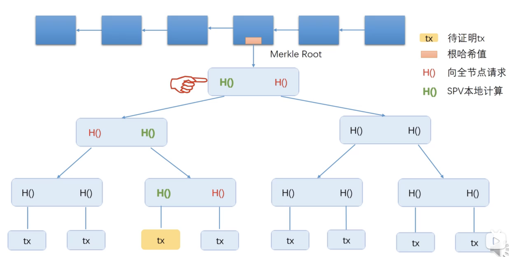

### 分布式共识协议

#### 分布式理论

- FLP
- CAP
- Paxos

#### 比特币中的分布式共识

- 区块链的目的是为了在互不信任的实体之间建立共识。
- 普通的投票机制会遭遇sybil attack问题（恶意节点创建超过半数的账户（公私钥对）就可以控制投票结果）。比特币采用是根据工作量（算力）投票机制来避免这一问题。
- 最长合法链原则（分叉攻击） 

### 比特币系统的实现

#### 比特币和出矿奖励

- 初始每出一个区块可以获得50BTC，之后每21万个区块减半，大约需要4年时间。这是获取新的比特币的唯一途径。
- 比特币总量=21万\*50\*（1+1/2+1/4+...）=2100万个

#### UTXO

- 全节点需要在本地维护一个UTXO数据结构，来记录未花费的交易输出。
- 比特币系统中没有账户的概念，要知道一个账户的余额，只能通过UTXO推算得出。
- UTXO设计的目的是为了快速校验新交易的合法性，以防止double spending问题。
- 每个交易会花费若干个输入的UTXO，创建若干个新的UTXO，矿工需要校验每个输入必须有效且未被花费，每个输入都需要有匹配的签名，总输入大于等于总输出

#### 交易

- 比特币是基于交易的模式，以太坊是基于账户的模式
- 比特币系统中的交易分为铸币交易和普通交易。铸币交易没有交易输入，是产生新的比特币的唯一途径。普通交易每一个输入使用的BTC都需要说明是由哪一个之前的交易中的第几个输出产生的。
- 输入部分需要给出支付的币的来源（为了防止双花攻击），付款人的签名（防止篡改），付款人的公钥（为了验证签名，这个公钥需要跟上一个输出交易的公钥哈希对应），输出部分需要给出收款人公钥的哈希。
- 输入减去输出的差额是作为交易费支付给矿工。
- 输入输出都是通过脚本方式给定的。将当前交易的输入脚本和上一个交易（提供币的来源的交易）的输出脚本拼接后（交叉）执行用来校验交易的合法性。

#### 脚本

比特币脚本语言基于堆栈结构。不具有图灵完备，不支持循环操作。

- P2PK
  最简单的形式。
- P2PKH
  使用最多的形式。
- P2SH
  主要用于多重签名。
- Proof of Burn
  脚本以RETURN开头，不论input 脚本如何设计，执行到RETURN都会直接返回，不会往下执行，所以这个输出脚本对应的比特币永远不会被花费。可以用来永久保存一些数据到区块链。输出脚本在校验当前交易合法性的时候是不会被执行的，只有当下一个交易需要花费该输出时才会执行，这样，该脚本才得以执行。

#### 挖矿

- 挖矿就是调整区块头中nonce和Merkle树的root hash值（其实是调整Merkle树中铸币交易的CoinBase域的内容，使得Merkle树的root hash值改变），然后计算出区块头的哈希值，使其大于等于target规定的值

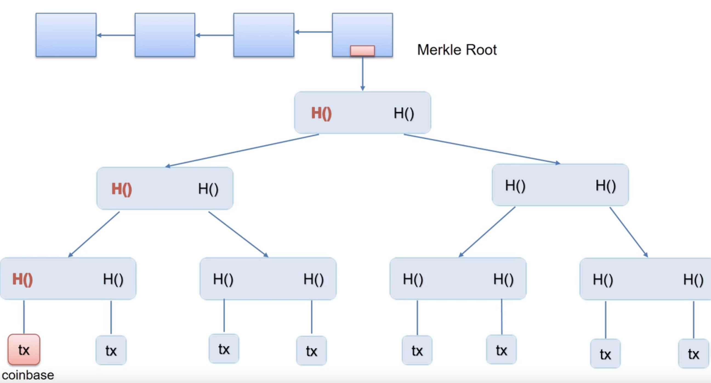

- progress free 
  具有无记忆性。将来还需要挖矿的时间跟过去已经挖矿的时间是没有关系的。主要用来保证挖矿的公平性，否则算力强的矿工就会比算力弱的矿工有优势。
- 比特币系统的安全性是通过挖矿机制来保证的。只要超过一半的计算力掌握在诚实人手中，比特币系统安全性就可以得到保证。
- 比特币系统默认每十分钟出一个区块。如果区块被挖出的速度越快，区块链分叉的概率会更高，这样诚实人的算力会被分散，系统会更加容易被分叉攻击（51% attack）。
- 比特币系统每2016个区块需要调整一下挖矿难度，大约需要2周时间。难度调整公式：next_difficulty=previous_difficulty * (2 weeks) / (time to mine last 2016 blocks)，之所以需要定期调整挖矿难度是为了稳定出矿时间。出矿时间变短会对大矿主有利，这对小矿工不公平
- selfish mining
  事先挖好一系列区块，但是不公开。如果攻击者的算力足够的强，可以使用该方式进行分叉攻击。另外也可以通过这种方式减少竞争，获取更多的出矿奖励

#### 节点

##### 全节点

- 一直在线
- 在硬盘上维护完整区块链信息
- 内存中维护UTXO
- 监听比特币网络上交易信息，验证每个交易的合法性
- 决定哪些交易被打包到区块里
- 监听别的矿工挖出来的区块，验证其合法性
- 挖矿

##### 轻节点

- 不是一直在线
- 只需要保存区块头信息
- 不用保存所有交易，只保存与自己有关的交易
- 只能校验和自己相关的交易的合法性（因为没有其它交易的信息）
- 无法检测网上发布的区块的正确性（因为没有其它交易的信息）
- 可以验证挖矿的难度（因为计算哈希值只用到了区块头的信息）
- 只能检测最长链，但是不能判断最长合法链

#### 矿池及利益分成

- 矿主和矿工  
  矿主负责除了Hash运算以外其他工作，矿工只负责Hash运算工作。矿池的收益按照每个矿工的工作量分成。
- 矿池的出现使得矿工的收入变的稳定，减轻矿工的负担。
- 大型矿池使得51% sttack变得更加容易，因为矿工不需要自己拥有51%算力，只需要能动员51%算力即可。

#### 分叉

- state fork  
  对区块链中当前状态出现分歧导致的分叉。

- protocol fork  
  
  - 因为比特币协议的不同意见导致的分叉。
  
  - 根据协议内容不同可以分为硬分叉和软分叉。
    
    - soft fork
      只需要半数以上算力的节点更新软件，就不会出现永久性分叉，只会出现临时性分叉。典型例子如coinbase域和P2SH功能的增加（判断技巧：新节点的区块对于旧节点而言也是合法的，但是旧节点的区块对于新节点而言是非法的）。
    
    - hard fork
      必须系统中所有节点都更新软件，才不会出现永久分叉。（判断技巧：新节点的区块对于旧节点而言是不合法的）
      
      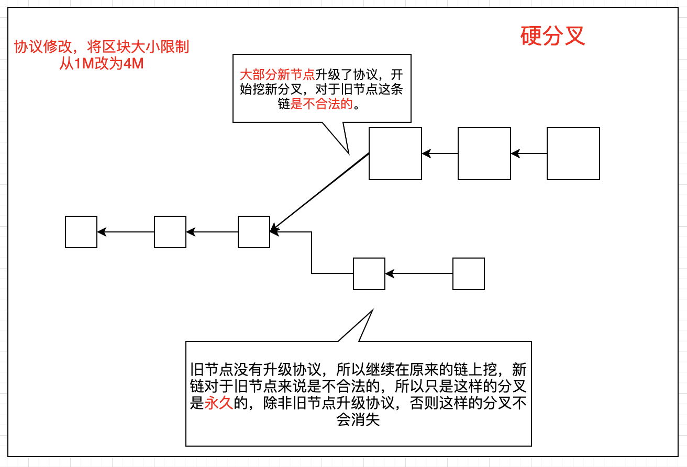
      
      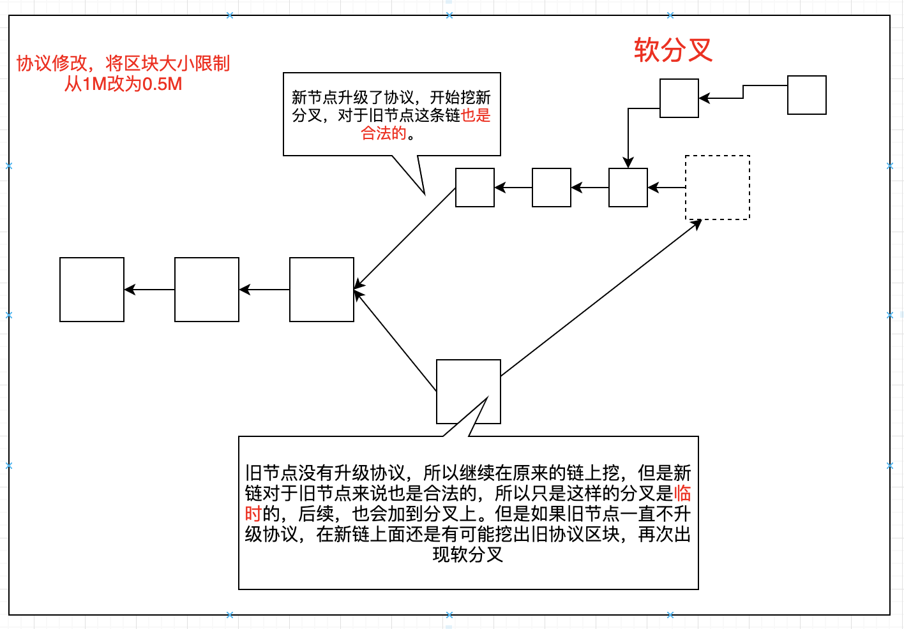

#### 挖矿中存在的问题

- 如果矿主占超过半数的算力，可能会导致分叉攻击，也可能导致boycott，封锁特定账户的交易上链（只要出现特定账户，立刻开始分叉攻击，成为新的最长合法链）

### 比特币网络

- 应用层：比特币区块链
- 网络层：P2P Overlay Network，所有节点都是平等的，相互之间采用TCP通信。
- 每一个节点会维护一个邻居节点集合，消息在网络中采用flooding方式传播。邻居节点选举随机的，不考虑底层网络拓扑结构。
- 设计原则：简单、健壮，但是牺牲了高效。

### 比特币的安全

- 比特币系统的安全主要有两部分来做保证，第一是密码学的保证，第二是共识机制。

- 提高比特币的匿名性
  
  - 网络层
    采用洋蔥路由（Onion routing）保证。
  
  - 应用层  
    coin mixing  
    零知识证明 
    零币、零钞
    
    ## 以太坊([原理](https://ethfans.org/posts/ethereum-explained-merkle-trees-world-state-transactions-and-more))

### 账户

- 比特币是基于交易的系统，没有显示记录账户余额的方式，只能通过UTXO查询推算，隐私性比较好，以太坊是基于账户的系统，主要是因为智能合约需要稳定的账户体系
- 比特币和以太坊都是交易驱动的状态机。比特币中的状态机是UTXO的内容，以太坊的是状态树中的内容
- 账户地址160位，20个字节，40个16进制表示。分为外部账户（EOA）和智能合约账户。我们用来互相收发以太币、部署智能合约的账户就是外部账户，而部署智能合约时自动生成的账户则是合约账户。交易只能从外部账户发起。外部账户属性有balance（普通账户余额）、nonce（计数器，用来防止重放攻击），合约账户有balance（合约账户余额）、nonce、code（存放智能合约代码）、storage（存储智能合约的状态，是一颗MPT）。

### 钱包

- 私钥，256位随机数，用于发送交易中创建签名证明资金所有权
- 公钥，根据私钥通过椭圆曲线单向加密后得到512位
- 地址，将公钥通过keccak256单向哈希，取最后160位得到

### 网络

- 以太坊节点之间通信也是采用P2P网络，默认端口30303
- 以太坊RPC服务默认端口8545

### EVM

- 智能合约的运行环境，每一个全节点底层都需要运行EVM，执行交易中的合约代码，合约的代码是以字节码的形式存在在区块链上
- 每个账户都会有一个storage，是一个KV数据库，这个是以太坊上合约状态存储的地方，会永久保存区块链的信息

### 客户端

- geth

#### JSON-RPC API

- 本质是以太坊客户端提供的一个HTTP服务，端口默认8545。

### 状态树

- Merkle Patricia Trie（MPT）
- 对状态树的修改会新建一个树，而会保留历史记录。原因是为了回滚交易，因为以太坊中的智能合约图灵完备，功能比较复杂，无法从结果反推回到执行之前的状态。
- 多个状态树之间会共享一些数据，只有改变交易状态的节点需要新建一个分支，其余的直接引用其他节点即可。

### 交易树和收据树

- 和状态树的区别：交易树和收据树只包含当前这个区块相关的信息，而状态树需要包含系统中所有账户的状态信息。另外和状态树不同，交易树和收据树的节点之间不会共享节点数据。
- 每个交易结束后会得到一个收据。交易列表长度应该等于收据列表长度。
- 布隆过滤器
  - 快速过滤掉集合中肯定不存在的元素，缩小搜索范围

### gas费

- gas费的设计是对交易的执行消耗资源的体现
- 一方面是为了限制每个区块大小，另一方面是为了限制出现死循环
- gas limit是指消耗gas的上限，实际支付的gas数量是执行交易过程中实际消耗的gas，差额会退回发送人账户

### 交易

- 一个由外部账户发起的签名数据包，由以太坊网络传输，并最后被序列化到以太坊区块链上。一个交易包含的内容：nonce（为了保证交易的唯一性，防止重放攻击）、接收方地址（以太坊不会校验该地址，如果给的地址不存在，转入的以太币将永远无法取出）、发送方签名、value、data、gas limit、gas price

- 交易是唯一可以触发以太坊状态更改的东西

- 以太坊中的交易分为三类：
  
  - 转账
    - value表示转账的以太币，可以有data，表示备注信息
  - 创建部署智能合约
    - value为0，data为合约编译成字节码的数据
  - 调用智能合约
    - 可以有value，表示往合约转账的以太币，data表示要调用合约的函数和参数（具体是将被调用的函数签名使用keccak256哈希编码，取前面4个字节，放在data最前面，将传入的实参转16进制放在最后，中间用0填充）

- 交易执行流程（[以太坊交易生命周期](https://ethfans.org/posts/life-cycle-of-an-ethereum-transaction)）
  
  - 构建原始交易对象(RawTransaction)。
  - 使用交易账户的私钥对原始交易对象进行签名。
  - 签署过后的交易会提交至以太坊节点。然后节点会验证已签名的交易，确保它是由交易账户签署过的。
  - 交易经过节点验证通过后，会被广播至其对等节点（Peer Nodes），这些对等节点再将该交易广播给它们的对等节点，以此类推。一旦交易被广播至网络，会输出该交易的id，可以用它来追踪交易的状态。
  - 交易先是被添加进交易池（有矿工维护），再由矿工进行评估选择来打包。矿工一般将所有交易存储在根据gasPrice价格分类的池中。
  - 矿工选择将交易包含进区块，这些交易将被验证并包含进一个待处理区块，工作量证明开始。某个矿工节点最终会找到一个有效的区块，并将这一区块添加到区块链上。**就像上面介绍的节点广播原始交易一样，矿工节点也会将这一有效区块广播给其他节点。**
  - 最终，全网节点将接收这个新区块，并同步区块链。一旦接收到这个新区块，节点就会执行区块里的所有交易。结合我们使用的truffle调用合约代码， truffle会不断测验连接节点的区块链以求确认。一旦它发现交易被确认，就会执行 then()中的回调逻辑。

### 消息

- 合约和合约之间的调用发送（函数调用）的称为消息，和交易不同，消息不会被持久化到区块链上，只存在于EVM中

### GHOST

#### uncle reward

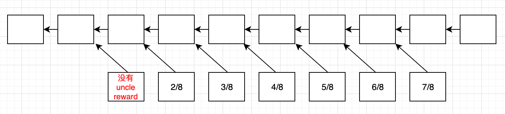

- 七代以内有共同祖先的uncle区块有uncle reward，随着隔的代数越多，获取的出块奖励比例越低，这样设计的目的为了鼓励及时合并分叉。合并方区块能获取的额外出矿奖励都是1/32。
- 合并uncle区块的时候，uncle区块内的交易并不会被执行，也不会检查交易合法性，因为这些交易有可能跟当前最长合法链上的交易有冲突，导致执行失败。但是会需要检查uncle区块的合法性
- 只有分叉后的第一次区块才能获取uncle reward，后面的区块不能得到，这样设计的原因是提高分叉攻击成本，降低分叉攻击风险

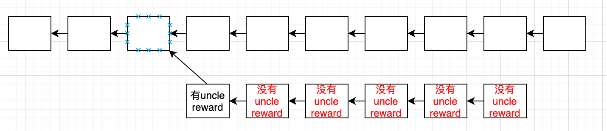

### 挖矿算法

- Ethash
  Ethash工作量证明是内存难解的，这使它能抵抗ASIC。抵抗ASIC的关键在于挖矿算法设计必须削弱CPU能力，增加堆内存的需求

### 区块收入

#### 普通区块

- 出块奖励
- 区块内包含的所有交易的消耗的gas费总和
- 如果引用了叔父区块，每引用一个叔父区块可以得到出块奖励的1/32

#### 叔父区块

- 叔父区块奖励，计算公式：叔父区块奖励=（叔父区块高度-引用该叔父区块的区块高度+8）* 出矿奖励 /8

### 难度调整

- 难度炸弹
- 

### 权益证明

- 工作量证明（挖矿）是按照算力来决定谁拥有出块权利，权益证明是按照所占的权益份额决定的
- 和工作量证明比较，权益证明是按照所占的权益份额来决定的，维护区块链安全的资源是一个闭环，与外部世界没有直接联系。而工作量证明不是闭环，更容易被攻击
- Casper共识协议
  - 每50个区块为一个epoch，Validator对其进行投票

### Solidity

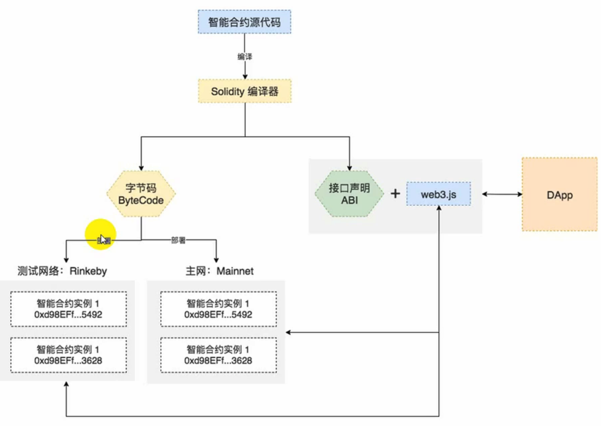

- abi
  - 合约的json接口描述文件，提供给客户端（web3js）以此构建生成代表该合约的js对象
- bin
  - 字节码文件，部署合约时提交到以太坊区块链上

#### 事件

#### 常用语法

- import
- 类型
  - bool
  - int/uint 
  - fixed/ufixed
  - address (payable)
  - 字节数组
    - 定长 （bytes1~byte32）
    - 变长（bytes（Hex字符串）和string（UTF-8字符串））
  - enum
  - function
  - array
    - 定长
    - 不定长，可以使用push或者修改length修改数组长度，底层是采用哈希表实现的
  - struct
  - mapping
  - 
- 

#### 数据位置

- 数组、结构体、mapping都有一个额外的属性——数据位置，说明数据是存储在memory还是storage中。
- 分类
  - 强制指定数据位置
    - 外部函数的参数：calldata
    - 状态变量（全局变量）：storage
  - 默认数据位置
    - 函数参数和返回值：memory
    - 引用类型的局部变量：storage
    - 值类型局部变量：栈
  - 特殊情况
    - public的函数参数一定是memory，如果是需要storage，则必须是private或者internal，为了防止随意调用和占用公开资源

#### 函数可见性

- external
  - 外部函数只能被当前合约外部（其他合约或者交易）调用，不能在合约内部调用
- public
  - 可以被内部或者外部调用，public的状态变量会自动生成一个同名的getter()函数
- private 
  - 只能在当前合约内部使用，不能被外部（包括子类）使用
- internal
  - internal函数只能被内部调用（包括当前合约内部或者子类），状态变量都是internal的

#### 函数状态可变性

- pure
  
  - 纯函数，该函数不能修改和访问状态变量
  
  
  
  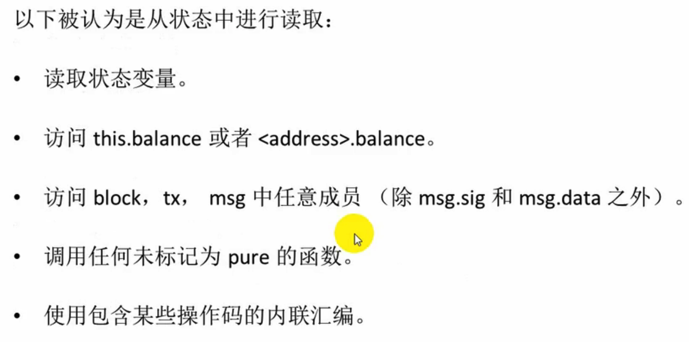

- view
  
  - 该函数不能修改状态变量

- payable
  
  - 允许从消息中接收以太币
  - 如果只有value，没有data，这时候fallback函数必须定义为payable。如果部署合约同时需要转以太币，该合约的构造器也需要定义为payable

- constant
  
  - 一般修饰状态变量，不能修改，如果修饰函数，效果跟view一样

#### modifier

- 用来抽取函数中公共的部分
- 一个函数可以有多个modifier，用空格分开

### 智能合约

- 每一个全节点收到智能合约的交易时，都会先在自己本地的数据结构（三棵树）中修改对应的状态，然后实际发布到区块链的时候这些内容才会对外公开，达成共识。在实际操作中，需要先执行交易中所有的智能合约代码，然后再进行挖矿，因为只有先执行了所有的智能合约代码，本地的三棵树的数据结构才会被更新到正确的状态，才能计算出合法的三棵树的根哈希值（在区块头中），才能计算出合法的区块头哈希值，才能进行挖矿。当没有挖到矿的矿工收到一个已经发布的区块时，需要在本地独立验证已发布区块的合法性（每个全节点需要独立对新区块中的交易做校验，所有交易在本地执行一遍，更新3棵树的内容，算出3个hash值，与发布区块中的3个hash值作比较），会丢弃本地自己的修改记录，并将发布区块的交易都执行一遍，算出根哈希值，跟已发布区块头中的根哈希值进行比较，达到共 识 

- 智能合约是（由交易驱动）运行在区块链上的一段代码，代码的逻辑定义合约的内容。具有图灵完备特性，但是因为停机问题不可解，所以无法检测死循环问题，所以以太坊引入gas费机制限制。

- 智能合约的代码需要编译成bytecode，运行在EVM上。合约的代码放在data域。

- 智能合约的账户，拥有并可以读写自己的内部存储（本质就是一个32byte的KV数据库），保存合约当前的运行状态。

- Solidity是智能合约最常用的语言。不支持多线程。原因是执行同一个智能合约，对于同一个输入，不同的全节点本地执行的结果必须要完全相同并且是确定性的才能达成共识。多线程执行，各节点执行的结果有可能会不同。同样的，智能合约也不支持其它会产生不确定执行结果的功能，比如产生随机数，通过系统调用获取本地环境一些数据（比如当前时间）等，只能获取一些确定性的信息，比如区块信息，调用信息。
  
  - 智能合约可以获取的区块信息
    
    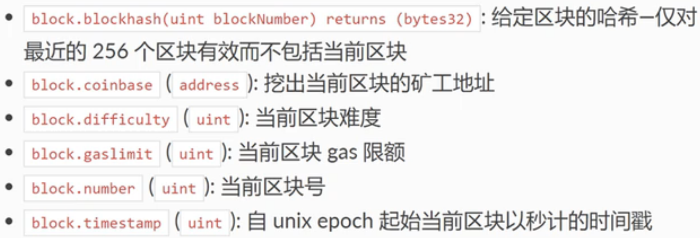
  
  - 智能合约可以获取的调用信息
    
    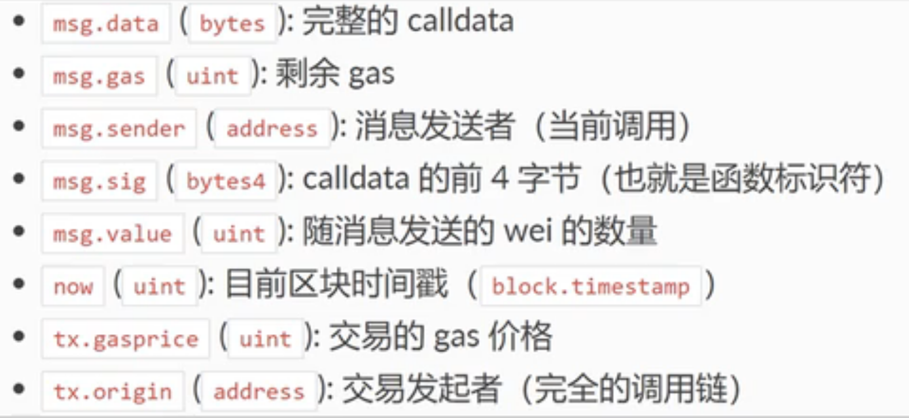
  
  - 

- 

- Solidity常用语法
  
  - 一个合约调用另一个合约函数
    
    - 直接调用
      
      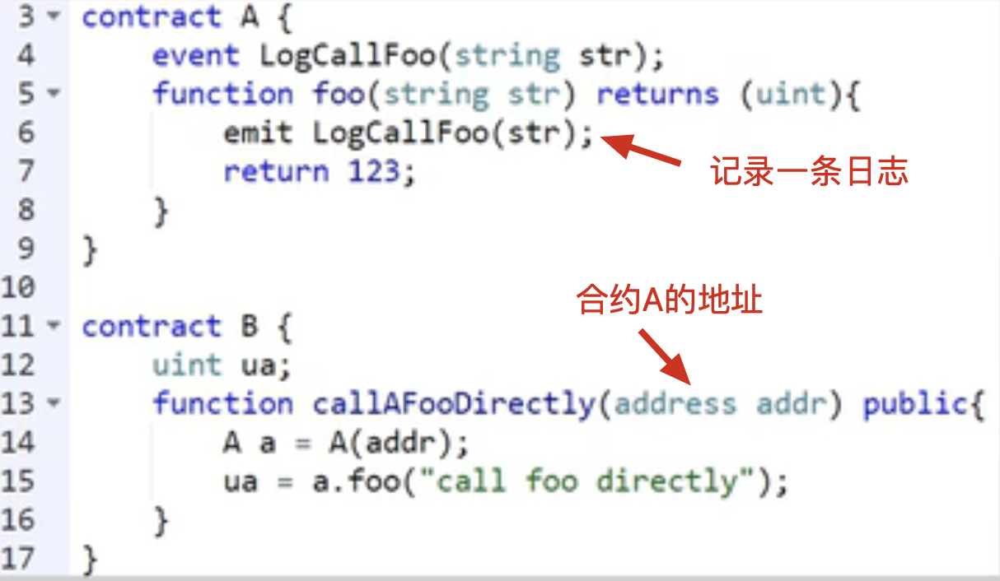
        -  使用address的call()函数
      
      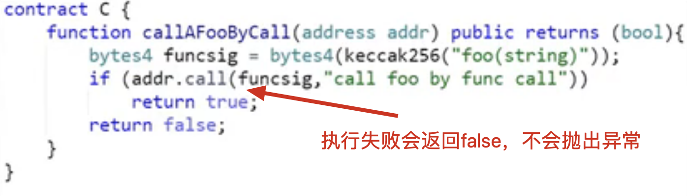
      
      - delegatecall()
  
  ​                        

- - 创建智能合约
    外部账户发起一个转账交易到0x0地址，转账金额为0，智能合约代码放在data域中，但是要支付汽油费（转账金额是支付给收款人的，汽油费是给打包发布合约的矿工的）。矿工将智能合约发布到区块链上后，返回智能合约的地址。

- 调用智能合约
  智能合约执行具有原子性（以太坊的交易，不管是普通转账交易还是智能合约的调用，都是原子性，要不全部执行，要不全部不执行），执行过程中出现错误（比如汽油费不够，但是已消耗的汽油费不会再退回，并且错误的交易也需要发布到区块链上，因为只有发布到区块链上达成共识才能真正获取汽油费）会导致回滚。如果出现嵌套调用（一个合约调用另一个合约中的函数），不同的方式回滚策略不同。直接调用tansfer方式会导致连锁回滚，跟直接调用合约函数一样，而调用send方式只会返回false，不会导致连锁回滚，address类型的call.value()方法调用也不会导致连锁回滚。
  
  - 外部账户
    创建一个交易，接收地址为要调用的智能合约的地址，data域填写要调用的函数（函数选择器）及参数的编码值。
  - 智能合约
    - 直接调用（transfer或者send）（transfer或者send调用发送的汽油费固定只有2300wei，只够输出一条日志，而call.value()方式则会将当前账户所有可用汽油费都发送过去）
    - address类型的call()或者delegatecall()调用（两者的使用基本一样，区别在于执行是否切换合约的上下文环境，call()会使用被调用合约的上下文环境，而delegatecall()会使用当前合约的环境（存储、余额等属性））
    - 智能合约账户需要接收外部账户转账交易（转账金额不为0）的函数需要使用payable标注，否则实际转账的时候会抛出异常
    - fallback函数也称匿名函数，没有参数也没有返回值，当调用智能合约的一方data域为空，或者data中指定的函数不存在的时候（给合约账户纯转账交易），fallback函数会被调用，如果需要接收转账交易，也需要标注为payable
    - 异常处理，没有try catch机制，可以使用require或者assert判断，条件不满足会抛出异常，revert()会无条件抛出异常

- 智能合约案例 —— 拍卖
  
  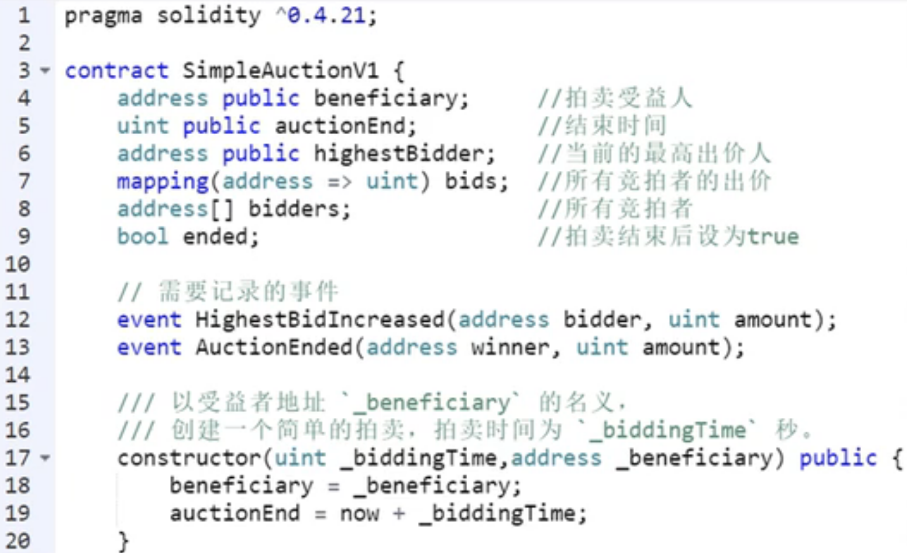
  
  - 第一版

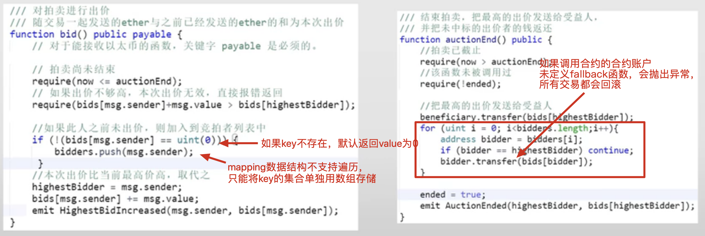

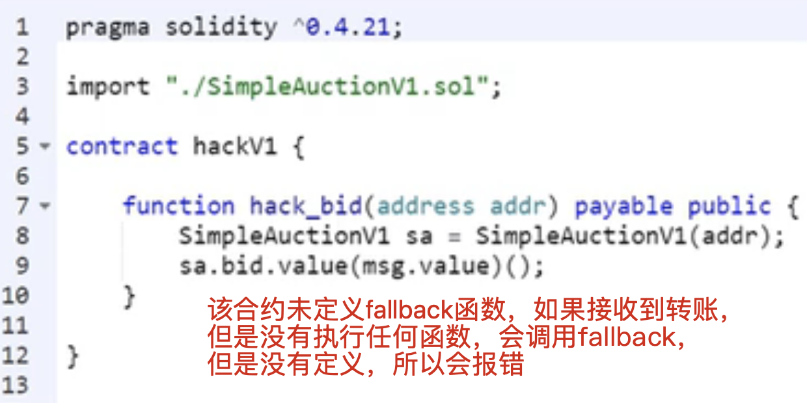

- 第二版
  - 存在重入攻击

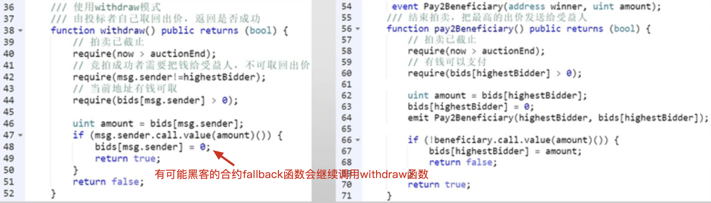

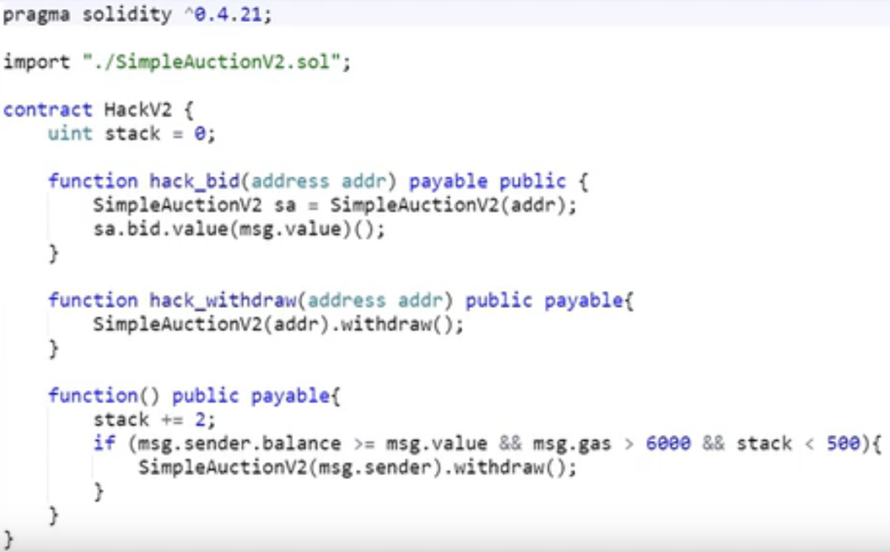

- 正确的withdraw()
  
  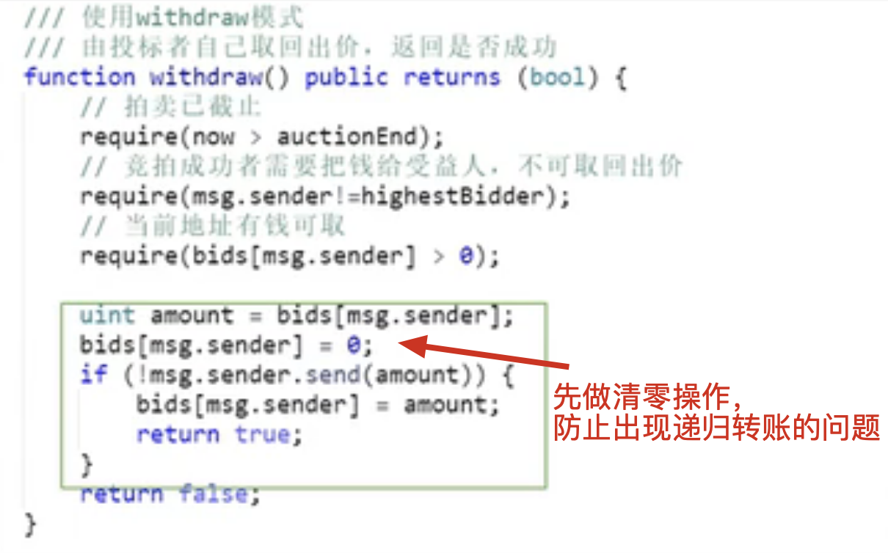

- 总结拍卖流程
  
  - 编写拍卖程序智能合约的代码，然后通过发起创建智能合约的交易，矿工将智能合约发布到区块链上后，返回智能合约的地址，然后所有人都可以调用该智能合约的函数。
  - 参与竞拍的人通过发起调用智能合约的交易，调用部署好的智能合约的函数，开始竞拍，这些交易最后也都需要发布到区块链上

- 智能合约案例 —— 美链bug
  
  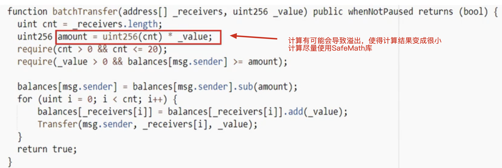

- ERC20合约
  
  - ERC20是在以太坊上发行代币的一个标准，规范所有需要在以太坊上发行代币的智能合约都需要实现的功能和遵循的接口

- 智能合约的本质是控制逻辑，而不是计算逻辑和存储逻辑，主要是为了在不信任的主体之间达成共识，只有这些共识的逻辑才需要写在智能合约里

- 

合约安全问题

- 使用“检查-生效-交互”（Checks-Effects-Interactions）模式
  - 先使用require()对参数做校验
  - 修改可能会影响到合约状态变量的处理
  - 与其它合约的交互应该是任何函数的最后一步
- 

### 代币（Token）

- 可替代性通证（ERC20）
  - 相互可以替代
- 非同质通证（ERC721）
  - 每一个代币都是唯一不可替代，如加密猫

### Dapp

- 可以在以太坊上基于智能合约创建Dapp（去中心化应用）
- 至少包括两部分：智能合约和前端界面

### the Dao

### 美链
