# Java Concurrent

# 挑战

### 上下文切换

#### 测试工具

- lmbench3
- vmstat

#### 减少上下文切换

- 无锁编程，hash算法
- CAS
- 避免创建不必要的线程
- 在单线程中使用协程实现多任务调度

### 死锁

#### 避免死锁

- 避免一个线程同时获取多个锁
- 避免一个线程在锁内同时占用多个资源
- 使用定时锁
- 对于数据库锁，加锁和解锁必须在同一个连接中

### 资源限制

## 并发机制底层原理

### volatile

由于高速缓存存在，处理器会将内存数据先读入高速缓存，操作完后也会先写入高速缓存，但不知何时才会同步会内存。如果对volatile变量进行写操作，JVM会向CPU发送一条LOCK前缀的指令，强制将变量同步会内存。同时，各处理器会通过实现缓存一致性协议，保证处理器在对这个数据进行操作时会重新从内存中读取。

### synchronized

- 同步代码块采用monitorenter和monitorexit指令实现。
- 同步方法在字节码层面并没有任何特别的指令来实现，而是在Class文件的方法表中将该方法的access_flags字段中的synchronized标志位置1，表示该方法是同步方法并使用调用该方法的对象或该方法所属的Class在JVM的内部对象表示Klass做为锁对象。


#### 对象头

#### 锁升级

偏向锁、轻量级锁(可以理解为自旋锁)、重量级锁

大多数情况下锁不仅不存在多线程竞争，而且总是由同一线程多次获得，为了让线程获得锁的代价更低而引入了偏向锁，用于一个线程访问同步代码块的场景。但是如果存在多个线程争抢锁，就会升级成为轻量级锁，采用CAS自旋方式获取锁，不会发生阻塞，用于竞争不是很激烈或同步代码块执行很快的场景。但是如果锁竞争很激烈导致CAS一直获取不到锁，自旋一定次数（默认10次）后，会升级成为重量级锁。

##### 比较

- 偏向锁加解锁不需要额外消耗，适用于只有一个线程访问同步块的场景。但是当线程间存在锁竞争时，会带来额外锁撤销的消耗。
- 轻量级锁在竞争锁时会采用CAS自旋，不会导致线程阻塞，适用于追求响应时间，并且同步代码块执行速度快的场景。但是如果同步代码块执行很慢，始终得不到锁，自旋会消耗CPU。
- 重量级锁不采用自旋，不会消耗CPU，但是会导致线程阻塞，适用于追求吞吐量并且同步代码块执行时间长的场景。

### 原子操作

#### CPU层面

- 总线锁
- 缓存锁

#### Java

- 锁

- CAS自旋

  - CAS存在的问题
    - ABA问题
      解决：添加版本号。如AtomicStampedReference类。
    - 长时间自旋带来CPU消耗
    - 只能保证一个共享变量原子操作
      解决：使用锁或者把多个变量合并成一个变量操作。如AtomicReference类。

## Java内存模型

Java内存模型定义了多线程之间共享变量的可见性以及如何在需要的时候对共享变量进行同步。
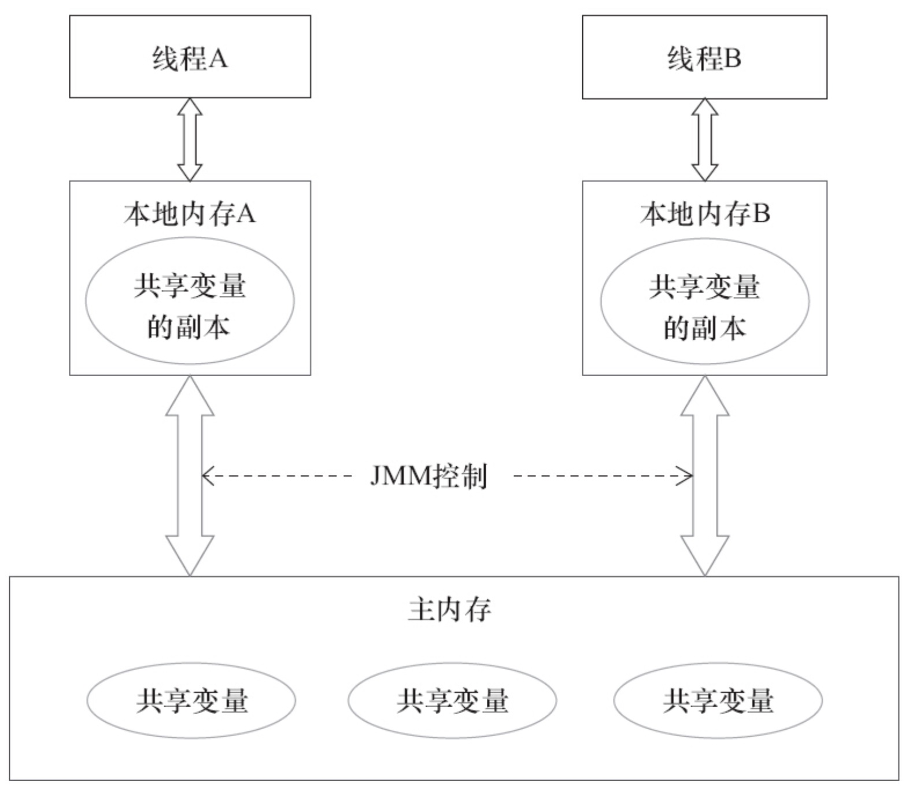
线程A与线程B之间如要通信的话，必须要经历下面2个步骤：
- 首先，线程A把本地内存A中更新过的共享变量刷新到主内存中去。

- 然后，线程B到主内存中去读取线程A之前已更新过的共享变量。 

### 并发两个关键问题

- 通信
Java并发采用共享内存模型。
- 同步

### 重排序

- 编译器重排序
- 指令集并行重排序
- 内存系统重排序
在不同的编译器和处理器平台上，JMM通过禁止特定类型的编译器和处理器重排序来确保一致的内存可见性。

#### 原则

- 数据依赖性

- as-if-serial

  保证单线程内，程序执行的结果不被改变。

- 顺序一致性

  顺序一致性内存模型和JMM的比较：

  - 顺序一致性内存模型会保证单线程中按程序顺序执行，JMM不保证。
  - 顺序一致性内存模型保证所有线程只能看到一致的操作执行顺序，JMM不保证。
  - 顺序一致性内存模型保证所有内存读写操作都具有原子性，JMM中保证对64位long和double变量写操作具有原子性。

### happens-before

- JMM使用happens-before来阐述操作之间的内存可见性和执行顺序。
如果一个操作happens-before另一个操作，那么第一个操作的执行结果对第二个操作可见，并且第一个操作执行顺序在第二个之前。但是，这只是JMM的保证。在不改变程序执行结果的前提下，JMM允许编译器和处理器对具体的执行顺序进行重排序。所以，具有happens-before关系的两个操作，实际执行顺序可能并不是happens-before指定的顺序。
- happens-before和as-if-serial的关系
happens-before和as-if-seria本质上是用一种语义，as-if-seria是为了保证**单线程**中程序执行结果不被改变。happens-before是在**多线程**中保证执行结果不被改变。

#### 常用规则

- 传递性

  如果A happens-before B，且B happens-before C，那么A happens-before C。

- 程序顺序规则

  **一个线程**中，前面每个操作happens-before任意后续操作。

- 监视器锁

  对一个锁解锁happens-before随后对这个锁的加锁。

- volatile规则

  对一个volatile变量的写操作happens-before任意后续对这个volatile变量的读。

- Thread.start()

  Thread.start()操作happens-before Thread线程中的任意操作。

- Thread.join()

  Thread线程中的任意操作happens-before Thread.join()方法的返回。

### volatile

#### 特性

- 可见性
对一个volatile变量（包括64位的long和double类型）的读，总是能看到对这个volatile变量最后的写入。
- 原子性
对任意单个volatile变量（包括64位的long和double类型）的读写具有原子性，但是多个volatile操作或者volatile++不具有原子性。

#### 内存语义

- 当写一个volatile变量时，JMM会把该线程对应的本地内存中共享变量刷新到主内存。
- 当读一个volatile变量时，会把本地内存中变量置于无效，强制从主内存中读取。

#### 内存语义实现

编译器在生成字节码时，会在指令序列中插入**内存屏障**来禁止特定类型的处理器重排序。

### 锁

#### 内存语义

- 当线程释放锁时，JMM会把该线程对应的本地内存中共享变量刷新到主内存。
- 当线程获取锁时，会把本地内存中变量置于无效，强制从主内存中读取。

#### 内存语义实现

- 利用volatile的语义
- 利用CAS的语义

### final

#### 内存语义

- 在构造器内对一个final变量的写入，与随后把这个被构造的对象的引用赋值给一个引用变量，这两个操作不能重排序。这个可以保证在对象引用被任意线程可见之前，final变量已经被初始化。（还有一个前提，被构造对象引用不能在构造器中逸出）
- 初次读一个包含final变量的对象的引用，和随后读这个final变量，不能重排序。这个可以保证，读这个final变量之前一定会先读这个对象引用。
- 如果是final变量是引用类型，则还需要增加规则：在构造器中对这个final引用类型的变量的成员属性的写入，和随后把这个被构造的对象的引用赋值给一个引用变量，这两个操作不能重排序。

#### 内存语义实现

编译器在final域写之后，构造器return之前插入内存屏障来实现。

## Java并发基础

### 线程状态切换

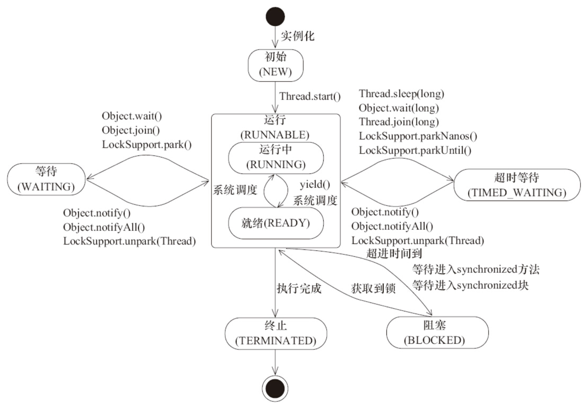

### 线程中断

- 线程中断只是线程的标识位的修改
- 抛出InterruptedException之前，JVM会清除中断标识，然后再抛出异常。

### 等待通知机制

经典范式：

```java
//等待方：
synchronized(lock){
	while(条件不满足){
    	lock.await();
    }
    //唤醒后的逻辑处理
}

//通知方：
synchronized(lock){
	修改条件
    lock.notifyAll();
}
```


## JUC

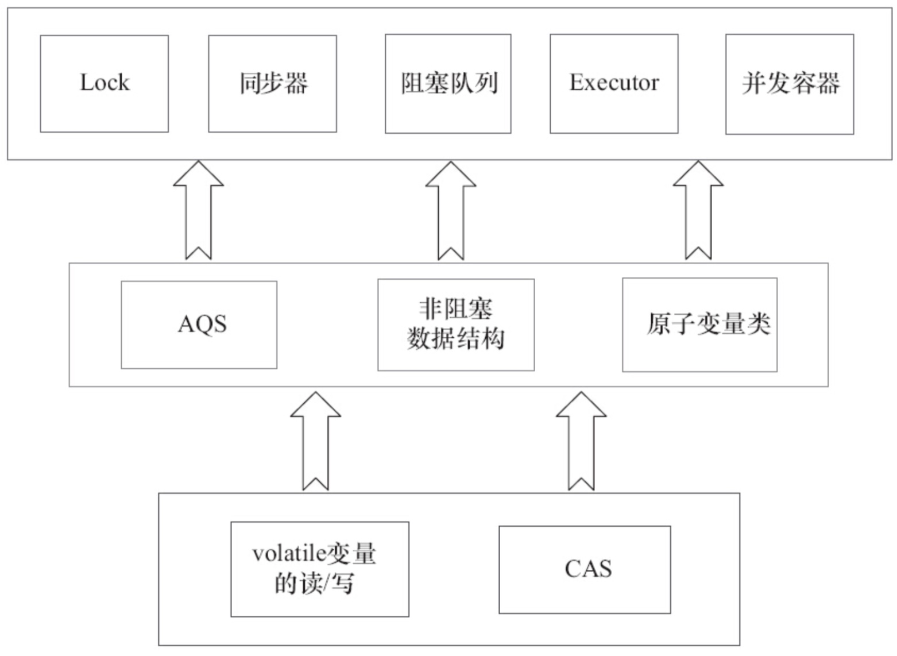

### Lock

#### 重入锁

- synchronized隐式支持重入，Lock中的ReentrantLock不但支持重入，还可以选择取得的锁的公平性。
- 公平锁是指，等待时间越长的锁，越优先获得锁。
- 一般而言，公平锁会导致大量的线程上下文切换，性能没有非公平锁高。但是公平锁可以有效的减少线程的饥饿。

##### 实现原理

实现重进入解决两个问题：
- 再次获取锁的时候判断是否就是当前线程，如果是，再次获取成功。
- 重复获取n次锁，释放锁的时候也要释放n次。

非公平锁最终获取锁的逻辑在nonfairTryAcquire()方法中。
```java
final boolean nonfairTryAcquire(int acquires) {
            final Thread current = Thread.currentThread();
            int c = getState();
            if (c == 0) {
                if (compareAndSetState(0, acquires)) {
                    setExclusiveOwnerThread(current);
                    return true;
                }
            }
            else if (current == getExclusiveOwnerThread()) {
                int nextc = c + acquires;
                if (nextc < 0) // overflow
                    throw new Error("Maximum lock count exceeded");
                setState(nextc);
                return true;
            }
            return false;
        }
```
主要增加判断当前占用锁的线程是否就是当前线程的逻辑，如果是，则会增加同步状态的值。
公平锁最终获取锁的逻辑在tryAcquire()方法中。和非公平锁的代码唯一不同的是增加了!hasQueuedPredecessors的判断逻辑，来保证前面没有其它的节点在等待获取锁。


释放锁的逻辑在tryRelease()方法中。
```java
protected final boolean tryRelease(int releases) {
            int c = getState() - releases;
            if (Thread.currentThread() != getExclusiveOwnerThread())
                throw new IllegalMonitorStateException();
            boolean free = false;
            if (c == 0) {
                free = true;                setExclusiveOwnerThread(null);
            }
            setState(c);
            return free;
        }
```
会一直将同步状态值减为0才释放锁。

#### 读写锁

ReentrantReadWriteLock

##### 实现原理

- 读写状态设计
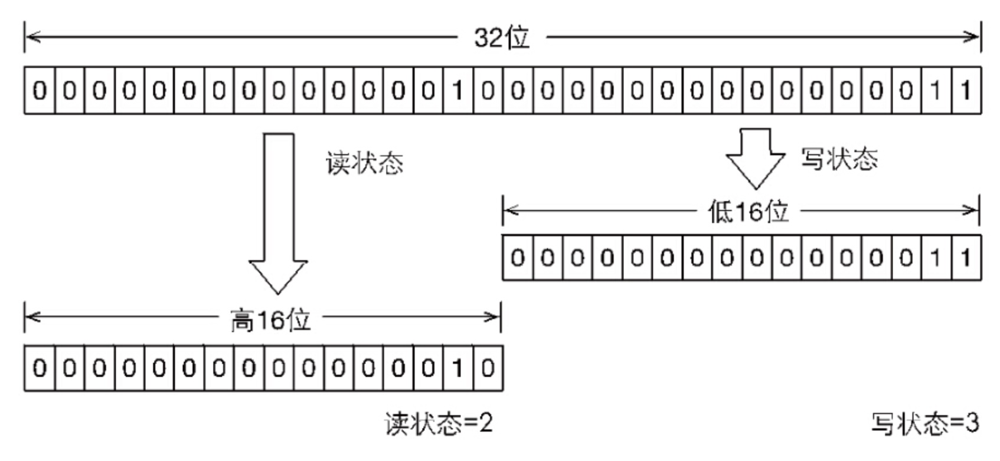
按位分割，高16位表示读，低16位表示写。通过位运算快速获取读和写的状态。假设当前同步状态为S，读状态等于S>>>16，写状态等于S&0x0000FFFF。当写状态+1时，S+1。读状态+1时，S+(1<<16)。当S不等于0时，写状态如果等于0，表示读状态不等于0，即读锁被获取。

- 写锁获取和释放
获取逻辑在ReentrantReadWriteLock.Sync.tryAcquire。如果当前线程获取写锁时，已经有读锁被其他线程获取或者当前线程并不是获取写锁的线程，当前线程会被阻塞。
```
if (c != 0) {
   if (w == 0 || current != getExclusiveOwnerThread())
       return false;
```
写锁释放逻辑和ReentrantLock基本类似。
- 读锁获取和释放
读锁获取逻辑在ReentrantReadWriteLock.Sync.tryAcquireShared()方法。
如果当前其它线程已经获取写锁，则当前线程获取读锁失败。如果当前线程获取了写锁，或者写锁未被获取，则当前线程采用CAS修改读状态，获取读锁。
```
Thread current = Thread.currentThread();
            int c = getState();
            //通过位运算得到低16位(写状态)
            if (exclusiveCount(c) != 0 &&
                getExclusiveOwnerThread() != current)
                return -1;
            int r = sharedCount(c);
            //通过CAS获取读锁
            if (!readerShouldBlock() &&
                r < MAX_COUNT &&
                compareAndSetState(c, c + SHARED_UNIT)) {
```

- 锁降级
获取的写锁，再获取读锁，随后释放之前获取的写锁的过程。像拥有写锁，先释放掉再获取读锁这种分段操作不能叫锁降级。


#### LockSupport

#### Condition

##### 实现原理

- 等待队列
等待队列中每一个节点都包含在一个Condition对象上等待的线程。如果调用Condition.await()方法，该线程会释放锁，并将当前线程封装成Node并加入等待队列，入队过程不需要CAS保证，因为用Condition.await()方法的线程必定是获取当前Lock（独占锁）的线程，不存在并发问题。
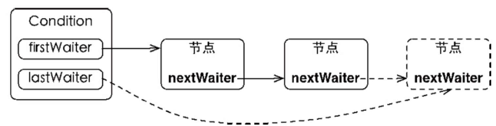
Lock可以拥有一个同步队列和多个等待队列。
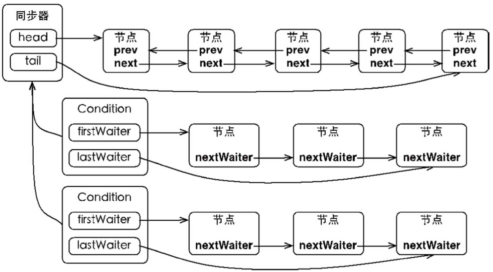

- 等待
调用Condition.await()方法必定是获取到锁的线程，也就是同步队列的首节点的线程。它会释放同步状态（锁），并唤醒后继节点，并将该线程封装成Node加入Condition的等待队列。
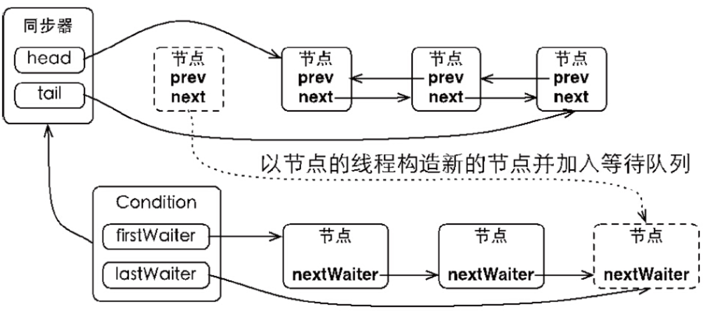

- 通知
调用Condition.signal()方法必定是获取到锁的线程。他会将等待队列中首节点重新移动回同步队列，并使用LockSupport.unpark()唤醒节点中的线程。被唤醒的线程此时会从await()的while (!isOnSyncQueue(node))退出循环，然后调用acquireQueued()重新争夺同步状态。成功获取同步状态后，await()方法返回。signalAll()相当于将等待队列中所有节点全部执行一次signal()。
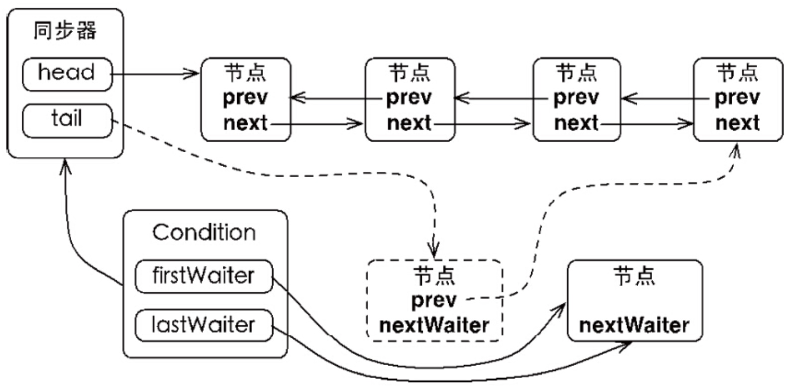


### AQS

- AQS是用来构建锁或者其他同步组件的基础框架，使用一个int成员变量表示同步状态，内部维护一个FIFO同步队列完成资源获取线程的排队工作。
- AQS是实现锁（或者其他同步组件）的基础。锁是面向使用者的，定义了锁和使用者交互的接口，隐藏实现细节。AQS面对锁的实现者，简化锁的实现方式，屏蔽同步状态管理、线程排队、等待和唤醒等底层实现细节。

#### 实现原理

- 同步队列
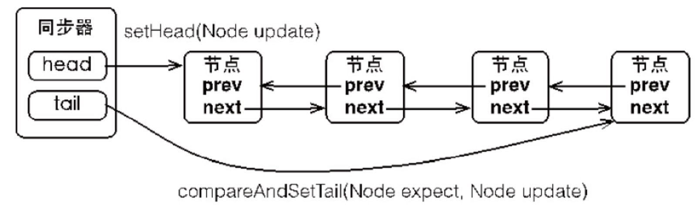
当前线程获取同步状态失败后，AQS会将当前线程和等待状态等信息封装成一个Node节点，并将其使用CAS自旋方式加入同步队列，同时会阻塞当前线程。
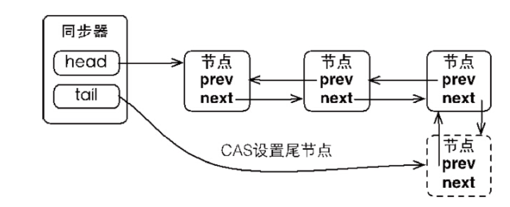
之所以需要采用CAS方式是因为，获取同步状态失败的线程会有很多，会并发入队，所以需要使用CAS保证线程安全。

当首节点释放同步状态时，会唤醒后继节点线程，并使其再次获取同步状态，如果获取成功则将自己设置为首节点。
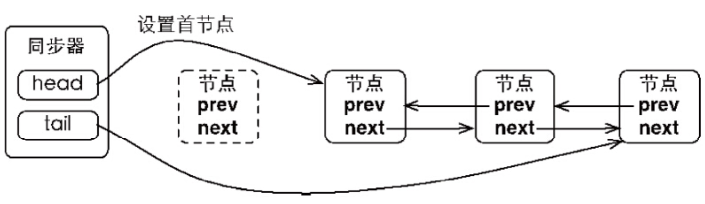
设置首节点不需要使用CAS操作，因为只会是后继节点才能获取到同步状态，而后继节点只会有一个，不存在线程安全问题。

- 独占式同步状态获取和释放
```java
public final void acquire(int arg) {
        if (!tryAcquire(arg) &&        acquireQueued(addWaiter(Node.EXCLUSIVE), arg))
        selfInterrupt();
    }
```
主要完成同步状态获取、节点构造、加入同步队列、在同步队列中自旋获取同步状态等工作。
主要逻辑：调用tryAcquire尝试无阻塞获取同步状态，如果获取失败，会构造Node节点，通过addWaiter加入同步队列。然后通过acquireQueued自旋获取同步状态，如果获取不到则一直阻塞，直到前驱节点出队或者线程被中断退出。
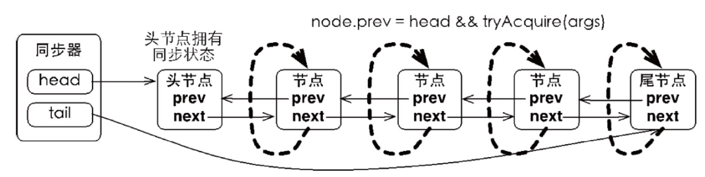

总结：
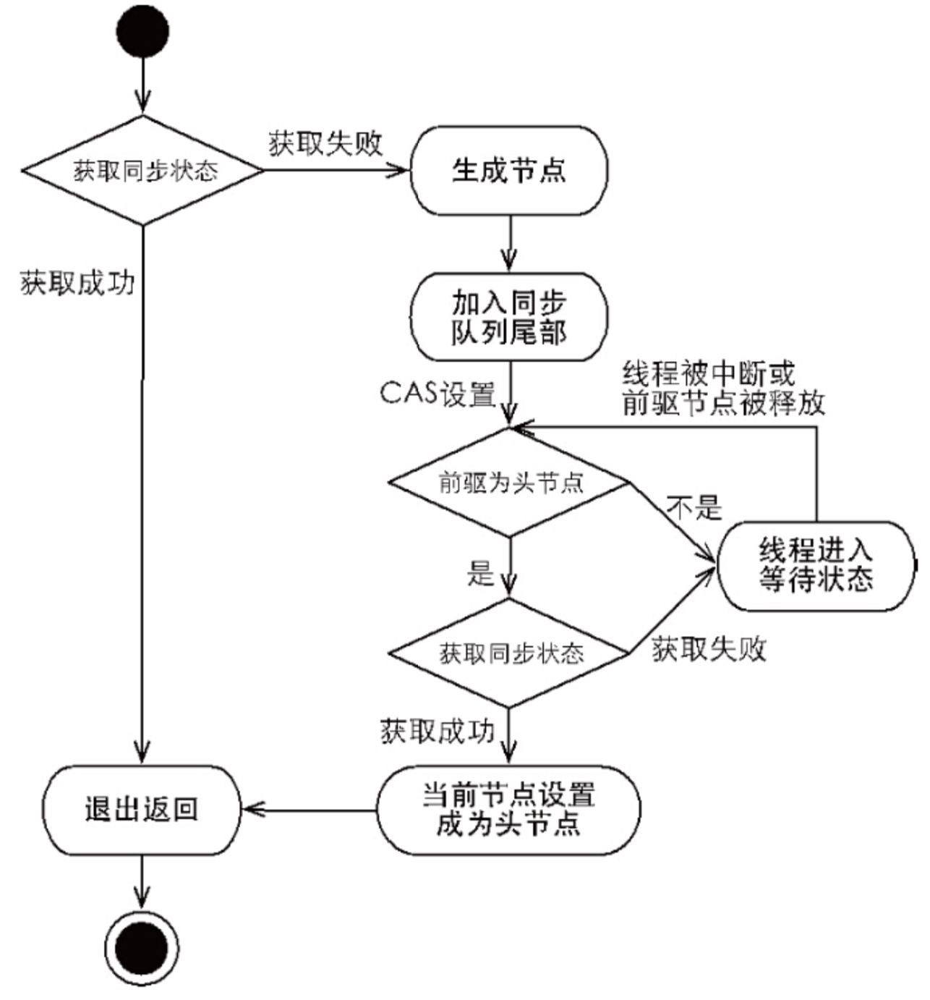

当首节点执行完逻辑后，通过release释放同步状态，并唤醒后继节点。
```
public final boolean release(int arg) {
        if (tryRelease(arg)) {
            Node h = head;
            if (h != null && h.waitStatus != 0)
                unparkSuccessor(h);
            return true;
        }
        return false;
    }
```

- 共享式同步状态获取和释放
```
public final void acquireShared(int arg){
        if (tryAcquireShared(arg) < 0)
            doAcquireShared(arg);
}
```
调用tryAcquireShared获取同步状态，如果tryAcquireShared返回值大于等于0，则表示成功获取。否则获取失败，使用CAS操作加入同步队列，并一直保持自旋检测同步状态。当前驱节点为首节点并且调用tryAcquireShared返回值大于等于0时，表示获取到同步状态退出。

```
public final boolean releaseShared(int arg) {
        if (tryReleaseShared(arg)) {
            doReleaseShared();
            return true;
        }
        return false;
    }
```
通过调用releaseShared释放同步状态，并唤醒后继节点。需要注意，tryReleaseShared和tryRelease不同，因为共享锁释放时，可能会有多个线程同时释放（因为共享锁可以被多个线程同时获取），所以tryReleaseShared必须保证线程安全，一般采用CAS自旋方式保证。

- 超时独占式同步状态获取和释放
自定义同步器会通过tryAcquireNanos实现超时独占同步状态获取，最终会调用doAcquireNanos。如果nanosTimeout<=0表示超时退出。否则会进入同步队列自旋，如果当前驱节点为首节点并且调用获得同步状态，就会退出。否则重新计算超时时间nanosTimeout，并判断是否超时，然后是线程等待nanosTimeout后继续自旋。但是如果nanosTimeout <=spinForTimeoutThreshold（1000纳秒）则不会等待，而是直接继续自旋，因为这个时间太过短，不精确。如果线程被中断则会退出。
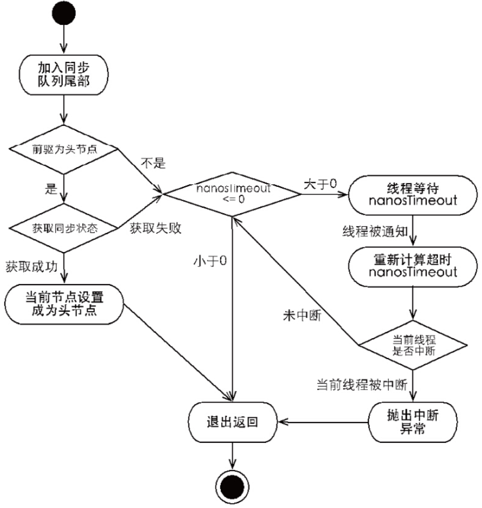

### 并发容器

#### ConcurrentHashMap

#### ConcurrentLinkedQueue

#### 阻塞队列

### Fork/Join

### Atomic类

### 并发控制工具

#### CountDownLatch

#### CyclicBarrier

#### Semaphore

#### Exchanger

### 线程池

#### 实现原理

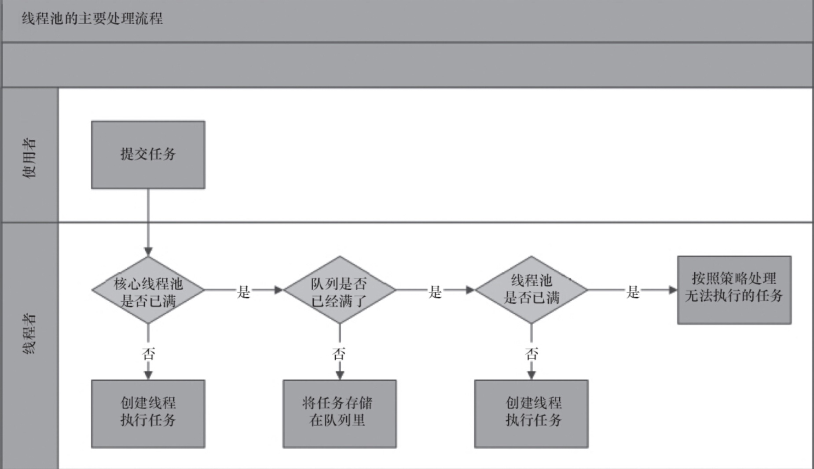
主要逻辑在ThreadPoolExecutor的execute()方法中，
```
public void execute(Runnable command) {
    if (command == null)
        throw new NullPointerException();
    int c = ctl.get();
    if (workerCountOf(c) < corePoolSize) {
        if (addWorker(command, true))
            return;
        c = ctl.get();
    }
    if (isRunning(c) && workQueue.offer(command)) {
        int recheck = ctl.get();
        if (! isRunning(recheck) && remove(command))
            reject(command);
        else if (workerCountOf(recheck) == 0)
            addWorker(null, false);
    }
    else if (!addWorker(command, false))
        reject(command);
}
```
- 如果Worker线程数小于核心线程数，调用addWorker()创建新的Worker执行任务。Worker本身就是一个线程类，在Worker内部会使用ThreadFactory返回Worker自身的线程对象，然后在addWorker()中会通过Thread.start()启动Worker线程，进而会调用Worker.run()，里面会调用runWorker()方法。runWorker()中，Worker线程不仅会执行firstTask，执行完毕后，还会不断循环从BlockingQueue中获取任务并执行。
```
while (task != null || (task = getTask()) != null) {
	beforeExecute(wt, task);
	task.run();
    afterExecute(task, thrown);
}
```
- 如果Worker线程数大于等于核心线程数，将任务加入BlockingQueue。
- 如果任务加入BlockingQueue失败，再调用addWorker()创建新的Worker执行任务。
- 如果Worker线程数大于最大线程数，则会根据不同拒绝策略调用RejectedExecutionHandler.rejectedExecution()拒绝任务。


#### 核心参数

- corePoolSize（核心线程数）
当Worker线程数\<corePoolSize时，会通过创建Worker线程执行任务，到达corePoolSize后就不会再创建。可以使用ThreadPoolExecutor的prestartAllCoreThreads()方法提前创建并启动所有的核心线程。
- runnableTaskQueue（阻塞队列）
可以选用
	- ArrayBlockingQueue
    - LinkedBlockingQueue
    - SynchronousQueue
    - PriorityBlockingQueue
- maximumPoolSize（最大线程数）
任务队列满了，但是Worker线程数小于最大线程数，线程池会再次创建新的Worker线程执行任务。对于无界队列，该参数无效。
- ThreadFactory
设置创建的线程。
- RejectedExecutionHandler（拒绝策略）
任务队列和线程池都满了采取具体的拒绝策略拒绝任务。
	- AbortPolicy（默认）
    抛出异常。
    - CallerRunsPolicy
    直接在当前线程中运行任务。
    - DiscardPolicy
    不作任何处理。
    - DiscardOldestPolicy
    将线程池的任务队列中头节点（最先入队）删除，然后执行当前任务。
- keepAliveTime
Worker线程空闲之后可以存活的时间。
- TimeUnit
keepAliveTime的时间单位。


#### 提交任务

- execute
- submit

#### 关闭

- shutdown
- shutdownNow

#### 配置线程池

#### 监控线程池

### Executor		

#### ThreadPoolExecutor

ThreadPoolExecutor一般使用Executors创建。可以分为3类：
- SingleThreadExecutor
```
new ThreadPoolExecutor(1, 1,
                                    0L, TimeUnit.MILLISECONDS,
                                    new LinkedBlockingQueue<Runnable>());
```
	- 核心线程数和最大线程数都等于1，其他参数和FixedThreadPool相同。

- FixedThreadPool
```
public static ExecutorService newFixedThreadPool(int nThreads) {
        return new ThreadPoolExecutor(nThreads, nThreads,
                                      0L, TimeUnit.MILLISECONDS,
                                      new LinkedBlockingQueue<Runnable>());
    }
```
	- 核心线程数和最大线程数一样，keepAliveTime设为0，使用LinkedBlockingQueue无界队列（其实是有限的，最大容量是Integer.MAX_VALUE）。
	- 因为使用无界队列，所以任务队列不会满，也就不会跟maximumPoolSize比较（maximumPoolSize失效），也就不会拒绝任务（除非调用shutdown()或者shutdownNow()）。

- CachedThreadPool
```
new ThreadPoolExecutor(0, Integer.MAX_VALUE,
                                      60L, TimeUnit.SECONDS,
                                      new SynchronousQueue<Runnable>());
```
	- 核心线程数设为0，最大线程数设为Integer.MAX_VALUE，即无界。keepAliveTime设为60s。同时使用的阻塞队列是SynchronousQueue。这意味着，当主线程一提交任务，任务就会入队，但是SynchronousQueue没有容量，相当于队列满了，而同时又因为最大线程数无界，所以又会创建新的Worker线程。所以如果主线程提交任务速度大于Worker处理任务的速度，线程资源消耗会越来越多，直至耗尽。

#### ScheduledThreadPoolExecutor

- ScheduledThreadPoolExecutor继承自ThreadPoolExecutor，在ThreadPoolExecutor基础上添加延迟或周期调度的功能。ScheduledThreadPoolExecutor比TImer功能更加强大，可以指定多个后台线程。
- ScheduledThreadPoolExecutor内部使用DelayQueue无界队列作为任务队列，因为是无界队列，所以maximumPoolSize失效。
- ScheduledThreadPoolExecutor执行流程

- ScheduledThreadPoolExecutor实现
```
public ScheduledThreadPoolExecutor(int corePoolSize) {
        super(corePoolSize, Integer.MAX_VALUE, 0, NANOSECONDS,
              new DelayedWorkQueue());
    }
```


#### Future和FutureTask

# Executors 
