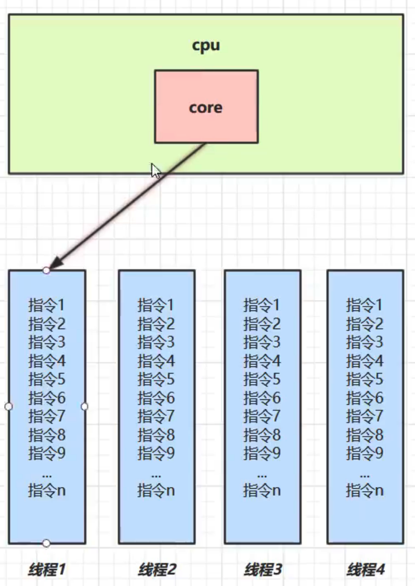
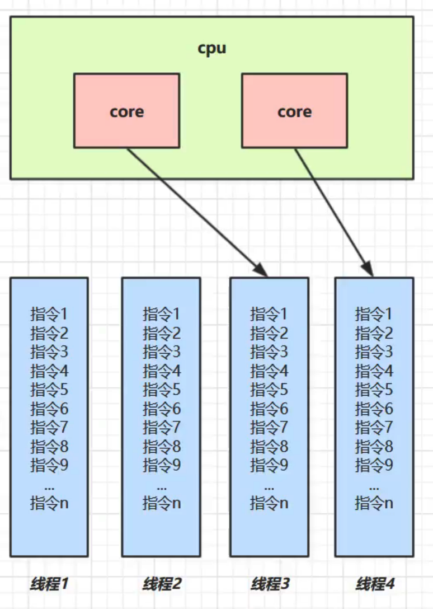

# Java Concurrent

## 并发和并行

- 并发：同一时间处理不同事情的能力



- 并行：同时能做多少事情



## 多线程应用

- 异步
- 提高性能

## 挑战

### 上下文切换

#### 原因

- CPU时间片用完

- 垃圾回收

- 有更高优先级的线程需要运行

- 线程自己调用sleep、yield、wait、join等方法

#### 测试工具

- lmbench3
- vmstat

#### 减少上下文切换

- 无锁编程，hash算法
- CAS
- 避免创建不必要的线程
- 在单线程中使用协程实现多任务调度

### 死锁

#### 避免死锁

- 避免一个线程同时获取多个锁
- 避免一个线程在锁内同时占用多个资源
- 使用定时锁
- 对于数据库锁，加锁和解锁必须在同一个连接中

### 资源限制

## 并发机制底层原理

### volatile

由于高速缓存存在，处理器会将内存数据先读入高速缓存，操作完后也会先写入高速缓存，但不知何时才会同步会内存。如果对volatile变量进行写操作，JVM会向CPU发送一条LOCK前缀的指令，强制将变量同步会内存。同时，各处理器会通过实现缓存一致性协议，保证处理器在对这个数据进行操作时会重新从内存中读取。

### synchronized

#### 锁的本质


- 锁的本质是一个对象，这个对象维护了一个是否加锁的标志位，以及占用锁的线程ID和阻塞等待锁的线程列表

- 锁对象和共享资源的对象可以是同一个对象

- 锁有没有互斥生效，只要看不同线程中竞争的锁是不是同一个对象

#### 锁的实现


- 在对象头的Mark Word数据域里，维护锁对象关联的Monitor对象。在字节码层面采用monitorenter和monitorexit指令实现，其中monitorenter用来将锁对象MarkWord置为Monitor指针，并且将获取锁的线程置为Monitor的Owner，其余线程放入EntryList阻塞等待，而monitorexit将MarkWord重置，唤醒EntryList线程

#### 对象头格式


#### 锁优化

##### 偏向锁

###### 概念

- 当存在sychronized重入时，只有第一次会使用CAS获取轻量级锁，并会将线程ID设置到Mark Word中，之后如果发现线程ID是自己的，不用再做CAS操作，节约CAS开销

- 偏向锁默认开启，但是会延迟开启，可以使用JVM参数控制

###### 撤销

- 调用锁对象的hashcode()方法会导致偏向锁撤销，升级成为轻量级锁

- 其他线程争抢锁会导致偏向锁撤销

- 调用wait/notify，一律会将锁升级为重量级锁

###### 批量重偏向

- 当偏向锁撤销超过20次，偏向锁的线程ID会修改新的线程ID

###### 批量撤销

- 当偏向锁撤销超过40次，整个类的所有对象都会变成不可偏向，新创建的对象也是不可偏向

##### 轻量级锁

###### 场景

- 一个对象虽然有多线程访问，但是多线程访问时间是相互搓错开的（没有竞争），可以使用轻量级锁优化

- 轻量级锁也是用sychronized，对使用者透明，加锁时会优先使用轻量级锁，产生锁竞争才会升级为重量级锁

###### 加锁解锁过程


- 每一个线程加锁的时候，都会在栈帧中创建一个锁记录的结构，并将锁对象的引用保存在锁记录中，同时会采用CAS将锁对象的Mark Word域的数据（hashcode以及锁状态01等）暂存入锁记录内，并且在对象头上保存锁记录的地址以及锁状态00，这样可以方便查询加锁的线程

- 如果CAS执行成功，则表示轻量级锁上锁成功

- 如果CAS失败，有两种情况
  
  
  
  - 一种是自己线程再次进入sychronized临界区，这视为锁重入，会在栈帧中再创建一条内容为null的锁记录
  
  - 一种是其他线程加了轻量级锁，这时表明有竞争，进入锁膨胀过程，轻量级锁会升级为重量级锁

- 退出sychronized代码块时，依次从栈帧中弹出锁记录对象，如果内容为null的锁记录表示是重入锁，清空锁记录，如果不为null，再次使用CAS将锁记录中保存的Mark Word数据恢复到锁对象中，并且将状态改为01

- 如果CAS执行成功，则解锁成功，如果失败，说明轻量级锁已经升级为重量级锁，进入重量级锁解锁流程

##### 重量级锁


- 当有其它线程已经获取轻量级锁导致加锁失败，进入锁膨胀过程。当前线程会为锁对象Object申请Monitor对象，并且在锁对象头Mark Word域保存Monitor地址，并且自己进入Monitor的EntryList阻塞等待

- 当获取轻量级锁的线程执行完sychronized代码块后，使用CAS恢复对象头Mark Word数据时，因为数据域内容已经发生改变，CAS失败，会进入重量级锁解锁流程，即根据Monitor地址找到Monitor对象，设置Owner为null，唤醒EntryList阻塞的线程

##### 自旋锁

- 轻量级锁升级为重量级锁后，未获取锁的线程并不会立刻进入Monitor阻塞，而是会开启自旋检测锁状态一段时间，如果自旋期间锁已被释放并且获取到，则可以避免进入阻塞，减少线程上下文切换的开销

##### 锁消除

- ### 原子操作

#### CPU层面

- 总线锁
- 缓存锁

#### Java

- 锁

- CAS自旋
  
  - CAS存在的问题
    - ABA问题
      解决：添加版本号。如AtomicStampedReference类。
    - 长时间自旋带来CPU消耗
    - 只能保证一个共享变量原子操作
      解决：使用锁或者把多个变量合并成一个变量操作。如AtomicReference类。

## Java内存模型

Java内存模型定义了多线程之间共享变量的可见性以及如何在需要的时候对共享变量进行同步。JMM定义了主存和工作内存的概念。其中主存是所有线程共享的内存，工作内存是每个线程本地的内存，对应计算机底层硬件中的各个存储空间

线程A与线程B之间如要通信的话，必须要经历下面2个步骤：

- 首先，线程A把本地内存A中更新过的共享变量刷新到主内存中去。

- 然后，线程B到主内存中去读取线程A之前已更新过的共享变量。 

### 并发两个关键问题

- 通信
  Java并发采用共享内存模型。
- 同步

### 重排序

- 编译器重排序
- 指令集并行重排序
- 内存系统重排序
  在不同的编译器和处理器平台上，JMM通过禁止特定类型的编译器和处理器重排序来确保一致的内存可见性。

#### 原则

- 数据依赖性

- as-if-serial
  
  保证单线程内，程序执行的结果不被改变。

- 顺序一致性
  
  顺序一致性内存模型和JMM的比较：
  
  - 顺序一致性内存模型会保证单线程中按程序顺序执行，JMM不保证。
  - 顺序一致性内存模型保证所有线程只能看到一致的操作执行顺序，JMM不保证。
  - 顺序一致性内存模型保证所有内存读写操作都具有原子性，JMM中保证对64位long和double变量写操作具有原子性。

### happens-before

- JMM使用happens-before来阐述操作之间的内存可见性和执行顺序。
  如果一个操作happens-before另一个操作，那么第一个操作的执行结果对第二个操作可见，并且第一个操作执行顺序在第二个之前。但是，这只是JMM的保证。在不改变程序执行结果的前提下，JMM允许编译器和处理器对具体的执行顺序进行重排序。所以，具有happens-before关系的两个操作，实际执行顺序可能并不是happens-before指定的顺序。也就是说，**happens-before只保证了可见性，并不保证真正的执行顺序**
- happens-before和as-if-serial的关系
  happens-before和as-if-seria本质上是用一种语义，as-if-seria是为了保证**单线程**中程序执行结果不被改变。happens-before是在**多线程**中保证执行结果不被改变。

#### 常用规则

- 传递性
  
  **如果A happens-before B，且B happens-before C，那么A happens-before C**

- 程序顺序规则
  
  **一个线程中，前面每个操作happens-before任意后续操作。**

- 监视器锁synchronized
  
  **对一个锁解锁happens-before随后对这个锁的加锁。**

- volatile变量
  
  **对一个volatile变量的写操作happens-before任意后续对这个volatile变量的读**。

- final变量
  
  **对一个final变量的写操作happens-before任意后续对这个final变量的读**。

- Thread.start()
  
  Thread.start()操作happens-before Thread线程中的任意操作。

- Thread.join()
  
  Thread线程中的任意操作happens-before Thread.join()方法的返回。

- 对一个线程interrupt前对变量的写，happen-before其他线程得知该线程被interrupt（调用该线程的interrupted或者isInterrupted）后对变量的读取

### volatile

#### 特性

- 可见性
  **对一个volatile变量（包括64位的long和double类型）的读，总是能看到对这个volatile变量最后的写入，这是由JMM的happen before规则决定的。** happen before机制可以保证64位的long和double类型变量在32位系统中读取数据错误，以及双重检查锁单例模式创建对象时初始化对象不完整的问题
- 原子性
  对任意单个volatile变量（包括64位的long和double类型）的读写具有原子性，但是多个volatile操作或者volatile++不具有原子性。

#### 内存语义

- 当写一个volatile变量时，JMM会把该线程对应的本地内存中共享变量刷新到主内存。
- 当读一个volatile变量时，会把本地内存中变量置于无效，强制从主内存中读取。

#### 内存语义实现

编译器在生成字节码时，会在指令序列中插入**内存屏障**来禁止特定类型的处理器重排序。

### 锁

#### 内存语义

- 当线程释放锁时，JMM会把该线程对应的本地内存中共享变量刷新到主内存。
- 当线程获取锁时，会把本地内存中变量置于无效，强制从主内存中读取。

#### 内存语义实现

- 利用volatile的语义
- 利用CAS的语义

### final

#### 内存语义

- 在构造器内对一个final变量的写入，与随后把这个被构造的对象的引用赋值给一个引用变量，这两个操作不能重排序。这个可以保证在对象引用被任意线程可见之前，final变量已经被初始化。（还有一个前提，被构造对象引用不能在构造器中逸出）
- 初次读一个包含final变量的对象的引用，和随后读这个final变量，不能重排序。这个可以保证，读这个final变量之前一定会先读这个对象引用。
- 如果是final变量是引用类型，则还需要增加规则：在构造器中对这个final引用类型的变量的成员属性的写入，和随后把这个被构造的对象的引用赋值给一个引用变量，这两个操作不能重排序。

#### 内存语义实现

编译器在final域写之后，构造器return之前插入**内存屏障**来实现。

## Java并发基础

### 线程状态切换


### 创建线程的方式

- 继承Thread类，重写run()方法

- 实现Runnable接口，将其作为参数传入Thread构造器

- 使用FutureTask和Callable创建带有返回值的线程任务

### 线程中断interrupt

- 线程中断只是线程的标识位的修改
- 调用Thread的interrupt()，只有当该线程的执行逻辑中包含了 wait(),join(),sleep()等声明了InterruptedException的方法，该线程才会抛出InterruptedException，同时，该线程的interrupt状态会清空，isInterrupted()返回false。可以再次调用Thread的interrupt()将中断状态设置为true
- 正常运行的线程（不包含wait(),join(),sleep()）也可以被打断，打断后不会抛出InterruptedException异常，但是该线程的interrupt状态不会被清空，isInterrupted()调用返回true。可以利用这个特点实现对线程的优雅停止

### wait/notify机制


- 当获取lock的Owner线程发现执行条件不满足，调用wait()，当前线程会让出CPU执行权，进入Monitor的WaitSet等待，并且会释放持有的lock，线程状态由RUNNABLE变成WAITING

- 当其它的线程中调用lock的notify()时，WaitSet中的线程将会被唤醒，但不会立刻获取锁，需要进入EntryList重新竞争

#### sleep和wait

- sleep是Thread的方法，wait是Object的方法

- 调用wait前必须先获取锁，sleep没有这个限制

- sleep在睡眠同时，不会释放持有的锁，wait会先释放锁后进入阻塞

#### 经典范式

```java
//等待方：
synchronized(lock){
    while(条件不满足){
        lock.wait();
    }
    //唤醒后的逻辑处理
}

//通知方：
synchronized(lock){
    修改条件
    lock.notifyAll();
}
```

#### 经典应用

##### 同步模型-保护性暂停


- 用来解决一个线程需要等待另一个线程的执行结果的场景，生产者和消费者必须一一对应，并且消息的结果是同步获取

- 主要实现要点：让不同线程关联同一个GuardedObject，GuardedObject中维护一个存储结果的成员变量，并提供get和compute接口，其中get中调用wait()等待compute的计算结果

- join和Future的实现就是采用这种模型

##### 异步模型-生产消费模型


- 生产者和消费者不需要一一对应，并且消息的结果是异步获取

- JDK中各类BlockQueue实现就是采用这种模式

#### 常见问题

##### wait()和notify()为什么是Object的方法

- Java的锁本质就是对象，而且可以是任意的Java对象。线程获取释放锁，本质上其实就是操作Java锁对象的对象头中维护的锁的状态。wait()和notify()的通信其实就是通过操作锁的这些状态来实现的。因为任意的Java对象都可以成为锁，所以wait()和notify()定义成为Object的方法才能保证一定可以被调用

##### wait()和notify()为什么需要配合synchronized使用

- wait()和notify()的通信其实就是通过操作锁的这些状态来实现的。这个过程本身也是需要加锁同步的，否则会导致状态修改出错，synchronized的实现是使用字节码指令实现的，用来保证原子性

##### wait()为什么需要释放锁

- 因为wait()和notify()的调用是在同一个锁的同步代码块中，如果wait()休眠但不释放锁，线程就无法进入notify()所在的同步代码块，就无法调用notify()，从而引发死锁

##### wait()和notify()机制的问题

- wait()和notify()作用的对象和synchronized作用的对象是同一个，没办法区别不同条件，这会导致在多线程调用notifyAll()时，会将所有等待的生产者和消费者都唤醒，而无法做到只唤醒生产者或者只唤醒消费者。这个问题需要使用Condition机制解决

##### 线程执行顺序控制

### 活跃性

#### 死锁

- 两个线程分别持有对方想要的锁导致两个都无法继续执行的现象

- 定位死锁可以使用jconsole或者jstack

- 哲学家就餐问题

- 可以使用ReentrantLock的tryLock()或者中断机制或者超时机制来避免死锁问题

#### 活锁

- 两个线程互相改变对方结束条件导致谁也无法结束的现象

- 可以让不同线程的执行时机交错来避免活锁

#### 饥饿

- 一个线程由于优先级太低导致始终得不到CPU调度，最终导致线程也不能够结束

## 无锁

- 无锁的核心是CAS，CAS必须配合volatile保证线程可见性

- sychronized锁会导致大量的线程上下文切换，而CAS可以避免。但是CAS运行的前提是需要额外的CPU核心支持，否则执行CAS的线程也会进入阻塞，还是会产生线程上下文切换。所以CAS适合于线程数小于CPU核心数的场景

## 线程安全对象

- **线程安全对象是指对象中的每一个方法在多线程中单独使用都是线程安全的，但是多个方法组合使用是线程不安全的**

## 不可变对象

- 类和属性都是final

- 保护性拷贝。通过创建一个新的对象来避免多线程共享，JDK底层的所有的包装类，String类，BigDecimal类都是用这种思想

- 使用享元模式来避免创建过多的对象。JDK底层的所有的包装类，String类，BigDecimal类都是用这种思想

## JUC

### AQS

- AQS是用来构建阻塞式锁或者其他同步组件的基础框架。锁是面向使用者的，定义了锁和使用者交互的接口，隐藏实现细节。AQS面对锁的实现者，简化锁的实现方式，屏蔽同步状态管理、线程排队、等待和唤醒等底层实现细节
- 使用一个int成员变量state表示资源状态，分为独占模式和共享模式。独占模式是指只有一个线程能够访问资源，共享模式是指可以有多个线程同时访问资源。子类需要实现如何维护这个状态
- 内部维护一个FIFO同步队列完成资源获取线程的排队工作，类似于Monitor的EntryList
- 支持多个条件变量来实现等待唤醒机制，类似于Monitor的WaitSet

### Lock

#### ReentrantLock

##### 和synchronized相比

- synchronized和ReentrantLock都支持重入

- synchronized不可以被中断，ReentrantLock的lockInterruptibly()可以被其他线程中断

- ReentrantLock可以设置为公平锁，等待时间越长的锁，越优先获得锁，synchronized不可以。一般而言，公平锁会导致大量的线程上下文切换，性能没有非公平锁高。但是公平锁可以有效的减少线程的饥饿

- ReentrantLock的tryLock()可以设置超时时间

- ReentrantLock可以支持多个条件变量，而synchronized只支持一个条件变量（WaitSet），即wait/notifyAll只能唤醒所有线程，没办法唤醒指定条件的线程

##### 实现原理

###### 加锁逻辑

- lock()


```java
final void lock() {
    // tryAcquire会尝试CAS获取锁，如果获取成功，则将state设置为1，并且将锁的Owner设置为当前线程
    if (compareAndSetState(0, 1))
        setExclusiveOwnerThread(Thread.currentThread());
     else
        acquire(1);
}

public final void acquire(int arg) {
   //会再次尝试获取一次锁
   if (!tryAcquire(arg) &&
   //  如果获取锁失败，则会进入 acquireQueued()逻辑
   acquireQueued(addWaiter(Node.EXCLUSIVE), arg))
     selfInterrupt();
}
```

- 非公平锁的tryAcquire实现在nonfairTryAcquire中

```java
final boolean nonfairTryAcquire(int acquires) {
            final Thread current = Thread.currentThread();
            int c = getState();
            if (c == 0) {
                //因为是非公平锁，这边不会去判断AQS队列，直接尝试CAS获取锁，如果获取成功，则将state设置为1，并且将锁的Owner设置为当前线程
                if (compareAndSetState(0, acquires)) {
                    setExclusiveOwnerThread(current);
                    return true;
                }
            }
            // 发生锁的重入，ReentrantLock支持重入的体现
            else if (current == getExclusiveOwnerThread()) {
                int nextc = c + acquires;
                if (nextc < 0) // overflow
                    throw new Error("Maximum lock count exceeded");
                setState(nextc);
                return true;
            }
            return false;
}
```

- 如果CAS获取锁失败，则进入会构造Node节点进入acquireQueued逻辑


```java
final boolean acquireQueued(final Node node, int arg) {
        boolean failed = true;
        try {
            boolean interrupted = false;
            for (;;) {
                final Node p = node.predecessor();
                //获取等待队列中当前节点的前驱节点
                //如果前驱节点是head节点，则当前节点有权再次尝试一下CAS获取锁
                if (p == head && tryAcquire(arg)) {
                    //如果获取成功，则会将当前节点设置为新的head节点，并将关联的线程设置为null
                    setHead(node);
                    p.next = null; // help GC
                    failed = false;
                    return interrupted;
                }
                // 会将前驱节点的waitStatus改为-1，代表该节点会唤醒后继节点
                if (shouldParkAfterFailedAcquire(p, node) &&
                    //调用park阻塞当前线程
                    parkAndCheckInterrupt())
                    interrupted = true;
            }
        } finally {
            if (failed)
                cancelAcquire(node);
        }
    }
```

###### 解锁逻辑

- unlock()

```java
 public final boolean release(int arg) {
         //当前线程释放锁
        if (tryRelease(arg)) {
            Node h = head;
             //判断当前节点的waitStatus，唤醒后继节点
             // 后继节点线程会在acquireQueued的park处被唤醒继续执行死循环，重新竞争锁
             //由于是非公平锁，这个时候如果有其他线程获取锁，当前线程依然会竞争失败，重新进入队列阻塞
            if (h != null && h.waitStatus != 0)
                unparkSuccessor(h);
            return true;
        }
        return false;
    }

 protected final boolean tryRelease(int releases) {
            // 重入计数释放
            int c = getState() - releases;
            if (Thread.currentThread() != getExclusiveOwnerThread())
                throw new IllegalMonitorStateException();
            boolean free = false;
            if (c == 0) {
                free = true;
                // 将锁的Owner设置为null
                setExclusiveOwnerThread(null);
            }
     // 将state设置为0
            setState(c);
            return free;
        }
```

###### 可打断原理

- 调用ReentrantLock的lock()不可以打断，原因是在acquireQueued的parkAndCheckInterrupt中会清空打断标记，等下一次该线程调用park时依然会被阻塞。同时parkAndCheckInterrupt执行后会再次进入循环，该线程依然需要重新获取锁，如果获取不到，依然会被阻塞，直到获取到锁后，才会响应打断状态。也就是说，在该模式下，即使当前线程被打断，线程依然会驻留在AQS队列中，并不能及时响应打断，只有当该线程获取到锁后，才会响应打断

- 调用ReentrantLock的lockInterruptibly()被打断

```java
 private void doAcquireInterruptibly(int arg)
        throws InterruptedException {
        final Node node = addWaiter(Node.EXCLUSIVE);
        boolean failed = true;
        try {
            for (;;) {
                final Node p = node.predecessor();
                if (p == head && tryAcquire(arg)) {
                    setHead(node);
                    p.next = null; // help GC
                    failed = false;
                    return;
                }
                if (shouldParkAfterFailedAcquire(p, node) &&
                    parkAndCheckInterrupt())
                    //当线程被打断后，直接会抛出InterruptedException，
                    //而不会再重新进入AQS队列等待获取锁，所以打断会被及时响应
                    throw new InterruptedException();
            }
        } finally {
            if (failed)
                cancelAcquire(node);
        }
    }
```

###### 公平锁原理

- FairSync的tryAcquire()

```java
protected final boolean tryAcquire(int acquires) {
            final Thread current = Thread.currentThread();
            int c = getState();
            if (c == 0) {
                //会先判断AQS队列，看当前节点有没有前驱节点，如果没有，才会CAS获取锁
                if (!hasQueuedPredecessors() &&
                    compareAndSetState(0, acquires)) {
                    setExclusiveOwnerThread(current);
                    return true;
                }
            }
            else if (current == getExclusiveOwnerThread()) {
                int nextc = c + acquires;
                if (nextc < 0)
                    throw new Error("Maximum lock count exceeded");
                setState(nextc);
                return true;
            }
            return false;
}
```

#### Condition

##### 实现原理

- 每一个Condition对应一个等待队列，实现类是ConditionObject

###### await


```java
public final void await() throws InterruptedException {
            if (Thread.interrupted())
                throw new InterruptedException();
            //创建Condition等待队列节点，关联当前线程，并且设置waitStatus为-2
            Node node = addConditionWaiter();
            //释放当前线程持有的锁，并且会唤醒等待队列中的下一个节点去竞争锁
            int savedState = fullyRelease(node);
            int interruptMode = 0;
            while (!isOnSyncQueue(node)) {
                //当前线程进入阻塞
                LockSupport.park(this);
                if ((interruptMode = checkInterruptWhileWaiting(node)) != 0)
                    break;
            }
            if (acquireQueued(node, savedState) && interruptMode != THROW_IE)
                interruptMode = REINTERRUPT;
            if (node.nextWaiter != null) // clean up if cancelled
                unlinkCancelledWaiters();
            if (interruptMode != 0)
                reportInterruptAfterWait(interruptMode);
        }
```

###### signal


```java
public final void signal() {
            // signal的前提是获取锁
            if (!isHeldExclusively())
                throw new IllegalMonitorStateException();
            Node first = firstWaiter;
            //将Condition队列中第一个Node的线程唤醒
            if (first != null)
                doSignal(first);
 }


private void doSignal(Node first) {
            do {
                if ( (firstWaiter = first.nextWaiter) == null)
                    lastWaiter = null;
                first.nextWaiter = null;
            //将Condition队列中第一个Node转移到竞争锁的等待队列尾部，
            //将Node的waitStatus设置为0，
            //将前驱节点的waitStatus设置为-1，
            //并且将Node中的线程唤醒
            } while (!transferForSignal(first) &&
                     (first = firstWaiter) != null);
        }
```

#### ReentrantReadWriteLock

##### 使用

- 读写锁定义了两种操作：写操作和读操作。其中读读不互斥，读写和写写互斥，来提高读操作的效率，适用于读多写少的场景

- 读写锁重入时不支持锁升级（在持有读锁的情况下继续获取写锁，会导致永久阻塞），但是支持锁的降级（在持有写锁的情况下继续获取读锁）

##### 实现原理

###### 读写状态设计


按位分割，高16位表示读，低16位表示写。通过位运算快速获取读和写的状态。假设当前同步状态为S，读状态等于S>>>16，写状态等于S&0x0000FFFF。当写状态+1时，S+1。读状态+1时，S+(1<<16)。当S不等于0时，写状态如果等于0，表示读状态不等于0，即读锁被获取。

###### 写锁获取

- 获取逻辑在ReentrantReadWriteLock.Sync.tryAcquire

```java
protected final boolean tryAcquire(int acquires) {
            Thread current = Thread.currentThread();
            int c = getState();
            int w = exclusiveCount(c);
            // 如果已经加了锁
            if (c != 0) {
                // 如果别的线程已经加了读锁，或者加了写锁，则当前线程写锁获取失败
                //这里也体现了读写锁不支持锁升级，当前线程尝试获取写锁时，
                //如果已经state加了读锁，不论是不是当前线程加的，都一律返回false，加锁失败
                if (w == 0 || current != getExclusiveOwnerThread())
                    return false;
                if (w + exclusiveCount(acquires) > MAX_COUNT)
                    throw new Error("Maximum lock count exceeded");
                // 写锁获取成功
                setState(c + acquires);
                return true;
            }
            //如果其他线程没有加锁的情况
            //非公平锁都返回false，公平锁会检查AQS队列
            if (writerShouldBlock() ||
                !compareAndSetState(c, c + acquires))
                return false;
            setExclusiveOwnerThread(current);
            return true;
        }
```

###### 写锁释放

- 和ReentrantLock的unlock逻辑基本类似

###### 读锁获取

- 读锁获取逻辑在ReentrantReadWriteLock.Sync.tryAcquireShared()方法

```java
public final void acquireShared(int arg) {
         //尝试获取读锁，如果获取成功返回1，获取失败返回-1
        if (tryAcquireShared(arg) < 0)
            doAcquireShared(arg);
    }

protected final int tryAcquireShared(int unused) {
            Thread current = Thread.currentThread();
            int c = getState();
            //锁降级的体现，如果已经加了写锁，同一个线程可以继续加读锁
            if (exclusiveCount(c) != 0 &&
                getExclusiveOwnerThread() != current)
                //如果是其他线程，则获取锁失败，返回-1
                return -1;
            int r = sharedCount(c);
            if (!readerShouldBlock() &&
                r < MAX_COUNT &&
                //CAS获取锁
                compareAndSetState(c, c + SHARED_UNIT)) {
                if (r == 0) {
                    firstReader = current;
                    firstReaderHoldCount = 1;
                } else if (firstReader == current) {
                    firstReaderHoldCount++;
                } else {
                    HoldCounter rh = cachedHoldCounter;
                    if (rh == null || rh.tid != getThreadId(current))
                        cachedHoldCounter = rh = readHolds.get();
                    else if (rh.count == 0)
                        readHolds.set(rh);
                    rh.count++;
                }
                //获取锁成功，返回1
                return 1;
            }
            return fullTryAcquireShared(current);
        }

//获取读锁失败，创建一个SHARED类型的Node，并加入AQS队列中阻塞，整体流程跟ReentrantLock基本差不多
private void doAcquireShared(int arg) {
        final Node node = addWaiter(Node.SHARED);
        boolean failed = true;
        try {
            boolean interrupted = false;
            for (;;) {
                final Node p = node.predecessor();
                if (p == head) {
                    int r = tryAcquireShared(arg);
                    if (r >= 0) {
                        setHeadAndPropagate(node, r);
                        p.next = null; // help GC
                        if (interrupted)
                            selfInterrupt();
                        failed = false;
                        return;
                    }
                }
                if (shouldParkAfterFailedAcquire(p, node) &&
                    parkAndCheckInterrupt())
                    interrupted = true;
            }
        } finally {
            if (failed)
                cancelAcquire(node);
        }
    }

//读锁可以并发访问的关键逻辑
//当AQS队列中第一个节点被唤醒获取到读锁执行时，如果后继节点也是SHARED类型的Node，
//则会继续调用doReleaseShared()，该方法中会继续唤醒后继节点，
//如果，后继节点也是SHARED类型的Node，则会继续往下接着唤醒，直至遇到不是SHARED类型的Node为止
private void setHeadAndPropagate(Node node, int propagate) {
        Node h = head; // Record old head for check below
        setHead(node);
        if (propagate > 0 || h == null || h.waitStatus < 0 ||
            (h = head) == null || h.waitStatus < 0) {
            Node s = node.next;
            if (s == null || s.isShared())
                doReleaseShared();
        }
    }
```

###### 读锁释放

```java
public final boolean releaseShared(int arg) {
        //CAS释放锁
        if (tryReleaseShared(arg)) {
            //唤醒后继节点
            doReleaseShared();
            return true;
        }
        return false;
    }
```

#### LockSupport

##### park和unpark

###### 使用

- LockSupport.park()会暂停当前调用线程，LockSupport.unpark()会恢复线程运行

- 和wait/notify相比
  
  - wait/notify调用前必须先获取锁，而park/unpark不需要
  
  - park/unpark是以线程为单位来阻塞和唤醒线程，notify/notifyAll只能随机唤醒一个线程或者唤醒全部线程，不是很精确
  
  - notify只能唤醒在调用notify之前wait的线程，而且unpark可以先于park执行

###### 原理


- 每一个线程会关联一个Parker对象，Parker对象持有三个变量\_counter,\_mutex,\_cond

- 当调用park()时，如果_counter=0，则线程进入_mutex的_cond阻塞等待，如果_counter=1，则线程会继续执行，并且将_counter设置为0

- 当调用unpark()时，会将_counter设置为1，并且如果_cond中有等待的线程，会将其唤醒执行。如果线程已经在运行，则不做停留继续执行，同时再次将_counter设置为0

#### 

### 并发容器

#### ConcurrentHashMap

#### ConcurrentLinkedQueue

#### BlockingQueue

- ArrayBlockingQueue
- LinkedBlockingQueue
- DelayQueue
- PriorityBlockingQueue

#### CopyOnWrite

##### 特点

- 数据保证最终一致性，在复制和写入数据期间，读线程读取的数据还是原来的老数据，只有当复制和写入完成后，才能读取最新的数据

- 适合读多写少的场景，最大程度保证读的效率，写数据需要加锁，做到了读读并发，读写并发，写写互斥

##### 分类

- CopyOnWriteArrayList

- CopyOnWriteArraySet

### Atomic类

### 并发控制工具

#### CountDownLatch

#### CyclicBarrier

#### Semaphore

#### Exchanger

### 线程池

#### 线程池状态

#### 实现原理


主要逻辑在ThreadPoolExecutor的execute()方法中，

```java
public void execute(Runnable command) {
    if (command == null)
        throw new NullPointerException();
    int c = ctl.get();
    if (workerCountOf(c) < corePoolSize) {
        if (addWorker(command, true))
            return;
        c = ctl.get();
    }
    if (isRunning(c) && workQueue.offer(command)) {
        int recheck = ctl.get();
        if (! isRunning(recheck) && remove(command))
            reject(command);
        else if (workerCountOf(recheck) == 0)
            addWorker(null, false);
    }
    else if (!addWorker(command, false))
        reject(command);
}
```

- 如果Worker线程数小于核心线程数，调用addWorker()创建新的Worker执行任务。Worker本身就是一个线程类，在Worker内部会使用ThreadFactory返回Worker自身的线程对象，然后在addWorker()中会通过Thread.start()启动Worker线程，进而会调用Worker.run()，里面会调用runWorker()方法。runWorker()中，Worker线程不仅会执行firstTask，执行完毕后，还会不断循环从BlockingQueue中获取任务并执行。
  
  ```java
  while (task != null || (task = getTask()) != null) {
    beforeExecute(wt, task);
    task.run();
    afterExecute(task, thrown);
  }
  ```

- 如果Worker线程数大于等于核心线程数，将任务加入BlockingQueue。

- 如果任务加入BlockingQueue失败，再调用addWorker()创建新的Worker执行任务。

- 如果Worker线程数大于最大线程数，则会根据不同拒绝策略调用RejectedExecutionHandler.rejectedExecution()拒绝任务。

#### 核心参数

- corePoolSize（核心线程数）
  当Worker线程数\<corePoolSize时，会通过创建Worker线程执行任务，到达corePoolSize后就不会再创建。可以使用ThreadPoolExecutor的prestartAllCoreThreads()方法提前创建并启动所有的核心线程。
- runnableTaskQueue（阻塞队列）
  可以选用
  - ArrayBlockingQueue
  - LinkedBlockingQueue
  - SynchronousQueue
  - PriorityBlockingQueue
- maximumPoolSize（最大线程数）
  任务队列满了，但是Worker线程数小于最大线程数，线程池会再次创建新的Worker线程（**救急线程**）执行任务。对于无界队列，该参数无效。
- ThreadFactory
  设置创建的线程。
- RejectedExecutionHandler（拒绝策略）
  任务队列和线程池都满了采取具体的拒绝策略拒绝任务。
  - AbortPolicy（默认）
    抛出异常。
  - CallerRunsPolicy
    直接在当前线程中运行任务。
  - DiscardPolicy
    不作任何处理。
  - DiscardOldestPolicy
    将线程池的任务队列中头节点（最先入队）删除，然后执行当前任务。
- keepAliveTime
  **救急线程**空闲之后可以存活的时间。
- TimeUnit
  keepAliveTime的时间单位。

#### 提交任务

- execute
- submit
- invokeAll
- invokeAny

#### 关闭

##### shutdown

- 线程池的状态变为SHUTDOWN
- 不会接收新的任务
- 打断空闲线程，正在执行任务的线程会继续执行完成
- 已提交到任务队列中的任务会继续执行完成
- 不会阻塞调用线程

##### shutdownNow

- 线程池的状态变为STOP
- 不会接收新的任务
- 已提交到任务队列中的任务不会继续执行，而是直接返回
- 所有的线程（空闲线程以及正在执行任务的线程）会全部被打断

#### 线程池配置

- CPU密集型任务，线程数设置为CPU核心数+1，多设置一个是为了防止操作系统出现故障导致线程暂停

- IO密集型任务，线程数设置为CPU核心数\*期望CPU利用率\*CPU总时间（CPU计算时间+CPU等待时间）/CPU计算时间

#### 分类

##### ThreadPoolExecutor

ThreadPoolExecutor一般使用Executors创建。可以分为3类：

###### SingleThreadExecutor

```java
new ThreadPoolExecutor(1, 1,0L, TimeUnit.MILLISECONDS,new LinkedBlockingQueue<Runnable>());
```

- 核心线程数和最大线程数都等于1，其他参数和FixedThreadPool相同。
- 使用场景：要保证多个任务串行执行，和直接 new Thread方式创建的单线程相比，在线程执行中发生异常后，线程池会重新创建一个新的线程继续执行队列中的任务，保证可靠性。和newFixedThreadPool(1)相比，SingleThreadExecutor返回的是一个ThreadPoolExecutor的包装类FinalizableDelegatedExecutorService，里面只包含了一部分线程池的接口，一旦核心线程数确定，后续无法再改变，而FixedThreadPool可以再修改
- 缺点：如果不同业务使用同一个线程池，有可能会出现饥饿现象，同FixedThreadPool

###### FixedThreadPool

```java
public static ExecutorService newFixedThreadPool(int nThreads) {
      return new ThreadPoolExecutor(nThreads, nThreads,
                                    0L, TimeUnit.MILLISECONDS,
                                    new LinkedBlockingQueue<Runnable>());
  }
```

- 核心线程数和最大线程数一样，没有救急线程，keepAliveTime设为0，使用LinkedBlockingQueue无界队列（其实是有限的，最大容量是Integer.MAX_VALUE）。
- 因为使用无界队列，所以任务队列不会满，也就不会跟maximumPoolSize比较（maximumPoolSize失效），也就不会拒绝任务（除非调用shutdown()或者shutdownNow()）。
- 使用场景：任务数固定，任务执行时间较长
- 缺点：如果不同业务使用同一个线程池，有可能会出现饥饿现象，即一个线程池中所有线程都去执行同一个业务，而另一个业务无法得到执行，从而导致整个业务无法继续。解决方案是**不同的业务使用不同的线程池**

###### CachedThreadPool

```
new ThreadPoolExecutor(0, Integer.MAX_VALUE,
                                    60L, TimeUnit.SECONDS,
                                    new SynchronousQueue<Runnable>());
```

- 核心线程数设为0，最大线程数设为Integer.MAX_VALUE，所有的线程都是救急线程，即无界。keepAliveTime设为60s。同时使用的阻塞队列是SynchronousQueue。这意味着，当主线程一提交任务，任务就会入队，但是SynchronousQueue没有容量，相当于队列满了，而同时又因为最大线程数无界，所以又会创建新的Worker线程。所以如果主线程提交任务速度大于Worker处理任务的速度，线程资源消耗会越来越多，直至耗尽。
- 使用场景：任务数不固定并且数量多，但是每一个任务执行时间较短，线程池的线程数可控

##### ScheduledThreadPoolExecutor

- ScheduledThreadPoolExecutor继承自ThreadPoolExecutor，在ThreadPoolExecutor基础上添加延迟或周期调度的功能。ScheduledThreadPoolExecutor比TImer功能更加强大，可以指定多个后台线程。

- ScheduledThreadPoolExecutor内部使用DelayQueue无界队列作为任务队列，因为是无界队列，所以maximumPoolSize失效。

- ScheduledThreadPoolExecutor执行流程
  

- ScheduledThreadPoolExecutor实现
  
  ```java
  public ScheduledThreadPoolExecutor(int corePoolSize) {
        super(corePoolSize, Integer.MAX_VALUE, 0, NANOSECONDS,
              new DelayedWorkQueue());
    }
  ```

##### Fork/Join

- 采用分治思想，适用于能够进行拆分的CPU密集型任务，将一个大任务，拆分为算法相同的多个小任务，交给多线程执行，提升执行效率

### Future和FutureTask
