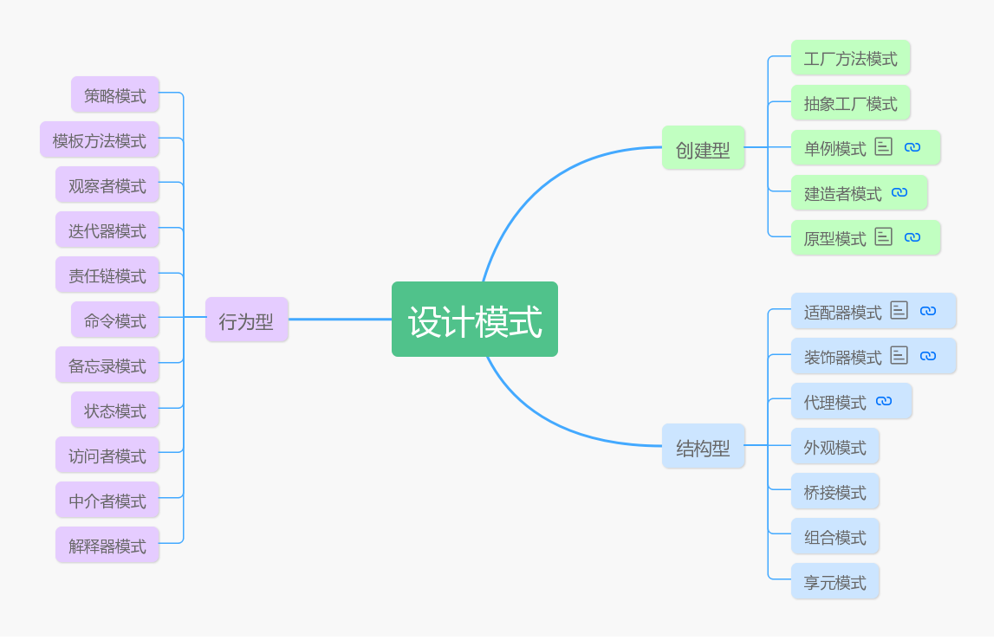

# 让设计模式飞一会儿|①开篇

哈喽，大家好，我是高冷就是范儿，以后就叫冷饭了，又和大家见面了。😎从今天开始我将正式开启有关**设计模式**的系列文章的写作，和大家一同来聊聊设计模式这个老生常谈的玩意。关于设计模式的文章，书籍，多如牛毛，随便百度、Google一下都能给你搜出不计其数关于讲解设计模式的文章来。

> ❓那为什么我还要花费如此大的精力和时间，来写这么个耳熟能详的东西呢？

## 写作原因

> 首先，肯定不是因为我对设计模式有多精通。其实我也只是一个正在学习路上的菜鸟，接下去写作过程中必然也需要查阅一些其它大佬们的资料来完善文章。我之前完整学习过设计模式，也做了一些笔记，所以希望能将学习过的知识做输出，分享给大家。

关于设计模式的文章确实有很多，但是我发现内容雷同比较多，甚至连内容的结构也比较统一单调，连文章的风格也都相去不远。设计模式属于技术体系中比较理论的内容，比较枯燥，要是再套用书本上那种正式严肃的风格去写，会比较痛苦。  

另外，有些文章篇幅相当长，里面各种图啊，代码啊贴的也不少，写的很是详细，当然初衷肯定是好的，希望能够帮助大家更好去理解。但是看着比较痛苦。好几次当我很痛苦的读完之后，发现还是没有把东西讲清楚，也不知道有什么用，还得去查阅其他资料。当我最后弄明白是咋回事后再回头看，发现这个玩意也并不是很复杂啊？为什么会讲的如此之复杂......

> **学习设计模式从忘记设计模式开始。**

基于这些问题，所以我决定还是应该炒炒冷饭（冷饭这名字还挺适合我~）写点设计模式的文章，我希望这次写作可以尽量抛弃书本上的教条框架，忘记自己曾经学习过设计模式，重新归零，从心出发，用自己比较通俗直白的方式，但又不失深度的将知识呈现给大家。

> 结合生活场景和框架源码。

同时，在后续的文章中，我也会尽量用生活中熟悉场景作为例子解释。当你真的学完每一个设计模式，并有过一些思考，会发现设计模式不再枯燥乏味，生活处处都会有它的身影。

另外，在技术领域，设计模式大量存在于各类主流开源框架中，其中以Spring，Mybatis等为典型代表，设计模式在其中被运用的炉火纯青。后续我也会挑选一些自己了解过的源码结合着聊。当你看懂其中的运用，你会不由赞叹设计者构思之精巧。

总体来讲，我希望我的文章不会是循规蹈矩，严肃死板的，以一种比较轻松、随意的风格进行的。文章的篇幅尽量简短精炼，能用一句话讲清楚绝不赘述。而且设计模式中，其实常用的模式就那么几种，所以我写的过程会有主次之分，重要我会详解，简单的或者几乎不用的模式我就一带而过了。当然如果大家有啥好的建议也可以告诉我。

今天是开篇导言，不涉及具体的模式的内容讲解，但是开宗明义，我还是想简单讲一下设计模式相关的概念。

## 是什么

> ❓设计模式到底是什么？

在这里我就不把设计模式的概念复制一遍了，我写着累，你们看着也累，而且前面说了，这个系列文章我尽量想用比较轻松、随意的风格写。总结起来就一句话，设计模式就是一些过去技术的大师们总结出来的一系列**写代码的套路**。

大佬们经过实践总结又将其这些套路分为三类，**创建型、结构型、行为型**。

顾名思义，**创建型模式**，是为了创建对象使用的，至于为什么创建个对象（直接new一个不就完事了吗）还需要如此多还不同的套路，后续你就知道，这边不赘述。**结构性模式**，是用来组织不同的小对象，从而变成更大更复杂结构的对象。**行为型模式**，是用来控制协调不同的对象的运行流程，因为实际开发场景下，不可能是孤零零一个对象在运行，会涉及多个对象交互，这中间的协调工作就会使用到行为型模式。

每一类型的模式都包含多个具体模式，如下图。后续每篇文章都会对其中一个模式做详解剖析，这边就不再赘述。

## 为什么

> ❓这些套路到底好在哪里？

很多人学设计模式觉得很难，很重要原因是，不知道这个模式到底好在哪里？解决了什么痛点？我能用它来干啥?所以只能生搬硬套。其实模仿也是无可厚非的，进步就是从模仿优秀者开始的。但是如果想要能驾驭一门知识，还是需要了解其本质的。

所以这边需要提一下一个跟设计模式紧密相关的概念——**面向对象的七大设计原则**。其实，如何评判一个设计模式好坏，就是用这七个原则来衡量的。这些原则有**开闭原则、里氏替换原则、依赖倒置原则、单一职责原则、接口隔离原则、迪米特法则、组合聚合复用原则**。还是比较抽象的，但是我这边就不展开了，大家也没必要去死记硬背这些原则，没意义。后续在讲到每个设计模式的优缺点时候，我会穿插提到这些设计原则，到时再做详解。

> ❓设计模式一定需要用吗？

这边先泼个冷水，这个设计模式系列你看完，你还真不一定能立刻用上，甚至有的时候你用了还是画蛇添足，会给应用带来一些不必要的问题和麻烦。尴尬......**设计模式对不同层级的程序（应用层级、类库层级、框架层级）重要性不一样**。设计模式更多可能会用在一些类库和框架的设计，或者对老项目重构，在业务逻辑开发中使用的比较少，甚至会引入不必要的复杂度。

**当用则用，不合适，或者感觉没把握，千万不要强上！👀当你的开发受到阻碍，亟需一条出路，哎，这个时候设计模式可以登场了......**

> ❓那这是为什么呢？

因为像类库框架这类产品，会被不同的人大量重复使用，所以对其重用性、扩展性、灵活性有很高的要求。而对于普通的业务逻辑开发，这方面要求较低。

## 怎么办

还能怎么办？学呗......😏下一篇我就会开始写第一个设计模式——**单例模式**，让咱们一起探讨设计模式的奥秘吧。不见不散。😊👏

