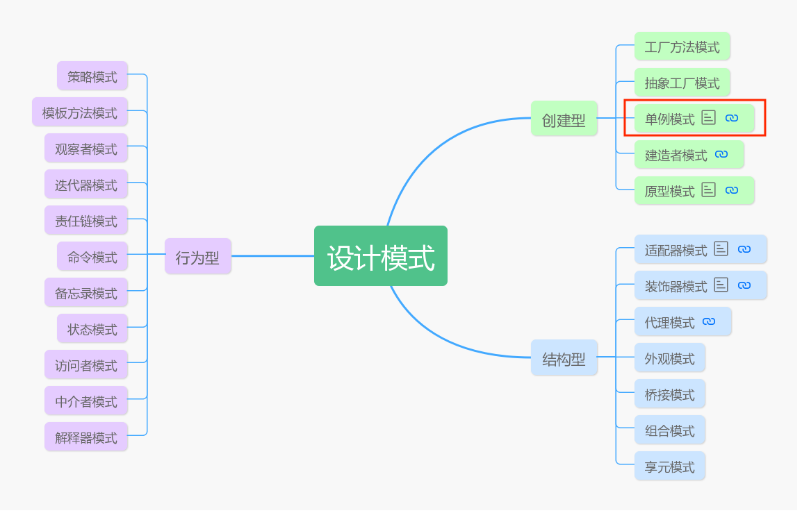
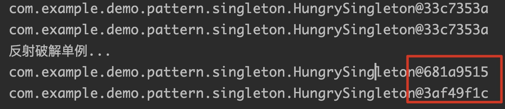
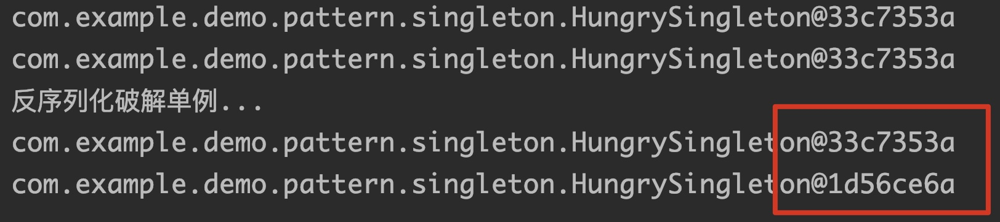

# 让设计模式飞一会儿|②单例模式

哈喽，大家好，我是高冷就是范儿，又和各位见面了。😎从今天开始，我将正式开始设计模式系列文章的写作分享。今天要和大家分享的是GOF23模式中第一个模式——**单例模式**。这个模式号称是GOF23所有设计模式中最简单的一个设计模式。不过，等你看完这篇文章后会发现，这句话听听就好，别当真。😂单例模式简单吗？这是不存在的，要想吃透里面的细节并不容易，尤其是初学者。但是单例模式在实际生活和开发中，却是大量的被使用到，因此，这个模式我们是需要深入学习掌握的。下面不废话直入主题。



## 为什么要使用单例模式

单例模式属于上篇说过的设计模式三大分类中的第一类——**创建型模式**，自然是跟对象的创建相关，而且听这名字——单例，也就是说，这个模式在创建对象的同时，还致力于控制创建对象的数量，是的，**只能创建一个实例**，多的不要。或者从这一方面讲，它确实是最简单的模式。每个Java程序员都知道，Java中的对象都是使用new关键字来加载类并在堆内存中开辟空间创建对象，这是平时用到最多创建对象的方式。也知道每次new都会产生一个全新的对象。一直这样用着，好像从来没觉得有啥不好，更没有怎么思考过，这玩意居然还要去控制它的数量。

> 👉那么问题来了，到底我们为什么要控制对象创建的个数？直接new一下多省事啊❓

既然这个模式存在并且大量使用，说明有些场景下，没它还真不行。那么什么场景下会没它不行呢？我举个栗子🌰，比如我们平时使用的Windows上的回收站，是不是只有一个？要是有多个，会发生什么？我刚把回收站清空了，换到另一个回收站看垃圾还在，那这垃圾到底是在，还是不在？是不是很诡异了？另外比如博客上会有一个博客访问人数统计，这个东西要是不是单例的会有啥问题？今天统计了流量有100个，第二天用了一个新的计数器，又回到0了重新开始统计，那这个统计还有意义吗？

> 也就是说，有些场景下，不使用单例模式，会导致系统同一时刻出现多个状态缺乏同步，用户自然无法判断当前处于什么状态

在技术领域，单例模式的场景更是不计其数。

比如XXX池的基本都是单例，为什么呢？对象的创建是一个比较耗时耗费资源的过程，尤其是像线程、数据库连接等，都属于使用非常频繁，但是创建销毁又非常耗时的资源，如果不使用池来控制其数量和创建，会对性能造成极大的影响。另外，像线程池中的线程，可能会需要相互通信，如果不是在同一个池中，对通信也会有影响。

> 通过控制创建对象的数量，可以节约系统资源开销

另外像应用中的日志系统，一般也会采用单例模式。这样所有的日志都会统一追加，方便后续管理。

读取配置的类一般会使用一个单例去统一加载读取。因为一般配置只会在应用启动时加载一次，而且会需要给整个应用所有对象共享。

> 全局数据共享

还有在各大主流开源框架以及JDK源码当中，也是大量使用到这种模式。后续我也会抛砖引玉给大家举两个例子。

正是存在上这些痛点，使得有时候我们创建对象还真不能再简单任性直接new一下，需要对其做一些精细控制。那怎么才能控制只创建一个对象呢？

经过无数前人总结，一般有以下这些经典的解决方案，

## 分类

### 饿汉式

啥叫饿汉式？饿了就立刻想到吃，类比到创建对象也是如此，当类一初始化，该类的对象就立刻会被实例化。

> 👉怎么实现？

代码如下：

```java
public class HungrySingleton {
  private HungrySingleton() {} ❶  

  private static HungrySingleton instance = new HungrySingleton();❷

  public static HungrySingleton getInstance() {
    return instance;
  }
}
```

当外部调用`HungrySingleton.getInstance()`时，就会返回唯一的`instance`实例。为什么是唯一的？

这代码中有几个要点

- 标注❶处该类的构造器用`private`修饰，防止外部手动通过new创建。后面的例子都需要这样，后面就不解释了。
- 标注❷处是核心，`instance`使用`static`修饰，然后调用new创建对象，我们知道`static`修饰的东西都属于类，而且在类加载阶段就已经被加载，并且只能被加载一次。就是类加载这种特性很好的保证了单例的特性，也天然防止了并发的问题。

卧槽，单例模式居然如此简单，这么轻松就完成一个，这就算完事了？呵呵......

这个代码确实实现了单例的效果，只要调用`HungrySingleton.getInstance()`，你就算是神仙也造不出第二个对象......（其实后面会知道，还是有办法的）

> 👉但是想想，这个方法有啥问题没？

没错，一旦类初始化时就会创建这个对象，有人说，创建就创建呗，这有啥大不了的？大部分情况下确实是没啥问题，但是如果创建这个对象极其耗费时间和资源呢？这样必然会造成巨大的性能损耗。

另外还有一种情况，有的时候我只是想单纯的加载一下类，但并不想去用该对象，那这个时候这种模式就属于浪费内存了。什么意思？我举个栗子🌰，如下代码，其他代码和上面一样，就是加了❶行，然后我现在外部调用`HungrySingleton.flag`，会发生什么？
```java
public class HungrySingleton {
  private HungrySingleton() {} 
	
  private static int flag = 1;	❶
  private static HungrySingleton instance = new HungrySingleton();

  public static HungrySingleton getInstance() {
    return instance;
  }
}
```

学过Java类加载机制的都知道，当去访问一个类的静态属性的时候会触发该类初始化，这就导致，我明明只是想使用一下`flag`属性，并不想用`HungrySingleton`对象，但由于你访问了flag导致`HungrySingleton`的初始化，从而导致`instance`被实例化，造成内存泄露。

看来这种方案可行，但不是完美的，那有啥更好方案，既能保证只创建单个对象，又可以做到真正需要使用该对象时再创建它（延迟加载），从来达到节约系统资源目的？答案当然是有的！

### 懒汉式

和饿汉相反，懒汉自然是很懒，能不吃就不吃饭，等到实在饿得不行了（需要用该对象了）才去吃饭（创建对象）。

> 👉怎么实现？

代码如下：

```java
public class LazySingleton {
   private static LazySingleton instance = null;	❶
     
	 private LazySingleton() {	
 	 }	
  public static LazySingleton getInstance() {	❷
    if(instance == null){ ❸
      instance = new LazySingleton();
    }
    return instance;
  }
}
```

关注❶处，类加载时不会立刻创建对象了，然后当`LazySingleton.getInstance()`调用❷处方法时，通过判断`instance == null`，如果有了就不创建了，没有就才会创建。

哈哈，既实现了延迟加载，节约资源，又保证了单例，貌似没毛病。飘了~😎

没错，在单线程下面确实如此，可惜忽略了多线程场景。为什么在多线程下会有问题？分析一下，现在有两个线程A和B，同时到达❸处，自然此时`instance = new LazySingleton()`这一行没被调用过，自然❸处条件成立，然后A和B同时进入了`if{}`代码块，后面的事情就知道了，A和B线程都会调用`instance = new LazySingleton()`，从而创建多个对象，破坏了单例。

那怎么办？有并发问题？那就加锁同步呗......

```java
public class LazySingleton {
  private LazySingleton() {	
  }	
  private static volatile LazySingleton instance = null;	❶

  public static synchronized LazySingleton getInstance() { ❷
    if(instance == null){
      instance = new LazySingleton();
    }
    return instance;
  }
}
```

这代码中有几个要点

- 标注❶处其它和上面一样，多了一个`volatile`修饰，这主要是为了保证多线程下内存可见性。因为高速缓存关系，一个线程的修改并不一定要实时同步到另一线程，`volatile`可以用来解决这个问题。
- 标注❷处加`synchronized`同步锁，可以保证同一时刻只会有一个线程进入`getInstance()`方法，自然只会有一个线程调用`instance = new LazySingleton()`，单例自然就保证了。但同时这个带来了一个新问题，因为每个线程不管instance有没有被创建过，都会去调用`getInstance()`，因为`if(instance == null)`是需要进入方法后才判断的，然而`getInstance()`又是一个同步的，同一时刻只会有一个线程进入，其余线程都必须等待，这就会导致线程阻塞，导致性能下降。

上述方法确实实现了延迟创建对象，但是性能低下的问题如何解决？聪明的攻城狮们又想到了新的方案......

### 双重检测锁

> 👉怎么实现？

代码如下： 

```java
public class LazySingleton {
    private LazySingleton() {
    }	
    
    private static volatile LazySingleton instance = null; ❷
    public static LazySingleton getInstance(){ ❶
      if(instance == null){ ❸	
        synchronized (LazySingleton.class) { ❺
          if(instance == null)	❹
          instance = new LazySingleton();❻
        }
      }
      return instance;
    }
  }
```

这个代码看上去会比较复杂，讲几个关注点：

- 标注❶处方法内部和上面例子代码最大的区别在于，有❸❹两处if判断。**为什么要两次判断？**

  - **第一次if判断是为了提高效率。**怎么理解？回顾懒汉式方案代码，`synchronized`将整个方法加同步锁，也就是说，不管外部（线程）在调用`getInstance()`方法这一刻该对象是否已经被创建好，都需要阻塞等待。而❸处的if判断就使得，只有此时真的还没有创建出对象才会进入`synchronized`代码块，如果已经创建了就直接return了，所以显然提高性能了。
  - **那么❹处的第二次if判断又是为什么？这才是用来保证多线程安全的。**又怎么理解？设想下面这种场景。A和B两个线程同时来到❺处，此时因为`synchronized`缘故，只能有一个线程进入，假设A拿到了这把锁，进入`synchronized`代码块，然后通过❻创建出了一个`LazySingleton`实例，然后离开`synchronized`代码块，然后把锁释放了，但是还没等到它return的时候，B线程拿到了这把锁，进入`synchronized`代码块，此时要是没有❹处if判断，B线程照样可以来到❻处，以迅雷不及掩耳之势噼里啪啦一顿操作，又创建出一个`LazySingleton`实例。显然此时，单例模式已经被破坏了。所以❹处的判断也不可省略。

- 标注❷处看上去和懒汉式的代码没区别，但是这边`volatile`语义已经发生改变，已经不单纯是为了内存可见的问题了，还涉及到**指令重排序**的问题。怎么理解？一切问题出在❻处。震惊！❻处看似平常的一行代码居然会有问题。是的，下面我来详解。❻处会创建一个`LazySingleton`实例，并且赋值给`instance`变量，很遗憾，这一个动作在指令层面并非原子操作。这个动作可以分为4步，

  > 1.申请内存空间
  >
  > 2.初始化默认值
  >
	> 3.执行构造器初始化
  >
  > 4.将instance指向创建的对象
  
  而有些编译器会对代码做指令重排序，因为3和4本身相互并不存在依赖，指令重排序的存在可能会导致3和4顺序发生颠倒。这会有什么问题？首先在单线程下并不会有什么问题，为什么？因为指令重排序的前提就是不改变在单线程下的结果，无论先执行3还是4，最后返回的对象都是初始化好后的。但是在多线程下呢？设想一种极端场景，现在假设A线程拿到锁进入到❻处，然后它完成了上面4步的1和2，因为现在指令重排序了，下面A线程会将`instance`指向创建的对象，也就是说，此时`instance != null`了！然后正当A要去执行构造器初始化对象时，巧得很，这时候B线程来到❸处，判断`instance == null`不成立了，直接返回，独留A线程在原地骂娘“尼玛，我™还没初始化对象呢......”，因为返回了一个没有经过初始化的对象，后续操作自然会有问题。正是因为这个原因，所以❷处`volatile`不可省略，**主要原因就在于防止指令重排序**，避免上述问题。

那是不是这样就万无一失了呢？很遗憾，上述如此严密的控制，还是不能完全保证出问题。What？那就是上述的做法有个前提，**JDK必须是JDK5或更高版本**，因为从JDK5才开始使用新的JSR-133内存模型规范，而在这个规范中才增强了`volatile`这个语义......

卧槽，原来搞了大半天还是有问题啊......心好累，而且说实话，就算不考虑JDK版本这个问题，这种方案的实现代码太过丑陋，本身看着就不是很爽，而且考虑的东西太多，稍有闪失就GG了。所以，这种方案虽然分析了这么多，但是其实没有实际意义，实际工作中强烈不建议使用。那还有没有好的方案啊？当然有啊！

### 静态内部类实现

**根据类加载机制，外部类的初始化并不会导致静态内部类的初始化。**

> 👉怎么验证？

如下代码：

```java
public class Demo {
    private static int a = 1;
    private static class Inner{
        static {
            System.out.println("Inner loading ...");
        }
    }
    public static void main(String[] args) {
        System.out.println(Demo.a);
    }
}
```

通过`Demo.a`引用外部类`Demo`的静态变量`a`，会导致外部类的初始化，如果`Inner`被初始化了，必然会执行`static`块，从而打印`"Inner loading ..."`，然而很遗憾，这个代码执行结果只会打印出`“1”`。这也印证了开始的结论。有了这个结论，我们就可以利用它实现优雅的单例了。哈哈~😍

> 👉怎么实现？

代码如下：

```java
public class StaticInnerSingleton {
    private StaticInnerSingleton() {
    }
    private static class StaticInnerSingletonInstance { ❶
      private static final StaticInnerSingleton instance = new StaticInnerSingleton();
    }
    public static StaticInnerSingleton getInstance() { ❷
      return StaticInnerSingletonInstance.instance;
    }
}
```

讲几个关注点：

- ❶处`StaticInnerSingletonInstance`是一个静态内部类，内部静态字段`instance`负责创建对象。因为上面的结论，所以当然外部类`StaticInnerSingleton`初始化时，并不会导致`StaticInnerSingletonInstance`初始化，进而导致`instance`的初始化。所以实现了延迟加载。

- 当外部调用❷处`getInstance()`时，通过`StaticInnerSingletonInstance.instance`对`instance`引用才会导致对象的创建。由于`static`的属性只会跟随类加载初始化一次，天然保证了线程安全问题。

这个方案算是完美解决了上述所有方案的问题，且保留了所有的优点。算是一个完美方案。

还有没有其它方案？必须的！

### 枚举实现

用枚举实现单例是最简单的了，因为，Java中的枚举类型本身就天然单例的，

> 👉怎么实现？

代码如下：

```java
enum EnumSingletonInstance{
   INSTANCE;
   public static EnumSingletonInstance getInstance(){
   		return INSTANCE;
   }
}
```

唯一遗憾的是，这个方案和饿汉式一样，没法延迟加载。枚举类加载自然就会初始化`INSTANCE`。

常用的单例模式的方案基本就是这些。那这样是不是就真的万无一失了呢？很遗憾的告诉大家，上述这些方法还不是绝对能保证只创建一个对象。mmp......我擦，我就想玩个单例咋这么累呢？心塞......😭是的，上面的方案除了枚举方案，其余方案都可以被破解。下面我们来了解一下。

## 破解单例

破解单例有两种方法，**反射或者反序列化**。下面我用代码做简单演示。以饿汉式为例，其余模式同理，大家可以自行测试。

### 反射

> 👉怎么破解？

代码如下：

```java
//饿汉式的代码省略，参考前面饿汉式章节
public static void main(String[] args) throws Exception {
        System.out.println(HungrySingleton.getInstance());
        System.out.println(HungrySingleton.getInstance());
        System.out.println("反射破解单例...");
        HungrySingleton instance1 = HungrySingleton.class.newInstance();
        HungrySingleton instance2 = HungrySingleton.class.newInstance();
        System.out.println(instance1);
        System.out.println(instance2);
}
```

输出结果如图，很清楚的看到单例被破解了。



 > 👉如何防止？

很简单，因为`Class.newInstance()`是通过调用`HungrySingleton`无参构造器创建对象的，只要在构造器中加入有以下逻辑即可。这样，当类初始化时，第一次正常创建出实例并赋值给`instance`。当再想通过反射想要破解单例时，自然会抛出异常阻止继续实例化。

```java
//饿汉式的其它代码，参考前面饿汉式章节
private HungrySingleton() {
    if (instance != null) {
      try {
        throw new Exception("只能创建一个对象！");
      } catch (Exception e) {
        e.printStackTrace();
      }
    }
}
```

### 反序列化

> 👉怎么破解？

另外，通过序列化和反序列化也可以破解单例。（前提是单例类实现了`Serializable`接口）代码如下：

```java
public static void main(String[] args) throws Exception {
        System.out.println(HungrySingleton.getInstance());
        System.out.println(HungrySingleton.getInstance());
        System.out.println("反序列化破解单例...");
        HungrySingleton instance1 = HungrySingleton.getInstance();
        ByteArrayOutputStream baos = new ByteArrayOutputStream();
        ObjectOutputStream out = new ObjectOutputStream(baos);
        out.writeObject(instance1);	//序列化
        ObjectInputStream ois = new ObjectInputStream(new ByteArrayInputStream(baos.toByteArray()));
        HungrySingleton instance2 = (HungrySingleton) ois.readObject();	//反序列化
        System.out.println(instance1);
        System.out.println(instance2);
}
```

输出结果如图，很清楚的看到单例也被破解了。



> 👉如何防止？

也非常简单，只需要在单例类中添加如下`readResolve()`方法，然后在方法体中返回我们的单例实例即可。为什么？因为`readResolve()`方法是在`readObject()`方法之后才被调用，因而它每次都会用我们自己生成的单实例替换从流中读取的对象。这样自然就保证了单例。

```java
private Object readResolve() throws ObjectStreamException{
  return instance;
}
```

## 如何选择

关于单例模式的全部内容就是这些，最后来做个总结，那么这么多的单例模式实现方案我们到底需要选择哪个呢？技术选型从来不是非黑即白的问题，**而是需要根据你的实际应用场景决定的**。不过从上述各种单例模式的特点，我们可以得出以下结论：

- 从安全性角度考虑，枚举显然是最安全的，保证绝对的单例，因为可以天然防止反射和反序列化的破解手段。而其它方案一定场合下全部可以被破解。

- 从延迟加载考虑，懒汉式、双重检测锁、静态内部类方案都可以实现，然而双重检测锁方案代码实现复杂，而且还有对JDK版本的要求，首先排除。懒汉式加锁性能较差，而静态内部类实现方法既能够延迟加载节约资源，另外也不需要加锁，性能较好，所以这方面考虑静态内部类方案最佳。

> 👉一般选用原则
>
> - 单例对象占用资源少，不需要延时加载：枚举式好于饿汉式。
> - 单例对象占用资源大，需要延时加载：静态内部类式好于懒汉式。

## 抛砖引玉

前面也提到，单例模式在开源框架中被使用的非常之多，下面我就抛砖引玉挑选几处给大家讲解一下，

下面这个代码截取自Mybatis中，这是一个典型的使用静态内部类方式实现单例。

```java
public abstract class VFS {
  	... //省略大量无关代码
    private static class VFSHolder {
        static final VFS INSTANCE = createVFS();

        static VFS createVFS() {
            ... //省略创建过程
        }
    }
		... //省略大量无关代码
    public static VFS getInstance() {
        return VFSHolder.INSTANCE;
    }
  	... //省略大量无关代码
}
```

在JDK底层也是大量使用了单例模式，比如，`Runtime`类是JDK中表示Java运行时的环境的一个类，其内部实现也是采用单例模式，因为一个应用程序只需要一个运行时的环境即可，并且是采用饿汉式方式实现。

```java
public class Runtime {
    private static Runtime currentRuntime = new Runtime();

    public static Runtime getRuntime() {
        return currentRuntime;
    }

    private Runtime() {
    }
}
```

## 最后啰嗦一句

在结束之前，我再多说一句，网上有些文章经常会用Spring的单例bean和Mybatis中的`ErrorContext`类作为单例模式的例子，**其实这是有问题的**。

- 首先，Spring中的单例bean跟本文讲的单例模式并没有关系，不是一回事，可能也就名字比较像，这也是容易混淆的地方，实现方式当然也就天差地别了。Spring的单例bean是通过将指定类首次创建的bean进行缓存，后续去获取的时候，如果设置为`singleton`，就直接会从缓存中返回之前缓存的对象，而不会创建新对象。但是这个是有前提的，那就是在**同一个容器**中。如果在你的JVM中存在多个Spring容器，该类也就会创建多个实例了。所以这是不能算是真正的单例模式。本文上述描述的单例模式是指JVM进程级别的，也就是说，只要是在同一个JVM中，单例类只会存在一个对象。

- Mybatis中的`ErrorContext`类中采用的是`ThreadLocal`机制保证同一个线程跟唯一一个`ErrorContext`实例绑定，但是这个也是有前提的，那就是在**线程范围内**的，在每一个线程内部，确实做到了只创建一个实例，但是从应用级别或者JVM级别依然不是单例，所以不能将其称之为单例模式。

> **一言以蔽之，真正的单例模式，是指JVM进程级别的**！


好了，今天关于单例模式的技术分享就到此结束，下一篇我会继续分享另一个设计模式——**工厂模式**，一起探讨设计模式的奥秘。咱们不见不散。😊👏