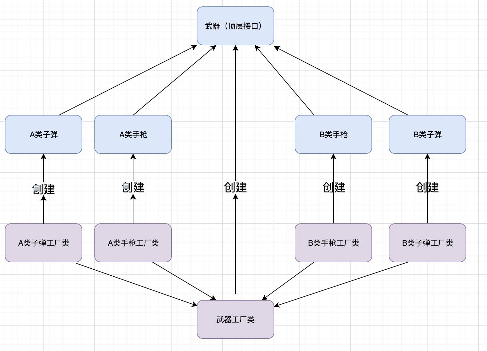
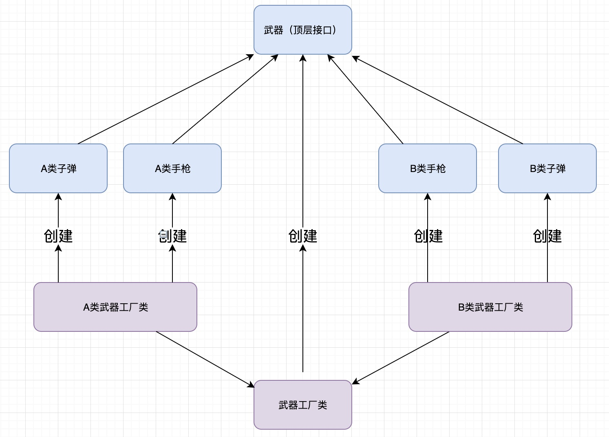
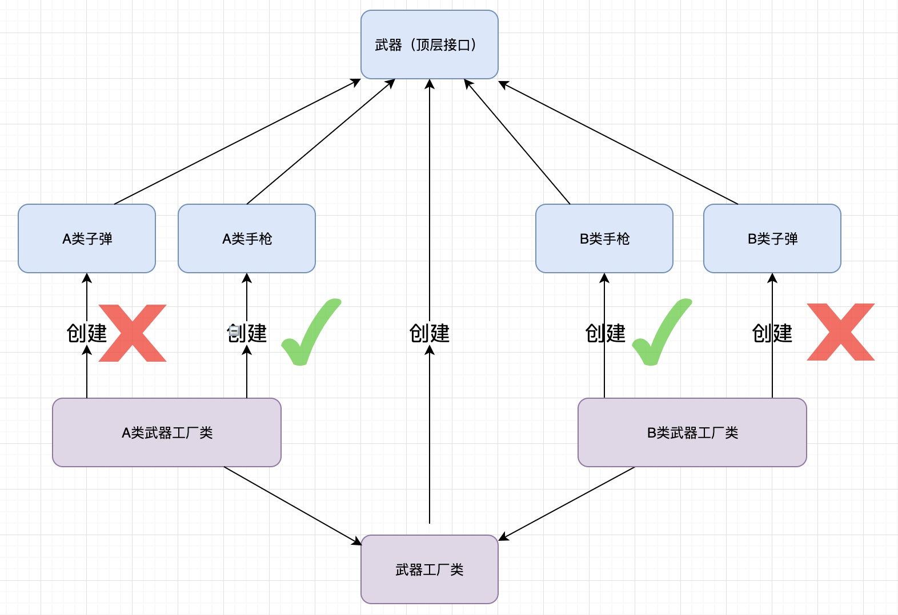

# 让设计模式飞一会儿|③工厂模式

哈喽，大家好，我是高冷就是范儿，很高兴又和大家见面了。😎上一篇文章中我们已经聊完了GOF23中的第一个模式——**单例模式**，如果没有看过的，可以回顾一下。

> **前文回顾**  
> 👉[让设计模式飞一会儿|①开篇](让设计模式飞一会儿|①开篇.md)  
> 👉[让设计模式飞一会儿|②单例模式](让设计模式飞一会儿|②单例模式.md)  

看完后感觉怎么样？是不是感觉设计模式也就那样，不是传说中的那样可望不可及吧？万事开头难，既然第一关已经过了，那么接下去的路就好走多了......（听听就好🤣）言归正传，今天我们开始一个新的模式——**工厂模式**。工厂模式作为本系列第二个登场的角色，可想而知它的重要性了。另外和单例模式相比，工厂模式会相对复杂一些，因为单例模式只涉及一个对象，而工厂模式会涉及到多个对象。而且这一模式在实际开发中，那真的是应用得太太太太太太™广泛了......😱再多的太都不足形容。因此，**这个模式也是我们需要深入掌握的一个模式**。

## 为什么需要工厂模式

看过我之前写的文章的应该都清楚我的风格，学一样东西，我会先简单思考一下，这玩意到底有啥用，学了能帮我解决什么，才能决定我如何学以及学习的深度。同样，今天学习工厂模式，我们先来看看，

> ❓工厂模式是个什么玩意？到底有什么用？为什么会出现这一模式？帮我们解决了什么问题？如果没有它会怎么样？

工厂模式，顾名思义，跟工厂有关。何为工厂？工厂就是用来生产产品的，例如汽车工厂用来生产汽车，粮食工厂用来生产粮食等。那在面向对象软件开发领域，自然是用这种模式来生产对象的。所以工厂模式也是属于之前说过的**创建型模式**。那老问题来了，平时我们创建一个对象大多数情况都是直接new一下不就有了吗？为什么非要按照你工厂模式的套路来创建对象？

为方便理解，下面我举个简单的例子，如下代码，

```java
public class Service {
    Dao dao = new JpaDao(); ❶
    void service(){
    	//使用dao进行一系列持久层操作
    }
}
```

做过Java后端开发的对上面的代码套路太熟悉不过了，这是一个经典的`Service`层，调用`DAO`层API完成数据库操作，这没有什么好说的。现在假设这个团队使用的持久层框架是`JPA`，所以他们把所有的数据库操作都封装在`JpaDao`这个工具类中，然后在`Service`类里面通过new得到一个实例，并在具体业务方法中使用它来完成数据库操作。这代码执行结果会有问题吗？当然不会，这代码肯定能跑起来，业务逻辑正常执行完成。

> ❓但是思考一下，这样的代码会有啥问题？
>

假设某一天，经过团队讨论，决定不用`JPA`这玩意了，还是使用`Mybatis`。于是团队各大高手通宵达旦，连夜又将`Mybatis`封装了一波，并开发出来一个`MybatisDao`工具包，打算用它来替换之前工程中使用的`JpaDao`。好了，现在问题来了，原来`Dao dao = new JpaDao()`这一行是写死在每一个`Service`类中，现在需要将所有`Service`类中的`Dao dao = new JpaDao()`修改为`Dao dao = new MybatisDao()`。要是整个工程就只有几个`Service`类，那还好办，改就改了。那要是成千上万呢？那通宵加班是免不了了......😭而且，要是下次又换个别的框架，又来这么一下，那还不得吐血啊⁉️......😒

在这个系列文章开篇，我们提到过设计的几大原则，这个代码就涉及到了其中的**开闭原则**。

> 👉开闭原则倡导，软件实体应当对扩展开放，对修改关闭。

翻译成人话就是说，你想要扩展或者修改以前已经写好的代码的功能，你可以**往里面加入新的代码，但是绝对不允许修改以前已经写好的代码**。很显然，上面代码违反了这一原则。

> ❓那么我们来分析一下，这个代码关键问题在哪里，才会导致这种不可收拾的结果？

不难发现，在这个代码中，`Service`和`JpaDao`是紧耦合的，也就意味着，每个`Service`你只能使用`JpaDao`，要想使用其它的，没有其他选择，必须修改代码。

> ❓如何解决？
>

思考一下，既然上面提到，这个代码中核心问题是`Service`和`JpaDao`的耦合导致代码的扩展性很差，那自然想到，有什么办法可以让它解耦？问题关键在于，在❶处是直接new出来一个非常具体的底层对象！

> ⚠️new操作本身就是一个耦合的操作！
>

所以要想`Service`和`JpaDao`解耦，必须拿掉这个new的逻辑。可是对象还是得创建啊，new拿掉了还怎么创建呢？new当然还是要new的，但是得让他挪个地方。优化代码如下，

```java
public class Service {
    Dao dao = DaoFactory.getDao(); ❶
    void service(){
    	//使用dao进行一系列持久层操作
    }
}
```

然后我将所有的new的代码全部抽取到`Service`类外部的一个单独`DaoFactory`类中，如下，

```java
public class DaoFactory {
    public static Dao getDao() {
        return new JpaDao(); ❷
    }
}
```

这样优化后有一个明显好处，以后不管你团队换啥持久层实现，所有的`Service`类是不需要再动了，比如需要将持久层框架改为`Mybatis`，只需要修改一下`DaoFactory`类❷处，将其改为`return new MybatisDao(`)就可以了，这样一来，修改代码的工作量极大减少。这个方案和刚开始的相比，可以说已经是一个很大的进步了。但是，现在虽然代码修改工作量少了，可是根本问题还是没有解决，`DaoFactory`的代码还是得修改啊？开闭原则该违反还是违反。作为**一个对技术有极致的程序猿**👨‍💻‍，怎么可能容忍这等事情呢⁉️

**绝对不可能！**

还有没有妙招？当然有！

其实上面`DaoFactory`之所以还需要修改，罪魁祸首还是因为❷处直接new了一个具体对象！哎呀，这万恶的new啊......😒想要解耦，必须拿掉new的逻辑，可是还是那个问题，不new怎么创建对象？依稀还记得当前大明湖畔的**反射**吗？`Java`当中的反射太强大了，给一个字符串就可以直接创建一个对象，牛逼🐂！这样就不需要通过new啦！那问题来了，这个字符串怎么传？要是通过方法参数传入，那不还得修改源代码吗？有没有一种方案可以不用通过代码传递参数的？没错，**配置文件**！哈哈，O了，于是再次优化方案，如下，

在类路径下创建`config.properties`文件，配置内容如下：

```
dao=com.example.demo.pattern.factory.JpaDao
```

然后`DaoFactory`内容修改如下，

```java
public class DaoFactory {
    public static Dao getDao() throws Exception {
        Properties prop = new Properties();
        prop.load(DaoFactory.class.getClassLoader().getResourceAsStream("config.properties"));
        Class<?> dao = Class.forName((String) prop.get("dao"));
        return (Dao) dao.newInstance();
    }
}
```

大家看出其中的奥秘了吗？这样一来就把代码中耦合的部分提取到了外部配置文件，后续再要修改`Dao`实现方式，只需要提供对应的`xxxDao`类，并将其全类名配置在`config.properties`中即可。所有的`Service`类中获取Dao的方式还是通过`DaoFactory.getDao()`，再也不需要修改了。O了，这真是个绝妙的完美方案啊~👏

说到这儿，大家可能有点懵逼了，哎，今天不是说好讲工厂模式的吗？讲了一大圈废话，这讲的是啥？哈哈，如果你能看懂上面这个例子，那么，恭喜你，你已经学习了工厂模式一部分内容。没错，上面这个例子就是一个经典的**简单工厂模式**的案例。

## 简单工厂模式

**简单工厂模式**是工厂模式的第一种形式，又叫**静态工厂模式**。顾名思义，因为这种工厂模式中获取对象的方法一般都定义成静态方法，形式如下：

```java
public class Factory {
    public static <R,P> R getInstance(P type){
        //根据传入的type不同做if else判断返回不同类型的对象。
    }
}
```

或者还有另一种形式：

```java
public class Factory {
    public static <R,P> R getInstance01(){
        //创建一种类型的对象
    }
  	public static <R,P> R getInstance02(){
        //创建另一种类型的对象
    }
}
```

这两种形式本质上跟前面例子中`DaoFactory.getDao`()方法是一样的，无非我们是通过直接修改返回值（或者修改配置文件）来返回不同类型对象，这边是通过对传入的字段判断达到返回不同类型对象的目的。

当然，你也可以将获取对象的方法定义成普通方法，然后通过`Factory`的实例调用其`getInstance()`，完全没问题。如下，

```java
public class Factory {
    public <R,P> R getInstance(P type){
        //根据传入的type不同做if else判断返回不同类型的对象。
    }
}
```

其实这种方式又叫做**实例工厂模式**。这两种方式的区别在于，静态工厂可以直接用类名调用而不需要创建出工厂类的实例。但是我们知道，静态方法可以继承，但是没有办法被重写，没有重写也就不可能实现多态的特性了。所以静态工厂是没有办法通过继承方式来动态改变工厂创建对象的行为的。

> 👉优缺点
>

通过上面这个例子，我们不难看出，简单工厂模式确实在一定程度上实现代码的解耦，而这种解耦的特点在于，这种模式将对象的创建和使用分离，其实这个特点是所有创建型模式的共性，包括前面聊过的单例模式，以及接下去后面还会讲到的其他的创建型模式都有这个特点。另外，简单工厂模式也起到了一定的封装功能。试想一下，假设上面的`DaoFactory.getDao()`返回的`JpaDao`和`MybatisDao`对象创建过程非常繁琐冗长，如果不使用工厂模式，`JpaDao`和`MybatisDao`对象的创建逻辑就会散落在项目中各个`Service`类，以及其他用到该对象的地方，造成代码重复冗余。

但是这种模式的缺点也很明显，**不符合开闭原则**。这种模式的本质在于通过一个传入的参数，做if else判断，来达到返回不同类型对象的目的。因此，如果需要增加新的类型，就不得不去修改原来的代码，违反开闭原则。虽然这个问题可以通过前面**反射+外部配置文件**的方式在一定程度上得到缓解，但是这只是一种“投机取巧”的解决方案，并没有从根本上解决简单工厂模式的问题。

或许也就是因为这原因，**很遗憾，简单工厂模式其实并不属于GOF23体系**。

那么有没有更好的办法，从根本上解决简单工厂模式的问题呢？答案当然是有的！

## 工厂方法模式

> ❓其实，简单工厂模式之所以违反开闭原则，关键在于什么？
>

那就是它把所有对象的创建都集中在同一个工厂类里面了！因此，当新增一个新对象时，必然会需要修改这个共享工厂类，违反开闭原则自然不可避免。

> ❓思考一下，既然问题关键在于，所有对象的创建都跟这个唯一的工厂类耦合了，那我每个对象各自都配置一个单独的工厂类，这个工厂类只创建各自类型的对象，那这样不就解决耦合的问题了吗？

这就引出了工厂模式的第二种形式——**工厂方法模式**。工厂方法模式的产生就是为了解决上面提到的简单工厂模式所遇到的问题的。工厂方法模式是在简单工厂模式基础上进一步抽象，将工厂类设计成抽象类或接口，不同的产品实现各自的工厂实体类。创建对象时，只需要提供对应的产品类和该产品的工厂类即可，不需要知道内部创建过程。

就比如上面例子的`DaoFactory`类，现在我们将其抽象成接口，然后同时为每一个`DAO`类实现一个对应的工厂实现类，如下：

```java
interface DaoFactory{
    Dao getDao();
}

class JpaDaoFactory implements DaoFactory{
    public Dao getDao() {
        return new JpaDao();
    }
}
class MybatisDaoFactory implements DaoFactory{
    public Dao getDao() {
        return new MybatisDao();
    }
}
```

然后在创建`Service`类时将具体的实现类对应的工厂类传入，利用多态就可以实现不同的持久层实现切换。代码如下：

```java
public class Service {
    private Dao dao;

    public Service(DaoFactory daoFactory) {
        this.dao = daoFactory.getDao();
    }
    void service() {
		//使用dao进行一系列持久层操作
    }
}
```

> ❓优缺点
>

从上面例子不难看出，工厂方法模式轻松解决了简单工厂模式的问题，**符合开闭原则**。在上面例子中，当需要切换另外某持久层实现，比如`JDBC`，此时只需要提供一个对应的`JDBCDaoFactory`实现`DaoFactory`的`getDao`方法，返回对应的`Dao`对象即可，对于原先代码再不需要做任何修改。

其实在工厂方法模式中，可以引申出另外一种设计原则，**依赖倒置原则**。

> 👉依赖倒置原则倡导我们要面向接口编程，不要面向实现编程。就比如上面例子中，和Service类耦合的是最高层接口DaoFactory，而底层实现是当程序运行时才决定的。

**那工厂方法模式有缺点吗？当然，没有什么是完美的。**

很明显的一点，每个类型的对象都会有一个与之对应的工厂类。如果对象的类型不是很多，那还好。但是如果对象的类型非常多，意味着会需要创建很多的工厂实现类，造成类数量膨胀，对后续维护带来一些麻烦。

**而且，这当中有一种特殊情况！**

有时候这些对象类型很多，但是彼此之间有依赖或者关系很紧密，属于**同一个系列**的东西，完全可以一起创建，没必要再另起炉灶，为每个对象单独创建一个工厂实现类了。但是使用工厂方法模式，你还是不得不为每个对象单独创建一个工厂实现类，因此非常繁琐。为了帮助理解这一点，下面举个例子。

假设现在需要创建一个手枪对象，但是有手枪，肯定需要配备子弹吧？没有子弹你玩什么枪？也就是说，你还要附带创建一个子弹对象。那如果使用上面的工厂方法模式能不能完成这一需求呢？

当然没问题，只要定义一个手枪和子弹对象的公共工厂接口，然后各自创建不同的工厂实现类即可。但是这样的话，你需要有两个工厂实现类。如果还需要配备其它和手枪相关的装备，还需要再继续创建一个对应的工厂实现类。再继续延伸，手枪可能还会分很多种类，上面说的只是其中一类，要是还有另外一种类的手枪，你也需要这么来一波操作，工厂实现类的数量继续翻倍。以此类推......

> ❓发现问题了没？

这也是上面总结的工厂方法模式的缺点。当随着创建的对象类型越来越多，工厂实现类数量也跟着膨胀。而这个例子中，创建的对象都是和手枪紧密相关的，你要创建手枪，其余组件也是需要跟着创建的，那这个时候也就没必要再单独为每一个组件配置一个工厂实现类了，直接在同一个工厂类中一起创建，这样不就解决工厂实现类数量膨胀问题了吗？而这正是前面的工厂方法模式遇到的最大问题啊⁉️哈哈，O了~

其实这个思路的实现，就是我们接下来要聊的抽象工厂模式了！

## 抽象工厂模式

**抽象工厂模式**是工厂模式的第三种形式，也是工厂模式中最为复杂和难以理解的一种形式。在GOF23中，抽象工厂模式其实是作为单独一个模式存在的，但是因为它和上面的两类工厂模式，尤其是工厂方法模式，存有较为密切的联系，所以我这边就放一起说了。

**抽象工厂模式出现，就是为了解决上述工厂方法模式存在的问题，可以看成是工厂方法模式的升级。**

> ❓怎么理解？

说实话，这句话是本文中最难理解的一句话了，下面我来做分析。

从上面工厂方法模式的例子不难看出，**工厂方法模式创建的对象其实归根到底都是同一类对象**。还是说手枪的例子，无论创建的是A类手枪及其附属组件，还是B类手枪及其附属组件，归根到底他们都属于同一个底层接口的实现。怎么理解？请看下图。



由上图不难得出，虽然武器分为A类和B类，但是从工厂方法模式角度，他们都是属于武器这一层级，这就导致了需要为**每一个单独武器**指定各自的工厂类，从而导致类数量膨胀问题。

自然会想到，那为什么不单独为**每一类武器**指定一个工厂类，这样不就可以大幅减少工厂类的数量了吗？如下图。



这样当每一类武器组件数量特别多，而组件之间又是紧密关联的时候，对减少工厂类数量起到极大的效果。下面我们就用代码简单的实现一下上面的例子。

```java
public interface Weapon {}
interface Gun extends Weapon{}
interface Bullet extends Weapon{}
//A类武器
class GunA implements Gun{}
class BulletA implements Bullet{}
//B类武器
class GunB implements Gun{}
class BulletB implements Bullet{}

//顶层武器工厂
public interface WeaponFactory {
    Gun getGun();
    Bullet getBullet();
}
//A类武器工厂，用来创建A类武器，包括A类手枪和A类子弹
class AWeaponFactory implements WeaponFactory{
    public Gun getGun() {
        return new GunA();
    }
    public Bullet getBullet() {
        return new BulletA();
    }
}
//B类武器工厂，用来创建B类武器，包括B类手枪和B类子弹
class BWeaponFactory implements WeaponFactory{
    public Gun getGun() {
        return new GunB();
    }
    public Bullet getBullet() {
        return new BulletB();
    }
}
```

其实上面的A类武器和B类武器有一个专用术语叫做**产品族**。抽象工厂模式就是为了创建一系列以产品族为单位的对象，而产品族内各个单独组件关系密切。这样在需要创建大量系列对象时可以大大提高开发效率，降低维护成本。

> 👉抽象工厂模式和工厂方法模式的关系
>

前面提到过，**抽象工厂模式是工厂方法模式的升级**。

> ❓那到底升级了啥？

其实是由原来的单一产品的生产升级成为了系列产品的生产。设想一下，假设上面手枪的例子中，每一类武器中就只生产一种武器（组件），比如就只生产手枪吧，不生产子弹等其他组件了，如下图，



发现了什么没有？震惊！这居然转变为我们之前讲过的工厂方法模式啦！卧槽，niubibility，这才是“抽象工厂模式是工厂方法模式的升级”这句话阐述的本质。**换句话说，当你的产品族中只生产一种产品的时候，你的抽象工厂模式其实已经退化为工厂方法模式了**。反过来说，当生产多种产品时，工厂方法模式就进化为抽象工厂模式。

> ❓那么抽象工厂模式存在什么问题？
>

和工厂方法模式用来生产单一产品不同，抽象工厂模式天生就是为生产产品族而生的，而对于生产单一产品却无能为力。

> ❓怎么理解？

还是上面手枪的例子，现在假设在武器装备中，我需要再加一个组件，比如手榴弹，怎么操作？你需要在`WeaponFactory`接口中添加返回手榴弹对象的接口，这一加不得了了......所有的武器实现类全部需要修改并追加该方法的实现，违反了开闭原则。而如果需要添加一个新的产品族，那就简单了，比如新增一个C类武器，那就只需要添加一个C类武器的工厂实现类就好了，并不会对原有的代码造成任何影响。

## 如何选择

工厂模式的三种形式都介绍完了，那我们实际开发中该如何去选择呢？

- 从设计原则来说，简单工厂模式不符合开闭原则。但是很神奇，在实际场景中，简单工厂模式确实用的最多的。个人觉得有以下这些原因，一、相对实现方式比较简单，维护起来也不困难。二、实际场景中需要工厂模式创建的对象数量一般也不会特别多。三、可以通过反射+外部配置文件的手段解决开闭原则的问题。
- 工厂方法模式是专门用于解决单个对象创建工作，本身模式没问题，也符合开闭原则。但是存在工厂类数量膨胀的问题。如果需要创建的工厂类不是很多，是一种不错的选择。
- 抽象工厂模式天生就是为生产产品族而生的。所以如果你需要创建的对象非常之多，但是对象之间存在明显产品族特征，那么这个时候用抽象工厂模式非常合适。

## 抛砖引玉

关于工厂模式的理论内容就说到这里，接下去，我们看看工厂模式在实际开发中的应用场景。开头就说过，工厂模式应用非常之广，在JDK底层源码以及各大主流框架中随处可见，下面我就挑几处比较熟悉常用的例子说说。

- JDK当中的`Calendar`类相信大家都比较熟悉，我们经常会通过这个类来获取当前的日期时间。`Calendar`类的构造器都是`protected`的，所以要获得一个`Calendar`对象需要通过调用其`getInstance()`方法，这个方法内部就采用了**静态工厂模式**来返回一个`Calendar`对象。`getInstance()`最终会通过调用`createCalendar()`方法，并且会传入两个`TimeZone`和`Locale`类型的参数。核心代码片段如下，

  ```java
  private static Calendar createCalendar(TimeZone zone, Locale aLocale) {
    			//省略大量无关代码
          Calendar cal = null;
          if (aLocale.hasExtensions()) {
              String caltype = aLocale.getUnicodeLocaleType("ca");
              if (caltype != null) {
                  switch (caltype) {
                      case "buddhist":
                          cal = new BuddhistCalendar(zone, aLocale);
                          break;
                      case "japanese":
                          cal = new JapaneseImperialCalendar(zone, aLocale);
                          break;
                      case "gregory":
                          cal = new GregorianCalendar(zone, aLocale);
                          break;
                  }
              }
          }
          if (cal == null) {
              if (aLocale.getLanguage() == "th" && aLocale.getCountry() == "TH") {
                  cal = new BuddhistCalendar(zone, aLocale);
              } else if (aLocale.getVariant() == "JP" && aLocale.getLanguage() == "ja"
                      && aLocale.getCountry() == "JP") {
                  cal = new JapaneseImperialCalendar(zone, aLocale);
              } else {
                  cal = new GregorianCalendar(zone, aLocale);
              }
          }
          return cal;
      }
  ```

  不难看出，`createCalendar()`方法就是通过对传入的`Locale`类型的参数内容判断，从而返回不同的`Calendar`对象。这是典型的**简单工厂模式**。

- 另外在`Spring`当中有一个`FactoryBean`接口，这个接口是用来指定其实现类为一个具体的工厂类，以创建特定类型的对象。比如，其实现类`ThreadPoolExecutorFactoryBean`就是用来创建返回一个线程池对象，`ProxyFactoryBean`用来创建返回一个代理对象等，这是典型的**工厂方法模式**的体现。`FactoryBean`的实现类较多，大家有兴趣可以自己看看，这边不再赘述。

其实，工厂模式在学习过程中是比较好辨别的，一般以`Factory`结尾命名的类，比如`Mybatis`中的`SqlSessionFactory`，`Spring`中的`BeanFactory`等，都是工厂模式的典型代表。

好了，今天关于工厂模式的技术分享就到此结束，下一篇我会继续分享另一个设计模式——**原型模式**，一起探讨设计模式的奥秘。咱们不见不散。😊👏


