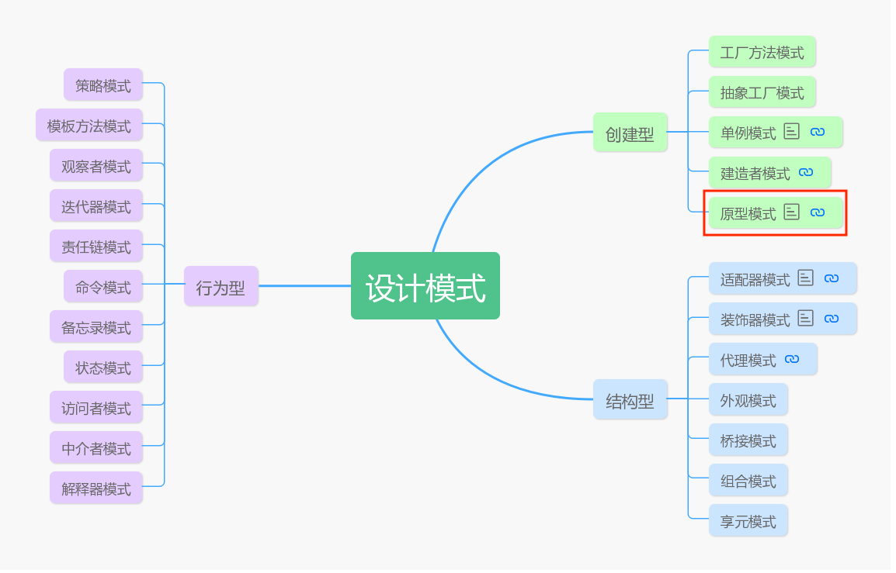
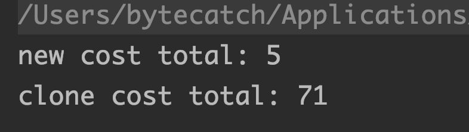
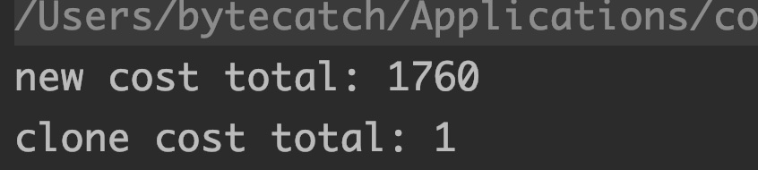

# 让设计模式飞一会儿|④原型模式

大家好，我是高冷就是范儿，很高兴又和大家见面了。😊今天我们继续设计模式的探索之路。前几篇的内容有小伙伴还没有阅读过的，可以阅读一下。

> **前文回顾**  
> 👉[让设计模式飞一会儿|①开篇](让设计模式飞一会儿|①开篇.md)  
> 👉[让设计模式飞一会儿|②单例模式](让设计模式飞一会儿|②单例模式.md) 
> 👉[让设计模式飞一会儿|③工厂模式](让设计模式飞一会儿|③工厂模式.md) 



今天我们接下来要聊的是**原型模式**。

> ❓何为原型？
>

维基百科上给出的概念：原型是首创的模型，代表同一类型的人物、物件、或观念。

以我的理解能力解释一下，就是说，它是一种类型的首创对象。在面向对象编程中，所谓的类型就是指类，也就是说，它是这个类的一个源实例。

## 为什么需要原型模式？

我还是坚持前面几篇一贯的风格，在深入了解该模式之前，先来思考一下，**这个模式它出现的原因以及存在的意义是什么？**

首先，这个模式也是属于**创建型模式**，也是用来创建对象。还是回到之前反复说过的一个问题，就是我们创建对象为什么一定要使用原型模式呢？

像之前我们学过的**单例模式**是因为需要控制对象个数必须是单个。**工厂模式**是需要将对象创建和使用解耦，使得可以在不需要知道创建细节而使用一个对象，那今天要学习的原型模式它用在创建对象上又是出于什么原因呢？

> 举个简单例子

比如某一个公司有A和B两个产品线，现在假设需要在每一个产品销售出去之前做一次检查，检查标准是，假如该产品的重量超过10kg，就重新生产一个新的。现在希望将所有产品的检查逻辑用同一个通用方法实现，并且后续增加新产品后可以方便扩展，怎么实现这个需求？

你可能会如下实现（伪代码），

```java
public class ProductCheck {
    public void check(Product product) {
        if (product.weight > 10) {
            //如果该产品是A产品就创建一个新的A对象。
            //如果该产品是B产品就创建一个新的对象。
        }
    }
}
```

但是现在出问题了，写不下去发现没有？为什么？

因为现在检查的这个对象重量超过10kg了，所以需要创建一个新的对象，但问题这个时候我并不知道传入的`product`对象是什么类型啊？是A类型？还是B类型？这个在你编译时期你是不知道的，自然这代码你就没法写下去了......

那该怎么解决这个问题呢？

有聪明的程序猿说了，这还不简单吗？直接在`check()`方法中加个`if else`判断一下不就好了吗？于是代码优化成如下，

```java
public class ProductCheck {
    public void check(Product product) {
        if (product.weight > 10) {
            if (product instanceof PA) {
                //如果该产品是A产品就创建一个新的A对象。
            } else if (product instanceof PB) {
                //如果该产品是B产品就创建一个新的对象。
            }
        }
    }
}
```

其中`PA`和`PB`分别是`Product`接口的子类，表示A产品和B产品。上面代码看上去貌似确实没啥问题，通过对传入的`product`类型判断从而创建不同类型的对象，很正常嘛？

> ❓但是这样写有个啥问题？
>

上面需求是这个通用方法需要满足，后续增加新产品后可以方便扩展。现在假设这个公司新增了一种C产品，也需要使用这个检查方法怎么办？这个时候你就必须要修改`check()`方法的代码，增加`else if (product instanceof PC)`的逻辑，还记得开闭原则吗？这显然违反了开闭原则，所以这个方案不可取。如果看过上篇工厂模式的同学可能想起点什么？这个有点类似工厂模式里面的简单工厂模式嘛？

> 引起这个问题的本质在于哪里？
>

没错，就是因为`check()`跟具体的产品类耦合了。

> 当时是怎么解决开闭原则的问题的？
>

没错是通过**工厂方法模式**解决的，于是优化后代码如下：

```java
public class ProductCheck {
    public void check(ProductFactory factory) {
        Product product = factory.createProduct();
        if (product.weight > 10) {
            Product product2 = factory.createProduct();
        }
    }
}
```

其中A产品和B产品各会有`ProductFactory`的实现类，这样当新增产品时就不会出现开闭原则的问题了。没错，这个问题用工厂方法模式完全可以解决，没问题。但是今天呢，我们将要聊的原型模式也可能解决这个问题。这个时候肯定会有人问了，既然工厂模式已经可以解决这一问题，那为什么还要你的原型模式呢？

这个问题我会留到后面讲，现在先让我们看一下原型模式是怎么解决这个问题的？

原型模式的原理是这样的，原型模式要求，每一个对象需要定义一个克隆自己的方法。什么意思？比如一个A对象，他需要提供一个方法，调用这个方法将会返回一个自己的副本。一般来说，会给所有需要克隆自己的对象提供一个公共的接口，这个接口里面会提供一个克隆自身的方法，如下，

```java
interface CloneableObj {
    Object cloneSelf();
}
```

然后让所有需要克隆自己的类去实现该接口，自然会需要实现`cloneSelf()`方法，这个方法内部就是克隆自己的逻辑实现。那如何实现克隆呢？

最傻瓜的办法，直接先new一个自己对象的实例，然后把自己实例中的数据取出来，设置到新的对象实例中去，不就可以完成实例的复制了嘛？这样这个`cloneSelf()`方法返回的就是一个跟自身一模一样的对象了。以下是代码实现：

```java
class PA extends Product implements CloneableObj{
    @Override
    public Object cloneSelf() {
        PA a = new PA();
        a.weight = weight;
        return a;
    }
}
```

这个时候假设你需要在工程其他代码中需要通过克隆方式快速得到一个PA对象，就可以通过调用原型PA对象（假设是a）`a.cloneSelf()`轻松快速的得到一个`PA`对象了。

没错，这个就是最本质的原型模式。其实说的简单一点，所谓的原型模式，就是复制（或克隆）模式，就是通过当前对象（原型对象）返回一个跟当前对象完全相同的对象，包括其中的属性值。

**这也是原型模式跟直接new的一个区别，我们知道new生成的对象的属性值都是默认的，而通过原型模式返回的对象是将属性值一同复制。**

> 其实，原型模式并不强制要求克隆生成的对象和原型对象完全相同，而且也没有规定具体采用的克隆技术，这个可以由程序自己实现。只是在大部分实际应用场景中，用原型模式生成的对象都是和原型对象完全相同或者相近。
>

## Object.clone()

其实，上面这个例子是为了更好的理解原型模式的本质，为了提高克隆效率，`JDK`已经设计了关于对象克隆的功能。在`Object`类中有一个`clone()`方法，该方法就可以轻松的实现对对象本身进行克隆。上面例子中底层还是采用`new`的方式创建对象，但是`Object.clone()`底层是直接对二进制数据流操作，因此效率会比直接new的方式高得多（看到后面，其实这句话说的不严谨）。不过要使用`Object.clone()`来对自身对象克隆有个限制，就是该对象所对应的类必须要实现`java.lang.Cloneable`接口，否则会抛出`CloneNotSupportedException`异常。另外，一般需要被克隆的类都需要重写`Object.clone()`，并且将访问修饰符改为`public`，以方便在其他类中使用。于是代码实现如下：

```java
public class ProductCheck {
    public void check(Product product) throws CloneNotSupportedException {
        if (product.weight > 10) {
            Object o = product.clone();
        }
    }
}
```

有人又会有疑问了，这样做相比较前面的工厂模式有啥优势？工厂方法模式也完全可以实现相同的需求啊？

## 原型模式和工厂模式

原型模式和工厂方法模式一个共同的优点是，他们都可以在**不知道具体的类型**情况之下，创建出某类型对象。比如上面例子中的`Product`，这只是一个抽象接口，其下会有很多的子类，具体创建哪种类型的子类对象取决于运行时期。原型模式是通过克隆自身的方式实现的，而工厂方法模式是通过不同子类的工厂类实现的。

但是原型模式相比于工厂方法模式的优势在于，工厂方法模式底层还是采用`new`的方式创建对象，并且需要手动的为属性赋值，效率较差。而通过`Object.clone()`实现的原型模式直接是操作二进制流实现，而且克隆生成的对象是已经赋好值了。因此效率要高得多。

> 那么，通过`new`的方式创建对象和调用`clone()`方式创建对象，效率相差多少？

下面给出一个简单的测试例子：

```java
public class A implements Cloneable {
    private String a = "a";

    @Override
    public Object clone() throws CloneNotSupportedException {
        return super.clone();
    }
		public A() {}
}

public class Demo {
    public static void main(String[] args) throws CloneNotSupportedException {
        A a = new A();
        long s1 = System.nanoTime();
        for (int i = 0; i < 10000000; i++) {
            new A();
        }
        long e1 = System.nanoTime();
        System.out.println("new cost total: " + TimeUnit.NANOSECONDS.toMillis(e1 - s1));
        long s2 = System.nanoTime();
        for (int i = 0; i < 10000000; i++) {
            a.clone();
        }
        long e2 = System.nanoTime();
        System.out.println("clone cost total: " + TimeUnit.NANOSECONDS.toMillis(e2 - s2));
    }
}
```

上面输出的结果如下：



相信看到这个结果的朋友肯定会大吃一惊⁉️震惊！怎么`clone`的速度比`new`还慢了这么多倍......😱和之前的认知大相径庭了。

**那结果真的是这样吗❓**

我们做一下小改动，其它代码都不做修改，但这一次我们在`new`所需要的构造器中加入一些耗时操作，如下：

```java
public class A implements Cloneable {
    //其余代码和上面的例子一样，省略，唯一区别在于加入下面的代码
		public A() {
      for (int i = 0; i < 1000; i++)
            a += "a";
    }
}
```

为了节省测试时间，我们把`Demo`中的循环次数减少到10000就好，如下：

```java
public class Demo {
    public static void main(String[] args) throws CloneNotSupportedException {
        A a = new A();
        long s1 = System.nanoTime();
        for (int i = 0; i < 10000; i++) {
            new A();
        }
        long e1 = System.nanoTime();
        System.out.println("new cost total: " + TimeUnit.NANOSECONDS.toMillis(e1 - s1));
        long s2 = System.nanoTime();
        for (int i = 0; i < 10000; i++) {
            a.clone();
        }
        long e2 = System.nanoTime();
        System.out.println("clone cost total: " + TimeUnit.NANOSECONDS.toMillis(e2 - s2));
    }
}
```

这一次测试结果如下：



这一次总算出现符合预期的结果了。

**也就是说，对于本身创建过程不是很耗时的简单对象来说，直接new的效率要比clone要高。但是如果是创建过程很复杂很耗时的对象，那使用clone的方式要比new的方式效率高得多。这也是clone()方法的意义所在。**

也就是说，对于创建耗时复杂的对象，用原型模式可以大大提高创建对象的效率。到这里估计很多人应该能想到，既然这样，把这两者结合一下不就可以弥补工厂方法模式的缺陷了吗？

没错，传统的工厂方法模式中，各子类的工厂类创建对象的方法，比如上面的`factory.createProduct()`底层还是采用`new`的方式，如果改成克隆方式就可以大大提高创建对象的效率了。思路比较简单，具体代码这边就不演示了。

另外，在原型模式中还会涉及到一个**浅克隆和深克隆**的问题，怎么理解呢？我举一个简单的例子，

```java
//以下代码全部省略setter、getter、toString
public class A {
    private int a;
}

public class B implements Cloneable{
    private int b;
    private A a;
  
    @Override
    public Object clone() throws CloneNotSupportedException {
        return super.clone();
    }
}

public class ShallowClone {
    public static void main(String[] args) throws CloneNotSupportedException {
        A a = new A();
        a.setA(1);
        B b = new B();
        b.setA(a);
        b.setB(2);
        B b2 = (B)b.clone();	❶
        System.out.println("b-->" + b);
        System.out.println("b2-->" + b2);
        b2.setB(3);	❷
        System.out.println("b-->" + b);
        System.out.println("b2-->" + b2);
        b2.getA().setA(10);❸
        System.out.println("b-->" + b);
        System.out.println("b2-->" + b2);
    }
}

//输出：
b-->B{b=2, a=A{a=1}}
b2-->B{b=2, a=A{a=1}}
b-->B{b=2, a=A{a=1}}
b2-->B{b=3, a=A{a=1}}
b-->B{b=2, a=A{a=10}}
b2-->B{b=3, a=A{a=10}}
```

从上面这个代码分析可得出：

- ❶行处，b2是通过调用`b.clone()`克隆得到的，所以这两个对象除了内存地址不同，其余的内容都相同。
- ❷行处，修改b2对象中的b属性，发现并没有影响原型对象b中b属性值。b属性是`int`类型。
- ❸行处，修改b2对象中的a属性中的a属性值，发现原型对象b中的a属性的a属性值也发生了改变。a属性是一个`A`类型（引用类型）。

由此，我们可以得出一个结论，`Object.clone()`实现的其实是一种**浅克隆**模式。

在浅克隆模式下，克隆生成对象的基本数据类型（包括对应包装类）属性和String拷贝的是值，后续修改克隆对象的该属性值，并不会影响原来的对象里的值。但如果是引用类型属性拷贝的是引用，拷贝得到的对象和原来的对象的属性指向同一个对象。所以，后续修改其属性值，就会影响原来的对象里的对应的属性值。

而在有些场合下，我们是希望原型对象和新创建的对象不要相互干扰。这就是**深克隆**模式。

> ❓那怎么实现呢？

```java
public class A implements Cloneable{
    private int a;

    @Override
    public Object clone() throws CloneNotSupportedException {
        return super.clone();
    }
}

public class B implements Cloneable{
    private Integer b;
    private A a;

    @Override
    public Object clone() throws CloneNotSupportedException {
        B b = (B) super.clone();	❶
        A a = b.getA();
        b.setA((A) a.clone());
        return b;
    }
}

public class DeepClone {
    public static void main(String[] args) throws CloneNotSupportedException {
        A a = new A();
        a.setA(1);
        B b = new B();
        b.setA(a);
        b.setB(2);
        B b2 = (B)b.clone();
        System.out.println("b-->" + b);
        System.out.println("b2-->" + b2);
        b2.setB(3);
        System.out.println("b-->" + b);
        System.out.println("b2-->" + b2);
        b2.getA().setA(10);
        System.out.println("b-->" + b);
        System.out.println("b2-->" + b2);
    }
}
//输出：
b-->B{b=2, a=A{a=1}}
b2-->B{b=2, a=A{a=1}}
b-->B{b=2, a=A{a=1}}
b2-->B{b=3, a=A{a=1}}
b-->B{b=2, a=A{a=1}}
b2-->B{b=3, a=A{a=10}}
```

通过上面代码执行结果我们不难看出，这个时候无论是修改b2中的a属性（引用类型）还是b属性（基本类型），都不会影响到原型对象中的值了。

> ❓那这个是怎么实现的呢？

深克隆模式实现的关键在于❶行处，在`B`对象通过调用`clone()`复制自己的同时，将a属性(引用类型)也`clone`了一份，并且赋值给生成的b2对象。

深克隆原理就是在每一个原型对象执行`clone()`方法的时候，同时将该对象中每一个引用类型的属性的内容也拷贝一份，并设置到新创建的对象中。假设，每一个引用类型中又嵌套着其它的引用类型的属性，再重复上面操作，以此类推，递归执行下去......这中间只要有一个没有这样操作，深克隆就失败。

这也是原型模式一大缺点，在实现深克隆复制时，每个原型的子类都必须实现`clone()`的操作，尤其是包含**多层嵌套引用类型**的对象时，必须要**递归**的让所有相关对象都正确的实现克隆操作，十分繁琐易错。

**那有没有更好的办法来实现深克隆呢？**

当然有！😎

## 序列化和反序列化实现深克隆

可以使用**序列化和反序列化**的手段实现对象的深克隆！

```java
public class A implements Serializable {
    private int a;
}
public class B implements Serializable {
    private Integer b;
    private A a;
}

public class DeepClone2 {
    public static void main(String[] args) throws IOException, ClassNotFoundException {
        A a = new A();
        a.setA(1);
        B b = new B();
        b.setA(a);
        b.setB(2);
        
        ByteArrayOutputStream baos = new ByteArrayOutputStream();
        ObjectOutputStream oos = new ObjectOutputStream(baos);
        oos.writeObject(b);
        ObjectInputStream ois = new ObjectInputStream(new ByteArrayInputStream(baos.toByteArray()));
        B b2 = (B) ois.readObject();
        System.out.println("b-->" + b);
        System.out.println("b2-->" + b2);
        b2.setB(3);
        System.out.println("b-->" + b);
        System.out.println("b2-->" + b2);
        b2.getA().setA(10);
        System.out.println("b-->" + b);
        System.out.println("b2-->" + b2);
    }
}
//输出：
b-->B{b=2, a=A{a=1}}
b2-->B{b=2, a=A{a=1}}
b-->B{b=2, a=A{a=1}}
b2-->B{b=3, a=A{a=1}}
b-->B{b=2, a=A{a=1}}
b2-->B{b=3, a=A{a=10}}
```

通过上面的代码不难看出，序列化和反序列化确实实现了深克隆，而且在实现方式上比之前用重写`clone()`的方式要简单的多，唯一需要做的就是给需要克隆的对象以及引用类型实现`Serializable`接口即可。

最后来做个总结，其实原型模式更适合叫做克隆模式，它的本质就在于通过一定技术手段生成一个自身的副本。这可以通过我们在文章最开始那样手动new一个，也可以通过`Object.clone()`，还可以通过序列化和反序列化实现。如果原型对象中存在引用类型的属性，根据是否同时克隆该属性可以分为深克隆模式和浅克隆模式。

## 何时使用原型模式？

在大部分场景下，我们主要会使用`Object.clone()`方法来实现克隆，根据上面对clone()方法执行性能测试结果，在创建大量复杂对象时，这个方法的创建效率要远高于new的方式。因此如果需要创建大量并且复杂对象时可以采用原型模式。

另外，原型模式可以像工厂方法模式一样，可以在事先不知道具体类型的前提下创建出对象，也就是**基于接口创建对象**，而且实现方式比工厂模式更高效简单。

好了，今天关于原型模式的技术分享就到此结束，下一篇我会继续分享另一个设计模式——**建造者模式**，一起探讨设计模式的奥秘。咱们不见不散。😊👏