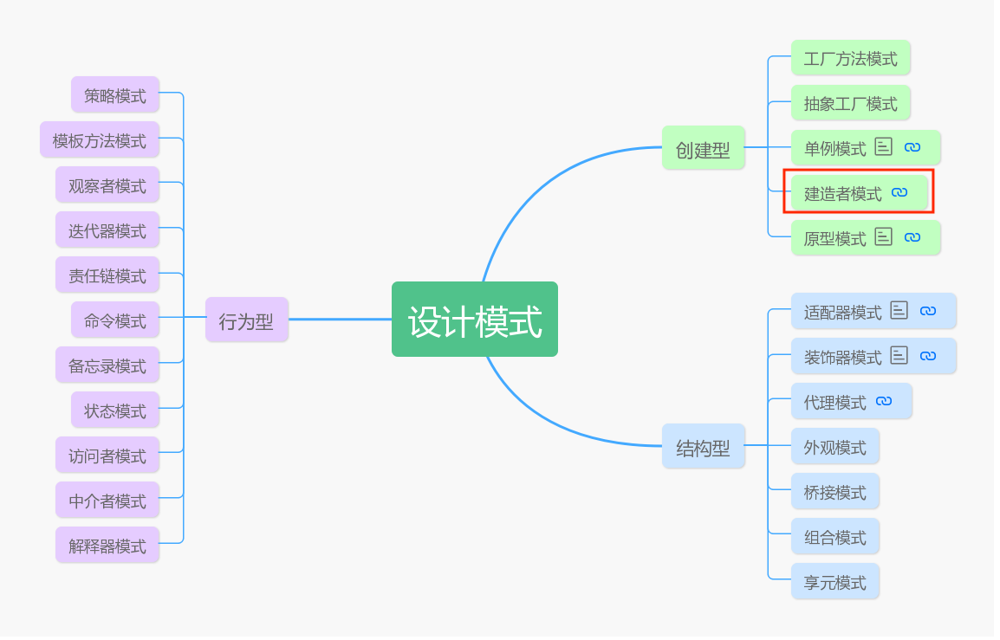
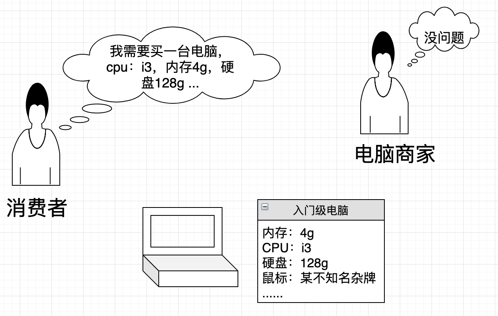
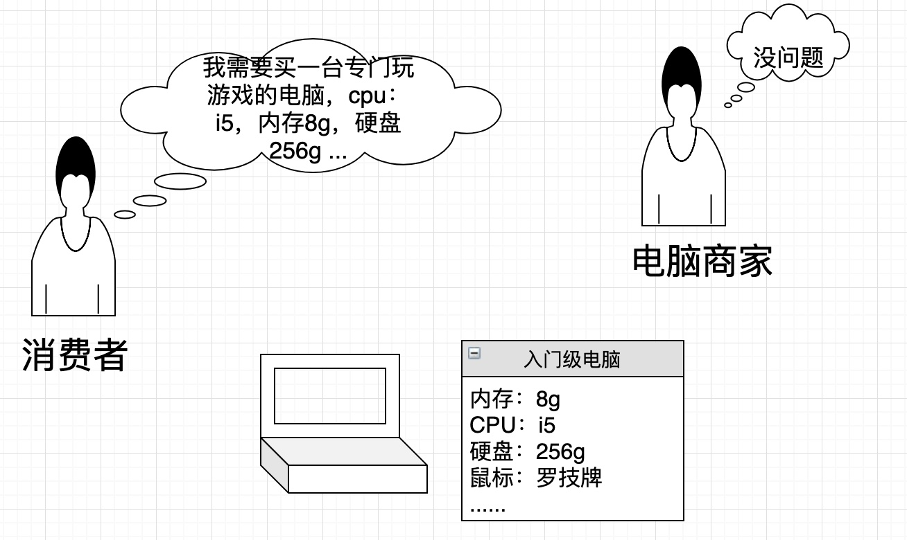
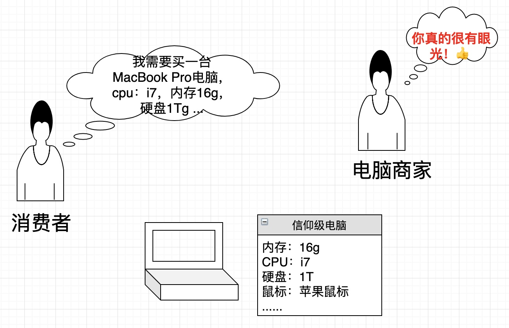
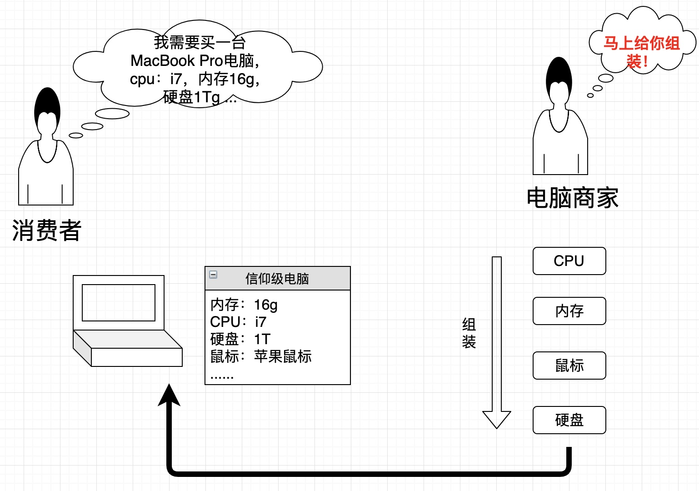
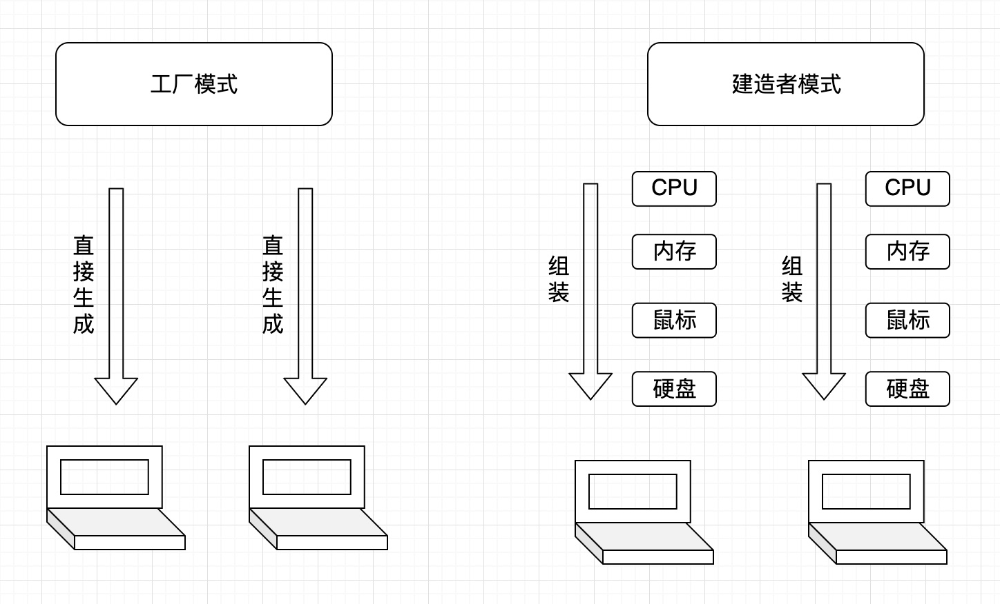
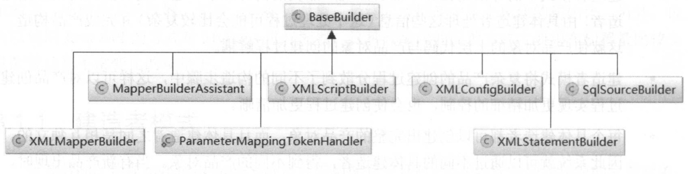

# 让设计模式飞一会儿|⑤建造者模式

## 开头日常吹牛

大家好，我是高冷就是范儿，好久不见。最近比较忙，文章更新较慢，抱歉。😊今天我们继续来聊设计模式这个话题。前面已经讲过几个模式，如果没有阅读过的朋友可以回顾一下。

> **前文回顾**  
> 👉[让设计模式飞一会儿|①开篇](让设计模式飞一会儿|①开篇.md)  
> 👉[让设计模式飞一会儿|②单例模式](让设计模式飞一会儿|②单例模式.md)   
> 👉[让设计模式飞一会儿|③工厂模式](让设计模式飞一会儿|③工厂模式.md)   
> 👉[让设计模式飞一会儿|④原型模式](让设计模式飞一会儿|④原型模式.md)   

那么，今天我们要来聊的是**建造者模式**，这也是GOF23的**创建型模式**中的最后一个模式。既然是创建型模式，自然又是一个用来创建对象的模式，这从这个模式的名字上也能看出来。



## 场景需求

> 建造者，就是用来创建对象的。这听上去就是一句废话......
>

对象不就是建造出来的吗？这怎么还成了一个单独的模式了？而且和前面说的那些模式有啥区别？

为了方便理解，我还是不套用书上或者网上的一些理论，但就自己学过的一些理解，结合生活的一些场景跟大家说说。

举个生活当中组装电脑的例子，比如现在小明去电脑城组装一台电脑，一台完整电脑肯定会包含显示器，键盘，鼠标等等一些配件，而每个配件的配置参数那就成百上千了，而且每个硬件上都会有一些专业的参数我们也看不懂。然而，我们需要买的只是一台电脑，我们只需要告诉卖电脑的人，我们需要买什么品牌，什么档次，什么价格的电脑或配件即可，这样电脑商家就会给我们组装好一台各方面都比较合适的电脑。小明平时就简单写个文档看个视频啥的，对配置要求不高，所以只需要入门级的电脑即可。如下图：



然后小明玩了几年后上了大学，无意中染上了玩游戏的毛病，一发不可收拾，原来的电脑配置已经卡出翔了。于是，他又想换台游戏本，如下图：



然后小明大学毕业了，因为大学天天玩游戏，毕业后实在混不下去了，听说学Java技术工资高，还能装逼，于是二话没说转行学Java......但是学Java再用原来那个破电脑可不行了，怎么样也得用个MacBook Pro才配得上程序猿这个高大上的职位嘛，于是......



上面这个是日常生活中非常常见的场景，那用代码如何去实现呢？

如果你之前没学过任何设计模式，你也许会如下设计（伪代码）：

```java
public class Computer {
    内存 
    CPU
    硬盘
    鼠标
		...
}

public class Client{
  void buy(){
    //入门级
    Computer comp = new Computer();
    comp.set内存("4g");
    comp.setCPU("i3");
    comp.set硬盘("128g");
    comp.set鼠标("杂牌");
    ...
  }
  把电脑交付给客户...
}
```

这样写粗看没有什么毛病，我们平时大部分时候就是这样写的。

> 那想想，这样写后续会有什么问题吗？

现在小明电脑要升级了，换成游戏本，这个时候麻烦来了，他得去修改上面`buy()`方法体内的代码了，将原来的

```java
comp.set内存("4g");
comp.setCPU("i3");
comp.set硬盘("128g");
comp.set鼠标("杂牌");
```

修改成新的配置：

```java
comp.set内存("8g");
comp.setCPU("i5");
comp.set硬盘("256g");
comp.set鼠标("罗技牌");
```

再升级成MacBook Pro时也同理。而且如果我需要增加或者减少一些配置也同样需要去修改原来的代码。

**显然这个是违反“开闭原则”了。**

> 那问题出在哪里呢？

不难看出，`comp`的`setXX()`系列方法和`Client`的api紧紧耦合了，而且`Client`需要对象创建的细节一清二楚，否则没法完成对象创建。

> 那怎么样才能把对象的创建过程单独从客户端代码中剥离出来，实现解耦呢？
>

如果还记得前面学过的**工厂模式**，有的同学可能就会想到，工厂模式不就是解决这个问题的吗？把对象创建和对象的使用分离实现解耦，使得客户端并不需要关注对象的创建过程，需要与对应的工厂类打交道即可。因为我们这边会涉及到多个对象，而且这多个对象之间也存在一些关联，所以此处可以采用抽象工厂模式实现。所以经过优化，你可能会如下实现：

```java
interface ComputerFactory{
  内存 create内存();
  CPU createCPU();
  ...
}
```

然后针对不同定位的电脑，创建其不同的`Factory`实现类即可。

```java
class 入门级 implements ComputerFactory{
	内存 create内存(){
    生产4G内存
  }
  CPU createCPU(){
    生产i3内存
  }
  ...
}
```

然后`Client`的代码会修改为如下：

```java
//入门级
public class Client{
  ComputerFactory factory;
  void buy(){    
    Computer comp = new Computer();
    comp.set内存(factory.create内存());
    comp.setCPU(factory.createCPU());
    ...
  }
  把电脑交付给客户...
}
```

这样的话，如果我需要升级配置，只需要传入不同的`ComputerFactory`就可以了，业务逻辑的代码是不需要再动了。但是对于这个需求，这样的解决方法是存在一些问题的。为什么呢？

之前在讲工厂模式的时候说过，工厂模式主要是用来生产**一个完整的产品**的。也就是说，用工厂模式创建出来的对象，就是**一个最终的产品**了。虽然抽象工厂模式可以一下子创建多个产品，但是这多个产品其本身就是一个完整的最终的产品，直接就可以使用了，无非是抽象工厂模式创建的这些个产品之类有一些关联，属于同一个类型的东西。

但是我们的这个需求中，像内存、CPU、鼠标等这些，**对于电脑而言**，都只是整台电脑的一个组成部分而已，他们并不是一个完整的产品，需要将他们组合装配起来才能构成一个完整的电脑对象。因为这个需求中，我们需要得到的是一个电脑对象，而并不是内存、CPU、鼠标等这些个零件。

当然你也可以使用工厂模式来创建这些个零件，但是，之后你也还需要自己去对这些零部件进行组装，也就是说，你还是需要对这个对象的组成细节了解清楚，否则，你还是无法创建出一个完整的对象。另外，还会出现多一个零件，少一个零件的问题，会增加客户端的复杂度。

于是，我们今天要讲的主角——**建造者模式**就闪亮登场了。

## 解决需求

建造者模式要解决的场景就是这个需求，致力于将一系列琐碎的零部件组装成一个完整的对象，而这其中具体的组装细节客户端是不需要知道的。

在建造者模式中，有一个抽象接口，里面会定义一系列对象零部件的装配的方法（组装内存、CPU、鼠标等这些个零件）。然后会有一个组装的人（比如电脑卖家），对这些个零部件进行组装，最后给客户端返回一个完整的对象。就比如上面组装电脑的例子。



实现代码如下：

```java
//抽象接口定义完整对象的零部件装配方法
abstract class ComputerBuilder{
    protected Computer comp = new Computer(); 
    abstract void build内存();
    abstract void buildCPU();
    abstract void build硬盘();
  	protected Computer getComputer(){
        return comp;
    }
}
```

然后针对于不同级别的电脑，可以创建其对应的抽象接口的实现类，以完成对电脑的装配，比如现在需要装配一台MacBook Pro，则实现如下：

```java
class MacBookProBuilder extends ComputerBuilder{
    void build内存() {
        comp.set内存("16g");
    }
    void buildCPU() {
        comp.setCPU("i7");
    }
    void build硬盘() {
        comp.set硬盘("1T");
    }
}
```

还要需要一个专门负责装配的对象，比如电脑卖家，

```java
class Seller{
  ComputerBuilder builder;
  Computer sell(){
    builder.build内存();
    builder.buildCPU();
    builder.build硬盘();
    return builder.getComputer();
  }
}
```

这个时候在Client中的代码变成了如下：

```java
//MacBook Pro
public class Client{
  Seller seller;
  void buy(){    
    Computer comp = seller.sell();
  }
  把电脑交付给客户...
}
```

我们会发现，此时，客户端已经完成解耦，我们只需要告诉电脑卖家我们需要什么级别的电脑，他就会给我们返回一台装配好的完整的对象，再也不需要去了解各个零件是怎么生产的（是通过单例模式创建的？还是原型模式？还是工厂模式？），也不需要知道这些零部件是怎么拼装起来的（是先装配CPU，还是先装配硬盘？）。这样就完美的解决了解耦的问题。

现在假设小明想再换一个配置的电脑，只需要再提供一个对应的`Buidler`子类，完成对应零件的创建，然后将`Builder`交给负责装配的人（术语叫`Director`），如卖家，就可以了，`Client`再也不需要有任何的改动，符合“开闭原则”。

在对象没有那么复杂的情况下，`Director`也是可以省略的，直接将装配过程在`Client`端实现即可。当然在这种情况下，`Client`是需要对该对象的组成结构有所了解的，也容易导致缺胳膊少腿的情况。

另外，上面的代码其实可以修改为更为优雅的写法。

```java
class MacBookProBuilder extends ComputerBuilder{
    void build内存() {
        comp.set内存("16g");
      	return this;
    }
    void buildCPU() {
        comp.setCPU("i7");
      	return this;
    }
    void build硬盘() {
        comp.set硬盘("1T");
      	return this;
    }
}
```

在每一个装配的方法中都返回当前`Builder`对象，这样`Director`中装配逻辑可以直接以清爽简洁的链式风格书写。

```java
class Seller{
  ComputerBuilder builder;
  Computer sell(){
    return builder.build内存().buildCPU().build硬盘().getComputer();
  }
}
```

这种链式风格可以很好的用来解决**伸缩构造器反模式**的问题。什么意思？

比如现在某一个类，属性极多，有上百个吧......

```java
class A{
  属性1;
  属性2;
  属性3;
  属性4;
  ...省略100个属性
}
```

现在我需要在某处创建该类对象，并且还需要对其中某一些属性进行赋值。如果这个时候我们采用构造器来创建就会比较麻烦，为什么呢？

因为我可能每一次创建所需要的属性可能是不一样的。比如在应用某处需要创建一个A对象，需要使用属性1、属性2、属性3，于是我会在A类中加入一个构造器，

```java
class A {
  //省略属性
  public A(属性1,属性2,属性3){}
}
```

在应用另外一处又需要创建一个A对象，需要使用属性1、属性2、属性3、属性4，于是你又需要添加一个构造器，

```java
class A {
  //省略属性
  public A(属性1,属性2,属性3,属性4){}
}
```

可以想象，要是各处引用构造器特别多，并且参数还都不一样，那画面太美不敢想象。还有，当构造器重载太多，创建对象时选择合适构造器都是一件很费神的事情。这个时候使用建造者模式的链式风格就很好的解决了这个问题。

```java
class ABuilder{
  A a = new A();
  A set属性1(xxx){... return this;}
  A set属性2(xxx){... return this;}
  A set属性3(xxx){... return this;}
  A set属性4(xxx){... return this;}
  A build(){return a;}
 ...
}
```

这个时候我再创建一个A对象，如下，如果我需要修改属性设置的个数，可以很方便的进行调整，很好的解决了重载构造器的问题。

```java
A a = new ABuilder().set属性1(xxx),set属性2(xxx).set属性3(xxx).set属性4(xxx).build();
```

## 总结

关于建造者模式的核心内容就这些，我们可以做一下总结。

- 作为创建型模式，建造者模式也是用来创建对象的，而且他和工厂模式看上去会比较相似，甚至难以区分。

  - 不过建造者模式关键点在于建造和装配分离。建造者最终只会生成一个完整的对象，但是这个对象一般来说是比较复杂的，里面会分成好几个模块，建造者模式强调的是这个装配的过程。

  - 而工厂模式，主要强调的是创建，当然这个创建有可能是会同时创建一个（简单工厂或者工厂方法模式）或者多个对象（抽象工厂模式）。虽然工厂模式创建的也有可能很复杂，但是他不关心对象会不会有装配的过程，只要创建出来即可。

    如下图：

    

    > **一言以蔽之，工厂模式强调创建，建造者模式强调组装。**
    
    其实设计模式这东西并不是很绝对很孤立的去看待，因此我们没有必要将每一个模式的区别都分得特别明确，一般来说，设计模式也不是独立使用的，会相互搭配。就比如这边得工厂模式和建造者模式，两者侧重点不同，但是完全可以结合使用。比如在使用工厂模式创建对象时，有可能每个对象都会有比较明确的装配过程，就可以结合使用。反过来吗，在使用建造者模式时，每一步的装配所需要的零件，又有可能是通过工厂模式（当然也有可能是通过原型模式，单例模式）创建所得。

- 在建造者模式中，客户端只需要与`Director`交互，并不需要知道内部的对象构建和装配的细节，屏蔽了系统复杂度。

- 可以为系统中添加多个`Builder`，比如上面例子中为不同品牌的电脑分别创建一个`Builder`对象，来达到扩展系统功能的目的。同时，通过调整每一个`Builder`内部装配的过程，有可能轻松对装配过程中的每一步进行细粒度的控制和定制。

## 存在的问题  

没有一个设计模式是完美的，每一个设计模式都有其特定的使用场景。通过上面分析，不难发现，

- 建造者模式主要用于创建那些**具有明显组装过程**的一类复杂对象，并且这类对象中**内部结构差异性都不大**，基本结构都相同，并且比较稳定。比如上面的电脑的例子，不管啥牌子的电脑，啥级别的电脑，配件都是那些，CPU，内存，硬盘等，变不出花来了，无非就是每种配件的具体参数不同。可以想象，如果是两类差异性很大的对象，一类是电脑，一类是汽车，完全是八竿子打不着的两类产品，装配过程更是天差地别，自然是没法使用建造者模式的。

  > 一个类的各个组成部分的具体实现类或者算法经常面临着变化，但是将他们组合在一起的算法却相对稳定。建造者模式提供一种封装机制，将**稳定的组合算法**于易变的各个组成部分隔离开来。

- 建造者模式创建的对象一般**内部变化是不大，不频繁的**。对于变动很频繁的也是不适合用建造者模式的。就像买电脑，你三天两头换电脑，升级配置，而每升级一套配置，就需要重新创建一个全新的`Builder`类，如果变动太多，系统中就需要维护大量的`Builder`类，增加系统复杂度和维护难度。

## 抛砖引玉

最后我举两个我知道的在实际框架或者`JDK`源码中使用建造者模式的例子。其实建造者模式在实际开发中应用也是非常广泛的，而且也比较好识别，基本以`xxxBuilder`命名的都是使用了建造者模式。

比如`JDK`中，`StringBuilder`类是一个经典的建造者模式实现，

```java
//经典用法
String s = new StringBuilder("a").append("b").append("c").toString();
```

`StringBuilder`继承自`AbstractStringBuilder`，这是一个抽象类，在它里面定义了一个属性`value`数组。

```java
abstract class AbstractStringBuilder implements Appendable, CharSequence {
	//省略无关代码
    char[] value;
  //省略无关代码
}
```

当我们调用`StringBuilder`的构造器或者是`append()`方法时，实际上是对该`value`数组操作。比如`append()`为例，

```java
 public StringBuilder append(CharSequence s) {
   super.append(s);
   return this;
}
```

他会去调用父类的`append()`方法，同时会`return this`，实现链式风格的编程。在父类`append()`方法中，最终会调用如下：

```java
public AbstractStringBuilder append(CharSequence s, int start, int end) {   
  //省略一些校验扩容操作
  for (int i = start, j = count; i < end; i++, j++)
    value[j] = s.charAt(i);
  count += len;
  return this;
}
```

其实就是往`value`数组中设置传入的字符串值。有点像`ArrayList`的感觉。

当调用`toString()`方法时，其实就是把`value`数组的内容转成`String`返回罢了。

```java
public String toString() {
  return new String(value, 0, count);
}
```

另外，在`Mybatis`中也是大量使用了建造者模式。在`Mybatis`启动时，会做一系列的解析工作，比如`mybatis-config.xml`文件解析，各`Mapper.xml`，还有`Mapper`接口上的注解等，这一系列的解析工作都是通过一系列的`Builder`完成的。顶层是`BaseBuilder`类。这些`Builder`的层次结构如下图，比如，`XMLConfigBuilder`就是用来解析`mybatis-config.xml`文件，`XMLMapperBuilder`用来解析各`Mapper.xml`等。



在这里，`BaseBuilder`作为一个顶层抽象接口，里面只定义了一些所有具体`Builder`的属性和方法，比如全局配置`Configuration`对象。而其余`Builder`子类作为具体建造者完成各自的解析工作。我们这边以`XMLConfigBuilder`为例，`XMLConfigBuilder.parse()`方法是解析的核心方法。里面会调用`BseBuilder`中的`parseConfiguration()`方法。`parseConfiguration()`方法就是整个装配流程，

```java
private void parseConfiguration(XNode root) {
      propertiesElement(root.evalNode("properties"));
      Properties settings = settingsAsProperties(root.evalNode("settings"));
      loadCustomVfs(settings);
      loadCustomLogImpl(settings);
      typeAliasesElement(root.evalNode("typeAliases"));
      pluginElement(root.evalNode("plugins"));
      objectFactoryElement(root.evalNode("objectFactory"));
      objectWrapperFactoryElement(root.evalNode("objectWrapperFactory"));
      reflectorFactoryElement(root.evalNode("reflectorFactory"));
      settingsElement(settings);
      environmentsElement(root.evalNode("environments"));
      databaseIdProviderElement(root.evalNode("databaseIdProvider"));
      typeHandlerElement(root.evalNode("typeHandlers"));
      mapperElement(root.evalNode("mappers"));
}
```

我们以`propertiesElement`为例，这个方法会使用`XPATH`解析`properties`字段中的`resource`，`url`属性，并且会将其设置到定义在`BaseBuilder`中的`configuration`中。其余的解析方法同理，就不再赘述了。当所有的装配工作完成之后，`XMLConfigBuilder.parse()`就会将解析后的`Configuration`对象返回。在`SqlSessionFactoryBuilder`的`build()`方法中会调用`XMLConfigBuilder.parse()`，根据组装好的`Configuration`对象生成`SqlSessionFactory`，进而创建`SqlSession`以操作数据库。

```java
public SqlSessionFactory build(InputStream inputStream, String environment, Properties properties) {
      XMLConfigBuilder parser = new XMLConfigBuilder(inputStream, environment, properties);
      return build(parser.parse());
    //省略异常处理
  }
```

好了，今天关于**建造者模式**的技术分享就到此结束。随着本次建造者模式的结束，GOF23的**创建型模式**就都讲完了。从下一篇开始，我们会进入另外一大类——**结构型模式**的世界。**结构型模式**的模式主要关注点是如何通过一定手段，将两个或多个对象组合形成一个更大更强大的对象。下一篇我就将从结构型模式中最重要，也是最难理解的一个设计模式——**代理模式**开始讲起，具体我们下期再说，敬请期待。😊👏

