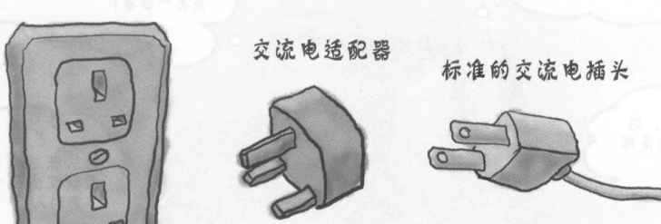
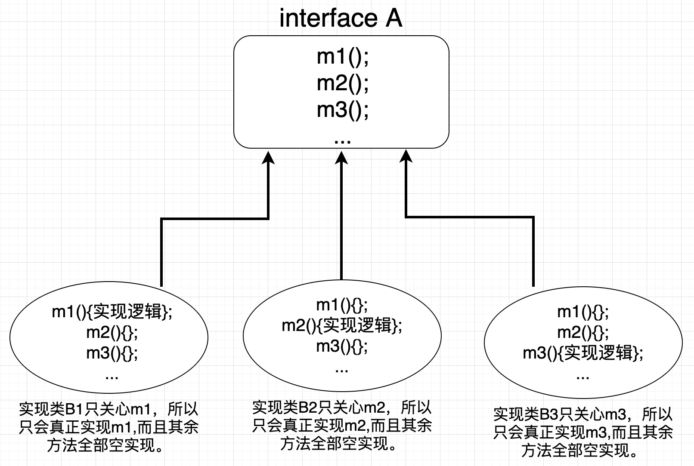
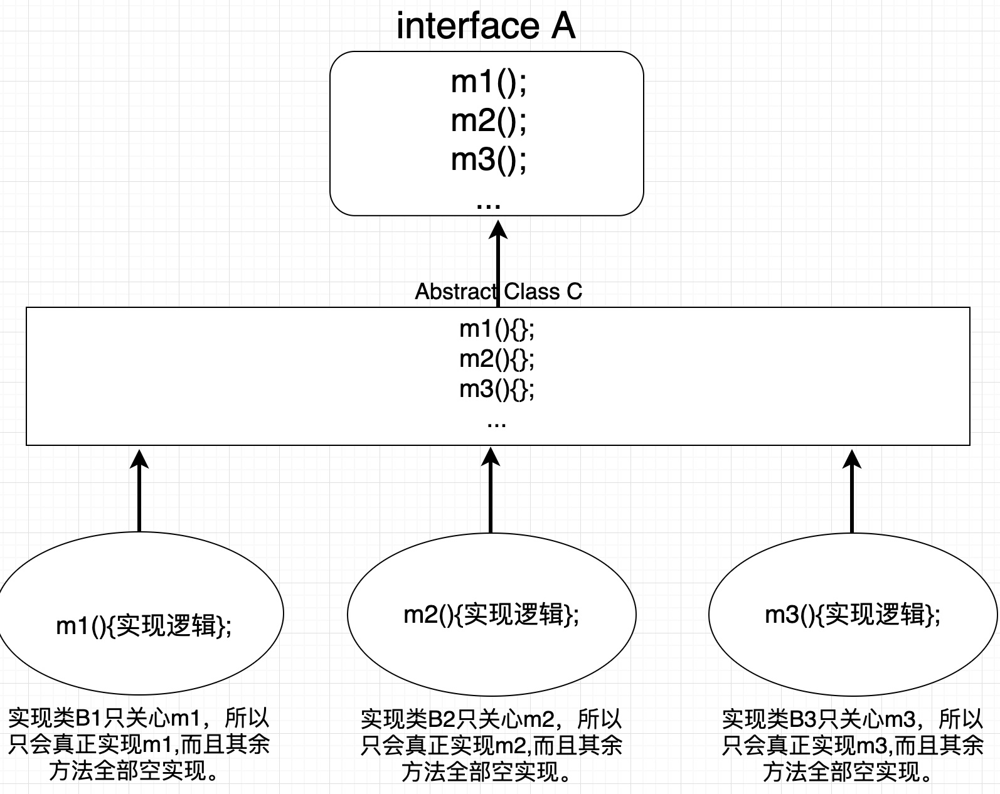
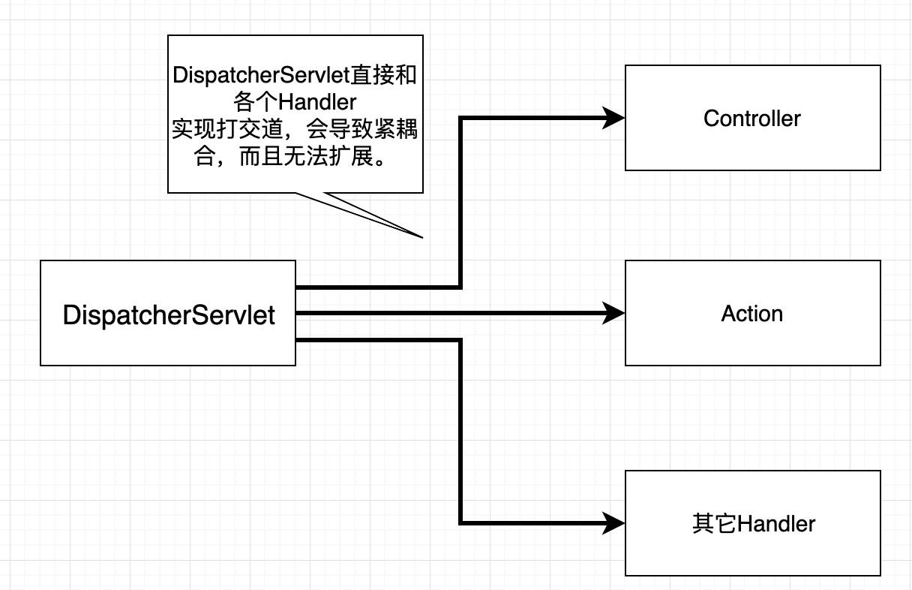
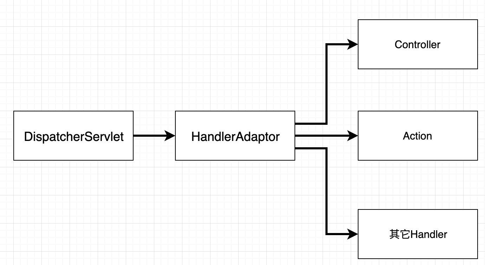

# 让设计模式飞一会儿|⑦适配器模式

大家好，我是**高冷就是范儿**，好久不见。过了一个国庆节，人相当懒散，一时没啥灵感，文章更新速度较慢，抱歉。😊今天我们继续来聊设计模式这个话题。前面已经讲过几个模式，如果没有阅读过的朋友可以回顾一下。

> **前文回顾**  
> 👉[让设计模式飞一会儿|①开篇](让设计模式飞一会儿|①开篇.md)  
> 👉[让设计模式飞一会儿|②单例模式](让设计模式飞一会儿|②单例模式.md)   
> 👉[让设计模式飞一会儿|③工厂模式](让设计模式飞一会儿|③工厂模式.md)   
> 👉[让设计模式飞一会儿|④原型模式](让设计模式飞一会儿|④原型模式.md)   
> 👉[让设计模式飞一会儿|⑤建造者模式](让设计模式飞一会儿|⑤建造者模式.md)  
> 👉[让设计模式飞一会儿|⑥代理模式](让设计模式飞一会儿|⑥代理模式.md)  

那么，今天我们要来聊的是**适配器模式**，这个模式和上篇讲过的代理模式一样，也是属于GOF23的**结构型模式**中的一个模式。


## 引子

❓**何为适配器？**

很经典的一个例子，就是插座，如下图，



假设，一台电脑需要用电，他的插头是两项插头，但是呢，插座却只有三项插孔的。怎么办？插座就在那里，是不可能改变的。我们总不能为了电脑用个电把整个电脑换了吧？不现实！那我们常用的做法就是买一个转接头，一面是两项插孔，一面是三项插孔。这样就很好的解决了这个问题。

这个生活中常见的场景就是经典的适配器模式的体现。

那现在让我用代码来实现一下，如下，

```java
//三项插座
public class Dominate{
  public void cost(){
    ... //用电逻辑
  }
}

//电脑
public interface Computer{
  void run();
}
```

现在电脑运行需要使用电，说白了，`Computer`或者（实现类）的`run()`需要调用`Dominate`的`cost()`方法，怎么办？你可能会如下实现，

```java
public class Adaptor implements Computer extends Dominate{
  public void run(){
    cost();
  }
}
```

上面代码中的`Adaptor`提供了一个中间的适配器角色，因为要以`Computer`的方式去使用，所以需要实现`Computer`接口，因为其`run()`方法需要使用到`Dominate`的`cost()`逻辑，所以，通过继承`Dominate`方式就可以实现这个需求。这样之后，我需要使用电脑，我不在直接去调用`Computer`的`run()`了，因为这个里面没有电，我通过调用`Adaptor`的`run()`方法去使用电脑就可以了。

上面这样的方式很好的解决了因为插孔不兼容而导致的问题。这种方式有什么问题吗？

我们知道，Java是单继承的，上面采用继承方式来达到调用`Dominate`的`cost()`方法的目的，这样也就意味着`Adaptor`以后无法再继承其它的类来扩展，这或多或少会影响到以后的扩展性。

更关键的是，还记得第一天说过的几大设计原则吗？这个地方就又涉及到了一个设计原则，叫做**组合聚合复用原则。**

> 组合聚合复用原则提倡，软件复用优先使用组合或者聚合关系复用，少用继承关系复用。

为什么呢？

这边我不特别展开关于组合和继承的阐述。一般来说，继承的方式用于真的是具有“Is－A”的父子关系。而我们的例子中，我们的适配器只是想去调用插座的用电逻辑，但它本身可并不属于插座哦？而且继承关系会导致类和类之间耦合性增大，不利于类的扩展、复用和维护。

其实等你看到后面的一些模式，你会对此更有体会，在很多场合下，用组合方式扩展设计，会比继承方式灵活很多，甚至好多模式就是用组合模式来解决继承方式不易扩展的弊病。

所以上面例子，我们可以使用组合方式加以改造，如下，

```java
public class Adaptor implements Computer{
  private Dominate dominate;
  //省略构造器
  public void run(){
    dominate.cost();
  }
}
```

这样就很轻松的解决了这个问题。

## 适配器模式

做个小总结，**适配器模式**就是解决这样一种场景，客户端需要通过一种方式（或者接口规范）去访问或者使用另一个已经存在的接口，但是由于各类原因，没有办法直接去调用。这个时候可以提供一下中间媒介作为适配器对象，在其内部将接口做一下转换，然后客户端就可以顺利的通过访问适配器的方式去访问目标接口了。

适配器模式的实现有两种，就是上面展示的两种，一种是通过**继承**方式，另一种是通过**组合**方式实现的。考虑到Java的单继承特点，加上组合聚合复用设计原则，一般都会采用组合方式实现。

适配器模式的优点也很明显，它使得在不需要修改已有代码的前提下，直接重用现有的类库代码。而且实现起来很简单，也很容易理解。另外对于客户端而言，适配器这种兼容转换不同接口的方式是在其内部实现的，对于客户端而言是完全透明的，客户端无需了解目标接口的细节，只需要按照当前接口的规范去调用即可。

## 实际应用场景

适配器在实际开发中应用也是相当广泛。下面我举几个很典型使用适配器模式的例子来说明，相信大家看完后会有更加清晰的认识。

### 默认适配器

首先我先讲一个有点特殊的实际应用场景，相信大家都曾经遇到过。

假设现在有一个A接口，这个接口里面定义了非常多的接口方法`m1()`，`m2()`，`m3()`......针对不同功能点，然后其实现类也是根据不同的功能对A接口进行实现，但是每个实现类可能只需要实现其中自己关注的那个方法即可，至于其余无关的方法我并不想实现。但是Java语法限制，如果一个实体类要实现一个接口，必须需要实现其所有抽象方法。这也就意味着他会将自己关注的那个方法实现，而至于其余不关心都只能空实现。这样的造成了极大的代码冗余，而且这些冗余的代码毫无优雅可言，除了占用空间和美观不起任何作用。如下图，



这个时候，有一种比较特殊的适配器模式，叫**默认适配器模式**来解决这个问题。

怎么解决呢？

在接口的直接下层，定义一个抽象层作为适配器，将接口的所有方法全部空实现。而所有的具体实现类不会再直接实现顶层接口了，而且去跟这个抽象层打交道，这样的话，每个具体实现类只需要实现自己关注的方法即可。如下，



###JDK IO转换流的实现

JDK的IO API中转换流`InputStreamReader`和`OutputStreamWriter`也是应用了适配器模式，实现了由字节流到字符流的转换，下面我简单的带大家来看看其实现。

`OutputStreamWriter`继承了`Writer`（目标接口），并且重写了`Writer`所有核心的方法。但是我们现在只能提供一个字节流`OutputStream`类型，`OutputStreamWriter`内会将其封装成为`StreamEncoder`对象，并且设置为`OutputStreamWriter`的属性。至于封装`StreamEncoder`对象是因为还需要考虑字符集编码的问题，这个不是重点。然后此时，客户端去访问`OutputStreamWriter`的`write()`等方法时，会将其委托给`StreamEncoder`对象的相关方法执行，从而实现由字节流操作到字符流操作的转换。

### 开源框架中的运用

另外，开源框架`Spring`、`Mybatis`中适配器模式的应用不计其数。

SpringMVC中，`HandlerAdaptor`就是一个典型例子。如果有深入了解过SpringMVC原理源码的朋友应该会知道，SpringMVC中所有的请求会被前端控制器`DispatcherServlet`转发给次级控制器进行具体的请求处理，SpringMVC将其次级控制器都称之为`Handler`，我们平时绝大多数使用的都是`Controller`就是其中之一。很多人可能会认为次级控制器只有`Controller`，其实`SpringMVC`理论上支持任意多种控制器，包括Struts2中的`Action`等。那么问题来了，各类次级控制器实现原理五花八门，如下图，SpringMVC如何将其统一抽象呢？



这其中的关键就是在于`HandlerAdaptor`这个组件，听名字就知道这个使用了适配器模式。那他是怎么实现的呢？我带大家简单看一下SpringMVC的实现。`HandlerAdapter`中主要有两个方法，`supports()`和`handle()`。前者会通过传入一个具体的`Handler`实例进行判断其类型，确定当前的`Handler`是否可以被SpringMVC支持处理。如果可以，会通过`handle()`处理请求并返回`ModelAndView`实例进行后续视图解析返回等工作。这样`DispatcherServlet`在做请求转发的时候就不需要考虑每一个具体的`Handler`的实现了，他只需要跟一系列的`HandlerAdaptor`打交道，至于对`Handler`的类型校验，还有具体的请求处理，都是在`HandlerAdaptor`内部实现，对于`DispatcherServlet`（此处作为客户端）完全是透明的。如下图，



另外，在SpringMVC在实现其`HandlerInterceptor`拦截器时，使用了`HandlerInterceptorAdapter`，顾名思义也是用到了适配器模式，而且还是上面讲到过的默认适配器模式。

同样作为优秀的开源框架Mybatis中适配器模式也应用的非常广，最典型的就是Mybatis的日记模块了。众所周知，Mybatis支持log4j等各大开源日志框架，那么各大开源日志框架底层实现五花八门，他又是怎么做到统一抽象的呢？其实和上面SpringgMVC的`HandlerAdaptor`的思路是一样的。窥一斑而知全豹吧，技术最重要的就是举一反三，灵活运用了。限于篇幅，这两个的原理我这边就不多废话了，大家如果有兴趣可以去阅读一下其源码实现。

好了，今天关于**适配器模式**的技术分享就到此结束，下一篇我会分享另一个设计模式——**装饰者模式**，一起继续探讨设计模式的奥秘。咱们不见不散。😊👏


