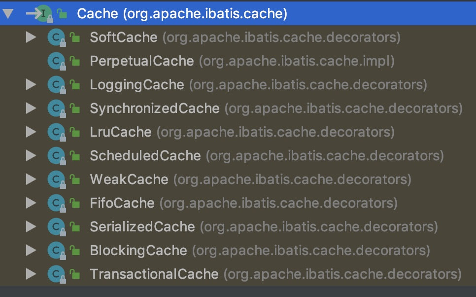
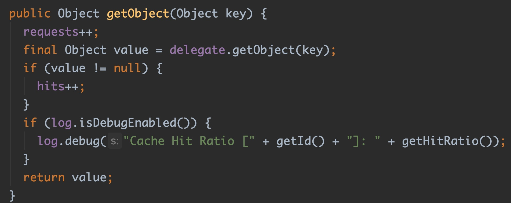

# 让设计模式飞一会儿|⑧装饰者模式

大家好，我是**高冷就是范儿**，今天我们继续来聊设计模式这个话题。前面已经讲过几个模式，如果没有阅读过的朋友可以回顾一下。

> **前文回顾**  
> 👉[让设计模式飞一会儿|①开篇](让设计模式飞一会儿|①开篇.md)  
> 👉[让设计模式飞一会儿|②单例模式](让设计模式飞一会儿|②单例模式.md)   
> 👉[让设计模式飞一会儿|③工厂模式](让设计模式飞一会儿|③工厂模式.md)   
> 👉[让设计模式飞一会儿|④原型模式](让设计模式飞一会儿|④原型模式.md)   
> 👉[让设计模式飞一会儿|⑤建造者模式](让设计模式飞一会儿|⑤建造者模式.md)  
> 👉[让设计模式飞一会儿|⑥代理模式](让设计模式飞一会儿|⑥代理模式.md)  
> 👉[让设计模式飞一会儿|⑦适配器模式](让设计模式飞一会儿|⑦适配器模式) 

今天我们要来聊的是**装饰者模式**，这个模式也是属于GOF23的**结构型模式**中的一个模式。

## 装饰者

何为装饰？

比如美女脸蛋上抹点粉，这就是装饰。房子装修一下，这也是装饰。咖啡里面加点牛奶，这也是装饰......生活当中，这样的场景太多了。那装饰有啥用呢？装饰后，美女变得更加亮丽动人，房子住的更加舒适，咖啡口感更加丝滑......

说白了，装饰的作用就是在原来的基础上面，加点新功能，让原来的东西功能变得更好。就比如举个简单的例子，普通人都会跑步，但是能飞的肯定不是普通人，那是超人，那问题是，怎么才能成为一个像超人一样能飞的人呢？

```java
interface Man{
    void action();
}

class CommonMan implements Man{
    public void action() {
        System.out.println("我会跑步...");
    }
}
```

在原有基础上扩展功能很容易就能想到继承，所以可以如下实现，

```java
class SuperMan extends CommonMan{
    public void action() {
        super.action();
        fly();
    }
    private void fly(){
        System.out.println("我会飞...");
    }
}
```

这样，一个普通人就加上了飞的功能，如此之轻松，不是吗？

现在假设，我还需要在飞的基础上再加无穷力量的功能，照样画瓢，如下实现，

```java
class SuperMan2 extends SuperMan{
    public void action() {
        super.action();
        power();
    }
    private void power(){
        System.out.println("无穷力量!");
    }
}
```

还是如此之轻松，不是吗？

现在我还需要在飞和无穷力量的基础上，再加上激光发射的功能，呵呵，这有啥难呢？继续画瓢呗？

```java
class SuperMan3 extends SuperMan2{
    public void action() {
        super.action();
        shoot();
    }
    private void shoot(){
        System.out.println("激光发射!");
    }
}
```

没有任何扩展难度啊？不是吗？

现在来了个需求，我需要一个普通人再加上无穷力量的功能，但是不要飞的功能和激光发射的功能，照原来的思路，实现如下，

```java
class SuperMan4 extends CommonMan{
    public void action() {
        super.action();
        power();
    }
    private void power(){
        System.out.println("无穷力量!");
    }
}
```

现在假设需求又变了，我现在有想要一个普通人加上激光发射的功能，但是不要飞的功能和无穷力量......

如果此时你发现情况好像有点不妙，那恭喜你，你的直觉很准。通过上面简单的演示，我们会发现，再扩展下去，类数量会越来越多，完全不好管理维护。而这种不好管理的问题，正是继承这种扩展方式带来的。其实之前的模式当前我们也曾经说到过，继承这种模式只适合应用在，父子类之间确实存在Is-A的关系，并且子类尽量通过增加新的方法，但是不要去修改父类已有的功能。否则，在扩展的时候就会出现扩展非常呆板，后期非常不好维护的局面。这边涉及到一个设计原则——里氏替换原则。

> 里氏替换原则提倡，子类可以扩展父类的功能，但不能改变父类原有的功能。也就是说，子类继承父类时，除添加新的方法完成新增功能外，尽量不要重写父类的方法。

继承的主要问题在于，父子类功能耦合性比较高，后续不容易修改，因为父类的功能都会被单向的继承给子类，但是子类的功能是无法反向给父类的。那有没有一种办法可以将功能点单独抽离出来？

## 装饰者模式

这个需求使用装饰者模式来解决就特别合适了。装饰者模式采用的是组合的方式来解决的。之前我们也提到过，对于功能扩展，一般来说，组合要优于继承方式，因为组合耦合性更低，会更加灵活。下面我们来看看装饰者模式是怎么解决这个问题？

我们需要先提供一个抽象装饰者类，这个类封装需要增强的原始对象，然后，根据不同的功能点提供其子类。

```java
abstract class CommonManWrapper implements Man{
    private Man man;
    public CommonManWrapper(Man man) {
        this.man = man;
    }
    public void action() {
        man.action();
    }
}
```

比如，需要增加飞的功能，那么增加一个子类，

```java
class CommonManFlyWrapper extends CommonManWrapper{
    public CommonManFlyWrapper(Man man) {
        super(man);
    }
    @Override
    public void action() {
        super.action();
        fly();
    }
    private void fly(){
        System.out.println("我会飞...");
    }
}
```

那这个类怎么用呢？

```java
new CommonManFlyWrapper(new CommonMan()).action();
//输出如下:
我会跑步...
我会飞...
```

哈哈，成功的实现了功能的扩展。有的人可能看得有点懵，这样设计有啥好处，看着好像比继承复杂多了，还不好理解啊？好，我们继续看...

现在假设重新来实现最开始的需求，我需要在飞的基础上再加无穷力量的功能。这个时候，我们可不用再需要在`CommonManFlyWrapper`基础上去做扩展哦，这样又会出现继承的问题。我们将再创建一个装饰者类，这个类专门负责加无穷力量的功能。有没有发现？这样就是和其它功能完全解耦了，如下，

```java
class CommonManPowerWrapper extends CommonManWrapper{
    public CommonManPowerWrapper(Man man) {
        super(man);
    }
    public void action() {
        super.action();
        power();
    }
    private void power(){
        System.out.println("无穷力量!");
    }
}
```

再次运行结果如下，

```java
new CommonManPowerWrapper(new CommonMan()).action();
//输出如下:
我会跑步...
无穷力量!
```

看，这次只增加了无穷力量的功能，并没有带上其它功能。功能之间完全解耦。那现在我想要多个功能呢？既要能飞，也要有无穷力量，怎么实现？这个时候再也不需要添加新的类了，只要把几个装饰者类组合一下即可。

```java
new CommonManPowerWrapper(new CommonManFlyWrapper(new CommonMan())).action();
//输出如下:
我会跑步...
我会飞...
无穷力量!
```

有没有体会到这种设计的厉害！有心人肯定发现，这种操作方式和我们平时使用的IO的API极其相似。没错，IO API正是使用了装饰者模式，后面我们也会一起分析IO API的代码，现在我们可以来做个小总结。

## 装饰者和继承

首先我们来拿装饰者模式和继承方式做个比较。

装饰者模式和继承方式都可以对类进行扩展。但是继承的问题我们开头可以看到，一旦涉及到有多个功能点相互组合的需求，继承扩展的呆板之处就一览无遗。比如需要在一个基类涉及3个功能点，相互组合，极端情况下，你会需要创建6个不同的子类来应对不同的需求扩展，这还不包括有些功能之间会存在顺序问题，这为后续维护带来极大的困难。而装饰者模式的增强主要是通过为每一个功能点创建各自的装饰者类，每一个装饰者只负责增强自己的功能，与其它的功能以及基类都不存在直接的附属关系，这样就把功能扩展点很好的解耦开来，后续通过不同的组合达到非常灵活的增强。

## 装饰者和代理模式

另外，在上面讲装饰者模式时，不知道有没有人发现，装饰者模式的实现方式跟之前讲过的代理模式简直惊人的相似！装饰者模式的装饰者类会需要实现被装饰对象相同接口，然后再实现的方法上做增强，这跟代理模式中，代理类需要和目标对象实现相同接口，然后再实现的方法上做增强貌似完全没区别啊？那么这两个模式到底有啥区别呢？

其实关于这个问题，网上也是众说纷纭，我不想把网上的话跟着抄一遍，就谈点自己的想法。

之前就说过，设计模式这玩意就是一种思路，没必要把几种模式区别的特别清楚，泾渭分明。其实这两个模式从实现上来说很相近，从作用上来说也是很相近的，都是对一个对象增强，只能说两者的侧重点不同。装饰者模式如其名，他偏重于在不改变原有对象的前提下，增强原有对象的功能，强调的是将功能一层层的包装到目标对象上，并且这个包装的过程可以在运行时动态的进行和切换。而代理模式更多强调的是通过为目标对象生成一个代理对象，屏蔽真实对象的直接访问的作用。但是，这样的定义其实还是非常模糊的，因为代理在访问真实对象的时候，也可以为目标对象添加一些额外的功能，无非是她更关心的是代理的作用。反过来说，装饰者模式通过装饰者类对真实对象经过层层封装后达到增强原有对象的功能，但同时，这不也是一种代理吗？无非它更关心的是功能增强的这个过程。

总之，设计模式是用来为写代码提供优雅的思路的，不是用来钻牛角尖的，所以关于两者区别，大家有自己的理解即可。

## 实际应用场景

最后，我们还是一起看一下在实际开发场景中，装饰者模式到底是怎么使用的？

谈到装饰者模式，首先不得不说JDK中IO API了。

```java
InputStream inputStream = new BufferedInputStream(new FileInputStream(new File("xxx")));
```

上面就是我们平时开发中特别熟悉的IO的使用方式，使用`BufferedInputStream`对`FileInputStream`进行一个包装，使得`FileInputStream`增加了缓冲读取的功能，提高IO效率。其实在这里，`BufferedInputStream`就充当了装饰者的角色。那么JDK是怎么实现的呢？

进入`BufferedInputStream`源码会发现，`BufferedInputStream`继承自`FilterInputStream`（可以看做成上面例子中的`CommonManWrapper`抽象类），`FilterInputStream`又继承自`InputStream`（可以看做是Man接口），在`FilterInputStream`中维护着一个`InputStream`类型的属性in，而其继承自`InputStream`核心方法`read()`中，将`read()`的功能转发给了传入的`in`。当往`BufferedInputStream`中传入一个`FileInputStream`类型的对象，最终会被设置到`in`中。而`BufferedInputStream`作为一个装饰者类，在其实现的`read()`中，会调用继承自`FilterInputStream`的`in`的`read()`功能，但是同时添加了使用缓冲操作的功能。

另外再说一个Mybatis里面的应用。

Mybatis当中的缓存模块使用了装饰者模式。在Mybatis中，缓存模块最顶层接口是`Cache`接口，他有很多实现类，如图，



但是这里面只有`PerpetualCache`是真正具有缓存功能实现的实现类，其内部会通过维护一个`HashMap`来缓存数据，而其余的`Cache`实现类都只是其装饰者类。以`LoggingCache`为例，他就会在`PerpetualCache`的功能基础上加上了日志功能。查看`LoggingCache`的`getObject()`方法，



其中的`delegate`就是定义在`LoggingCache`中的属性，由外部传入，将真正的缓存获取操作转发给它，同时添加打印缓存命中的日志信息。其余的`Cache`实现类如出一辙。

另外，在Java Servlet API中有一个`HttpServletRequestWrapper`类，从命名就可以看出，这也是一个使用了装饰者模式的类，一般运用装饰者模式的类都会以`Wrapper`或者`Decorator`结尾。那这个类是干什么用的？听名字就可以知道，这个类是对`HttpServletRequest`进行装饰。这玩意主要配合`Filter`使用。

比如现在有个需求，需要将客户端收到请求参数加密处理后再继续后传，这个时候我们可以自定义一个`HttpServletRequestWrapper`子类，然后重写其`getParameter()`方法，然后在原先的获取参数之后添加上加密逻辑，然后添加一个`Filter`，在他的doFilter()时候，使用我们自定义的`HttpServletRequestWrapper`对象替换掉原生的`HttpServletRequest`对象，达到偷梁换柱的效果。

好了，今天关于**装饰者模式**的技术分享就到此结束，下一篇我会分享另一个设计模式——**桥接模式**，一起继续探讨设计模式的奥秘。咱们不见不散。😊👏

