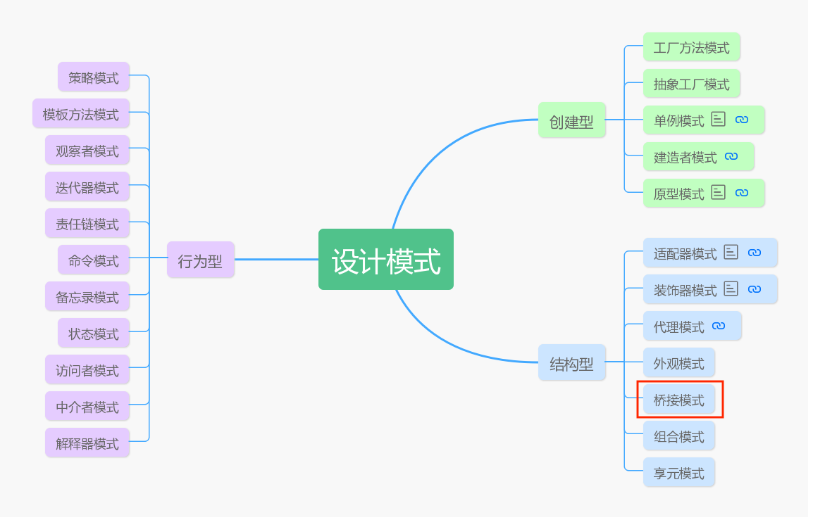
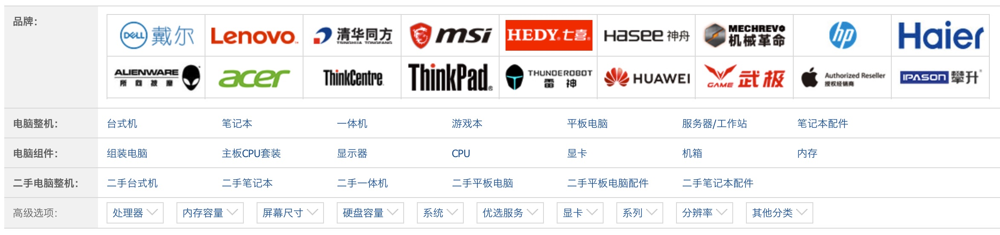
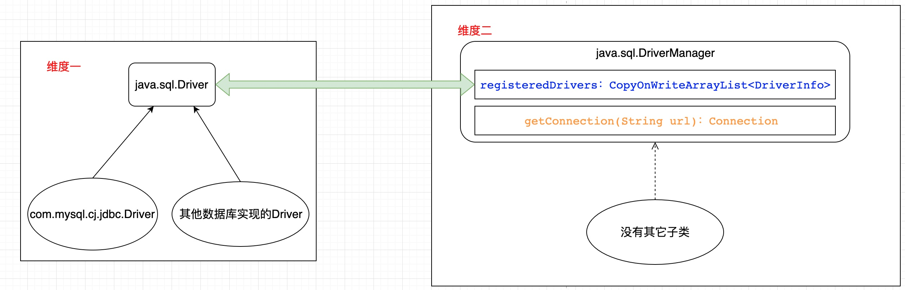

# 让设计模式飞一会儿|⑨桥接模式

大家好，我是**高冷就是范儿**，这一次真的好久不见了......差不多都有两个月没更新过文章了，主要前段时间出于个人职业规划，换了个工作，面试找工作花了不少时间，然后人也就懒散了......花了挺长时间才缓过来，想了想，决定还是继续把这个系列写完。其实，GOF23共有23种设计模式，前面我们讲了不到十种，但其实，我个人觉得，前面已经讲过这几篇可以说是GOF23中最重要的几个模式，时间确实隔得比较长了，如果之前读者们没有阅读过的，可以点击下面链接回顾一下。

> **前文回顾**  
> 👉[让设计模式飞一会儿|①开篇](让设计模式飞一会儿|①开篇.md)  
> 👉[让设计模式飞一会儿|②单例模式](让设计模式飞一会儿|②单例模式.md)   
> 👉[让设计模式飞一会儿|③工厂模式](让设计模式飞一会儿|③工厂模式.md)   
> 👉[让设计模式飞一会儿|④原型模式](让设计模式飞一会儿|④原型模式.md)   
> 👉[让设计模式飞一会儿|⑤建造者模式](让设计模式飞一会儿|⑤建造者模式.md)  
> 👉[让设计模式飞一会儿|⑥代理模式](让设计模式飞一会儿|⑥代理模式.md)  
> 👉[让设计模式飞一会儿|⑦适配器模式](让设计模式飞一会儿|⑦适配器模式.md)   
> 👉[让设计模式飞一会儿|⑧装饰者模式](让设计模式飞一会儿|⑧装饰者模式.md) 

后面的模式虽然还有很多，但是用的都不是太多，而且总体感觉难度都不是特别大，除了个别模式，比如访问者模式、解释器模式等稍微有点难懂，其它的模式要不就是实战中用的极少，要不难度不是很大，所以首先需要恭喜大家其实设计模式最大的难关已经过了。接下去的文章我挑选一些重点讲一下我自己学习中的一些理解，对于一些无关紧要的细节我就一带而过，甚至就不讲了。网上对于每一个模式你都可以搜到非常丰富的资料和讲解，但是我个人觉得花20%精力学好80%知识即可。

那么，下面不多废话，开始今天的话题，今天开始接下去还是聊结构型模式中剩余4个模式，这四个模式用的不多，我个人对其理解也不是太深，所以接下去的内容只谈谈我个人对这几个模式的一些看法。



首先，今天我们先说**桥接模式**。

关于桥接模式的定义，我在准备素材时Google搜了一下，基本得到的都是一句话，

> 桥接模式（Bridge Pattern），将抽象部分与它的实现部分分离，使它们都可以独立地变化。

反正我不知道各位看官看完这句话是啥感受，反正我是看了几遍都完全一脸懵逼的状态，这说的都是些什么玩意，有种累觉不爱的感觉，要是这样学设计模式痛苦啊......

其实，桥接模式用一个生活中的例子描述一下，你会发现真是简单的不行......
## 例子
比如高冷我现在需要换一个新电脑，是吧？大家知道电脑种类那真是五花八门，多的不行，光从分类来看就分好几种啊，首先从外观可以分为台式机、笔记本，要是平板电脑也算电脑又是一种。从用途来分，又可以分为游戏本、商务本、上网本、超极本等。另外从电脑品牌来分，又可以分为联想、戴尔、惠普、华硕等等，相信下面这个我特地上京东截取的页面大家一定不会陌生。



那么现在我有这么一个需求，我需要设计一个系统，根据用户在页面选择的每一维度的选项，最后输出对应类别的电脑产品，比如用户选了戴尔+台式机，那么就给他发货一台戴尔台式机，要是选了联想+笔记本，就给他发货联想笔记本，等等。

如果不使用任何设计模式的编程方式，简单实现如下：

```java
public interface Computer {
    void run();
}

class LenovoLaptopComputer implements Computer {

    public void run() {
        System.out.println("联想笔记本");
    }
}

class DellDesktopComputer implements Computer {

    public void run() {
        System.out.println("戴尔台式机");
    }

```
显然这种方式相信大家都知道，其实如果你要创建的对象数量并不是很多的情况下，我们就只需要这样做即可。之前也和大家说过，设计模式这玩意不是说在项目中生搬硬套上去就显得多么高大上似的，个人理解，设计模式其实是在写代码过程中，被逼无奈，用正常方式无法完成需求后的一条无奈之路，有种被逼上梁山的感觉。如果你项目中就只需要创建几个这类对象，那这样写无可厚非。

但是如果上面这系统用户量非常大，而且每个用户各种选择维度的组合大不相同，这时会发生什么？

为方便阐述，将上述需求中电脑的类别维度简化为两个维度， 
 
维度1：品牌  
联想、戴尔、惠普  
维度2：外观  
台式机、平板电脑、笔记本电脑  

将上述2个维度两两组合，就会产生3x3=9种组合，也就意味着你需要创建9个不同的类用于完成需求。而更可怕的是，这还只是一个简化的模型，假设，现在维度增多，每个维度的可选方案增多，就会产生可怕的类膨胀问题，这显然是不可行的方案。
说到类结构扩展，很多人第一个想到的手段就是继承，代码如下：

```java
public interface Computer {
    void run();
}

class LenovoComputer implements Computer {

    public void run() {
        System.out.println("联想");
    }
}

class LaptopComputer extends LenovoComputer {
    @Override
    public void run() {
        super.run();
        System.out.println("笔记本");
    }
}

class DellComputer implements Computer {

    public void run() {
        System.out.println("戴尔");
    }
}

class DesktopComputer extends DellComputer {

    public void run() {
        super.run();
        System.out.println("台式本");
    }
}
```

继承方式的优点是，大家都很熟悉这种方式，毕竟这是Java自带的功能。但是前面我们也不止一次的说过，在设计模式中，组合类和类之间关系推荐使用组合方式，而不是继承，至于原因前面也都说过，继承关系比较呆板，不利于扩展。一般而言，继承多用于具有明显“Is-A”的关系，并且尽量减少继承的层级，以免带来后续扩展的问题。而上面例子中，品牌和外观显然是两个不同的维度，并且也不具有“Is-A”的关系，所以不适合使用继承来扩展。

这个时候，我们今天要讲的桥接模式就登场了，桥接模式最拿手的就是处理这种具有明显多层次多维度变化的类的结构。

顾名思义，桥接模式的关键在于桥接。什么是桥接？一个整体和另一个整体通过某一种方式联系在一起就是桥接，而在桥接模式中，对于多维度变化的场景，每一个维度就是对应一个整体，联系的方式就是采用**组合**方式。

现在使用代码实现：

在上面的需求中，共有两个维度，品牌和外观。  

维度1：品牌  

```java
public interface Brand {
    void run();
}

class Lenovo implements Brand {

    public void run() {
        System.out.println("联想");
    }
}

class Dell implements Brand {

    public void run() {
        System.out.println("戴尔");
    }
}

class HP implements Brand {

    public void run() {
        System.out.println("惠普");
    }
}
```
维度2：外观

```java
abstract class Type {
    Brand brand;

    public Type(Brand brand) {
        this.brand = brand;
    }

    protected abstract void run();
}

class Laptop extends Type {
    public Laptop(Brand brand) {
        super(brand);
    }

    protected void run() {
        System.out.println("笔记本");
    }
}

class Desktop extends Type {
    public Desktop(Brand brand) {
        super(brand);
    }

    protected void run() {
        System.out.println("台式机");
    }
}

class Tablet extends Type {
    public Tablet(Brand brand) {
        super(brand);
    }

    protected void run() {
        System.out.println("平板电脑");
    }
}

```

这边关键在于`Type`维度中持有`Brand`维度的引用，采用组合方式将两个维度联系在一起，因为`Brand`是由外部传入，因为不会与`Type`维度耦合，这样就两个维度就可以独立扩展，互不干扰，符合“单一职责原则”，而多层继承是不符合“单一职责原则”的，因为一个类承担了太多职责，导致后续扩展性变差，同时，每一个维度的变化扩展都不会对已经存在的代码有任何影响，只需要扩展新的实现类即可，符合“开闭原则”。

## 总结

简单总结一下，所谓的桥接模式就是用来解决存在多个维度并且需要各自独立变化扩展的场景，将每个维度抽象为一个抽象类或者接口，然后采用组合的方式将各个类联系起来，极大的提高了代码的扩展性。

不过上述我们的例子是为了演示桥接模式的原理，实际开发过程中肯定不会有这么简单的业务场景，桥接模式得以施展最关键的是在于如何识别界定多个维度，这个就需要有经验的开发人员具有一定的业务敏感度了，这也是桥接模式使用的难点。

## 应用场景

因为桥接模式特点非常鲜明，所以他的实际应用场景也就是具有明显多维度相互独立变化的场景，比如人力资源系统中的奖金计算模块，奖金计算分为多个维度，比如可以按照奖金类别分为个人奖金、团体奖金、激励奖金，按照部门分等，可以分为人事部门、销售部门、研发部门等。

另外，其实在JDK中也有使用桥接模式的例子，最典型的是JDBC的设计，下面我做简单的介绍。

JDBC是Java为了访问数据库而抽象的一套规范，我们知道数据库的实现很多，最流行的像MySQL和Oracle等，但是在JDBC API中，都是抽象成统一的API来实现用户的透明调用。JDBC中每一个对数据库的访问抽象为一个`Connection`对象，不同的数据库实现，自然`Connection`对象也不同，`Connection`对象是由`Driver`通过调用其`connect()`方法创建，不同的数据库实现提供各自实现的`Driver`实现。这些不同`Driver`实现就构成了第一个维度，如下图。


那么。第二个维度又是什么呢？

光有`Driver`实现没有用，必须需要有人来调用它的`connect()`方法，从而返回一个`Connection`对象，实现数据库访问。谁来调用`Driver`？没错，就是`DriverManager`。在`DriverManager`中维护了一个`CopyOnWriteArrayList`列表，里面保存着初始化（就是调用`Class.forName()`）时所有的`Driver`实现类。然后当调用`DriverManager`的`getConnection()`方法时，触发对其调用。

请看`DriverManager`的`getConnection()`方法核心源码如下，

```java
//省略无关代码
for(DriverInfo aDriver : registeredDrivers) {
    if(isDriverAllowed(aDriver.driver, callerCL)) {
        println("    trying " + aDriver.driver.getClass().getName());
        Connection con = aDriver.driver.connect(url, info);
        if (con != null) {
            // Success!
            println("getConnection returning " + aDriver.driver.getClass().getName());
            return (con);
        }
    } else {
        println("    skipping: " + aDriver.getClass().getName());
    }
}
//省略无关代码
```
`DriverManager`会遍历所有检测到的`Driver`实现类，依次调用其`connect()`方法。

所以，这个`DriverManager`就是第二个维度！这个之所以比较难以理解，甚至不易发现的原因在于，标准的桥接模式的每个维度一般都是抽象为一个抽象类或者接口，并且会有多个实现类，而在其中一个维度中持有另一个维度的引用一般也是一个。**而在JDBC中运用的桥接模式可以看成是标准桥接模式的一个变种**，`Driver`维度没有问题，和标准模式一样，但是`DriverManager`维度居然是一个实体类，而并没有进一步抽象。另外，`DriverManager`维度中持有的`Driver`维度是一个集合（`CopyOnWriteArrayList`类型），并不是单个实体。整个桥接关系如下图所示。



好了，今天关于**桥接模式**的技术分享就到此结束，下一篇我会分享另一个设计模式——**外观模式**，一起继续探讨设计模式的奥秘。咱们不见不散。😊👏


