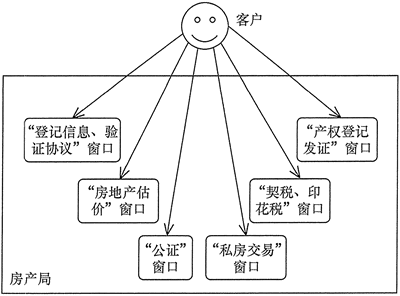

## 外观模式
- 为子系统提供统一的入口。封装子系统的复杂性，便于客户端调用。

- 图示

  

- 优点

  - 外部应用程序不用关心内部子系统的具体的细节。

- 缺点

  - 不能很好地限制客户使用子系统类。

  - 增加新的子系统可能需要修改外观类或客户端的源代码，违背了“开闭原则”。

- 应用场景
  
  - XXX工具类 
  
- 代码实现

  ```java
  //子系统角色
  class SubSystem01 {
      public void method1() {
          System.out.println("子系统01的method1()被调用！");
      }
  }
  
  //子系统角色
  class SubSystem02 {
      public void method2() {
          System.out.println("子系统02的method2()被调用！");
      }
  }
  
  //子系统角色
  class SubSystem03 {
      public void method3() {
          System.out.println("子系统03的method3()被调用！");
      }
  }
  
  //外观角色
  class Facade {
      private SubSystem01 s1 = new SubSystem01();
      private SubSystem02 s2 = new SubSystem02();
      private SubSystem03 s3 = new SubSystem03();
  
      public void invoke() {
          s1.method1();
          s2.method2();
          s3.method3();
      }
  
      public static void main(String[] args) {
          new Facade().invoke();
      }
  }
  ```

  