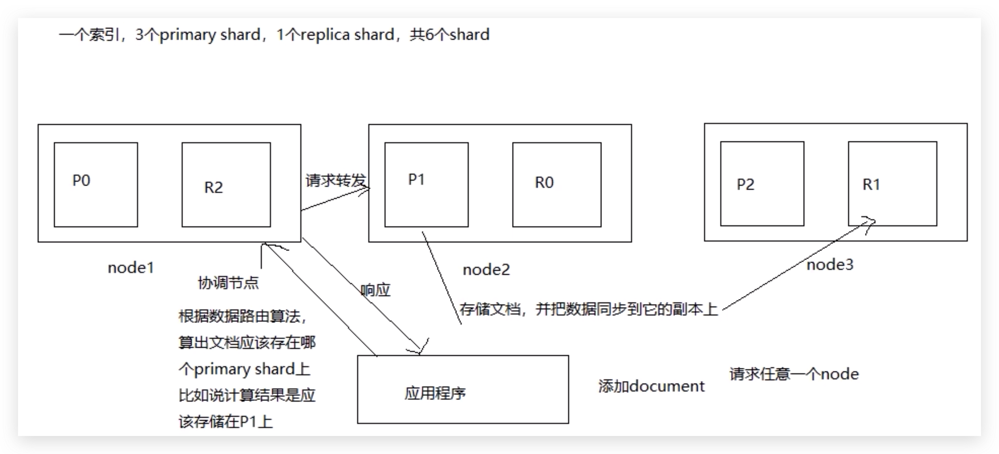
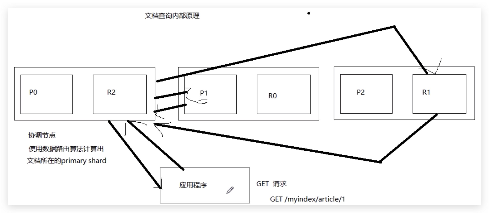

# Elasticsearch

## 基本概念

- Index
- Type
- Document
- Mapping

## 倒排索引

## 分词器


## 基本操作

### 创建索引库

```
PUT person
{
"settings": {
  "number_of_shards": 3
  , "number_of_replicas": 0
},
"mappings": {}
}

GET /person/_settings
GET _all/_settings
```


### 删除索引库

```
DELETE /person2
```

### 查看Mapping

```
GET /person/_mapping
```


### 插入文档

```
# 自定义id
PUT /person/student/1
{
  "name":"dujc",
  "age":28
}
# 自动生成id
POST /person2/teacher
{
  "name":"zhangsan",
  "sex":"man"
}
```


### 查询文档

```
# 显示全部字段
GET /person/student/1
# 显示指定字段
GET /person/student/1?_source=age
```


### 修改文档

```
# 覆盖方式修改文档
PUT /person/student/1
{
  "name2":"dujc2",
  "age2":30,
  "sex":"m"
}
# 局部修改
POST /person/student/1/_update
{
  "doc":{
      "name2":"dujc"
  }
}
```


### 删除文档

```
DELETE /person/student/1
```

### 批量查询

```
# 写法1
GET /_mget
{
  "docs":[
    {
      "_index":"person",
      "_type":"student",
      "_id":1
    },
    {
      "_index":"person",
      "_type":"student",
      "_id":2,
      "_source":["name"]
    },
    {
      "_index":"person",
      "_type":"student",
      "_id":3
    }
    ]
}
# 写法2
GET /person/student/_mget
{
  "docs":[
    {
      "_id":1
    },
    {
      "_id":2
    },
    {
      "_id":3,
      "_source":["age"]
    }
    ]
}

# 写法3
GET /person/student/_mget
{
  "ids":[2,3]
}
```

### Bulk操作

- bulk格式
  - {action:{metadata}}\n
  - {requestbody}\n

```
POST /person/stu/_bulk
#创建
#如果已存在，create会报错，index会更新数据
{"create":{"_index":"person","_type":"stu","_id":1}}
{"name":"zhangsan", "age":17}
{"index":{"_index":"person","_type":"stu","_id":1}}
{"name":"zhangsan", "age":17}
#更新
{"update":{"_index":"person","_type":"stu","_id":1}}
{"doc":{"age":20}}
#删除
{"delete":{"_index":"person","_type":"stu","_id":1}}
```

## 版本控制

- ElasticSearch采用乐观锁保证数据一致性。
- 内部版本控制使用_version字段，用户操作时，带上version参数，如果参数值和__version值相同，则更新，否则抛出异常
- 外部版本控制是检查请求中指定的数值是否大于__version值，如果是则更新，否则抛出异常，另外在增加请求参数version_type=external

## 数据类型

### 核心数据类型

- 字符型：string，分为text和keyword，text会被分词，keyword不会被分词
- 数字型：long,integer,short,byte,double,float
- 日期型：date
- 布尔型：boolean
- 二进制型：binary

### 复杂数据类型

### 地理数据类型

### 特定类型

## 基本查询

### term和terms查询

- term和terms查询会直接到分词器建立好的倒排索引中寻找term，并不会进行分词，适合查询keyword、数字型、date。需要注意一点，ES默认的分词器分词时会将英文单词全变小写。

```
GET /person/student/_search
{
  "query": {
    "term": {
      "interests": {
        "value": "yuedu"
      }
    }
  }
}

GET /person/student/_search
{
  "query": {
    "terms": {
      "interests": [
        "xiezuo",
        "changge"
      ]
    }
  }
}
```


### 控制查询返回数量

```
GET /person/student/_search
{
  "from": 0, 
  "size": 1, 
  "query": {
    "terms": {
      "interests": [
        "yuedu"
      ]
    }
  }
}
```

### 返回版本号

```
GET /person/student/_search
{
  "version": true, 
  "query": {
    "terms": {
      "interests": [
        "yuedu"
      ]
    }
  }
}
```

### match查询

- match查询会先对查询条件进行分词，然后在进行查询

```
GET /person/student/_search
{
  "query": {
    "match": {
      "interests": "changge xiezuo"
    }
  }
}
```

- match_all查询所有文档

```
GET /person/student/_search
{
  "query": {
    "match_all": {}
  }
}
```

- multi_match指定多个字段查询

```
GET /person/student/_search
{
  "query": {
   "multi_match": {
     "query": "yuedu",
     "fields": ["interests", "name"]
   }
  }
}
```

- match_phrase必须匹配短语中所有分词，并保证各个分词相对位置不变

```
GET /person/student/_search
{
  "query": {
   "match_phrase": {
     "lang": "ruby,c"
   }
  }
}
```

- match_phrase_prefix匹配短语前缀查询

```
GET /person/student/_search
{
  "query": {
  "match_phrase_prefix": {
    "name": "du"
  }
  }
}
```


### 指定返回的字段

```
GET /person/student/_search
{
  "_source": "age", 
  "query": {
   "match": {
     "lang": "java"
   }
  }
}
```

### 排序

```
GET /person/student/_search
{
  "query": {
  "match_phrase_prefix": {
    "name": "du"
  }
  },
  "sort": [
    {
      "age": {
        "order": "desc"
      }
    }
  ]
}
```

### 范围查询

```
GET /person/student/_search
{
  "query": {
 "range": {
   "age": {
     "from": 28,
     "to": 30,
     "include_lower":false,
     "include_upper":false
   }
 }
  }
}
```

### 通配符匹配

- *表示0个或多个字符
- ?表示任意一个字符

```
GET /person/student/_search
{
  "query": {
"wildcard": {
  "lang": {
    "value": "j?va"
  }
}
  }
}
```

### 模糊查询

```
GET /person/student/_search
{
  "query": {
"fuzzy": {
  "lang": "pthon"
}
  }
}
```

### Filter查询

- filter不计算相关性，同时可以缓存，因此速度会比query快

```
GET /person/student/_search
{
  "query": {
"bool": {
  "filter": [
    {"term":{"name":"dujc"}}
    ]
}
}}

GET /person/student/_search
{
  "query": {
"bool": {
  "filter": [
    {"terms":{"lang":["shell","ruby"]}}
    ]
}
}}
```

### bool过滤

```
GET /person/student/_search
{
  "query": {
    "bool": {
      "should": [
        {"term":{"lang": "rust"}},
        {"term":{"lang": "go"}}
      ],
      "must_not": [
        {"term":{"lang": "shell"}}
      ],
      "must": [
        {"term":{"lang": "js"}}
      ]
    }
  }
}
```

### 范围过滤

```
GET /person/student/_search
{
  "query": {
    "bool": {
      "filter": {
        "range": {
          "age": {
            "gte": 28,
            "lte": 30
          }
        }
      }
    }
  }
}
```

### 过滤非空（Null）

```
GET /person/student/_search
{
  "query": {
    "bool": {
      "filter": {
        "exists": {
          "field": "name"
        }
      }
    }
  }
}
```

### 高亮显示

```
GET /person/student/_search
{
  "query": {
    "match": {
      "lang": "java shell"
    }
    
  }
  , "highlight": {
    "fields": [{"lang": {}}], 
    "pre_tags": ["<span stype=color:red>"],
    "post_tags": ["</span>"]
  }
}
```


## 聚合查询

- sum求和

```
GET /person/student/_search
{
  "size": 0, 
 "aggs": {
   "sum_of_age": {
     "sum": {
       "field": "age"
     }
   }
 }
}
```


- min求最小值

```
GET /person/student/_search
{
  "size": 0, 
 "aggs": {
   "min_age": {
     "min": {
       "field": "age"
     }
   }
 }
}
```

- max求最大值

```
GET /person/student/_search
{
  "size": 0, 
 "aggs": {
   "max_age": {
     "max": {
       "field": "age"
     }
   }
 }
}
```

- avg求平均值

```
GET /person/student/_search
{
  "size": 0, 
 "aggs": {
   "avg_of_age": {
     "avg": {
       "field": "age"
     }
   }
 }
}
```

- cardinality求基数（不重复元素个数）

```
GET /person/student/_search
{
  "size": 0, 
 "aggs": {
   "card_of_age": {
     "cardinality": {
       "field": "age"
     }
   }
 }
}
```

- terms分组

```
GET /person/student/_search
{
  "size": 0, 
 "aggs": {
   "group_of_age": {
     "terms": {
       "field": "age"
     }
   }
 }
}
```

- 综合
- 对lang字段包含rust的元素按照年龄分组，计算每组平均值，并且按照平均值降序排序

```
GET /person/student/_search
{
  "size": 0, 
   "query": {
     "match": {
       "lang": "rust"
     }
   },
   "aggs": {
     "group_of_age": {
       "terms": {
         "field": "age",
         "order": {
           "avg_of_age": "desc"
         }
       },
       "aggs": {
         "avg_of_age": {
           "avg": {
             "field": "age"
           }
         }
       }
     }
   }
}
```

## 复合查询

- 将多个基本查询组合成单一查询的查询

## ElasticSearch原理

### 分片和副本机制

- 一个index包含多个shard，每一个shard都是一个Lucene实例，具有完整建立索引和处理请求的能力
- 增减节点，shard会自动在节点间负载均衡
- 每一个document只会存在于某一个primary shard（以及对应的replica shard），每一个primary shard只会存放一部分document，所有primary shard所有的文档集合才是一个index中所有的文档数据
- replica shard是primary shard的副本，负责容错，承担读请求负载
- primary shard的数量在创建index时指定，之后不能再修改，replica shard的数量随时可以修改。默认primary shard数量为5，replica shard为1
- primary shard不能和自己的replica shard放在同一个节点，否则一宕机会造成数据丢失

### 单节点创建index

- 只会将3个primary shard分配到仅有的一个节点上，因为primary shard及其replica shard不能放在同一个节点上，所有会导致3个replica shard无法分配，集群可以正常使用，但是一旦节点宕机，数据全部丢失，集群不可用

### 两节点创建index

- 将3个primary shard放在一个节点，将3个replica shard放在另一个节点

### 集群扩容

#### 垂直扩容

- 不改变集群节点数量，提高单台服务器的配置

#### 水平扩容

- 不改变单台服务器配置，通过增加节点数量

##### 水平扩容过程

- 水平扩容后，primary shard和replica shard会自动负载均衡
- 扩容后每一个节点上shard数量减少，分配给每一个shard的系统资源更多，性能提高
- 扩容的极限是有N个shard，增加N个节点。如果想要超出扩容极限，可以通过增加replica shard个数，提高集群的容错性
- 总结：集群扩容的作用主要有两个，一个是提高系统吞吐量，一个是提高系统容错性（允许集群中更多的节点宕机，但是集群依然可以使用，数据不丢失）

### ES集群容错机制

- 只要集群中有一个含有primary shard的节点宕机，集群状态为red，因为不是所有的primary shard处于活跃状态
- 重新选举master节点
- master将丢失的primary shard的其中一个replica shard升级为primary shard，此时集群中所有的primary shard都是活跃的，集群状态转为yellow（此时集群中所有的primary shard处于活跃，但是并不是所有的replica shard处于活跃）
- 将宕机的服务器重启，master节点会将每一个primary shard的数据拷贝一份到该服务器上，此时primary shard和replica shard都是活跃的，集群状态转为green

### 文档核心元数据

- _index
  - 说明一个文档存储在哪个索引
  - 同一个索引下存放相似的文档（文档的字段多数是相同的）
  - 索引名必须是小写的，不能以下划线开头，不能包括逗号
- _type
  - 表示文档属于索引中哪一个类型
  - 从ES 6.0开始，**一个索引下只能有一个type**
  - 类型名可以是大写，也可以是小写，不能以下划线开头，不能包含逗号
- _id
  - 文档的唯一标识，和索引、类型一唯一标识一个文档
  - 可以手动指定，如果不指定，由ES自动生成

### 文档Id生成方式

- 手动指定
  - 一般将其他系统中的已有数据导入ES时使用该方式
- ES自动生成
  - 使用GUID算法，分布式并发生成ID值不会冲突

### 文档修改和删除原理

#### 文档修改

- put方式修改文档会先从ES中查询出待修改文档数据，然后再将修改后的数据发送给ES， 在ES内部会将原文档标记为deleted，同时会生成一个新文档
- post方式修改文档则直接将文档部分修改内容提交给ES，在ES内部查询出该文档数据，然后使用用户提交的数据更新文档，将已有文档标记为deleted ，同时创建一个新的文档
- 两种方式比较
  - post方式比put方式少一次查询的操作，从查询文档到修改文档到创建新文档都是在ES内部完成，网络传输次数减少，性能较好
  - post方式发生并发冲突的可能性降低。另外可以使用retry_on_conflict参数设置当出现乐观锁冲突时的重试次数

#### 文档删除

- 删除文档也是在ES内部将该文档标记为deleted，在随后某个时间ES将其真正删除

### 使用groovy脚本更新文档

#### 数字型

```
GET /person/student/5/_update
{
  "script":"ctx._source.age+=1"
}
```


#### 字符串型

```
GET /person/student/5/_update
{
  "script":"ctx._source.name+='hello'"
}
```


#### 数组型

```
GET /person/student/5/_update
{
  "script":{
    "source": "ctx._source.interests.add(params.it)",
    "params": {
      "it":"hecha"
    }
  }
}

GET /person/student/5/_update
{
  "script":{
    "source": "ctx._source.interests.remove(ctx._source.interests.indexOf(params.it))",
    "params": {
      "it":"hecha"
    }
  }
}
```


#### 删除文档

```
GET /person/student/5/_update
{
  "script":{
    "source": "ctx.op=ctx._source.age==params.a?'delete':'none'",
    "params": {
      "a":32
    }
  }
}
```


#### upsert

- 如果文档存在，则执行script逻辑，否则按照upsert内容创建文档

```
GET /person/student/5/_update
{
  "script":"ctx._source.age+=1",
  "upsert":{
    "name" : "dujc3",
      "age" : 33,
      "interests" : [
        "yuedu",
        "yundong",
        "zijiayou"
      ],
      "lang" : "python,shell,c,go"
  }
}
```


### 文档数据路由原理

- 每次CRUD操作时，都会有一个routing值（默认为文档id，也可以自己指定）
- 对这个routing值进行hash运算，再将计算结果%primary shard数量，计算出余数
- 文档j就存放在余数对应的shard上

### 文档增删改原理



### 写一致性和Quorum机制

- 任何一个CRUD操作都可以加上consistency参数指定一致性。取值有one、all、quorum。
  - one 只要有一个primary shard是活跃的就可以执行操作
  - all 必须所有primary shard是活跃的才可以执行操作
  - quorum 大部分shard是活跃的就可以执行操作，为默认配置quorum的值计算公式：quorum=int((primary shard数量+每个primary shard对应的replica shard数量)/2)+1
- 可能会出现shard不能分配齐全的情况
  - 设置了1个primary shard和1个replica shard，根据计算quorum=int((1+1)/2)+1=2，如果只有一个节点，primary 和replica不能在同一个节点上，所以不能执行写操作

- 当活跃的shard个数没有达到要求，ES默认等待一分钟，如果还是没有增加shard个数，显示timeout

### 文档查询内部原理



- 查询请求发给任意一个节点（协调节点），该节点使用路由算法计算出文档所在的primary shard
- 协调节点把请求转发给primary shard，也可以转发给replica shard（使用轮询调度算法）
- 处理请求的节点把结果返回协调节点，协调节点再返回给应用程序
- 特殊情况
  - 如果index正在建立过程中，primary shard存在，replica shard不存在，此时如果调度到replica shard，会提示文档查询不到

### 多index、多type查询

```
//查询全部
GET _search
//查询全部
GET /_all/_search
GET /person2/teacher/1
//查询多个index
GET /person,person2/_search
GET /person2/_search
//支持通配符
GET /per*/_search
//查询多个index下的多个type
GET /person,person2/student,teacher/_search
//查询多个type
GET /_all/student,teacher/_search
```

###  copy_to

- copy_to字段是将其它字段（mapping设置了copy_to）的值，以空格分隔符组成一个大字符串，然后被分析索引，但是不会存储，也就是说，只能被查询，不能被取回显示
- 设置copy_to的字段只能是text类型
- 当query查询没有指定field时，就会从copy_to字段中查询，如GET /person/student/\_search?q=zhang

### 字符串排序

- ES默认情况下会对text类型字符串分词，所以无法直接对text进行排序，需要设置排序字段的Mapping信息

```
# 创建person
PUT /person
{
  "settings": {
    "number_of_shards": 3,
    "number_of_replicas": 0
  },
  "mappings": {
    "student":{
      "properties":{
        "name":{
          "type":"text"
        },
        "age":{
          "type":"integer"
        },
        "lang":{
        # 设置type为text是为了建立倒排索引，便于搜索
          "type":"text",
          "fields":{
          	# 设置kw字段为keyword类型，是为了建立正排索引，便于排序
            "kw":{
              "type":"keyword"
            }
          },
          "fielddata":true
        }
      }
    }
  }
}
# 排序搜索
GET /person/student/_search
{
  "query": {
    "match_all": {}
  },
  "sort": [
    {
      "lang.kw": {
        "order": "desc"
      }
    }
  ]
}
```

### Doc Values

- DocValues其实是Lucene在构建倒排索引时，会额外建立一个有序的正排索引（document => field value的映射），主要用于排序、分组和一些聚合操作
- 默认对不分词的字段是开启的，对分词的字段（比如text）无效（需要设置fielddata为true）

```
PUT /person
{
  "settings": {
    "number_of_shards": 3,
    "number_of_replicas": 0
  },
  "mappings": {
    "student":{
      "properties":{
        "name":{
          "type":"text"
        },
        "age":{
          "type":"integer",
          # 不分词的字段默认开启，如果关闭，则该字段没法排序
          "doc_values":false
        },
        "lang":{
          "type":"text",
          "fields":{
            "kw":{
              "type":"keyword"
            }
          },
          "fielddata":true
        }
        
      }
    }
  }
}
```

### Scroll搜索

- scroll搜索在第一次搜索时候，保存一个当时的视图快照，之后基于该旧的视图快照提供数据搜索，如果这个期间数据变更，是不会让用户看到的
- ES默认采用\_score排序，如果数据量很大，计算相关度分数开销较大，因此将排序改为基于\_doc排序，提高性能

```
# 查询结果1m内返回
GET /person/student/_search?scroll=1m
{
  "query": {
    "match_all": {}
  },
  # 按照_doc排序
  "sort": [
   "_doc"
  ],
  # 每次返回2个文档
  "size": 2
}

GET /_search/scroll
{
  "scroll":"1m",
# 上一次返回的_scroll_id值
"scroll_id":"DnF1ZXJ5VGhlbkZldGNoAwAAAAAAAtFQFm0zTkt6MzVIUWR1U0I0SXZEcjBPWncAAAAAAALRUhZtM05LejM1SFFkdVNCNEl2RHIwT1p3AAAAAAAC0VEWbTNOS3ozNUhRZHVTQjRJdkRyME9adw=="
}
```

### Mapping属性

- dynamic
  - true	创建文档上传的字段中遇到陌生字段（未在Mapping中定义），自动映射
  - false  创建文档上传的字段中遇到陌生字段（未在Mapping中定义），忽略
  - strict  创建文档上传的字段中遇到陌生字段（未在Mapping中定义），报错
- date_detection
  - 默认按照一定格式识别date
- dynamic mapping template 

## SpringBoot集成Elasticsearch

