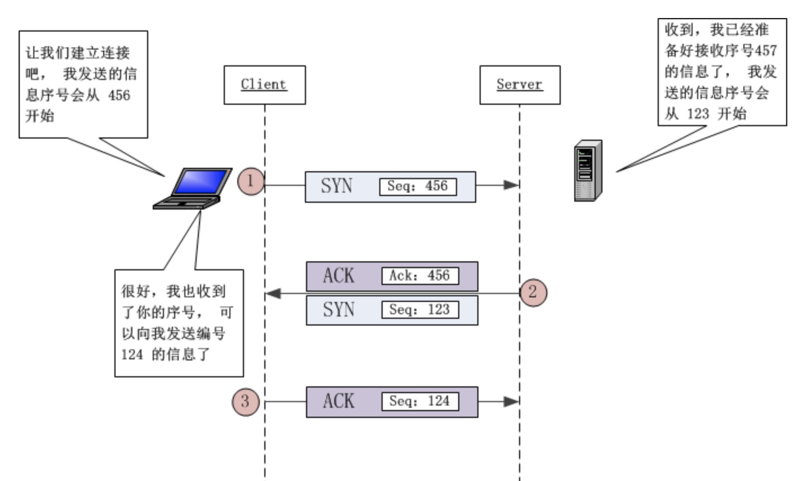
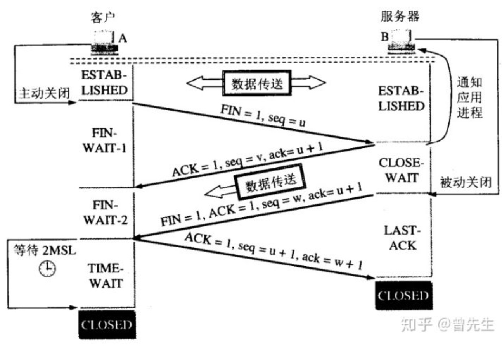
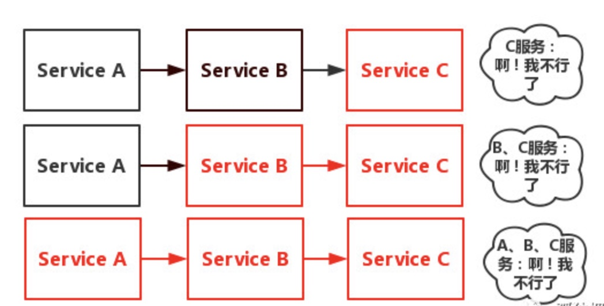
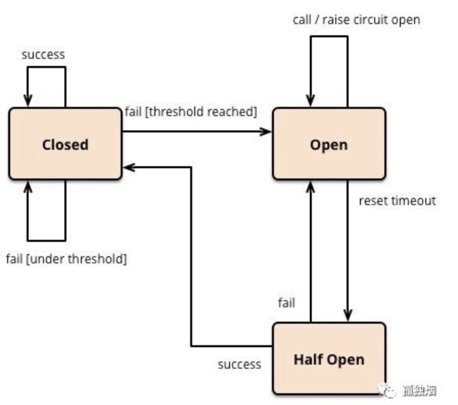

# Interview

## 当我们输入URL，按下回车发生了什么

- 浏览器的url输入栏发起一个请求，浏览器首先会看自己缓存中有没有对应的ip地址，如果有的话就直接去访问。如果没有，浏览器会去查看本地的hosts文件，看看有没有和这个域名匹配的ip地址，如果有的话就直接用hosts文件的ip地址。如果没有，浏览器会发出一个 DNS请求到本地DNS服务器 ，本地DNS服务器会首先查询它的缓存记录，如果缓存中有此条记录，就可以直接返回结果，此过程是递归的方式进行查询。如果没有，本地DNS服务器还要向DNS根服务器进行查询。DNS根服务器告诉本地DNS服务器，你可以到域服务器上去继续查询，并给出域服务器的地址。域服务器最终会返回给本地的DNS服务器一个具体的ip地址。然后本地的DNS服务器把这个具体的ip地址返回给浏览器，并且他自己也会把这个url请求对应的ip保存在自己本地，从而加快访问速度。浏览器得到域名对应的ip地址后，会加上一个端口号去访问。
- TCP三次握手建立连接。
- 建立连接后 Java的servlet容器（Tomcat）会去接受这个请求，接受后servlet容器会解析这个请求，与此同时容器会创建一个servlet实例，也就是实例化。实例化完成后调用init()初始化这个servlet对象。在初始化的时候，容器会给这个servlet实例创建一个ServletConfig对象，这个ServletConfig会从web应用中的配置文件（web.xml）读取配置信息，得到servlet初始化的时候所需要的参数信息。我们的springMVC框架中有一个dispatcherServlet去继承HTTPServlet，得到用户的请求信息，并进行业务处理然后将处理后的结果返回给前端进行处理，按页面原路返回给浏览器。
- 浏览器得到了请求的结果，就会解析HTML，CSS、JS、图片等文件了。
- TCP四次挥手，断开连接。

## 生产问题排查思路

### 排查死锁问题

使用jps+jstack或者使用jconsole和jvisualvm等图形化工具查看。

### 排查CPU 100%

- 使用top命令查看cpu占用资源较高的PID。
- 使用top -Hp <pid> 或者pidstat等命令找到cpu占用资源较高的某个线程以及记录其线程TID。
- 将TID转换为十六进制的表示方式。
- 通过jstack -l < PID > 输出当前进程的线程信息。
- 查找 TID对应的线程(输出的线程id为十六进制)，找到CPU占用较高的对应的代码位置。

## 性能优化

### JVM优化

- 尽量使用server模式提高性能。
- -Xms和-Xmx的值设置成相等，避免扩展时触发FullGC。
- 新生代尽量设置大一些，让对象在新生代多存活一段时间，每次Minor GC 都要尽可能多的收集垃圾对象，防止或延迟对象进入老年代的机会，以减少应用程序发生Full GC的频率。
- 代码实现方面，避免创建过大的对象及数组导致直接进入老年代更容易触发FullGC。尽量避免内存泄漏。

### MySQL优化

#### MySQL服务器硬件优化

#### 操作系统配置优化

- 网络方面的配置，要修改`/etc/sysctl.conf`文件。
  
  ```shell
  #增加tcp支持的队列数
  net.ipv4.tcp_max_syn_backlog = 65535
  #减少断开连接时，资源回收
  net.ipv4.tcp_max_tw_buckets = 8000
  net.ipv4.tcp_tw_reuse = 1
  net.ipv4.tcp_tw_recycle = 1
  net.ipv4.tcp_fin_timeout = 10
  ```

- 打开文件数的限制，可以使用`ulimit -a`查看目录的各个限制，可以修改`/etc/security/limits.conf`文件，增加以下内容以修改打开文件数量的限制。
  
  ```shell
  *soft nofile 65535
  *hard nofile 65535
  ```

#### MySQL配置文件my.cnf

#### SQL、索引优化

### Tomcat优化

- 修改Tomcat的内存配置，打开$TOMCAT_HOME/bin/catalina.sh文件，在JAVA_OPTS参数上添加内存参数设置即可。如下：
  
  ```shell
  JAVA_OPTS="$JAVA_OPTS -server -Xms2048m -Xmx2048m -XX:PermSize=128m -XX:MaxPermSize=256 -Djava.awt.headless=true"
  ```
  
  默认是client模式，server模式会比client模式启动速度慢，但是性能高很多。

- 修改Tomcat能处理的线程数，如设置为500，因为过多的线程会导致线程上下文切换，反而会降低服务器的响应性能。

## TCP拆包粘包

## Filter和拦截器

## Lock和sychronized

## Spring Bean生命周期

## 分布式登录方案

## 解决超卖问题

## equals和hashcode

## hashcode计算方法

以String为例：s[0]*31^(n-1) + s[1]*31^(n-2) + ... + s[n-1]。之所以选用31，一是因为31是一个适当大小的质数，计算结果可以使hash碰撞概率降低。二是因为31这个数字可以使用位运算代替加减乘除运算，而这些可以被jvm自动优化。

## Thread.sleep()作用

在循环监听或观察某个状态的时候使用，作用是等待一会儿，再接着执行，这样可以避免一直占用cpu无效的等待，主要是为了释放cpu，让他干一会儿其他的事，再回来接着干活，提高cpu利用率，也就提高了程序的效率。

## sleep()、wait()、yield()区别

- wait()属于Object中的方法，yield()和sleep()属于Thread类中的方法。
- sleep()会释放CPU执行权，如果sleep时该线程带有锁资源，则不会释放锁，其他需要获取该锁的线程都会阻塞。在sleep()期间可以通过调用这个线程的interrupt()方法被中断。
- 调用锁对象的wait方法时，此线程会释放cpu资源，也会释放锁，然后另一个线程可以获取这个锁，然后再调用这个锁的notify方法，把处于冻结状态的线程唤醒，重新获取cpu的执行资格和执行权。在wait()期间可以通过调用这个线程的interrupt()方法被中断。
- 调用线程的yield()会马上释放cpu的执行权，但是依然保留了cpu的执行资格，所以有可能cpu下次进行线程调度还会让这个线程获取到执行权继续执行。

## wait和notify为什么一定要在synchroized 同步块中

当两个线程竞争同一资源时，如果对资源的访问顺序敏感，就称存在**竞态条件**。

假设有2个线程，分别是生产者和消费者，他们有各自的任务。
1.1生产者检查条件（如缓存满了）-> 1.2生产者必须等待->2.1消费者消费了一个单位的缓存 -> 2.2重新设置了条件（如缓存没满） -> 2.3调用notifyAll()唤醒生产者。
我们希望的顺序是： 1.1->1.2->2.1->2.2->2.3。
但是由于CPU执行是随机的，可能会导致 2.3 先执行，1.2 后执行，这样就会导致生产者永远也醒不过来了！
所以我们必须对流程进行管理，也就是同步，通过在同步块中并结合 wait 和 notify 方法，我们可以手动对线程的执行顺序进行调整。

调用顺序如下：

- 使用 wait ，notify 和 notifyAll 时需要先对调用对象加锁。
- 调用 wait 方法后，线程状态有 Running 变为 Waiting，并将当前线程放置到对象的 等待队列。
- notify 或者 notifyAll 方法调用后， 等待线程依旧不会从 wait 返回，需要调用 noitfy 的线程释放锁之后，等待线程才有机会从 wait 返回。
- notify 方法将等待队列的一个等待线程从等待队列种移到同步队列中，而 notifyAll 方法则是将等待队列种所有的线程全部移到同步队列，被移动的线程状态由 Waiting 变为 Blocked。
- 从 wait 方法返回的前提是获得了调用对象的锁。

## 线程池参数优化

- 服务器性能IO优化中有一个估算公式：最佳线程数目 = （线程等待时间与线程CPU时间之比 + 1）* CPU数目。可以得出一个结论：**线程等待时间所占比例越高，需要越多线程。线程CPU时间所占比例越高，需要越少线程。**
- 对于CPU密集型任务，**CPU使用率很高**，若开过多的线程数，只能**增加上下文切换**的次数，因此会带来额外的开销。对于IO密集型任务，**CPU使用率并不高**，因此可以让CPU在等待IO的时候去处理别的任务，**充分利用CPU**。
- 一般而言，如果是CPU密集型任务，则线程池大小设置为N+1。IO密集型任务，线程池大小设置为2N+1。之所以需要+1，是因为即使当线程偶尔由于缺失故障或者其他原因而暂停时，这个额外的线程也能确保CPU的时钟周期不会被浪费。

## Ribbon负载均衡策略

## @Transactional使用注意的地方

- @Transactional只能应用到public方法才有效。因为底层Spring AOP代理时，会对目标方法是否是public判断，如果不是，则不会获取@Transactional 的属性配置信息，最终也不会用TransactionInterceptor来拦截该目标方法进行事务管理。
- 默认情况下，如果在事务中抛出了未检查异常（继承自RuntimeException的异常）或者Error，则Spring才会回滚事务。除此之外，Spring则不会回滚事务。如果在事务中抛出其他类型的异常，并期望Spring能够回滚事务，可以指定rollbackFor属性，这样事务中抛出指定的异常类及其子类的异常都会被回滚。
- 在Spring AOP代理下，只有目标方法由外部调用，目标方法才由 Spring 生成的代理对象来管理，这会造成自调用问题。若同一类中的其他没有加@Transactional注解的方法内部调用有@Transactional 注解的方法，有@Transactional 注解的方法的事务被忽略，不会发生回滚。

## serialVersionUID的作用

- serialVersionUID是Java为每个序列化类产生的版本标识，可用来保证在反序列时，发送方发送的和接受方接收的是可兼容的对象。如果接收方接收的类的serialVersionUID与发送方发送的serialVersionUID不一致，进行反序列时会抛出InvalidClassException。
- 若不显式定义serialVersionUID的值，Java编译器会根据类细节信息自动生成serialVersionUID的值。如果对类的源代码作了修改，再重新编译，新生成的类文件的serialVersionUID的取值有可能也会发生变化。类的serialVersionUID的默认值完全依赖于Java编译器的实现，对于同一个类，用不同的Java编译器编译，也有可能会导致不同的serialVersionUID。

## CountDownLatch和CyclicBarrier

- CountDownLatch和CyclicBarrier都能够实现线程之间的等待，只不过它们侧重点不同，CountDownLatch一般用于某个线程A等待若干个其他线程执行完任务之后，它才执行；而CyclicBarrier一般用于一组线程互相等待至某个状态，然后这一组线程再同时执行。
- CountDownLatch是不能够重用的，而CyclicBarrier是可以重用的。

## 3个线程交替打印0到100的数字，各打印一次

实现代码如下：

```java
public class Demo {

    public static void main(String[] args) {

        for (int i = 0; i < 3; i++) {
            new Thread(new Thread1(i)).start();
        }
    }

    static class Thread1 implements Runnable {

        private static final Object LOCK = new Object();
        //必须是static，在多线程下共享
        private static int count = 0;
        private int threadId;

        public Thread1(int threadId) {
            this.threadId = threadId;
        }

        @Override
        public void run() {
            while (true) {
                synchronized (LOCK) {
                    while ((count % 3) != threadId) {
                        if (count > 100) {
                            break;
                        }
                        try {
                            LOCK.wait();
                        } catch (InterruptedException e) {
                            e.printStackTrace();
                        }
                    }
                    if (count > 100) {
                        break;
                    }
                    System.out.println("线程：" + threadId + " 打印 " + count++);
                    LOCK.notifyAll();
                }
            }
        }
    }
}
```

运行结果：

```
线程：0 打印 0
线程：1 打印 1
线程：2 打印 2
线程：0 打印 3
线程：1 打印 4
线程：2 打印 5
线程：0 打印 6
线程：1 打印 7
线程：2 打印 8
线程：0 打印 9

...

线程：0 打印 93
线程：1 打印 94
线程：2 打印 95
线程：0 打印 96
线程：1 打印 97
线程：2 打印 98
线程：0 打印 99
线程：1 打印 100
```

## 3个线程交替打印0到100的数字，各打印3次

实现代码如下：

```java
public class Demo {

    public static void main(String[] args) {

        for (int i = 0; i < 3; i++) {
            new Thread(new Thread2(i)).start();
        }
    }

    static class Thread2 implements Runnable {

        private static final Object LOCK = new Object();
        //必须是static，在多线程下共享
        private static int count = 0;
        private int threadId;
        private static int state = 0;

        public Thread2(int threadId) {
            this.threadId = threadId;
        }

        @Override
        public void run() {
            while (true) {
                synchronized (LOCK) {
                    while ((state % 3) != threadId) {
                        if (count > 100) {
                            break;
                        }
                        try {
                            LOCK.wait();
                        } catch (InterruptedException e) {
                            e.printStackTrace();
                        }
                    }
                    if (count > 100) {
                        break;
                    }
                    for (int i = 0; i < 3; i++) {
                        if (count > 100) {
                            break;
                        }
                        System.out.println("线程：" + threadId + " 打印 " + count++);
                    }
                    state++;
                    LOCK.notifyAll();
                }
            }
        }
    }
}
```

运行结果：

```
线程：0 打印 0
线程：0 打印 1
线程：0 打印 2
线程：1 打印 3
线程：1 打印 4
线程：1 打印 5

...

线程：1 打印 93
线程：1 打印 94
线程：1 打印 95
线程：2 打印 96
线程：2 打印 97
线程：2 打印 98
线程：0 打印 99
线程：0 打印 100
```

## TCP为什么需要三次握手和四次挥手

### 三次握手

- 防止已失效的连接请求又传送到服务器端，因而产生错误。
  
  client发出的第一个连接请求报文段并没有丢失，而是在某个网络结点长时间滞留，以致延误到连接释放以后的某个时间才到达server。本来这是一个早已失效的报文段。但server收到此失效的连接请求报文段后，就误认为是client再次发出的一个新的连接请求。于是就向client发出确认报文段，同意建立连接。假设不采用“三次握手”，那么只要server发出确认，新的连接就建立了。由于现在client并没有发出建立连接的请求，因此不会理睬server的确认，也不会向server发送数据。但server却以为新的运输连接已经建立，并一直等待client发来数据。这样，server的很多资源就白白浪费掉了。采用三次握手的办法可以防止上述现象发生。例如刚才那种情况，client不会向server的确认发出确认回复。server由于收不到确认，就知道client并没有要求建立连接。主要目的防止server端一直等待，浪费资源。

- TCP是一种可靠的连接（相对于UDP而言，所谓可靠就是发送数据完整、有序），为了实现可靠传输， 通信双方需要判断自己已经发送的数据包是否都被接收方收到， 如果没收到， 就需要重发。为了实现这个需求， 很自然地就会引出**序号（sequence number）** 和 **确认号（acknowledgement number）** 的使用。序号并不是从 0 开始的， 而是由发送方随机选择的初始序列号 ( Initial Sequence Number, ISN )开始 。 由于 TCP 是一个双向通信协议（全双工）， 通信双方都有能力发送信息， 并接收响应。 因此， **通信双方都需要随机产生一个初始的序列号**， 并且把这个序号起始值告诉对方，并且都需要得到对方的确认（收到的序号+1）。如果只是两次握手， 最多只有连接发起方的起始序列号能被确认， 另一方选择的序列号则得不到确认。
  
  

### 四次挥手



TCP是全双工通信的，

- 第一次挥手
  
  因此当主动方发送断开连接的请求（即FIN报文）给被动方时，仅仅代表主动方不会再发送数据报文了，但主动方仍可以接收被动方的数据报文。

- 第二次挥手
  
  **被动方此时有可能还有相应的数据报文需要发送**，因此需要先发送ACK报文，告知主动方“我知道你想断开连接的请求了”。这样主动方便不会因为没有收到应答而继续（重复）发送断开连接的请求（即FIN报文）。但是如果此时**被动方此时也没有有相应的数据报文需要发送给主动方了，**那么对Client的ACK包和Server自己的FIN包就可以合并成为一个包发送过去，这样四次挥手就可以变成三次了。

- 第三次挥手
  
  被动方在处理完数据报文后，便发送给主动方FIN报文，这样可以保证数据通信正常可靠完成。发送完FIN报文后，被动方进入LAST_ACK阶段（超时等待）。

- 第四次挥手
  
  主动方等待2MSL后，会及时发送ACK报文进行被动方到主动方的连接的中断的确认，这时被动方就直接释放连接。

## 服务降级和服务熔断

### 服务雪崩

在分布式场景下，一个服务失败，导致整条调用链路的服务都失败的情形，我们称之为服务雪崩。如下图，此时流量突然性增加。那么在这种情况下，就算`Service A`能扛得住请求，`Service B`和`Service C`未必能扛得住这突发的请求。此时，如果`Service C`因为抗不住请求，变得不可用。那么`Service B`的请求也会阻塞，慢慢耗尽`Service B`的线程资源，`Service B`就会变得不可用。紧接着，`Service A`也会不可用。

**解决服务雪崩的常用手段就是服务熔断和服务降级。**



### 服务熔断

当下游的服务因为某种原因突然**变得不可用**或**响应过慢**，上游服务为了保证自己整体服务的可用性，不再继续调用目标服务，直接返回，快速释放资源。如果目标服务情况好转则恢复调用。**熔断其实是一个框架级的处理**，一般采用断路器模式。



- 最开始处于`closed`状态，一旦检测到错误到达一定阈值，便转为`open`状态。
- 这时候会有个 reset timeout，到了这个时间了，会转移到`half open`状态。
- **尝试放行一部分请求到后端**，一旦检测成功便回归到`closed`状态，即恢复服务。

###服务降级

当下游的服务因为某种原因**响应过慢**，下游服务**主动停掉一些不太重要的业务**，释放出服务器资源，增加响应速度。当下游的服务因为某种原因**不可用**，上游主动调用本地的一些降级逻辑，避免卡顿，迅速返回给用户。

**服务降级大多是属于一种业务级别的处理**。有很多种降级方式，如开关降级、限流降级、熔断降级。

**服务熔断属于降级方式的一种。**

### 熔断和降级的比较

#### 相同点

- **目的很一致**，都是从可用性可靠性着想，为防止系统的整体缓慢甚至崩溃，采用的技术手段。
- **最终表现类似**，对于两者来说，最终让用户体验到的是某些功能暂时不可达或不可用。
- **粒度一般都是服务级别**
- **自治性要求很高**，熔断模式一般都是服务基于策略的自动触发，降级虽说可人工干预，但在微服务架构下，完全靠人显然不可能，开关预置、配置中心都是必要手段。

#### 不同点

- **触发原因不太一样**，服务熔断一般是某个服务（下游服务）故障引起，而服务降级一般是从整体负荷考虑。
- **管理目标的层次不太一样**，熔断其实是一个框架级的处理，每个微服务都需要（无层级之分），而降级一般需要对业务有层级之分（比如降级一般是从最外围服务开始）。
- **实现方式不太一样**

## 内存分配与回收策略

- 一般而言，对象主要分配在新生代的Eden区上，如果启动了本地线程分配缓存(TLAB)，将按线程优先在TLAB上分配。少数情况下也可能直接分配在老年代中。
- 当Eden区没有足够空间进行分配时，虚拟机将发起一次MinorGC。新生代GC采用**复制算法**。将内存分为一块较大的Eden空间和两块较小的Survivor空间，每次使用Eden和其中一块Survivor。 当进行垃圾回收时，将Eden和Survivor中还存活的对象一次性地复制到另外一块Survivor空间上，最后处理掉Eden和刚才的Survivor空间。当Survivor空间不够用时，需要依赖老年代进行分配担保。
- **大对象直接进入老年代**。所谓的大对象是指，需要大量连续内存空间的Java对象，最典型的大对象就是那种很长的字符串以及数组。
- **长期存活的对象将进入老年代**。当对象在新生代中经历过一定次数（默认为15）的Minor GC后，就会被晋升到老年代中。
- **动态对象年龄判定。**虚拟机并不是永远地要求对象年龄必须达到了MaxTenuringThreshold才能晋升老年代，如果在Survivor空间中相同年龄所有对象大小的总和大于Survivor空间的一半，年龄大于或等于该年龄的对象就可以直接进入老年代，无须等到MaxTenuringThreshold中要求的年龄。

## 方法区、永久代、元空间

[https://blog.csdn.net/u011635492/article/details/81046174](https://blog.csdn.net/u011635492/article/details/81046174)

## MyBatis一级缓存和二级缓存

## 当一个线程进入一个对象的一个synchronized方法后，其它线程是否可进入此对象的其它方法
