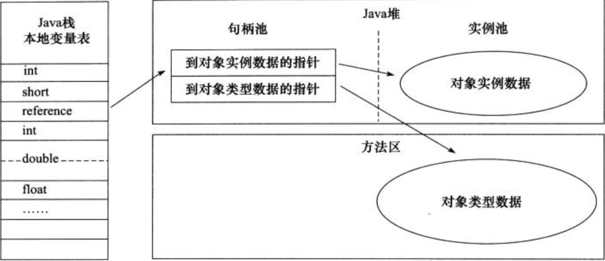
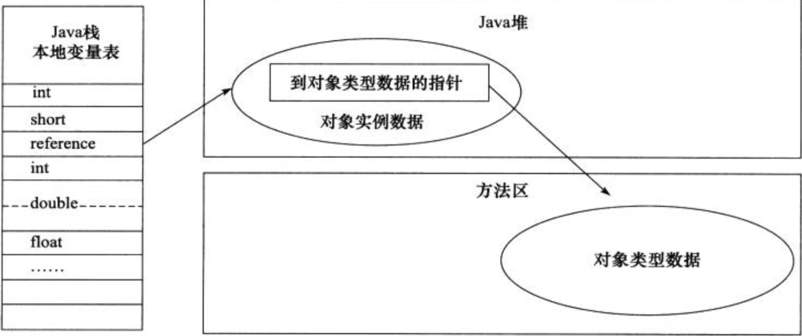
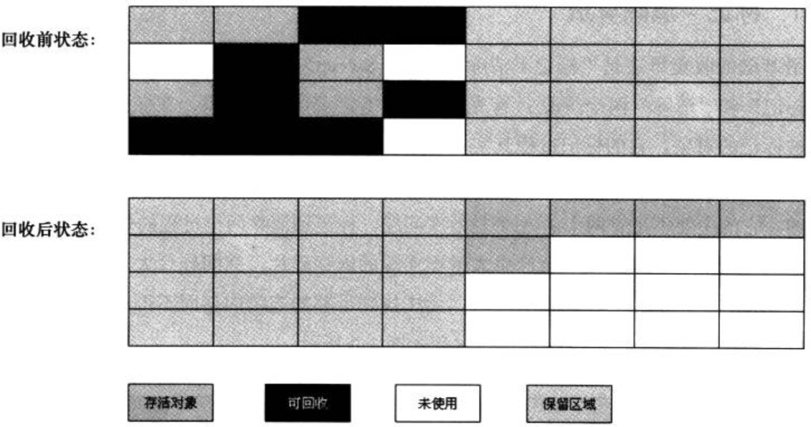
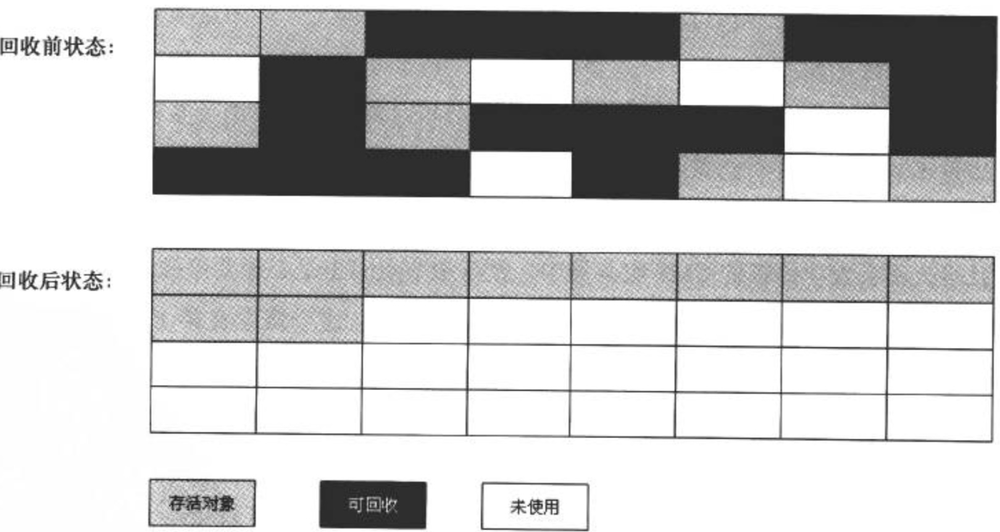
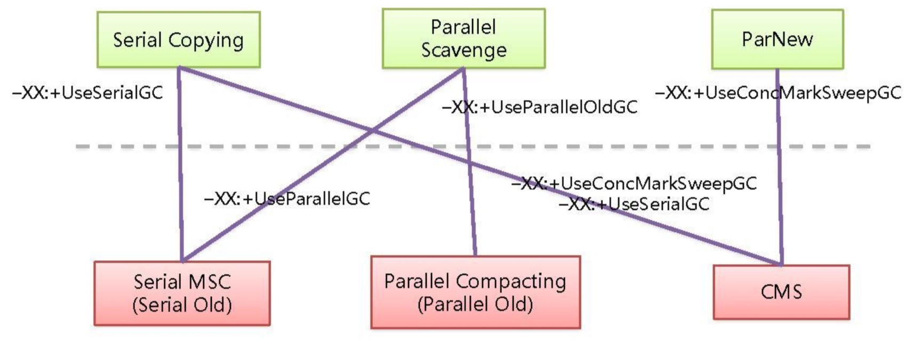

# JVM


## 优点

- 一次编写，处处运行

- 自动内存管理机制

- 数组下标越界检查

- 实现多态

## Java内存区域


### 程序计数器

- 当前线程执行字节码的行号指示器，记住下一条jvm指令的执行地址
- **每个线程都有一个独立的程序计数器**
- 这个区域是唯一一个在Java虚拟机规范中没有规定OOM的区域

### 虚拟机栈

- **线程私有**，每个方法执行时都会创建一个栈帧，用于存储局部变量表、操作数栈等信息。每一个方法的调用对应着一个栈帧在虚拟机栈中入栈出栈的过程，每一个线程只能有一个活动栈帧，对应当前正在执行的方法
- 如果栈帧过大或者过多，会抛出StackOverflowError。如果栈空间无法申请到足够的内存，会抛出OOM
- 栈空间分配不是越大越好，每一个线程的栈空间分配的过大，系统可以创建的线程数就变少

#### 相关问题

##### 方法内定义的局部变量是否线程安全

- 如果局部变量没有逃离方法的作用域，只有线程内可以访问到，那么是线程安全的

- 如果局部变量是一个引用类型，并且通过参数传入或者方法返回值逃离了当前方法的作用域，那么就有可能被其他线程访问到，就有可能会有线程安全问题

##### 找到CPU占用过多的线程

- 首先先用top找到CPU占用最高的进程ID

- 再使用ps H -eo找到CPU占用最高的线程ID

- 再使用jstack查找到该线程ID所对应的具体代码位置

### 本地方法栈

- 和Java虚拟机栈类似，区别是Java虚拟机栈为执行Java方法服务，本地方法栈为执行Native方法服务。
- HotSpot虚拟机将Java虚拟机栈和本地方法栈合二为一了。
- 和Java虚拟机栈一样会抛出StackOverflowError和OOM。

### Java堆

- **被所有线程共享**，唯一目的就是用来存放对象实例和数组。
- 是GC管理的主要区域，可以细分为新生代和老年代。
- 可能会抛出OOM。

#### 相关问题

##### GC后内存占用还是很高

- 使用jvisualvm工具的堆dump抓取当前堆内存快照，然后分析占用空间最大的对象进行分析

### 方法区

- 方法区是一个规范，不同虚拟机实现不同，Hotspot虚拟机JDK8以前是采用永久代实现，JDK8以后是使用元空间实现

- 被所有线程共享，用来存放已被虚拟机加载的类信息，常量，静态变量等数据

- 在大量动态生成类的字节码的场景下，有可能会抛出OOM

#### 运行时常量池

- 方法区的一部分
- Class文件中也有一个常量池，用来存放编译时期生成的各种字面量和符号引用，这部分内容在类加载后会进入方法区的运行时常量池中。
- 运行时期也可以将常量放入池中。
- 可能会抛出OOM

##### StringTable

- 常量池中的字符串加载到运行时常量池时，并不会立刻创建所有的字符串对象，而是在真正使用到该字符串时才会创建。然后会判断StringTable是否已存在该字符串对象，如果不存在则会放入到StringTable中

- 对于字符串**变量**拼接，底层会采用StringBuilder，对于字符串**常量**拼接，底层会使用编译器优化，直接将拼接后的值放入串池

- String.intern()可以主动将串池中还没有的字符串对象放入串池（JDK7以后，JDK6下，如果当前字符串对象在串池中不存在，则会复制一份再放入串池），同时返回串池中的对象

- JDK6下，StringTable位置在永久代。JDK8，StringTable位置在堆中，主要是为了加快字符串对象的垃圾回收

- StringTable的性能优化主要是根据代码中的字符串数量，尽量调大StringTable底层Hash表的Bucket个数（设置JVM参数-XX:StringTableSize=桶个数 ），从而减少hash碰撞，提高执行效率

### 直接内存


- 不是Java虚拟机规定的内存区域，不受JVM的管理。直接内存分配不会受到Java堆大小的限制。但是会受到总内存大小限制，所以有可能出现OOM
- 分配回收需要借助操作系统API，成本较高，但是避免了数据在用户态和内核态之间的拷贝，读写性能很高，一般用于NIO操作数据缓冲区
- 直接内存的分配可以用Unsafe类的allocateMemory()，回收可以使用Unsafe类的freeMemory()方法

## 对象创建过程

- JVM收到new指令，首先检查类是否已经被加载。如果没有，先执行类加载过程。
- 为新生对象分配内存。分配方式有指针碰撞和空闲列表。
- 将分配的内存空间都初始化为零值。
- 设置对象头信息。对象头信息包含两部分内容，一部分是对象自身运行时数据，又称为Mark Word，如HashCode、GC分代年龄等，一部分存放类型指针，JVM通过这个指针确定这个对象是哪个类的实例。
- 执行\<init\>方法，创建真正可用的对象。

## 对象引用方式

- 通过句柄方式访问对象
  
  
  
  - 优点：引用的句柄地址稳定，不会随着GC移动对象而发生改变。
  - 缺点：多了一次指针引用的开销。

- 通过直接指针方式访问对象
  
  
  
  - 优点：速度快，少了一次指针引用的开销。
  - 缺点：句柄地址会随着GC移动对象而发生改变。

## 垃圾回收

- GC回收的对象是在堆中创建的对象，对于栈内存，由于栈帧在方法执行完毕后自动就会释放，不需要垃圾回收

### 判断对象存活

- 引用计数算法
  - 最大的问题在于很难处理相互循环引用的对象的回收问题。
- 可达性分析算法
  - 从一系列GC ROOT对象作为起点，开始向下搜索，当一个对象到GC ROOT没有任何引用链相连接，则这个对象不可用。

### 引用类型


- 强引用
  - 永远不会被垃圾回收掉，只有当对象和所有GCRoot断开连接才会被回收
- 软引用
  - 没有跟GC Root直接引用，当内存不足时，软引用引用的对象会被回收，同时软引用对象自身会进入引用队列中
- 弱引用
  - 没有跟GC Root直接引用，下一次GC时不管内存充不充足，弱引用引用的对象都会被回收，同时弱引用对象自身会进入引用队列中
- 虚引用
  - 必须配合引用队列使用。当虚引用引用的对象被回收后，虚引用对象自身会进入引用队列中

### 垃圾回收算法

- 标记-清除算法
  
  
  
  - 标记和清除效率都不高。
  - 会产生大量非连续的内存碎片，不利于分配较大对象。

- 复制算法
  
  
  
  - 将内存分为2块，每次只用一块，一块用完后将存活的复制到另外一块上面，然后整个空间回收。实现简单，运行高效。但是空间浪费比较严重。
  - 主流虚拟机都**采用复制算法回收新生代**。将新生代分为Eden、from Survivor、to Survivor，默认比例8：1：1。
  - 复制算法在对象存活率较高的情况下效率会变低。

- 标记-整理算法
  
  
  
  - 标记后不直接回收被标记对象，而且将所有存活对象向一边移动，清理边界之外的内存
  - 不会有内存碎片，但是会有移动对象带来的开销

- 分代收集算法
  
  - 将堆内存分为新生代和老年代。新生代存活率较低，采用复制算法。老年代存活率较高，只能采用标记清除或者标记整理算法。

### （HotSpot）垃圾收集器




- Serial
  - 单线程，垃圾回收时必须停掉所有其他的工作线程
  - 采用复制算法
  - 高效简单，适合堆内存较小的场景
  - Client模式下默认的新生代收集器
- Serial Old
  - Serial的老年代版本，采用标记整理算法


- ParNew
  - Serial的多线程版本。
  - **可以和CMS配合使用**。设置-XX:+UseConcMarkSweepGC后默认的新生代收集器，也可以使用XX:+UseParNewGC强制指定
  - 默认开启收集线程数和CPU数相同，可以使用-XX:ParallelGCThreads指定收集线程数
- Parallel Scavenge
  - **和其它响应时间优先的垃圾回收器不同，Parallel Scavenge关注点是系统吞吐量（应用运行时间/总时间）**。低停顿时间（响应时间）可以提升用户体验，适合前台与用户交互的程序。高吞吐量可以提升CPU利用率，适合后台运行程序
  - 可以使用-XX:MaxGCPauseMillis设置最大收集停顿时间，-XX:GCTimeRatio设置吞吐量大小
  - -XX:+UseAdaptiveSizePolicy开启GC自适应调节策略，虚拟机会根据系统运行情况动态调整参数提供最适合的停顿时间和吞吐量
- 
- Parallel Old
  - Parallel Scavenge的老年代版本


- CMS
  - 工作在老年代，以获取最短响应时间为目标。在某几个阶段GC线程可以和用户线程一起并发执行，减少STW时间，如果并发标记失败后，会退化为Seri al Old


- G1
  - 同时注重吞吐量和低响应时间指标
  - 收集范围不再是整个新生代或者老年代，而是将Java堆划分多个独立区域（Region），通过跟踪各个Region中垃圾堆积的价值大小，在后台维护一个优先列表，优化回收价值最大的Region
  - 整体是标记整理算法，两个Region之间是复制算法

#### 组合选择

- 单CPU或者小内存
  
  -XX:+UseSerialGC

- 多CPU，**追求大吞吐量**，如后台运算
  
  -XX:+UseParallelGC或者-XX:+UseParallelOldGC

- 多CPU，**追求低响应时间**，如互联网产品
  
  -XX:+ParNewGC
  
  -XX:+UseConcMarkSweepGC

### 内存分配和回收

- Minor GC指新生代GC，Major GC指老年代GC，Full GC指新生代、老年代和方法区GC。
- 对象大部分都是在新生代Eden区分配，当Eden区内存不足会发生Minor GC。Minor GC主要过程是，会将Eden区和from区存活对象拷贝到to区，有一些对象会直接晋升到老年代，然后会清空Eden区和from区，将from区和to区交换身份，为下一次GC做准备。在Minor GC过程中会发生Stop the world，暂停其他所有用户线程执行，等垃圾回收结束后才会恢复
- 大对象（就算minor GC后，新生代也无法容纳下）会直接进入老年代，避免在新生代各区域之间发生大量复制操作。可以使用-XX:PretenureSizeThreshold设置大对象大小的临界值。
- 每个对象都会有一个对象年龄计数器，对象在Eden出生后经过第一次Minor GC后仍然存活，并且Survivor空间足够，会被移到Survivor区，并且年龄变为1，以后每经过一次Minor GC，年龄加1，当到达年龄阈值（最大15）时，会晋升到老年代。阈值可以用-XX:MaxTenuringThreshold设置。但是有个例外，如果在Survivor区中，相同年龄的所有对象的大小总和大于Survivor空间一半，年龄大于等于该年龄的对象可以直接进入老年代。
- 在发生每一次Minor GC之前，JVM会先检查老年代最大可用连续空间是否大于新生代所有对象之和。因为极端情况下，新生代所有对象在经过Minor GC后全部存活，需要老年代分配担保，把Survivor容纳不下的对象直接进入老年代。所以老年代需要有足够的可用连续空间。如果条件成立，那么Minor GC是绝对安全的。如果不成立，JVM会查看HandlePromotionFailure是否设置为true允许分配担保失败。如果允许，会继续比较老年代最大可用连续空间是否大于历年晋升到老年代的对象平均大小（因为，每一次Minor GC后实际会存活多少对象没法预料，只好取历史数据作为经验值）。如果小于，或者HandlePromotionFailure设置为false不允许分配担保失败，则会直接进行一次Full GC。如果大于，可以尝试进行Minor GC，虽然还是有风险。因为取平均值只是一种经验，有可能本次Minor GC存活对象剧增，依然会高于平均值，导致担保失败。出现HandlePromotionFailure失败后，也会再进行一次Full GC
- 当老年代空间不足，会先触发minor GC，如果空间还是不足，才会触发full  GC（对于CMS和G1收集器，如果并发收集的速度大于垃圾产生速度，这不叫full GC，此时并不会出现STW，GC日志中也不会打印full GC日志，只有当并发收集的速度小于垃圾产生速度，而导致并发收集失败，退化为串行收集器时，才会导致full GC），如果空间还是不足，会抛出OOM

### GC调优

#### 确定目标

- 低延迟还是高吞吐量

- CMS，G1还是Parallel GC

#### 新生代调优

- 新new的对象的内存分配是在TLAB中分配的，效率很高

- 新生代大部分对象生命周期很短

- Minor GC时间远远小于Full GC

- 新生代的内存空间不是越大越好，因为新生代空间过大，导致老年代空间相对变小，导致发生full GC的频率变高，反而会增加STW时间。理想情况下，新生代空间能容纳（并发量\*每个请求占用的数据量），一般新生代空间设置为总的堆空间大小的0.25~0.5

- 合理设置晋升阈值，使得生命周期较短的对象尽可能快的在新生代回收，生命周期较长的对象尽快晋升到老年代，避免占用新生代空间和复制算法开销

#### 老年代调优

- 内存越大越好
- 合理设置对象晋升阈值，使得生命周期较短的对象尽可能快的在新生代回收，生命周期较长的对象尽快晋升到老年代
- 设置-XX:+CMSScavengeBeforeRemark，在Full GC前先进行一次Minor GC

#### 案例

##### Full GC和Minor GC频繁

- 请求高峰期，新生代产生大量新创建对象，将新生代空间迅速占满，同时，由于幸存区空间不足，导致晋升阈值降低，大量生命周期较短的对象也进入了老年代，导致Full GC的发生

##### Full GC STW时间特别长（CMS）

- CMS在重新标记阶段会扫描整个堆内存的对象，比较耗时。可以设置-XX:+CMSScavengeBeforeRemark，在Full GC前先进行一次Minor GC，回收大部分新生代对象再进行并发标记

##### 老年代空间充裕下发生Full GC（CMS JDK1.7）

- JDK1.7前，永久代的内存不足也会导致Full GC，增加永久代空间解决

## 

## 类文件结构

### 魔数

### 版本信息

### 常量池

### 访问标识和继承信息

### 成员变量信息

### 方法信息

## 类加载

### 加载


- 查找并将类的二进制数据加载入方法区，内部采用C++的instanceKlass对象描述，java_mirror指向堆内存中的Class对象，Class对象封装了类在方法区的数据结构，提供访问方法区数据结构的接口

- 类加载不需要等到某个类被首次主动使用时才被加载
  
  jvm规范允许类加载器在预料某个类将被使用时预先加载，如果加载过程中遇到class文件丢失或者存在错误，类加载器必须在程序首次主动使用该类的时候才报告错误。如果该类一直没有被程序主动使用，那么类加载器不会报错

- 类都是由类加载器加载的。除了数组。数组是jvm运行时动态生成的类型

### 链接

- 验证类是否符合JVM规范，确保加载的类的正确性

- 准备阶段，为类的静态变量分配内存，并赋予默认值。如果是final修饰的静态的基本类型（包括基本原始类型和String，不包括原始类型的包装类），赋值操作在准备阶段就完成了。如果是final修饰的静态的引用类型，在准备阶段只分配空间，等到初始化阶段才会赋值

- 解析阶段，类文件常量池中的符号引用（并没有转换为真正物理内存上的地址）转换为直接引用（真正物理内存上的地址）

### 初始化

- 为类的静态变量赋予正确的初始值。所有虚拟机实现必须在每个类或接口被Java程序**主动使用**才会**初始化**它们

#### 主动使用（7种）

- 使用new创建类的实例，但是创建该类的数组，并不会导致该类的初始化
  
  ```java
  class Parent3{
    static final String str = UUID.randomUUID().toString();
    static {
        System.out.println("parent static block");
    }
  }
  
  public class Demo03 {
    public static void main(String[] args) {
        //类的数组创建并不会导致该类的初始化
        Parent3[] parent3s = new Parent3[1];
        System.out.println(parent3s.length);
        System.out.println(parent3s.getClass());
        System.out.println(parent3s.getClass().getSuperclass());
    }
  }
  //运行结果：
  1
  class [Lcom.dujc.jvm.Parent3;
  class java.lang.Object
  //并没有打印 parent static block，说明Parent3没有被初始化。
  // [Lcom.dujc.jvm.Parent3该类型是jvm运行时期动态生成。
  ```

- 访问一个类或者接口的静态变量（不是final的），或者对该静态变量赋值，只有直接定义该字段的类才会被初始化
  
  ```java
  class Parent{
   static String str1 = "parent field";
   static {
       System.out.println("parent static block");
   }
  }
  class Child extends Parent{
   static String str2 = "child field";
   static {
       System.out.println("child static block");
   }
  }
  
  @Test
  public void test01(){
  //虽然是通过Child类访问str1属性，但是str1是定义在Parent类中，所以只有Parent类会被初始化，Child类不会被初始化。
  System.out.println(Child.str1);
  }
  //测试结果打印
  parent static block
  parent field
  /*
  注意点：虽然Child类没有被初始化，但是完成了类的加载过程。通过jvm参数-XX:+TraceClassLoading
  jvm参数
  -XX:+<option>    开启option
  -XX:-<option>    关闭option
  -XX:<option>=<value>    赋值option
  */
  @Test
  public void test01(){
  //Child会被初始化
  System.out.println(Child.str2);
  }
  //测试结果打印
  parent static block
  child static block
  child field
  
  //final类型的属性的特殊情况
  //情况1
  class Parent2{
   //常量在编译阶段会被存入调用这个常量的方法所在的类的常量池中，
   //本质上调用类并没有直接引用到定义常量的类，因此不会导致其(Parent2)初始化。
   static final String str1 = "parent field";
   static {
       System.out.println("parent static block");
   }
  }
  public class Demo02 {
  public static void main(String[] args) {
   System.out.println(Parent2.str1);
  }
  }
  //测试结果打印
  parent field
  //情况2
  class Parent2{
   //当常量的值在编译时期没法确定的时候，那么其值不会被放到调用类的常量池中，
   //程序运行时，会导致主动使用这个常量所在的类，导致这个类被初始化。
   static final String str2 = UUID.randomUUID().toString();
   static {
       System.out.println("parent static block");
   }
  }
  public class Demo02 {
   public static void main(String[] args) {
       System.out.println(Parent2.str2);
   }
  }
  //测试结果打印
  parent static block
  65a4c2f4-0aae-47c7-bc6f-abb6a6756d01
  ```

- 调用该类的静态方法，必须是直接定义该静态方法的类才会被初始化，比如通过子类调用定义在父类中的静态方法，会导致父类的初始化，但不会导致子类的初始化
  
  ```java
  class Singleton{
   public static int a;
   private static Singleton instance = new Singleton();
   private Singleton(){
       a++;
       b++;
   }
   public static int b = 0;
   public static Singleton getInstance(){
       return instance;
   }
  }
  public class Demo05 {
   public static void main(String[] args) {
     //调用类的静态方法导致Singleton类初始化，赋予真正的值
       Singleton instance = Singleton.getInstance();
       System.out.println("a=" + Singleton.a);
       System.out.println("b=" + Singleton.b);
   }
  }
  //输出结果：
  a=1
  b=0
  ```

- 反射，比如Class.forName()

- 子类初始化，父类如果还没有初始化，会先执行父类的初始化

- main()所在的类总是会被初始化

- MethodHandle实例解析结果是REF_getStatic、REF_putStatic、REF_invokeStatic对应的类没有初始化，则初始化之

#### 被动使用

- 除了上面7种情况，其它使用类的的方式都是被动使用，不会导致类的初始化。比如，调用Classloader的loadClass方法加载类并不是对类的主动使用，不会导致类的初始化。调用类.class获取Class对象不会导致初始化，因为Class对象创建是在类加载阶段就完成了

```java
public class Demo06 {
    public static void main(String[] args) throws ClassNotFoundException {
        Class<?> clazz = ClassLoader.getSystemClassLoader().loadClass("com.dujc.jvm.A");
        System.out.println(clazz);
    }
}
class A{
    static {
        System.out.println("A static block...");
    }
}
//运行结果：
//并不会输出 A static block... 说明A没有初始化。
```

## 类加载器

### 分类

#### 根类加载器(sun.boot.class.path)

- 不是Java实现，会加载其它的类加载器
- 加载其它供jre正常运行的基本组件

#### 扩展类加载器(java.ext.dirs)

- 扩展类加载器加载的类需要打成jar包

#### 应用类加载器(java.class.path)

- 默认的系统类加载器。可以通过java.system.class.loader

#### 自定义类加载器

#### 线程上下文类加载器

- 每个类默认都会使用自己的类加载器（加载自身类的加载器）去加载其所依赖的类，如果ClassX引用了ClassY，那么ClassX会使用自己的类加载器去加载ClassY类（ClassY还尚未加载）

- **线程上下文类加载器的意义主要是为了打破双亲委托机制**，父ClassLoader中可以使用当前线程上下文类加载器加载需要使用子类加载器才能加载的类和资源，就改变了父ClassLoader不能引用子加载器加载的类或者其它没有直接或间接父子关系的类加载器加载的情况。比如，对于SPI，有些接口是Java核心类库的（比如JDBC中的DriverManager），由BootStrap加载。而这些接口的实现是各个厂商实现的jar被放置classpath下面，并不能被BootStrap访问加载。而通过线程上下文类加载器可以解决这一问题
  线程上下文类加载器使用一般模式：

```java
  //先备份当前线程上下文类加载器
  ClassLoader originalThread = Thread.currentThread().getContextClassLoader();
  try {
    //临时修改线程上下文类加载器，并使用其进行加载操作
    Thread.currentThread().setContextClassLoader(newThread);
    ...
  }finally {
    //加载完成后还原原始的线程上下文类加载器
    Thread.currentThread().setContextClassLoader(originalThread);
  }
```

### 双亲委托机制


1. 确保Java核心类库的类型安全

2. 确保Java核心类库的类型不会被自定义的类替代

3. **不同的类加载器可以为相同名称的类创建多个不同的命名空间，使得多个相同名称的类并存在jvm中，只需要不同的类加载器加载。不同的命名空间是相互隔离的**

4. 每个类加载器都有自己的命名空间，命名空间由该类加载器以及所有父加载器所加载的类组成的

5. 同一个命名空间中不会出现完整类名相同的两个类

6. **不同命名空间中有可能会出现完整类名相同的两个类**

7. 同一个命名空间中的类是相互可见的

8. 子加载器的命名空间包含所有父加载器的命名空间，**子加载器加载的类能看见父加载器加载的类**

9. **由父加载器加载的类无法看见子加载器加载的类**

10. 如果两个加载器之间没有直接或者间接的父子关系，那么它们各自加载的类互不可见

## 运行期优化

### 逃逸分析

### 方法内联

### 字段优化

### 反射优化