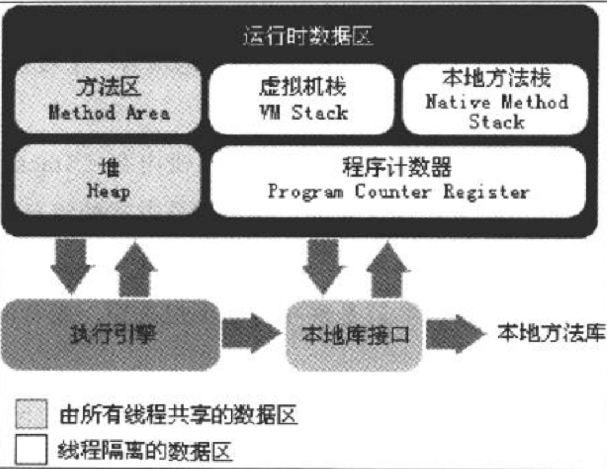

# 深入理解Java虚拟机

## Java内存区域

- 程序计数器
  - 当前线程执行字节码的行号指示器。每个线程都有一个独立的程序计数器。
  - 这个区域是唯一一个在Java虚拟机规范中没有规定OOM的区域。
- Java虚拟机栈
  - 线程私有，每个方法执行时都会创建一个栈帧，用于存储局部变量表、操作数栈等信息。每一个方法的调用对应着一个栈帧在虚拟机栈中入栈出栈的过程。
  - 如果线程请求栈深度超过JVM允许的深度，会抛出StackOverflowError。如果栈空间无法申请到足够的内存，会抛出OOM。
- 本地方法栈
  - 和Java虚拟机栈类似，区别是Java虚拟机栈为执行Java方法服务，本地方法栈为执行Native方法服务。
  - HotSpot虚拟机将Java虚拟机栈和本地方法栈合二为一了。
  - 和Java虚拟机栈一样会抛出StackOverflowError和OOM。
- Java堆
  - 被所有线程共享，唯一目的就是用来存放对象实例和数组。
  - 是GC管理的主要区域，可以细分为新生代和老年代。
  - 可能会抛出OOM。
- 方法区
  - 被所有线程共享，用来存放已被虚拟机加载的类信息，常量，静态变量等数据。
  - 可能会抛出OOM。
- 运行时常量池
  - 方法区的一部分
  - Class文件中也有一个常量池，用来存放编译时期生成的各种字面量和符号引用，这部分内容在类加载后会进入方法区的运行时常量池中。
  - 运行时期也可以将常量放入池中。
  - 可能会抛出OOM。
- 直接内存
  - 不是Java虚拟机规定的内存区域。直接内存分配不会受到Java堆大小的限制。但是会受到总内存大小限制，所以有可能出现OOM。

## 对象创建过程

- JVM收到new指令，首先检查类是否已经被加载。如果没有，先执行类加载过程。
- 为新生对象分配内存。分配方式有指针碰撞和空闲列表。
- 将分配的内存空间都初始化为零值。
- 设置对象头信息。对象头信息包含两部分内容，一部分是对象自身运行时数据，又称为Mark Word，如HashCode、GC分代年龄等，一部分存放类型指针，JVM通过这个指针确定这个对象是哪个类的实例。
- 执行\<init\>方法，创建真正可用的对象。

## 对象引用方式

- 通过句柄方式访问对象

  

  - 优点：引用的句柄地址稳定，不会随着GC移动对象而发生改变。
  - 缺点：多了一次指针引用的开销。

- 通过直接指针方式访问对象

  

  - 优点：速度快，少了一次指针引用的开销。
  - 缺点：句柄地址会随着GC移动对象而发生改变。

## 垃圾回收

### 判断对象存活

- 引用计数算法
  - 最大的问题在于很难处理对象间相互循环引用的问题。
- 可达性分析算法
  - 从一系列GC ROOT对象作为起点，开始向下搜索，当一个对象到GC ROOT没有任何引用链相连接，则这个对象不可用。

### 引用类型

- 强引用
  - 永远不会被垃圾回收掉。
- 软引用
  - 只有将要发生内存溢出之前才会被回收。
- 弱引用
  - 只能存活到下一次垃圾回收之前。下一次垃圾回收时，不管内存空间是否足够都会被回收。
- 虚引用
  - 唯一目的是在该对象回收之前收到一个通知。

### 垃圾回收算法

- 标记-清除算法

  

  - 标记和清除效率都不高。
  - 会产生大量非连续的内存碎片，不利于分配较大对象。

- 复制算法

  
  
  - 将内存分为2块，每次只用一块，一块用完后将存活的复制到另外一块上面，然后整个空间回收。实现简单，运行高效。但是空间浪费比较严重。
  - 主流虚拟机都**采用复制算法回收新生代**。将新生代分为Eden、from Survivor、to Survivor，默认比例8：1：1。
  - 复制算法在对象存活率较高的情况下效率会变低。
  
- 标记-整理算法

  
  
  - 标记后不直接回收被标记对象，而且将所有存活对象向一边移动，清理边界之外的内存。

- 分代收集算法

  - 将堆内存分为新生代和老年代。新生代存活率较低，采用复制算法。老年代存活率较高，只能采用标记清除或者标记整理算法。

### （HotSpot）垃圾收集器

- Serial
  - 单线程，垃圾回收时必须停掉所有其他的工作线程。
  - 高效简单。
  - Client模式下默认的新生代收集器。
- ParNew
  - Serial的多线程版本。
  - 可以和CMS配合使用。设置-XX:+UseConcMarkSweepGC后默认的新生代收集器，也可以使用XX:+UseParNewGC强制指定。
  - 默认开启收集线程数和CPU数相同，可以使用-XX:ParallelGCThreads指定收集线程数。
- Parallel Scavenge
  - **和其它关注工作线程停顿时间不同，Parallel Scavenge关注点是系统吞吐量（应用运行时间/总时间）**。低停顿时间（响应时间）可以提升用户体验，适合前台与用户交互的程序。高吞吐量可以提升CPU利用率，适合后台运行程序。
  - 可以使用-XX:MaxGCPauseMillis设置最大收集停顿时间，-XX:GCTimeRatio设置吞吐量大小。
  - -XX:+UseAdaptiveSizePolicy开启GC自适应调节策略，虚拟机会根据系统运行情况动态调整参数提供最适合的停顿时间和吞吐量。
- Serial Old
  - Serial的老年代版本。
- Parallel Old
  - Parallel Scavenge的老年代版本。
- CMS
  - 以获取最短停顿时间为目标。并发收集，低停顿。
- G1
  - 收集范围不再是整个新生代或者老年代，而是将Java堆划分多个独立区域（Region），通过跟踪各个Region中垃圾堆积的价值大小，在后台维护一个优先列表，优化回收价值最大的Region。

#### 组合选择

- 单CPU或者小内存

  -XX:+UseSerialGC

- 多CPU，**追求大吞吐量**，如后台运算

  -XX:+UseParallelGC或者-XX:+UseParallelOldGC

- 多CPU，**追求低响应时间**，如互联网产品

  -XX:+ParNewGC

  -XX:+UseConcMarkSweepGC

### 内存分配和回收

- Minor GC指新生代GC，Major GC指老年代GC，Full GC指新生代、老年代和方法区GC。
- 对象大部分都是在新生代Eden区分配，当Eden区内存不足会发生Minor GC。Minor GC主要过程是，会将Eden区和from区存活对象拷贝到to区，有一些对象会直接晋升到老年代，然后会清空Eden区和from区，将from区和to区交换身份，为下一次GC做准备。
- 大对象（很长的字符串或者数组）会直接进入老年代，避免在新生代各区域之间发生大量复制操作。可以使用-XX:PretenureSizeThreshold设置大对象大小的临界值。
- 每个对象都会有一个对象年龄计数器，对象在Eden出生后经过第一次Minor GC后仍然存活，并且Survivor空间足够，会被移到Survivor区，并且年龄变为1，以后每经过一次Minor GC，年龄加1，当到达年龄阈值时，会晋升到老年代。阈值可以用-XX:MaxTenuringThreshold设置。但是有个例外，如果在Survivor区中，相同年龄的所有对象的大小总和大于Survivor空间一半，年龄大于等于该年龄的对象可以直接进入老年代。
- 在发生每一次Minor GC之前，JVM会先检查老年代最大可用连续空间是否大于新生代所有对象之和。因为极端情况下，新生代所有对象在经过Minor GC后全部存活，需要老年代分配担保，把Survivor容纳不下的对象直接进入老年代。所以老年代需要有足够的可用连续空间。如果条件成立，那么Minor GC是绝对安全的。如果不成立，JVM会查看HandlePromotionFailure是否设置为true允许分配担保失败。如果允许，会继续比较老年代最大可用连续空间是否大于历年晋升到老年代的对象平均大小（因为，每一次Minor GC后实际会存活多少对象没法预料，只好取历史数据作为经验值）。如果小于，或者HandlePromotionFailure设置为false不允许分配担保失败，则会直接进行一次Full GC。如果大于，可以尝试进行Minor GC，虽然还是有风险。因为取平均值只是一种经验，有可能本次Minor GC存活对象剧增，依然会高于平均值，导致担保失败。出现HandlePromotionFailure失败后，也会再进行一次Full GC。