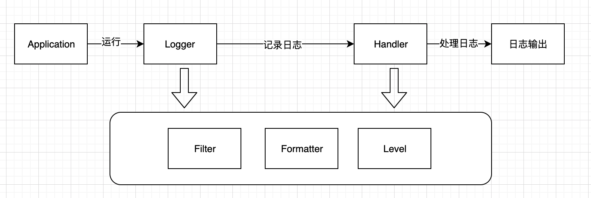

# Java日志

## 日志门面和日志框架

### 日志门面

- JCL
- SLF4J

### 日志框架

- JUL
- log4j
- logback
- log4j2

## JUL

### 架构

- Logger：日志记录器，是日志系统的入口。Logger之间存在父子关系，顶层的称为RootLogger，所有的Logger构成一个树状结构
- Handler：实现日志的输出位置等，每一个Logger可以关联一个或多个Handler
- Filter：细粒度定制日志记录的内容
- Formatter：对日志中的数据和信息进行格式化处理
- Level：日志输出级别

### 自定义配置文件

## Log4j

### 组件

#### Loggers

- 记录日志和定义日志的级别
- 实例的名称是类的全限定名，大小写敏感，命名具有继承关系。RootLogger是所有其它Logger的父Logger。父Logger的配置会直接影响到子Logger的配置

#### Appenders

- 日志输出方式，常用的主要有ConsoleAppender、FileAppender、RollingFileAppender、DailyRollingFileAppender、JDBCAppender

#### Layouts

- 日志格式化，主要使用PatternLayout自定义格式(常用占位符，占位符中间可以加数字设置占位符的宽度和对齐方式)

### 配置加载

- PropertyConfigurator

### 自定义Logger

- 同时存在RootLogger和自定义Logger配置，如果两者输出位置不同，则会取并集输出。但是对于输出日志级别按照自定义的Logger的配置为准
- 使用场景：需要对不同系统（不同的包前缀）做不同的日志定制化输出

## JCL
