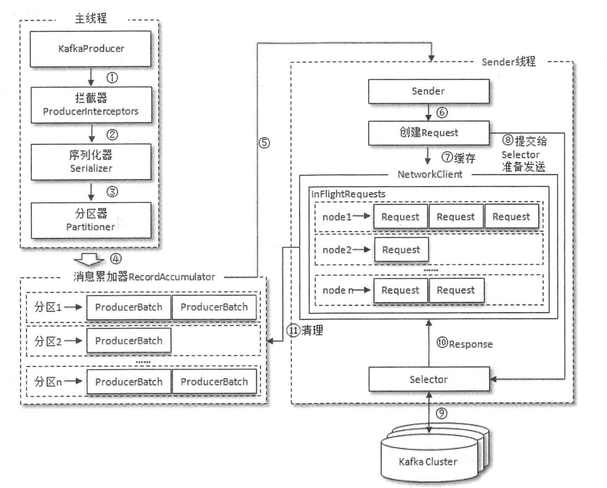
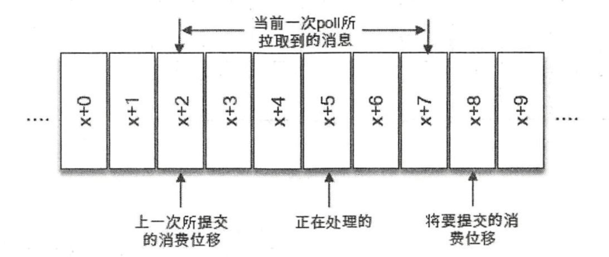
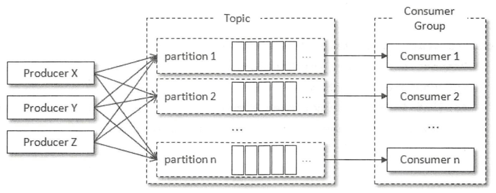
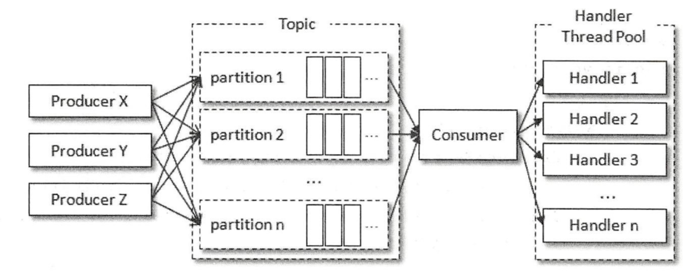

# Kafka

## 概念

- Producer
- Consumer
- Topic
- Partition
  - 单个Partition中数据是有序的，如果Topic有多个Partition，消费数据时不能保证消息的顺序，如果需要严格保证消息消费顺序，需要将Partition设为1
- Partition offset
- Replicas
  - 分为Leader和Follower。正常消费者只会从Leader节点读写数据，Follower只作为备份，当Leader挂了后会从ISR集合中的节点中重新选举新的Leader。当某一个Follower同步太慢，Leader会将这个Follower从ISR中剔除，重新创建一个Follower
- Broker
  - Broker节点数目尽量大于等于Topic的Partition数目，否则容易导致Kafka集群数据不均衡
- Zookeeper
- ISR
  - 与Leader保持数据同步的副本（可用副本）组成的集合
- OSR
  - 与Leader没有保持数据同步的副本组成的集合
- HW（高水位）
  - 表示消费者可以消费的最大消息偏移量（offset），HW本身的位置无法读取到
- LEO（Log End Offset）
  - 每个日志文件下一条待写入消息的offset，一般为日志文件最后一条消息的offset加一，分区ISR集合中每个副本都会维护自己的LEO，ISR中最小的LEO即为分区的HW

## 生产者

### 生产者整体架构




- 消息发送主要有两个线程共同工作，即主线程和Sender线程
- 主线程首先将业务数据封装成ProducerRecord对象，然后调用KafkaProducer的send()发送，在send()方法中会先通过所有的ProducerInterceptor链对原始ProducerRecord对象拦截处理，然后依次经过序列化器、分区器，最后将消息放入RecordAccumulator缓冲区。
- RecordAccumulator缓冲区主要用来缓存消息以便Sender线程可以批量发送，减少网络传输。RecordAccumulator缓冲区大小通过buffer.memory配置，默认值为32M。如果生产者发送消息速度大于Sender线程发送到服务器的速度，则会导致缓冲区满，这时send()方法会被阻塞，超过max.block.ms配置的时间（默认60s）会抛出异常
- 实际消息发送到Kafka Broker是由另外一个单独的Sender线程负责的。RecordAccumulator内部为每一个分区维护一个Deque（双向队列），即Map<分区,Deque<ProducerBatch>>，当一条消息进入RecordAccumulator会先查找对应的Deque，没有就创建，然后从尾部获取一个ProducerBatch，没有就创建，如果该ProducerBatch还能写入数据就将消息写入，否则创建一个新的ProducerBatch，在新建ProducerBatch时，如果评估该消息大小不超过batch.size的值，则按照batch.size的值创建（能被BufferPool管理，空间能复用），否则就按照实际评估的大小创建（不能被BufferPool管理，空间不能复用）。Sender获取到Map<分区,Deque<ProducerBatch>>会将其转换成Map<Node,List<ProducerBatch>>，进一步封装成Map<Node,List<ProduceRequest>>
- 保存到InFlightRequests中，InFlightRequests保存的形式为Map<NodeId,Deque<ProduceRequest>>，主要作用为缓存已发送但是没有收到响应的请求。可以设置max.in.flight.requests.per.connection设置每个连接（客户端和Node之间的连接）最多缓存的未响应请求数。可以通过比较指定Node的Deque<ProduceRequest>大小来判断Node的负载，堆积的未响应的请求数越多，负载越大。选择leastLoadedNode发送请求可以避免请求拥塞，比如元数据请求与更新就会挑选leastLoadedNode发送MetaRequest请求来获取元数据信息
- Sender线程最终执行网络IO线程将消息发送出去

### 发送类型

- 同步发送

 ```java
  producer.send(new ProducerRecord<String, String>("DEMO_TOPIC_1", "HELLO WORLD")).get()
 ```

- 异步发送

  ```java
  //对于同一分区，如果消息1发送先于消息2，那么消息1对应的Callback也会保证先于消息2的Callback执行，即回调函数在分区内也是有序的
  producer.send(new ProducerRecord<String, String>("DEMO_TOPIC_1", "HELLO WORLD"),(md,ex)->{
      if(ex != null){
          throw new RuntimeException(ex);
      }
      System.out.println(String.format("topic:%s,partition:%s,offset:%s", md.topic(),md.partition(), md.offset()));
  });
  ```

### 序列化器

- 所谓序列化就是将自定义的内容按照一定的格式和协议转换成字节数组的过程

- 反序列化就是将字节数组按照一定的格式和协议转换成自定义的内容的过程

  #### 自定义序列化和反序列化器

  - org.apache.kafka.common.serialization.Serializer
  - org.apache.kafka.common.serialization.Deserializer
- 设置key.serializer、value.serializer、key.deserializer、value.deserializer参数
  
  

### 分区器（参考文章https://huagetai.github.io/posts/fabbb24d/）

- 所谓分区策略是决定生产者将消息发送到哪个分区的算法，Topic下每个消息只会被发送到该Topic下某一个分区

- 分区的原因

  - 每个单独的分区都必须受限于主机的文件限制，不过一个主题可能有多个分区，可以无限水平扩展
  - 提供负载均衡的能力，增加消息发送的并发能力
  - 利用分区也可以实现其他一些业务级别的需求，比如可以将key设置为用户ID，将同一个用户的数据发送到相同的分区

- 分类

  - DefaultPartitioner

    - 如果指定partition，则直接发送到指定的partition，如果没有指定partition，但是指定了key，则根据key的hash值（默认是murmurHash2算法）计算partition，如果没有指定partition，也没有指定key，则采用UniformStickyPartitioner策略（2.4版本之前采用的是RoundRobinPartitioner）
  - RoundRobinPartitioner
  - UniformStickyPartitioner
  
    - 主要解决RoundRobinPartitioner下消息延迟的问题。因为生产者发送消息采用批次方式发送，但是如果采用RoundRobinPartitioner策略，每条消息还是会被分散到不同的分区中，导致请求次数太多，请求排队导致更高的延迟。而UniformStickyPartitioner会将该批次的消息发送到同一个分区，直到批次满了或者linger.ms时间到达才会切换分区
- 自定义分区策略
    - 实现org.apache.kafka.clients.producer.Partitioner，设置partitioner.class参数

### 拦截器

- 实现client端定制化处理逻辑
- 使用场景
  - 按照某个规则过滤不合法的消息
  - 修改消息内容，比如统一给消息添加前缀
  - 统计消息数据
- 自定义拦截器
  - 实现org.apache.kafka.clients.producer.ProducerInterceptor，并设置interceptor.classes参数

### 生产者参数

- acks
  - 1表示只要分区的Leader副本成功写入消息就会返回成功响应。如果消息写入Leader并返回成功响应给生产者，但是在其他Follower同步完成之前，Leader崩溃，则数据会丢失
  - 0表示发送消息后不再等待服务器响应，消息发送到写入到服务器过程中出现异常，消息就会丢失。0的性能最高，可靠性最差
  - -1或者all表示会等待ISR中所有副本都成功写入后才会成功响应。-1的可靠性最高，但是也不是绝对的可靠，因为当ISR中只剩下Leader时会退化为1的情况，需要更高的可靠性需要配合min.insync.replicas参数
- 

## 消费者

### 消费者组

- 每一个分区只能被同一个消费者组中的一个消费者消费，所以对于分区数固定的情况，消费者的数量不能超过分区数量，否则就会有消费者分配不到任何分区
- 消费者分区分配策略通过消费者参数设置partition.assignment.strategy来设置
-  两种极端情况
  - 如果整个系统只有一个消费组，所有消费者都属于同一个组，那么所有消息都会被均衡的分配给每个消费者，每条消息只会被一个消费者消费，相当于点对点模式
  - 如果系统中每一个消费者都是属于不同的组，每个组中只包括自己，那么所有消息都会被广播给所有消费者，相当于发布订阅模式
- 

### 订阅主题和分区

```java
public void subscribe(Collection<String> topics)
public void subscribe(Collection<String> topics, ConsumerRebalanceListener listener)
public void subscribe(Pattern pattern)  
public void subscribe(Pattern pattern, ConsumerRebalanceListener listener)
//订阅指定主题的特定分区
public void assign(Collection<TopicPartition> partitions)
```

### 反序列化器

- 参考生产者的序列化器

### offset提交

- 重复消费和消息丢失

  

  如果在poll()后立即提交offset，那么当消费到x+5位置时出现异常，重新恢复后，poll()会从x+8位置开始拉取消息，x+5到x+7的消息丢失。如果是消费完所有消息后再提交offset，那么当消费到x+5位置时出现异常，重新恢复后，poll()还是会从x+2位置开始拉取消息，x+2到x+4的消息会重复消费

- 提交方式
  - 自动提交

    - 通过消费者参数enable.auto.commit配置，默认为true。自动提交为定期提交，默认提交周期为auto.commit.interval.ms配置，默认为5秒。自动提交也会有重复消费和消息丢失的问题

  - 手动提交

    ```java
    //同步提交
    public void commitSync()
    public void commitSync(Duration timeout)
    public void commitSync(final Map<TopicPartition, OffsetAndMetadata> offsets)
    //异步提交
    public void commitAsync()
    public void commitAsync(OffsetCommitCallback callback)
    public void commitAsync(final Map<TopicPartition, OffsetAndMetadata> offsets, OffsetCommitCallback callback)  
    ```

    

- 暂停消费和恢复消费

  ```java
  public void pause(Collection<TopicPartition> partitions)
  public void resume(Collection<TopicPartition> partitions)
  ```

  

- 重置offset

  - 当消费者找不到消费位移或位移越界的情况下，会根据消费者客户端参数 auto.offset.reset 的配置来决定从何处开始进行消费，这个参数取值可以是latest、earliest、none。latest表示从分区末尾开始消费消息，earliest表示从分区offset为0位置开始消费消息，none的话，出现查到不到消费位移的时候，既不从最新的消息位置处开始消 费，也不从最早的消息位置处开始消费，此时会报出NoOffsetForPartitionException异常

- 指定offset消费

  ```java
  //seek()方法只能重置消费者分配到的分区的消费位置，而分区的分配是在poll()方法的调用过程中实现的。也就是说，在执行seek()方法之前需要先执行一次poll()方法，等到分配到分区之后才可以重置消费位置。可以使用assignment()方法来判定是否分配到了相应的分区，可以配合offsetsForTimes()方法重置基于时间的消费位置。seek()方法也为我们提供了将消费位移保存在外部存储介质中的能力
  public void seek(TopicPartition partition, long offset)
  public void seekToBeginning(Collection<TopicPartition> partitions)
  public void seekToEnd(Collection<TopicPartition> partitions)
  
  ```

  

### 再均衡

- 再均衡是指分区的所属权从一个消费者转移到另一消费者的行为，使我们可以既方便 又安全地删除消费组内的消费者或往消费组内添加消费者

- 在再均衡发生期间的这一小段时间内，消费组会变得不可用，停止读取消息

- 消费者消费完某个分区中的一部分消息时还没有来得及提交消费位移就发生了再均衡操作时会导致重复消费问题，可以使用再均衡监听器解决该问题

#### 再均衡监听器

```java
public interface ConsumerRebalanceListener {
  //在消费者停止读取消息之后，再均衡开始之前被调用
	void onPartitionsRevoked(Collection<TopicPartition> partitions);
  //在重新分配分区之后和消费者开始读取消费之前被调用
	void onPartitionsAssigned(Collection<TopicPartition> partitions);
}
```

  

### 消费者拦截器

- 自定义拦截器
  - 实现org.apache.kafka.clients.consumer.ConsumerInterceptor，并设置interceptor.classes参数

### 多线程消费

- KatkaProducer是线程安全的，然而KafkaConsumer却是非线程安全的 

- 实现方式

  - 第一种，每个线程实例化一个 KafkaConsumer 对象，线程并发消费受限于分区数，因为当消费线程多于分区数时，会有线程闲置。优点是每个线程可以按顺序消费各个分区中的消息。缺点是，每个消费线程都要维护一个独立的 TCP 连接 ， 如果分区数和 消费线程数都很大，那么会造成不小的系统开销

    

  

  - 第二种，将poll()操作跟业务处理逻辑分离，因为一般而言，poll()操作速度很快，性能瓶颈一般在业务逻辑处理上。优点是具有横向扩展的能力，还可以减少TCP连接对系统资源的消耗，但缺点是对于消息的顺序处理就比较困难

    

  - 

### 消费者参数

## 主题

### 创建主题

- 每个副本分布在不同broker节点，所以分区的副本数不能超过broker节点总数

### 删除主题

- 如果delete.topic.enable=true
  - 直接彻底删除主题
- 如果delete.topic.enable=false
  - 如果该主题没有使用过，则直接删除
  - 如果使用过，会先将其标记为已删除，等到kafka broker重启后再彻底删除

### 增加分区

- 主题的分区数只能增加，不能减少

### KafkaAdminClient

- 编程方式操作kafka主题

## 分区

### 副本机制

### Leader选举

### 分区重新分配

### 分区分配策略

## Kafka存储

### 存储结构

### 日志索引

### 日志清理

### Kafka高效的原因

## 稳定性

### 幂等性

### 事务

### 控制器

### 可靠性保证

### 一致性保证

### 消息重复场景和解决方案

#### 生产者端

#### 消费者端

### \_\_consumer_offset

## Kafka与SpringBoot整合

## Kafka监控

### JMX

### Kafka监控指标


