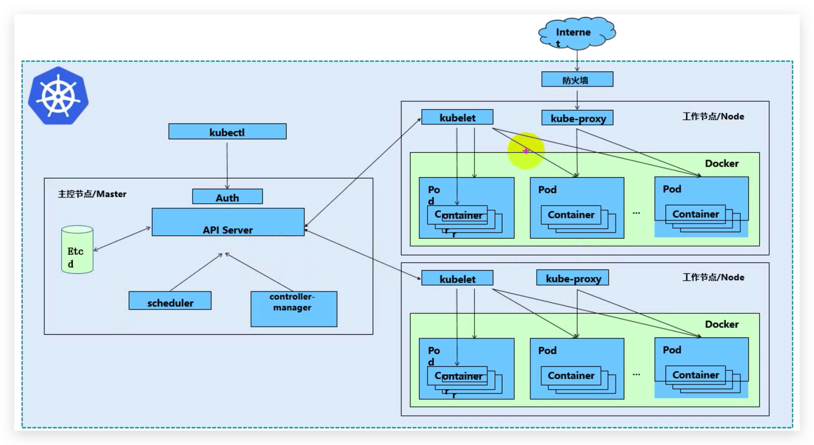
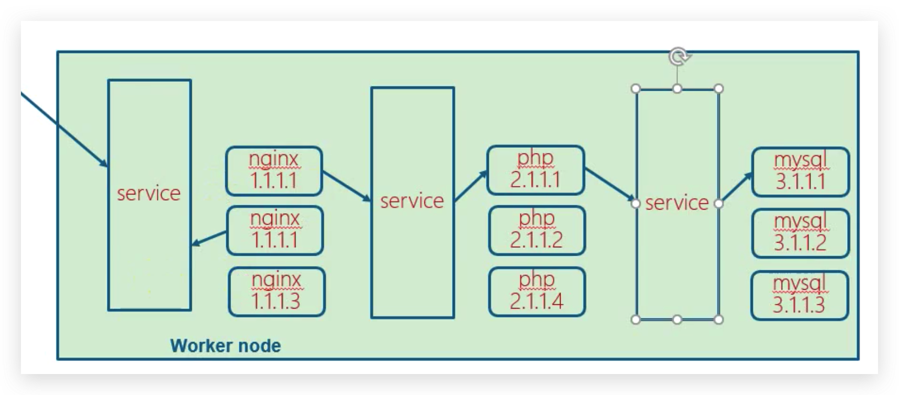
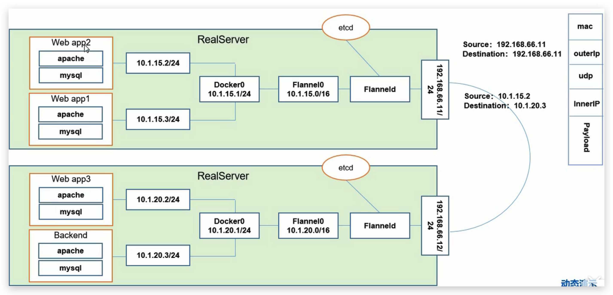

# Kubernetes

## 概念

-   k8s是一组服务器集群，管理集群节点上的Docker容器

## 功能

- 自我修复
- 弹性伸缩
- 自动部署
- 回滚
- 服务发现和负载均衡
- 机密和配置共享管理

## 架构



- k8s集群节点分为两类：master node和worker node
- master node组件
  - apiserver：集群统一入口，接收客户端操作k8s的指令。所有对象资源的CRUD和监听操作都交给apiservice处理后再提交给etcd存储。可以水平扩展提高性能。
  - scheduler：从多个worker node中选举一个启动服务
  - controller manager：运行了所有的控制器，逻辑上来说，每一个控制器是一个独立的进程，但是为了降低复杂度，这些控制器都被合并运行在一个进程里
  - etcd：分布式键值存储系统，用于保存集群状态数据，比如Pod、Service对象信息
- worker node组件
  - kubelet：直接跟docker容器交互实现对容器的生命周期的管理。Kubelet不管理不是通过 Kubernetes 创建的容器
  - kubeproxy：维护docker容器的网络规则，负责写入规则到iptables、ipvs实现服务映射访问，是实现 Kubernetes Service 概念的重要部分
  - 容器引擎：容器引擎负责运行容器。Kubernetes支持多种容器引擎：Docker、containerd、cri-o、rktlet 以及任何实现了 Kubernetes容器引擎接口 的容器引擎

## 其它组件（Addons）

### DNS

### Dashboard

### ContainerResource Monitoring

### Cluster-level Logging

## 核心概念

### Pod

- k8s最小的部署单元
- 一个pod表示一组容器，又称容器组，可能包含一个或者多个容器，同一个pod中不同容器共享网络和数据卷

### Controllers

- 控制Pod启动、停止、删除

#### ReplicaSet：确保预期的Pod副本数量

#### Deployment：无状态应用部署

- k8s通过发布Deployment创建特定的容器实例，这个实例会被包含在Pod中运行
- Deployment 将指示 k8s 如何创建和更新应用程序的实例，master 节点将应用程序实例调度到集群中的具体的节点上
- 创建应用程序实例后，Kubernetes Deployment Controller 会持续监控这些实例。如果运行实例的 worker 节点关机或被删除，则 Kubernetes Deployment Controller 将在群集中资源最优的另一个 worker 节点上重新创建一个新的实例。**这提供了一种自我修复机制来解决机器故障或维护问题**

#### StatefulSet：有状态应用部署

#### DaemonSet：确保所有的Node运行在同一个Pod

#### Job：一次性任务

#### CronJob：定时任务

### Service



- Service 将外部请求路由到一组 Pod 中，它提供了一个抽象层，使得 Kubernetes 可以在不影响服务调用者的情况下，动态调度容器组（在容器组失效后重新创建容器组，增加或者减少同一个 Deployment 对应容器组的数量等）
- Service使用 Labels、LabelSelector(标签和选择器) 匹配一组 Pod

### Label

- 一组pod有一个统一的label，service通过label和一组pod进行关联的

### Namespace

用来隔离pod的运行环境，默认情况下，pod之间可以相互访问

- 为不同公司提供不同的pod运行环境
- 为开发环境、测试环境、生产环境分别提供不同的命名空间进行隔离

## 网络通讯



- 同一个Pod内部通讯
  - 同一个pod共享同一个网络命名空间，共享同一个linux协议栈

-  不同Pod之间通讯
  - 在同一个主机上，直接通过Docker0网桥转发，不需要经过flannel
  - 不在同一个主机上的需要通过flannel转发
- pod和service之间通讯
  - 由iptables或者lvs维护和转发
- pod到外网
- 外网到pod
  - 通过service

## 滚动更新


## 生产部署Kubernetes

### 单master

### 多master

### 实战流程

#### 初始化服务器

##### 关闭防火墙

```shell
systemctl stop firewalld
systemctl disable firewalld
```


##### 关闭selinux

```shell
# 临时关闭
setenforce 0
# 永久关闭
vi /etc/selinux/config
# 修改 SELINUX=disabled
```


##### 配置主机名

```shell
hostnamectl set-hostname 主机名
hostname
```


##### 配置hosts

##### 配置时间同步

```shell
# 选择一个节点作为时间同步的服务端。，剩下的为客户端
# 服务端配置
yum install -y chrony
vi /etc/chrony.conf
systemctl start chrony
systemctl enable chrony
#客户端配置
```


##### 关闭交换分区

```shell
# 临时关闭
swapoff -a
# 永久关闭
vim /etc/fstab
# 删除/dev/mapper/centos-swap swap这一行
# 验证是否已经关闭成功
free -m
# Swap一行如果全为0则表示关闭成功
```


