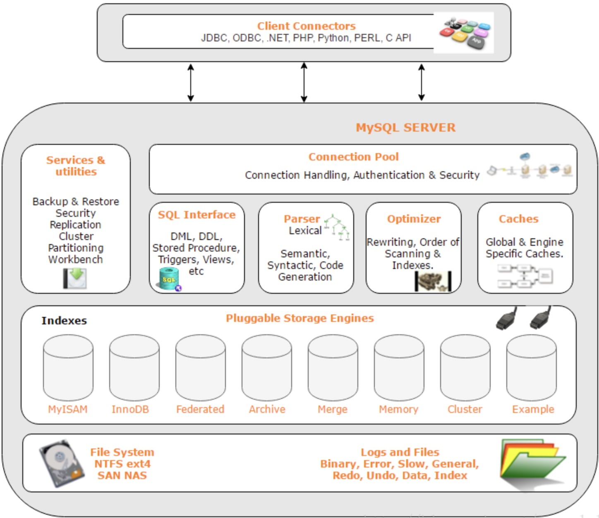
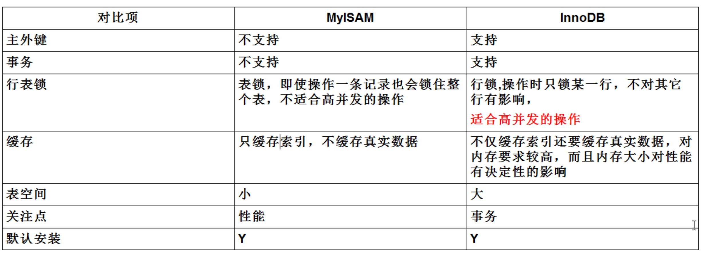
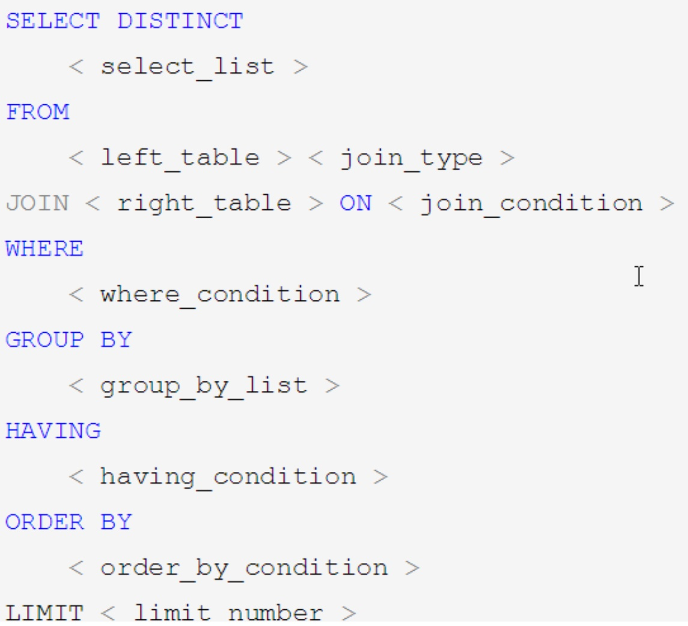
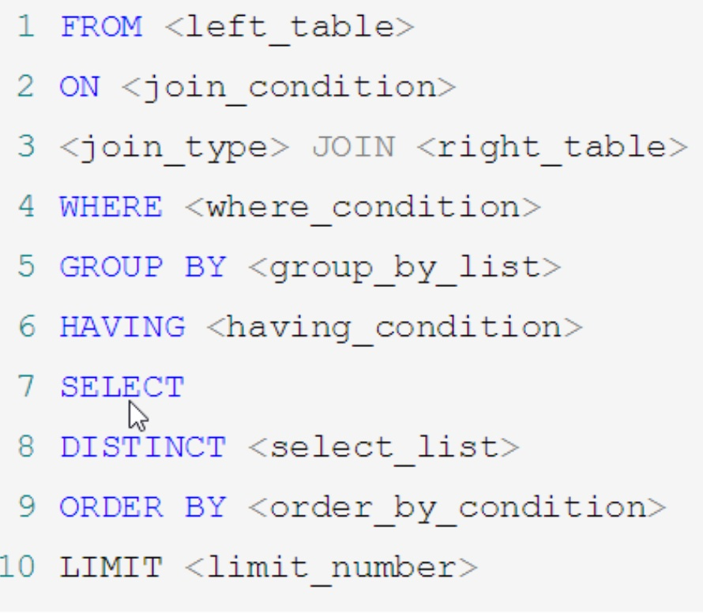
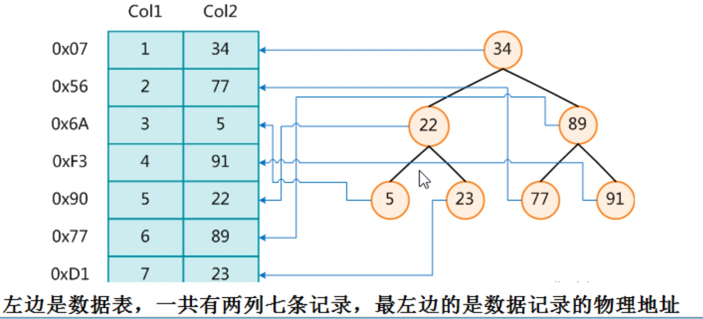
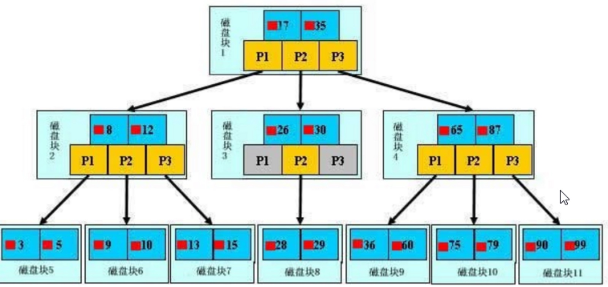
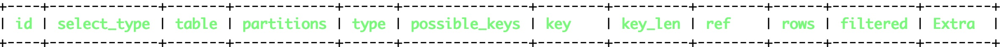
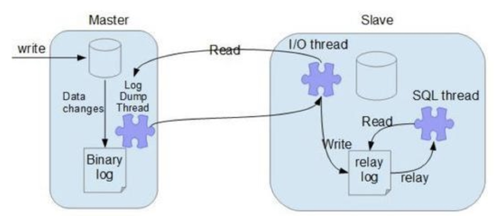

# MySQL

## 配置

### 字符集

- 查看MySQL字符集：`show variables like '%char%'`。默认MySQL数据库和服务端都是`latin1`字符集。

- 修改`my.cnf`配置

  ```
  [client]
  default-character-set=utf8
  [mysqld]
  character-set-server=utf8
  [mysql]
  default-character-set=utf8
  ```

- 修改字符集并重启MySQL，字符集生效。但是在修改字符集之前就创建的库字符集并不会做修改，需要重新建立。

### 常用配置

- `log-bin`:主从复制

- `log-error`:错误日志。记录严重错误和警告信息，启动和关闭详细信息。

- `log`：查询日志。记录查询的SQL语句。

## 文件结构

- `frm`文件：存放表结构

- `myd`文件：存放表数据

- `myi`文件：存放表索引

## 架构

### 插件式存储引擎

插件式的存储引擎结构将查询处理和其它系统任务以及数据存储提取分离。可以根据业务需求和实际需要选择合适的存储引擎。

- 连接层

  连接处理、授权认证及相关安全方案。

- 服务层

  核心服务功能。如SQL接口、缓存查询、SQL分析和优化、函数和存储过程调用。

- 引擎层

  真正负责数据的存储和提取。

- 存储层

  将数据存储在文件系统上。



### 存储引擎

- 分类

  - MyISAM
  - InnoDB

- 比较

  

  **说明：**

  - **MyISAM主要用在读操作，InnoDB主要用于写操作。**
  - **InnoDB相比于MyISAM最大的区别：行级锁和事务支持。**

- 查看当前存储引擎的命令

  ```sql
  show engines;  
  show variables like '%storage_engine%';
  ```
  
## Join

- SQL执行顺序

  - 手写

    

  - 机读

    

- 分类

  


## 索引

- 索引是帮助MySQL高效获取数据的**数据结构**，是**排好序**的**快速查找**数据结构。

  除了数据之外，数据库还维护着一个满足特定查找算法的数据结构，这些数据结构以某种方式指向数据，以使得可以高效查找数据。这种数据结构就是索引。

  

- 优点

  - 提高数据**检索**效率，降低**IO**操作成本。
  - 通过索引列对数据进行**排序**，降低排序成本，降低**CPU**消耗。

- 缺点

  - 索引会占用空间。
  - 索引会加快查询速度，但是会降低DML操作速度。因为DML操作的时候，不仅会修改表的数据，还会更新对应的索引。
  - 索引建立是需要通过优化的。

- 分类

  - 单值索引
  - 唯一索引
  - 复合索引

- 相关命令

  ```sql
  -- 创建索引
  CREATE [UNIQUE] INDEX index_name ON table_name (column_list)
  -- 普通索引
  ALTER TABLE table_name ADD INDEX index_name (column_list)
  -- 唯一索引
  ALTER TABLE table_name ADD UNIQUE (column_list)
  -- 主键索引
  ALTER TABLE table_name ADD PRIMARY KEY (column_list)
  -- 删除索引
  DROP INDEX index_name ON talbe_name
  ALTER TABLE table_name DROP INDEX index_name
  ALTER TABLE table_name DROP PRIMARY KEY
  -- 查看索引
  show index from tblname
  show keys from tblname
  ```

  

- 索引结构分为B+树、Hash索引等，主要使用B++树。

- 索引原理

  

一颗B++树中，浅蓝色的表示一个磁盘块，包含几个数据项（深蓝色）和指针（黄色）。真实数据全部保存在叶子节点数据项中，非叶子节点不存储真实数据，只存储指引搜索方向的数据项。B++树一般高度为三层，可以容纳上百万数据项，但是只需要3次IO操作，所以效率是很高的。

- 需要建立索引的情况

  - 主键自动会创建唯一索引
  - 频繁作为查询条件的字段
  - 查询中与其它表关联的字段，外键字段
  - 高并发下优先建立复合索引（相比于单值索引）
  - 排序字段（建立索引的顺序要与排序字段顺序一致）
  - 统计、分组字段

- 不需要建立索引的情况

  - 频繁更新的字段
  - where中用不到的字段
  - 表记录太少
  - 数据重复且分布均匀

## SQL优化

### SQL性能影响因素

- 查询SQL写的烂
- 索引失效
- 关联太多join
- 服务器参数调优及参数设置（线程数、缓冲大小等）

### MySQL性能瓶颈

- CPU
- IO
- 查看性能状态常用命令：top、free、iostat、vmstat

### explain

- 查看执行计划。可以使用explain模拟优化器执行SQL语句，知道MySQL是如何执行SQL语句的。分析表结构和SQL语句的性能瓶颈。

- 作用

  - 查看表的读取顺序（`id`字段）
  - 数据读取操作的操作类型（`select_type`字段）
  - 哪些索引可能被使用（`possible_keys`字段）
  - 哪些索引实际被使用（`key`字段）
  - 表之间的引用（`ref`字段）
  - 被优化器查询的记录行数（`rows`字段）

- 执行计划包含内容

  
  
  各个字段含义：
  
  - `id`
  
    表示执行顺序。相同的id从上向下执行，不同的id，id越大越先执行。
  
  - `select_type`
  
    查询类型，用来区别简单查询、联合查询、子查询。
  
    - `SIMPLE`：简单select语句，不包含子查询或UNION
    - `PRIMARY`：如果存在子查询，最外面一层标记为PRIMARY
    - `SUBQUERY`：WHERE或SELECT存在子查询部分
    - `DERIVED`：FROM中包含的子查询部分
    - `UNION`：UNION语句中第二个select语句
    - `UNION` RESULT：UNION返回结果的select语句
  
  - `table`
  
    这行数据是关于哪张表的。
  
  - `partitions`
  
  - `type`
  
    访问类型，一般至少达到`range`及以上。
  
    - `NULL`
  
      不需要扫描索引或者表就可以得到结果。
  
      ```sql
      explain select version(); 
      ```
  
    - `system`
  
      `const`的特例，所查询的表中只有一条记录。
  
      ```sql
      explain select * from (select * from emp where eid=1) t; 
      ```
  
    - `const`
  
      通过索引一次就能找到，一般`where`后面使用`primary key`或者`unique index`判断。因为只匹配确定的一行数据，速度很快。
  
      ```sql
      explain select* from emp where eid=1;  
      ```
  
    - `eq_ref`
  
      通常出现在多表的 join 查询，表示对于前表的每一个结果，都只能匹配到后表的一行结果，并且查询的比较操作通常是 =，查询效率较高。
  
      ```sql
      explain select * from a join b on a.id=b.id; 
      ```
  
    - `ref`
  
      此类型通常出现在多表的 join 查询，针对于非唯一或非主键索引，或者是使用了**最左前缀规则**索引的查询。
  
    - `range`
  
      使用索引范围查询，通过索引字段范围获取表中部分数据记录，性能比全表扫描好。一般是`where`中使用了between、in、<、>、IS NULL的查询。
  
    - `index`
  
      遍历索引树，一般比all要快。因为all是全表扫描，从硬盘读取。当是这种情况时, `Extra` 字段 会显示 `Using index`。
  
    - `all`
  
      扫描全表。  
  
  - `possible_keys`
  
    查询字段上面如果存在索引，会列出，但不一定会实际用到。
  
  - `key`
  
    实际使用的索引。如果为`NULL`，则没有使用到索引。
  
  - `key_len`
  
    索引中使用的字段长度。
  
  - `ref`
  
    显示索引中哪一列被引用了。
  
  - `rows`
  
    找到所需记录需要读取的行数。
  
  - `filtered`
  
  - `Extra`
  
    额外一些重要信息。如`Using filesort`、`Using temporary`、`Using index`等。

### 索引优化分析

- 索引分析

  - 单表

    ```sql
    +----+-------+-------+----------+-------+
    | id | aname | class | comments | level |
    +----+-------+-------+----------+-------+
    | 1  | a1    | 33    | yyyyyy   | 3     |
    | 2  | a2    | 11    | xxxxxx   | 2     |
    | 3  | a1    | 44    | zzzzzz   | 4     |
    | 6  | a2    | 55    | oooooo   | 4     |
    +----+-------+-------+----------+-------+
    select * from a where aname='a2' and level>2 order by class;
    1.不建立任何索引
    +----+-------------+-------+------+---------------+--------+---------+--------+------+-----------------------------+
    | id | select_type | table | type | possible_keys | key    | key_len | ref    | rows | Extra                       |
    +----+-------------+-------+------+---------------+--------+---------+--------+------+-----------------------------+
    | 1  | SIMPLE      | a     | ALL  | <null>        | <null> | <null>  | <null> | 4    | Using where; Using filesort |
    +----+-------------+-------+------+---------------+--------+---------+--------+------+-----------------------------+
    结论：type为ALL，并且出现Using filesort。
    2.创建复合索引
    create index idx_a_aname_level_class on a(aname,level,class);  
    +----+-------------+-------+-------+-------------------------+-------------------------+---------+--------+------+-----------------------------+
    | id | select_type | table | type  | possible_keys           | key                     | key_len | ref    | rows | Extra                       |
    +----+-------------+-------+-------+-------------------------+-------------------------+---------+--------+------+-----------------------------+
    | 1  | SIMPLE      | a     | range | idx_a_aname_level_class | idx_a_aname_level_class | 16      | <null> | 1    | Using where; Using filesort |
    +----+-------------+-------+-------+-------------------------+-------------------------+---------+--------+------+-----------------------------+
    结论：使用索引idx_a_aname_level_class，type优化为range，但是还是存在Using filesort。
    原因是根据最左匹配，aname和level使用到索引，但是由于level是范围，致使后面的字段的索引全部失效，所以class没有使用索引，只能通过filesort排序。
    3.重新创建复合索引
    create index idx_a_aname_class on a(aname,class); 
    +----+-------------+-------+------+-------------------+-------------------+---------+-------+------+-------------+
    | id | select_type | table | type | possible_keys     | key               | key_len | ref   | rows | Extra       |
    +----+-------------+-------+------+-------------------+-------------------+---------+-------+------+-------------+
    | 1  | SIMPLE      | a     | ref  | idx_a_aname_class | idx_a_aname_class | 12      | const | 2    | Using where |
    +----+-------------+-------+------+-------------------+-------------------+---------+-------+------+-------------+
    结论：type为ref，且没有filesort。
    ```

  - 两表

    联合join查询中，left join索引加在右表上，right join索引加在左表上。比如，left join，左表数据全部保留，所以关注点主要在右表。right join同理。

  - 三表

    遵循两表的原则。

    ```sql
    select * from a left join b on a.x=b.x left join c on c.x=b.x;
    -- 在b字段和c字段上添加索引
    ```
    
  - ORDER BY
    
    - MySQL排序有2种：filesort和index。前者性能较差，后者性能较好。
    
    - ORDER BY使用index排序的条件：
    
      - ORDER BY字段符合最左匹配原则。
      - ORDER BY字段和where字段组合起来符合最左匹配原则。
      - ORDER BY默认采用升序，ORDER BY后面各字段的排序规则需要统一，要不全部升序，要不全部降序，否则会出现filesort。
    
    - filesort有两种算法
    
      - 双路算法
    
        - 2次IO操作
    - 单路算法
      
      - 会将所有字段取出，在sort_buffer中1次排序IO操作，内存占用空间比双路要大。缺点是，如果sort_buffer不够大，会导致需要取多次才能完成排序，IO次数反而比双路算法更多。
      - 因此，**使用order by不要使用select ***，因为select *会将所有字段取出，更容易使sort_buffer空间占满，导致多次IO操作。
    - 优化方案
        - 增大`sort_buffer_size`
        - 增大`max_length_for_sort_data`
    
  - GROUP BY
    
    - 参考ORDER BY。
    
  - 结论
    
    - **永远小结果集驱动大结果集，减少外层循环总次数 。**
    
      ```sql
      select * from A where id in (select * from B);❶
      -- exists作用是，将前面的结果查出，并依次使用后面的条件过滤，保留结果为true的数据。
      select * from A where exists(select 1 from B where A.id=B.id);❷
      -- 结论：
      -- ❶语句中B表驱动A表，当A的数据量大于B时，性能比❷好。
      -- ❷中A驱动B，当A的数据量小于B时，性能比❷好。
      ```
    
    - 优先优化内层循环。
    
    - 保证join语句中被驱动表的join条件字段被索引。
    
    - 适当设置join buffer。 

- 索引失效

  - 全值匹配（个数和顺序）

  - **最佳左前缀匹配**

    **索引包含多列时，查询要从索引最左边列开始并且不要跳过索引中的列。**

  - 不要再索引列上做任何运算或者（显示或者隐式）类型转换，否则会导致索引失效全表扫描。

  - 存储引擎不能使用**索引中范围条件右边的列**。

  - 尽量使用**覆盖索引**，避免使用select *，尽量保证**查询列和索引列一致或者是索引列的子集**。

    ```sql
    explain select * from a where aname='a2' and level>=4; 
    -- 修改为
    explain select aname,level,class from a where aname='a2' and level>=4; 
    -- 后
    -- type由range变为ref，并且Using index，直接从索引上获取数据
    ```

  - 使用不等于(!=或者<>)、is(not) null索引会失效

  - 用or连接也会失效

  - like中通配符**%开头**索引也会失效（如果一定要使用%开头，可以使用**覆盖索引**避免ALL全表扫描）

    ```sql
    explain select * from a where aname='a2';                                                            
    +----+-------------+-------+------+-------------------------+-------------------------+---------+-------+------+-------------+
    | id | select_type | table | type | possible_keys           | key                     | key_len | ref   | rows | Extra       |
    +----+-------------+-------+------+-------------------------+-------------------------+---------+-------+------+-------------+
    | 1  | SIMPLE      | a     | ref  | idx_a_aname_level_class | idx_a_aname_level_class | 12      | const | 2    | Using where |
    +----+-------------+-------+------+-------------------------+-------------------------+---------+-------+------+-------------+
    explain select * from a where aname like 'a2%';                                                      
    +----+-------------+-------+-------+-------------------------+-------------------------+---------+--------+------+-------------+
    | id | select_type | table | type  | possible_keys           | key                     | key_len | ref    | rows | Extra       |
    +----+-------------+-------+-------+-------------------------+-------------------------+---------+--------+------+-------------+
    | 1  | SIMPLE      | a     | range | idx_a_aname_level_class | idx_a_aname_level_class | 12      | <null> | 2    | Using where |
    +----+-------------+-------+-------+-------------------------+-------------------------+---------+--------+------+-------------+
    explain select * from a where aname like '%a2';                                                      
    +----+-------------+-------+------+---------------+--------+---------+--------+------+-------------+
    | id | select_type | table | type | possible_keys | key    | key_len | ref    | rows | Extra       |
    +----+-------------+-------+------+---------------+--------+---------+--------+------+-------------+
    | 1  | SIMPLE      | a     | ALL  | <null>        | <null> | <null>  | <null> | 4    | Using where |
    +----+-------------+-------+------+---------------+--------+---------+--------+------+-------------+
    explain select aname from a where aname like '%a2';                                                  
    +----+-------------+-------+-------+---------------+-------------------------+---------+--------+------+--------------------------+
    | id | select_type | table | type  | possible_keys | key                     | key_len | ref    | rows | Extra                    |
    +----+-------------+-------+-------+---------------+-------------------------+---------+--------+------+--------------------------+
    | 1  | SIMPLE      | a     | index | <null>        | idx_a_aname_level_class | 28      | <null> | 4    | Using where; Using index |
    +----+-------------+-------+-------+---------------+-------------------------+---------+--------+------+--------------------------+
    ```

  - 索引列类型为字符串，如果不加单引号，会发生隐式类型转换，导致索引失效。

- 其它

  - 索引范围内，定值条件不同顺序不影响索引使用。MySQL会自动优化。如果出现范围条件，则范围前面的会用到索引，后面的不会使用索引。

    ```sql
    -- 比如：
    create index idx_a_aname_level_class on a(aname,level,class);
    -- 以下两条SQL，class，aname，level都会使用到该索引
    explain select * from a where class='55'and aname='a2' and level=4; 
    explain select * from a where aname='a2' and class='55' and level=4;
    -- 只有aname，level使用索引
    explain select * from a where aname='a2' and level>3 and class='55';
    -- MySQL会先做优化，将索引顺序改成aname，level，class，都会使用索引
    explain select * from a where aname='a2' and class>='55'and level=4 ;
    -- aname会用到索引查找，level会用到索引排序
    explain select * from a where aname='a2' and class='55' order by level; 
    -- aname会用到索引，但是会出现Using filesort，因为level断了
    explain select * from a where aname='a2'order by class; 
    -- order by顺序和索引不一致，出现Using filesort
    explain select * from a where aname='a2'order by class,level;
    -- 尽管order by顺序和索引不一致，但是level是一个常量，所以不会出现Using filesort
    explain select * from a where aname='a2' and level=1 order by class,level; 
    -- group by类比order by，aname会用到索引，level,class会排序，不用出现Using filesort
    explain select * from a where aname='a2' group by level,class;
    -- 会出现Using temporary; Using filesort
    explain select * from a where aname='a2' group by class,level; 
    -- level是一个常量，不会出现Using temporary; Using filesort
    explain select * from a where aname='a2' and level=1 group by class,level;  
    -- %放在右侧并不会导致索引链断开，所以class，aname，level都会使用到该索引
    explain select * from a where aname like 'a%' and class='55'and level=4;
    ```

### 查询截取分析

####  总体思路

- 慢查询开启捕获
- `explain`+慢查询分析
- `show profile`查询SQL的生命周期和执行细节
- MySQL服务器参数调优

#### 慢查询

- 记录超过`long_query_time`的SQL语句。默认10s。

- 开启关闭功能。默认关闭，因为开启慢查询会带来性能影响。

  ```sql
  -- 查看
  show variables like '%slow_query%'
  -- 开启（只对当前数据库生效，要永久生效需要配置在my.cnf）
  set global slow_query_log=1; 
  -- 查看最大容忍时间
  show variables like '%long_query_time%';  
  -- 设置最大容忍时间
  set global long_query_time=5;
  -- 查看慢查询总条数
  show global status like '%Slow_queries%';
  ```

- `mysqldumpslow`工具使用

#### show profiles

- 默认关闭，使用时需要开启。

```sql
show variables like '%profiling%'; 
set profiling=on;
show profile all for query 2; 
```

- 主要关注一下指标：
  -  converting heap to myisam
  - creating tmp table
  - copying to tmp table on disk
  - locked

#### 全局查询日志

- 开启后将会记录所有执行过的SQL语句，不要在生产环境使用。

```sql
show variables like '%general_log%';
set global general_log=1;
set global log_output='TABLE';
```

## 锁

### 分类

- 读锁和写锁

  - 多个读锁可以同时进行，不会相互影响。
  - 一个写操作完成之前会阻塞所有其他的读操作和写操作。

- 行锁和表锁

  - 表锁

    偏向MyISAM引擎，开销小，加锁快，不会出现死锁。锁粒度大，锁冲突概率大，并发度低。适合读操作多的场景。

  - 行锁

    偏向InnoDB引擎，开销大，加锁慢，锁粒度小，锁冲突概率小，并发度高。适合写操作多的场景。
### 案例

#### MyISAM表锁

```sql
-- 查看表加锁情况
show open tables; 
-- 给x表加写锁，a表加读锁
lock table x write, a read; 
-- 释放锁
unlock tables;
```

- 读锁

  ```sql
  session1：
  lock table a read; 
  -- 成功，可以读a表
  select * from a;
  -- 报错，解锁之前不能操作其它表
  select * from b;
  -- 报错，解锁之前不能修改加读锁的表
  update a set level=4 where id=6;
  
  session2：
  -- 成功，可以读a表
  select * from a;
  -- 成功，可以读其它表
  select * from b;
  -- 会阻塞，直至session1释放read锁
  update a set level=4 where id=6;
  ```

- 写锁

  ```sql
  session1：
  lock table a write; 
  -- 成功，可以读a表
  select * from a;
  -- 报错，解锁之前不能操作其它表
  select * from b;
  -- 成功，可以修改a表
  update a set level=4 where id=6;
  
  session2：
  -- 阻塞，直至session1释放write锁 
  -- 会有缓存，测试时更换id
  select * from a where id=4;
  -- 成功，可以读其它表
  select * from b;
  -- 会阻塞，直至session1释放write锁
  update a set level=4 where id=6;
  ```

#### InnoDB行锁

```sql
-- 查看行锁状态
show status like '%row_lock%';
```

```sql
session1：
insert into y value(1,'y1'),(2,'y2');
begin;
update y set yname='y3' where id=1; 
session2：
-- 阻塞，直至session1 commit
update y set yname='y4' where id=1;
-- 不会阻塞
update y set yname='y4' where id=2;
```

- 需要注意：

  - InnoDB行锁是通过给索引上的索引项加锁来实现的，**只有通过索引条件检索数据，InnoDB才使用行级锁，否则，InnoDB将使用表锁**。

  - 因此，索引失效会导致行锁升级成为表锁。
  
    ```sql
    +----+-------+
    | id | yname |
    +----+-------+
    | 1  | 1     |
    | 2  | 2     |
    +----+-------+
    session1：
    begin;
    update y set id=3 where yname=1;
    session2：
    -- 会阻塞，因为session1中yname=1出现了隐式格式转换，导致行锁升级成为表锁。
	  update y set id=4 where yname=2;
	  ```
	  
	- 	间隙锁
		
		当使用范围条件而不是相等条件检索数据，并且请求锁时，InnoDB会将该范围内所有记录都会加锁，无论记录存不存在。因此，有的时候，间隙锁会给系统带来一些性能问题。
		
		```sql
		+----+-------+
		| id | yname |
		+----+-------+
		| 1  | 1     |
		| 2  | 2     |
		+----+-------+
		
		session1：
		begin;
		update y set yname='3' where id>0;
		session2：
		-- 阻塞，因为session1中id>0会将所有该范围中的记录，不管是否存在，都会加锁。
		insert into y value (3,'y1');
		```
		
	- `select for update`
	
	  - 乐观锁和悲观锁
	
	    ```sql
	    -- 悲观锁
	    -- 适合写操作多的场景
	    begin;
	    select * from TABLE where id = 1 for update;
	    update TABLE set value=1 where id = 1;
	    commit;
	    
	    -- 乐观锁
	    -- 适合读操作多的场景
	    -- 默认不加锁
	    select id,value,version from TABLE where id=#{id}
	    begin;
	    update TABLE
	    set value=2,version=version+1
	    where id=#{id} and version=#{version};
	    commit;
	    ```
	
	    
### 事务

#### ACID

#### 并发事务问题

#### 事务隔离级别

## 主从复制 

### 原理



- 当从节点连接主节点时，主节点会创建一个log dump 线程，用于发送bin-log的内容。在读取bin-log中的操作时，此线程会对主节点上的bin-log加锁，当读取完成，甚至在发送给从节点之前，锁会被释放。
- 当从节点上执行`start slave`命令之后，从节点会创建一个I/O线程用来连接主节点，请求主库中更新的bin-log（从指定日志文件file的指定位置position之后的日志内容）。I/O线程接收到主节点binlog dump 进程发来的更新之后，保存在本地relay-log中，并将读取到的binary log文件名和位置保存到master-info 文件中，以便在下一次读取时回复master。
- SQL线程负责定时读取relay log中的更新内容，解析成具体的操作并执行，最终保证主从数据的一致性。