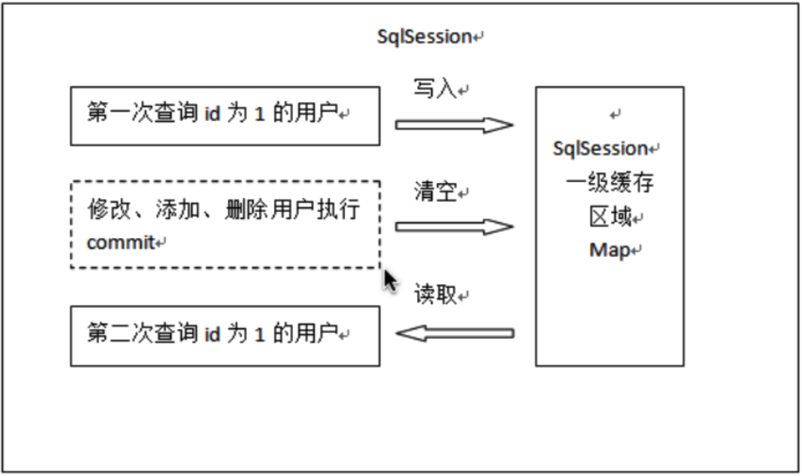
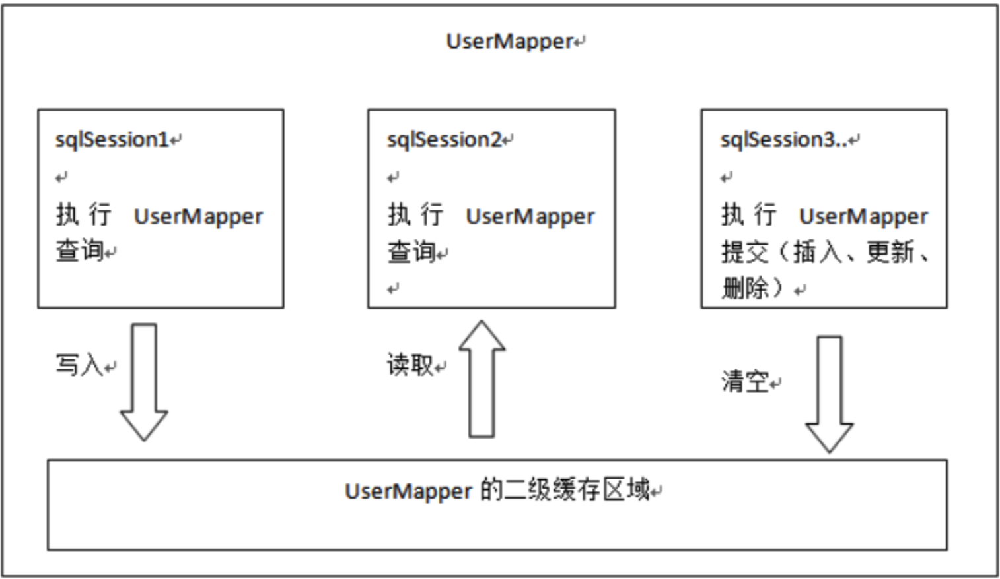
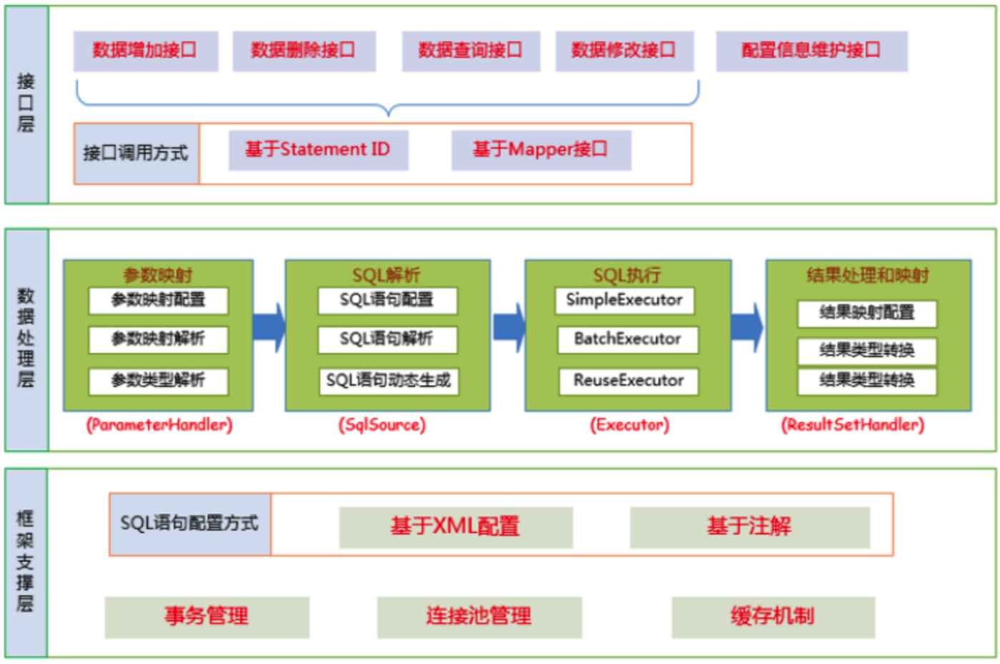
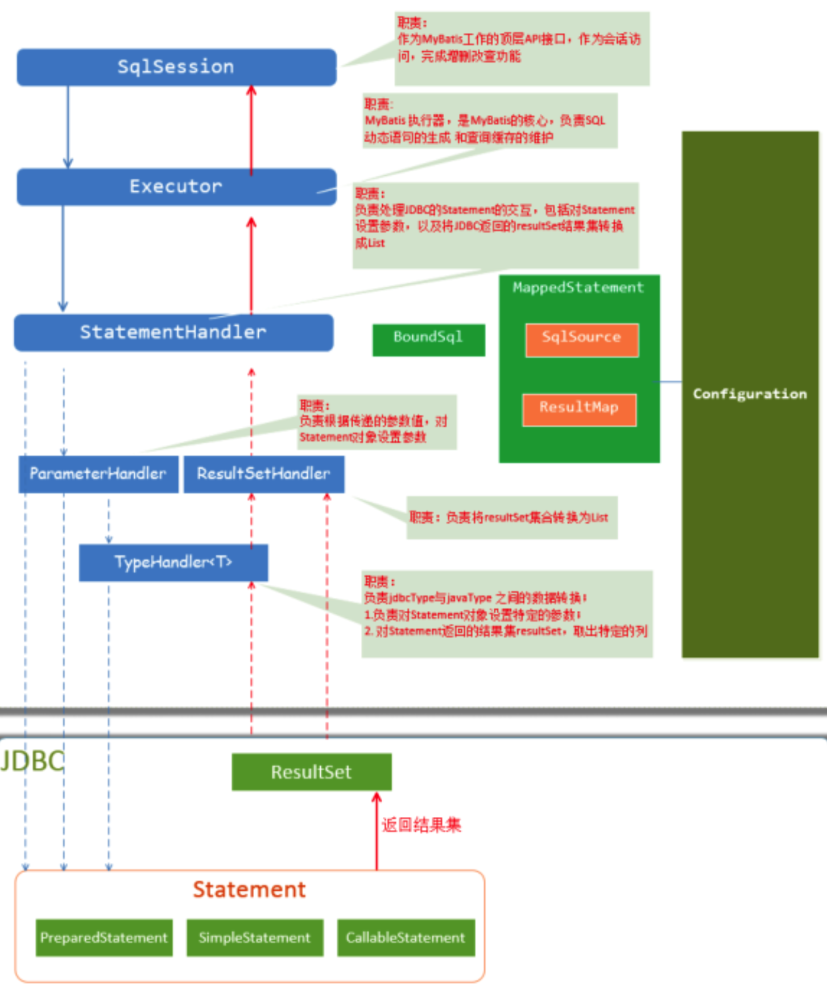

# Mybatis

## JDBC开发问题

- 数据库连接创建、释放频繁造成系统资源浪费
-  Sql语句在代码中硬编码
- 使用preparedStatement向占有位符号传参数存在硬编码
- 对结果集解析存在硬编码(查询列名)

## 解决问题的思路

- 使用数据库连接池初始化连接资源
- 将数据库配置和SQL配置提取到挖外部XML文件中，实现配置和java代码分离
- 使用反射、内省等底层技术，自动将实体与表进行属性与字段的自动映射

## 缓存

### 一级缓存



- 一级缓存是SqlSession级别的缓存，每个SqlSession的具体SQL执行工作交给Executor执行，每个Executor（具体实现是BaseExecutor）中维护了一个PerpetualCache类型的缓存对象，本质是HashMap实现，key是由MappedStatementId、parameterObject、rowBounds、boundSql以及environment几个因素构成
- 当执行query()操作时，会先根据CacheKey查询一级缓存，如果查询到数据则直接返回，否则会走数据库查询
- 当执行update()或者commit()操作时，会清空一级缓存

### 二级缓存



- 二级缓存是namespace(Mapper接口)级别的缓存，多个sqlSession可以共享一个mapper中的二级缓存区域，相同Mapper中的 MappedStatement共用一个Cache
- 可以通过实现Cache接口自定义二级缓存实现，Mybatis默认的二级缓存实现是PerpetualCache，淘汰策略是LruCache，二级缓存实现在CachingExecutor中
- 查询流程是先走二级缓存，二级缓存未命中再走一级缓存，一级缓存也未命中再走数据库查询。具体代码在CachingExecutor的query()中
- 二级缓存的生效需要调用SqlSession的commit()或者close()。原因：每个MappedStatement中都会持有一个Cache对象，而MappedStatement又是维护在全局配置Configuration类中，会导致有多个session同时获取操作缓存，若不加以控制，多个事务共用一个缓存实例，会导致脏读问题。所有需要引入TransactionalCacheManager（tcm），在tcm中维护了每一个Cache以及对应的TransactionalCache的映射，真正处理缓存操作是TransactionalCache。
- 当开启二级缓存开关时，具体的查询会通过CachingExecutor.query()完成。如果二级缓存未命中，会走数据库查询，但是并没有立刻将查询的结果放入二级缓存中，因为这样其它事务有可能会读到当前事务未提交的数据，导致脏读，而是将其缓存在TransactionalCache维护的entriesToAddOnCommit中保存。只有当调用SqlSession的commit()或者close()时，会触发调用tcm.commit()，而在这里面tcm最终会将之前缓存在entriesToAddOnCommit中的数据刷入到二级缓存，二级缓存才得以生效

## 延迟加载

### 配置

- 核心配置中设置lazyLoadingEnabled=true实现全局配置
- 在association和collection标签中都有一个fetchType属性，通过修改它的值，可以修改局部的加载策略
- 局部配置优先于全局配置

### 原理

- Mybatis的查询结果是由ResultSetHandler接口的handleResultSets()方法处理的。在处理结果集时，会判断如果属性配置了嵌套查询并且开启了延迟加载，就会使用javassist创建返回代理对象，当真正调用代理对象的getter()获取属性时才会真正的发起延迟数据的加载。具体的处理逻辑在DefaultResultSetHandler的createResultObject()中

## 插件

### Plugin机制原理

- 所有的Mybatis的Plugin本质是AOP拦截器，需要实现Interceptor接口，并且加上@Intercepts注解，表明需要拦截的Mybatis组件（Executor、StatementHandler、ParameterHandler、ResultSetHandler）以及对应拦截的方法
- MyBatis在启动时会加载配置的Plugin，并保存Plugin实例到相关对象(InterceptorChain，拦截器链) 中。 待准备工作做完后，MyBatis处于就绪状态
- MyBatis的内部组件（Executor、StatementHandler、ParameterHandler、ResultSetHandler）创建的时候会使用动态代理创建对应的代理对象，并且会通过调用interceptorChain.pluginAll(parameterHandler)将所有配置的拦截器应用到组件上，最后返回的是一个经过Plugin chain层层代理包装后的代理对象
- 我们在执行SQL操作时，MyBatis的组件（如Executor） 具体方法会被触发，从而进入Plugin代理的逻辑，实现功能扩展

## 架构及核心组件





## 源码剖析

### 传统方式

#### 初始化

```java
Inputstream inputstream = Resources.getResourceAsStream("mybatis-config.xml");
SqlSessionFactory factory = new SqlSessionFactoryBuilder().build(inputStream);
```

- 初始化主要完成工作是使用XMLConfigBuilder解析Mybatis的核心配置和SQL配置文件，并且将创建Configuration对象，将解析的xml数据封装到Configuration中，其中mapper.xml中的每一个select/update/insert/delete节点都会创建一个MappedStatement对象与之对应，并且会将所有的MappedStatement缓存在Configuration的mappedStatements属性中，mappedStatements 是一个HashMap，存储时key是全限定类名（namespace）+方法名（sql id），value是对应的MappedStatement对象。同时根据封装好的Configuration创建DefaultSqlSessionFactory

#### 执行SQL

```java
SqlSession sqlSession = factory.openSession();
List<User> list = sqlSession.selectList("com.lagou.mapper.UserMapper.getUserByName");
```

- SqlSessionFactory的openSession主要完成的工作是，根据默认的ExecutorType创建Executor对象（默认是SimpleExecutor实现）， 如果开启二级缓存，则会使用CachingExecutor包装对象。然后再通过配置的所有的拦截器包装，返回包装后的Executor代理对象，并通过前面解析创建好的Configuration对象和Executor创建DefaultSqlSession
- SqlSession的selectList()主要逻辑是根据传入的statementId从Configuration中缓存的MappedStatement Map中获取对应的MappedStatement对象，然后调用executor.query()方法执行真正的SQL操作
- executor.query()方法主要逻辑是解析替换Mybatis的占位符为JDBC的?占位符返回BoundSql对象，并且通过MappedStatement,parameterObject, RowBounds, BoundSql创建用于缓存的CacheKey，然后会先从一级缓存中获取数据，如果获取不到再通过StatementHandler发起真正的数据库查询请求
- StatementHandler主要通过ParameterHandler来处理SQL查询参数，以及通过ResultHandler来处理查询返回的结果集

### Mapper代理方式

```java
public static void main(String[] args) {
  //前三步都相同
  InputStream inputStream = Resources.getResourceAsStream("sqlMapConfig.xml");
  SqlSessionFactory factory = new SqlSessionFactoryBuilder().build(inputStream);
  SqlSession sqlSession = factory.openSession(); 
  //这里不再直接调用SqlSession的api,而是获得了接口对象，调用接口中的方法。
  UserMapper mapper = sqlSession.getMapper(UserMapper.class);
  List<User> list = mapper.getUserByName("tom");
}
```

- 在Mybatis初始化解析配置时，当解析到mappers标签时，会判断如果是接口时，会给每个Mapper接口创建对应的MapperProxyFactory对象，并且将其缓存在MapperRegistry的knownMappers的属性中，而MapperRegistry也被维护在Configuration成员属性中
- 调用sqlSession.getMapper()时，会根据传入的Mapper接口，从Configuration的MapperRegistry中获取到对应的MapperProxyFactory代理工厂类，并调用其newInstance()通过JDK动态代理为Mapper接口生成一个代理实现类
- 当调用Mapper中的方法（除了Object自带的方法）时，会被代理执行，执行逻辑在MapperProxy的invoke()中
- MapperProxy的invoke()会委托PlainMethodInvoker的invoke()完成具体的执行逻辑，主要是通过调用MapperMethod的execute()，里面会通过判断执行SQL的类型进行具体的SQL执行操作

## MybatisPlus

### BaseMapper SQL注入原理

- MybatisPlus初始化解析mapper配置的时候，会依次调用MybatisConfiguration.addMapper()、MybatisMapperRegistry.addMapper()为每一个Mapper接口创建对应的MybatisMapperProxyFactory，同时，会调用MybatisMapperAnnotationBuilder.parse()，在该方法中会判断如果实现了BaseMapper接口，最终会调用DefaultSqlInjector.inspectInject()，在该方法中，会获取到BaseMapper内置的这些方法所对应的AbstractMethod集合，依次调用各自的inject()，最终通过MapperBuilderAssistant.addMappedStatement()将这些基本的CRUD API注入到Mybatis中

