# Netty

## IO模型

### 阻塞、非阻塞、多路复用

- 阻塞会导致线程暂停，虽然不占用CPU，但是线程资源闲置浪费

- 非阻塞不会导致线程暂停，可以使用一个线程同时处理多个IO事件。但是会导致当没有任何IO事件时，CPU也在空转，资源白白浪费

- 基于Selector多路复用技术，可以实现用一个线程完成同时对多个IO事件处理，并且保证只有发生了IO事件才去处理，不会导致CPU资源白白浪费。**只有网络channel才能使用多路复用，文件channel不能使用**

### BIO

- 同步阻塞。默认情况下，ServerSocketChannel的accept()和SocketChannel的read()和write()方法都是阻塞的，只有当有真正的连接请求和读写请求时线程才会恢复运行

### NIO

- 同步非阻塞。调用ServerSocketChannel和SocketChannel的configureBlocking(false)，则ServerSocketChannel的accept()和SocketChannel的read()和write()方法都会变为非阻塞的。但是这样的话，会导致Channel中没有IO事件时，线程也会不断轮询，造成CPU资源浪费。所以引入Selector，Selector底层对应于Linux系统中的Epoll，在Selector中会维护两个列表，所有注册的Channel列表，以及有IO事件发生的Channel列表。当调用Selector的select()方法时，会检查有IO事件发生的Channel列表，如果没有Channel发生IO事件，则select()会阻塞，有任何IO事件发生，select()会继续运行

#### Selector

##### 代码

```java
public class NioServer {
    public static void main(String[] args) throws Exception {
        Selector selector = Selector.open();
        ServerSocketChannel serverSocketChannel = ServerSocketChannel.open();
        serverSocketChannel.socket().bind(new InetSocketAddress(6666));
        serverSocketChannel.configureBlocking(false);//通道设置为非阻塞模式
        serverSocketChannel.register(selector, SelectionKey.OP_ACCEPT);//将serverSocketChannel注册到selector上，并且其监听OP_ACCEPT事件
        while (true) {
            //如果有未处理的IO事件，selector.select()不会阻塞，
            //如果没有未处理的IO事件，selector.select(100)会等待100ms会继续运行
            if (selector.select(100) == 0) {
                continue;
            }
            //如果不为0，则将有事件发生的SelectionKey集合返回，并遍历各个SelectionKey，根据不同的事件分别进行对应的处理
            Set<SelectionKey> selectedKeys = selector.selectedKeys();
            Iterator<SelectionKey> iterator = selectedKeys.iterator();
            while (iterator.hasNext()) {
                SelectionKey key = iterator.next();
                //如果是OP_ACCEPT事件，则使用ServerSocketChannel的accept()为每一个客户端创建对应的SocketChannel，并将其也注册到selector上，并且其监听OP_READ事件
                if (key.isAcceptable()) {
                    SocketChannel socketChannel = serverSocketChannel.accept();
                    System.out.println("一个客户端连接[" + socketChannel.socket().getRemoteSocketAddress() + "]");
                    socketChannel.configureBlocking(false);//通道设置为非阻塞模式
                    socketChannel.register(selector, SelectionKey.OP_READ);
                }
                //如果是OP_READ事件，则通过SelectionKey获取与其关联的SocketChannel，并从里面读取数据
                if (key.isReadable()) {
                    SocketChannel socketChannel = (SocketChannel) key.channel();
                    System.out.println("接收到客户端[" + socketChannel.socket().getRemoteSocketAddress() + "]数据");
                    ByteBuffer buffer = ByteBuffer.allocate(10);
                    while (true) {
                        buffer.clear();
                        int read = socketChannel.read(buffer);
                        if (read == -1) {
                            break;
                        }
                        System.out.print(new String(buffer.array(), 0, read));
                    }
                }
                //处理事件后，Selector并不会自动删除该Channel，需要手动删除，否则下一次循环又会重新处理导致报错
                iterator.remove();
            }
        }
    }
}
```

#### Buffer

- 底层是数组实现的，既可以读取，也可以写入数据
- 除了boolean外的原始类型都有一个Buffer子类，最常用是ByteBuffer
- ByteBuffer的get()方法会自动往后移动position指针
- 只读ByteBuffer
- MappedByteBuffer
- Scattering和Gathering，即使用ByteBuffer数组读写数据。当往ByteBuffer数组读取或者写入数据时，会按照数组顺序依次读取或者写入
- ByteBuffer 支持类型化的 put 和 get, put 放入的是什么数据类型，get就应该使用相应的数据类型来取出，否则可能有 BufferUnderflowException异常
- 核心属性，大小关系为0 <= mark <= position <= limit <= capacity
  - capacity
    - 缓冲区的容量，最大容纳的元素个数，在缓冲区创建时指定，不能修改
  - limit
    - 不能读或写的第一个元素的索引，比如只允许读取缓冲区0到4的数据，limit就是5
  - position
    - 下一个将要读或者写的元素的索引，比如缓冲区已经存储0到4的数据，position就是5
  - mark
    - 标记，如果定义某个索引为mark，当调用reset()方法，position将会回到mark的位置。如果limit或者position调整到比mark小的位置，mark将会被清除

#### Channel

- 双向读写，可以异步读写数据
- 分类
  - FileChannel
  - DatagramChannel
  - ServerSocketChannel
  - SocketChannel
- channel和stream的比较
  - channel会利用系统的发送缓冲区和接收缓冲区功能
  - stream只支持阻塞API，channel同时支持阻塞和非阻塞API，还可以配合Selector实现多路复用
  - 两者都是全双工，读写操作可以同时进行

### AIO

- 异步非阻塞。它的特点是先由操作系统完成后才通知服务端程序启动线程去处理，一般适用于连接数较多且连接时间较长的应用。在Linux系统中AIO本质还是多路复用，性能并没有特别大的提升，编程复杂度变高，所以使用很少

### BIO、NIO、AIO 对比表

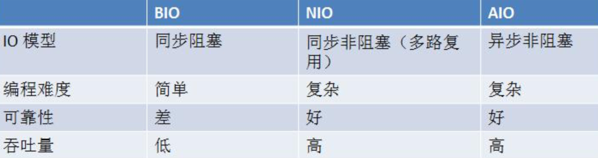

## 线程模型

### 传统阻塞 I/O

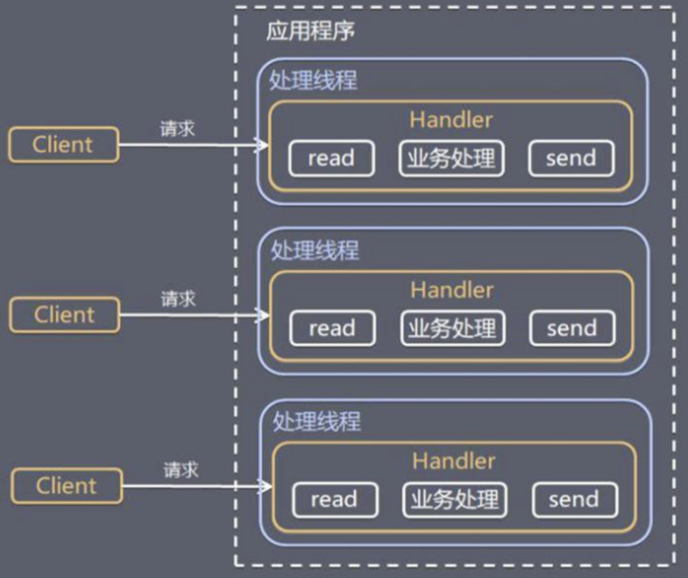

#### 特点

- 采用阻塞IO模式获取输入的数据
- 每个连接都需要独立的线程完成数据的输入，业务处理，数据返回

#### 缺点

- 当并发数很大，就会创建大量的线程，占用很大系统资源
- 连接创建后，如果当前线程暂时没有数据可读，该线程会阻塞在 read 操作，造成线程资源浪费

### Reactor 模式

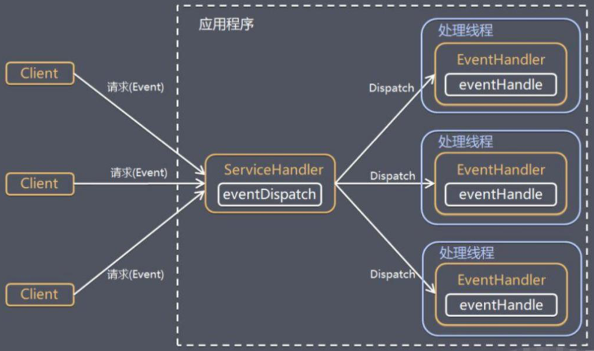

#### 特点

- **基于 I/O 复用模型**，多个连接共用一个阻塞对象，应用程序只需要在一个阻塞对象等待，无需阻塞等待所有连 接。当某个连接有新的数据可以处理时，操作系统通知应用程序，线程从阻塞状态返回，开始进行业务处理
- **基于线程池复用线程资源**，不必再为每个连接创建线程，将连接完成后的业务处理任务分配给线程进行处理，一个线程可以处理多个连接的业务

#### 核心角色

- Reactor
  - Reactor 在一个单独的线程中运行，负责监听客户端请求事件和分发事件，分发给适当的Handler来对 IO 事件处理，NIO中的Selector可以理解为Reactor
- Handler
  - 执行 I/O （Read或者Write）事件要完成的实际事件

#### 分类

##### 单 Reactor 单线程

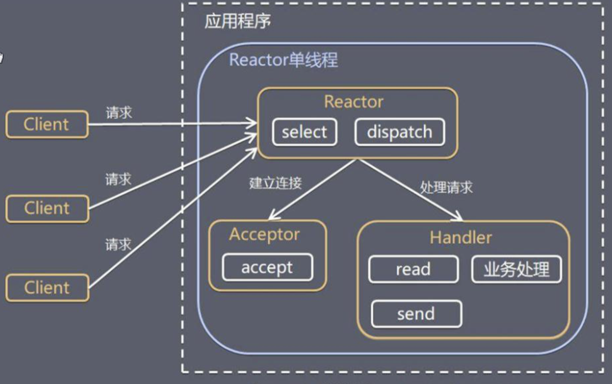

###### 特点

- Reactor 对象通过 Select 监控客户端请求事件，收到事件后通过 Dispatch 进行分发
- 如果是建立连接请求事件，则由 Acceptor 通过 Accept 处理连接请求，然后创建一个 Handler 对象处理连接完成后的后续业务处理
- 如果不是建立连接事件，则 Reactor 会分发调用连接对应的 Handler 来响应
- Handler 会完成 Read→业务处理→Send 的完整业务流程

###### 优缺点

- 优点：模型简单，没有多线程、进程通信、竞争的问题，全部都在一个线程中完成
- 缺点：性能问题，只有一个线程，无法完全发挥多核 CPU 的性能。Handler 在处理某个连接上的业务时，整个进程无法处理其他连接事件，很容易导致性能瓶颈。另外，线程意外终止，或者进入死循环，会导致整个系统通信模块不可用，不能接收和处理外部消息，造成节点故障

##### 单 Reactor 多线程

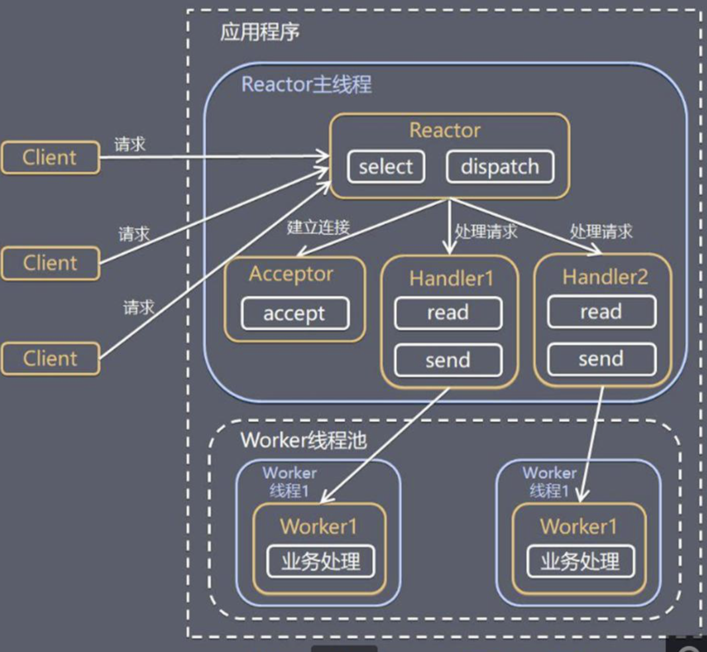

###### 特点

- 在单 Reactor 单线程基础上改进，handler 只负责响应事件，不做具体的业务处理, 通过 read 读取数据后，会分发给后面的 worker 线程池的某个单独线程处理业务逻辑

###### 优缺点

- 可以充分的利用多核cpu的处理能力，但是reactor处理所有的事件的监听和响应，在单线程运行，在高并发场景容易出现性能瓶颈

##### 主从 Reactor 多线程

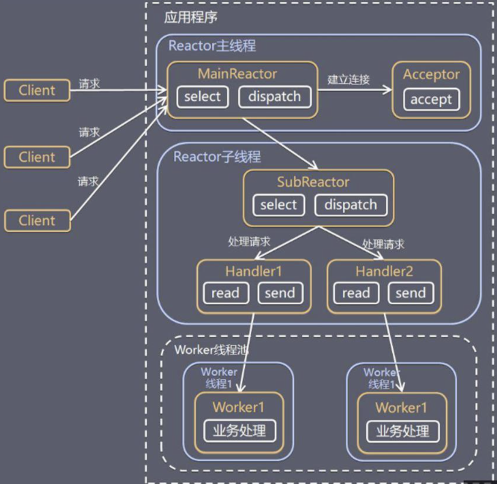

###### 特点

- 在单 Reactor 多线程基础上改进，将Reactor分为不同的线程组中，Reactor 主线程可以对应多个 Reactor 子线程，Reactor 主线程只负责处理连接事件，并将创建的连接分配给子Reactor线程，子Reactor线程完成具体的IO操作和业务处理

###### 优缺点

- 父线程与子线程的数据交互简单职责明确，父线程只需要接收新连接，子线程完成后续的业务处理，并且子线程无需返回数据给父线程，交互简单

## Netty架构设计

### 线程模型

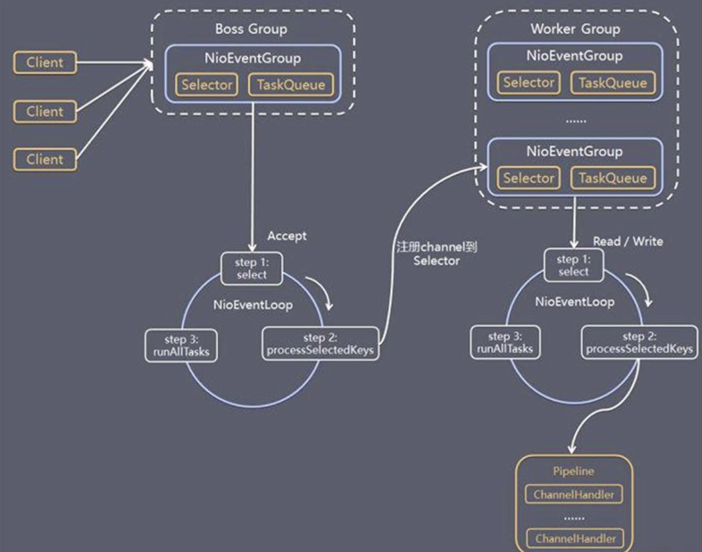

- Netty 主要基于主从 Reactor 多线程模型做了一定的改进，BossGroup 专门负责接收客户端的连接, WorkerGroup 专门负责网络的读写，BossGroup 和 WorkerGroup 类型都是 NioEventLoopGroup
- NioEventLoopGroup 相当于一个事件循环组, 这个组中含有多个事件循环 ，每一个事件循环是 NioEventLoop，NioEventLoop 表示一个不断循环的执行处理任务的线程， 每个 NioEventLoop 都有一个 selector , 用于监听绑定在其上的 socket 的网络通讯
- BossGroup中的每个NioEventLoop轮询 并处理accept 事件，与 client 建立连接 , 生成 NioScocketChannel , 并将其注册到某个 worker NIOEventLoop 上的 selector
- WorkerGroup中的每个NioEventLoop轮询 并处理read, write 事件。在处理IO事件时，每个Worker NIOEventLoop 处理业务时，会使用pipeline(管道), pipeline 中包含了 channel , 即通过pipeline 可以获取到对应通道, 管道中维护了很多的 处理器
- NioEventLoop 内部采用串行化设计，从消息的读取->解码->处理->编码->发送，始终由 IO 线程 NioEventLoop 负责

### 异步模型

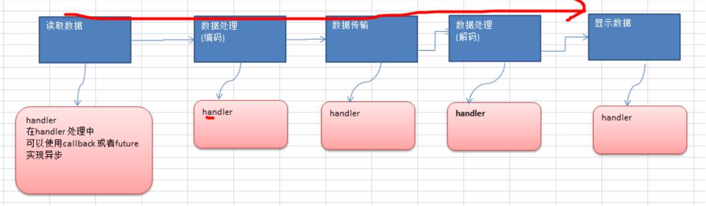

- Netty 的异步模型是建立在 future 和 callback 之上的
- 当 Future 对象刚刚创建时，处于非完成状态，调用者可以通过返回的 ChannelFuture 来获取操作执行的状态， 也可以注册监听器到 ChannelFuture 上，可以在 I/O 操作成功、失败或取消时回调通知调用方

## Netty核心组件

### Bootstrap、ServerBootstrap

- 配置整个 Netty 程序，串联各个组件，Netty 中 Bootstrap 类是客户端程序的启动引导类，ServerBootstrap 是服务端启动引导类

### Future、Promise

- netty的Future扩展自JDK的Future，JDK的Future只能同步等待执行结果，而netty的Future除了同步等待，还可以通过Listener异步返回结果

- Promise扩展自netty的Future，把异步执行结果的Future对象创建以及执行结果设置权交给用户线程自己，可以用来在两个线程之间传递结果的容器

### ChannelFuture

- connect()方法是一个异步操作，由main线程发起调用，真正执行是NIO线程，使用ChannelFuture的sync()或者addListener()来返回连接建立完成后的Channel

### Channel

#### 核心API

- close()
  
  - 关闭Channel，是一个异步操作

- closeFuture()
  
  - 异步关闭Channel后做一个回调功能，结合sync或者addListener方法使用完成对Channel的优雅关闭

- pipeline()

- write()、writeAndFlush()

### Selector

- Netty 基于 Selector 对象实现 I/O 多路复用，通过 Selector 一个线程监听并处理多个连接的 Channel 事件

### ChannelHandler

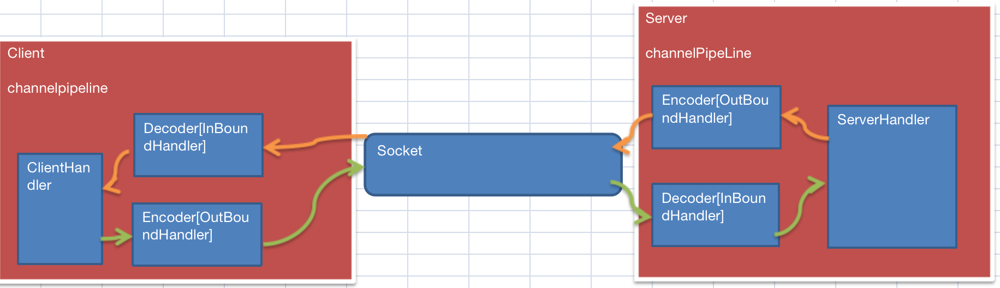

- 用来处理 I/O 事件或拦截 I/O 操作，并将其转发到其 ChannelPipeline(业务处理链) 中的下一个处理程序
- 分为ChannelInboundHandler和ChannelOutboundHandler，分别处理进站（read事件，主要是用来读取客户端请求数据，并做业务处理，写回结果）和出站事件（write事件，主要是对写回的结果进行处理，比如编码），ChannelDuplexHandler既可以处理进站，也可以处理出站事件
- 默认情况下，Handler的回调方法都是在IO线程中执行的，如果执行一些耗时任务，就会影响到IO线程处理IO事件的效率，可以在ChannelPipeline的add()系列方法中自己指定执行该Handler的EventLoopGroup
- 在执行ChannelPipeline中Handler链的回调方法时，如果这些Handler关联的是同一个EventLoop，那么会直接普通方法调用，如果是不同的EventLoop，则会将执行交给下一个Handler的EventExecutor

```java
static void invokeChannelRead(final AbstractChannelHandlerContext next, Object msg) {
        final Object m = next.pipeline.touch(ObjectUtil.checkNotNull(msg, "msg"), next);
        //获取下一个handler的EventLoop
        EventExecutor executor = next.executor();
        //如果下一个handler的EventLoop和当前的EventLoop是同一个
        if (executor.inEventLoop()) {
            next.invokeChannelRead(m);
        } else {
            //如果不是同一个，则会交给下一个handler的EventLoop处理
            executor.execute(new Runnable() {
                @Override
                public void run() {
                    next.invokeChannelRead(m);
                }
            });
        }
    }
```

- 同一个Handler有可能会被多个EventLoop共享，所以对于无状态的handler（添加了@sharable）可以创建一个实例供多个Channel的Pipeline共享使用，而对于有状态的Handler，则必须每一次添加使用每次new一个新的handler

### Pipeline 和 ChannelPipeline

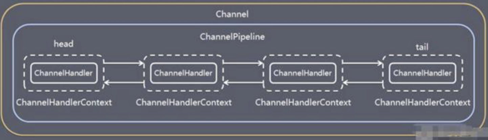

- 在 Netty 中每个 Channel 都有且仅有一个 ChannelPipeline 与之对应
- ChannelPipeline中维护了一个由ChannelHandlerContext组成的双向链表，每个ChannelHandlerContext中又关联一个ChannelHandler
- 入站处理器和出站处理器放置的是同一个ChannelPipeline，只是每一个ChannelHandlerContext会标识该ChannelHandler是出站还是入站。入站事件（read事件）会从head往后传递到最后一个入站处理器，出站事件（write事件）会从tail往前传递到最前一个出站处理器，两种类型的处理器互不干扰。**其中出站处理器只有当在Channel中发生数据写入操作时才会触发，如果是调用Channel的write()方法，则会从pipeline的tail节点往head节点遍历，如果是调用ChannelHandlerContext的write()方法，则会从pipeline的当前节点往head节点遍历**


### ChannelHandlerContext

- 保存Channel相关所有的上下文信息，同时关联一个ChannelHandler，所有的ChannelHandlerContext组成一个双向链表，在一个Handler中调用ctx的fireChannelRead(final Object msg)会将当前Handler中处理过的msg传递给pipeline中下一个ChannelInboundHandler处理

### ChannelOption

- 设置Channel参数

### EventLoopGroup

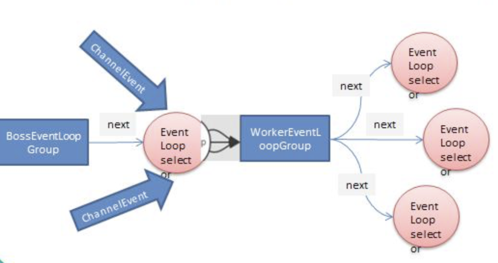

- EventLoopGroup包含多个EventLoop，每个EventLoop本质上是一个单线程池，维护一个Selector实例 ，一个线程对象，以及一个任务队列，EventLoop的作用就是用来不断循环处理Channel上的IO事件
- EventLoopGroup的主要实现有DefaultEventLoopGroup和NioEventLoopGroup。其中DefaultEventLoopGroup只能处理普通任务和定时任务，NioEventLoopGroup既可以处理普通任务和定时任务，也可以处理IO事件任务
- EventLoopGroup提供next()按照一定的算法获取组中某一个EventLoop，默认是采用轮询算法，可以自己实现EventExecutorChooserFactory接口扩展
- **Channel会调用EventLoopGroup的register方法来注册到其中的一个EventLoop上，以后该Channel中发生的所有IO事件都会交给该EventLoop处理，这样可以保证IO事件处理的线程安全问题**
- Boss EventLoopGroup通常为一个单线程EventLoop，维护一个注册了ServerSocketChannel的Selector，并不断轮询Selector的select()监听OP_ACCEPT事件，然后将得到的SocketChannel交给Worker EventLoopGroup,Worker EventLoopGroup根据next()确定其中一个EventLoop，并将该SocketChannel注册到其维护的Selector上，用来处理后续的IO事件

### ByteBuf

#### 特点


- ByteBuf和ByteBuffer最大的区别是，ByteBuffer内部只维护一个指针，所以读写操作切换时需要执行flip()。而ByteBuf内部维护了readerindex 和 writerIndex，因为不需要flip()

- ByteBuf可以自动扩容

- 实现池化技术，实现ByteBuf复用

- 很多API实现使用了零拷贝技术，提高了读写性能

- ByteBuf既支持堆内存，也支持直接内存，直接内存创建和销毁代价较大，但是读写性能高，适合配合池化技术使用。另外直接内存不受JVM管理，对GC压力小

#### 内存释放

- Netty采用引用计数法来回收各种ByteBuf实现的内存占用，所有的ByteBuf实现都实现了ReferenceCounted接口，该接口定义了内存回收策略

- 每个ByteBuf对象初始计数为1，每调用一下retain()，计数加一，每调用一下release()，计数减一，如果计数为0，则内存被回收

- 回收规则是，最后一个使用ByteBuf对象的Handler负责释放内存

- pipeline的HeadContext和TailContext中，如果msg实现了ReferenceCounted接口，会自动释放msg对象内存

#### 核心API


- slice()，对原始的ByteBuf切片，并且不会发生任何内存复制


- duplicate()，复制原始的ByteBuf，并且不会发生任何内存复制

- copy()，原始的ByteBuf的深拷贝操作，底层会发生内存复制

#### CompositeByteBuf

- 可以将多个ByteBuf的数据合并为一个ByteBuf，并且底层也不会发生内存复制

### Unpooled

- 操作ByteBuf工具类，wrappedBuffer()方法底层也是采用CompositeByteBuf，可以将多个ByteBuf的数据合并为一个ByteBuf

## Netty编解码器

### 编码和解码

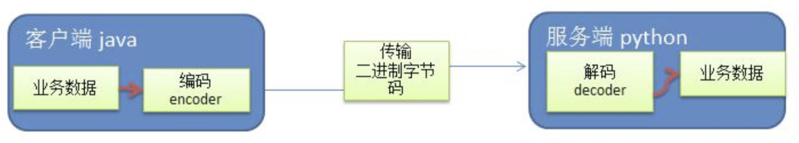

- encoder 本质是一个出站Handler，负责把业务数据转换成字节数据，decoder本质是一个入站Handler， 负责把字节码数据转换成业务数据

### Netty编解码器的问题

- Netty 自身提供了一些 codec(编解码器)，如StringEncoder（StringDecoder）、ObjectEncoder（ObjectDecoder）
- Netty自带的编解码器底层使用的是Java序列化技术，用因为存在无法跨语言、序列化后占用空间庞大、序列化性能差等问题

### 编解码器

#### ByteToMessageDecoder（ReplayingDecoder）

  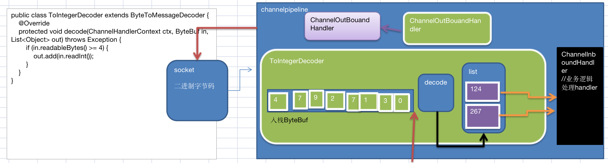

- decode()方法会被多次调用，直到缓冲区中没有新的数据，每一次decode 后会将本次decode的结果发给下一个Handler处理，然后继续调用decode()
- 解码器解码时需要判断缓冲区中数据是否足够，如果使用ReplayingDecoder则不需要判断

#### MessageToByteEncoder

- 如果接收的数据类型和处理的数据类型不一致，则会跳过Encoder的encode()处理
  
  ```java
  public boolean acceptOutboundMessage(Object msg) throws Exception {
          return matcher.match(msg);
  }
  
  @Override
  public void write(ChannelHandlerContext ctx, Object msg, ChannelPromise promise) throws Exception {
    ByteBuf buf = null;
    if (acceptOutboundMessage(msg)) {
      ...
        encode(ctx, cast, buf);
      ...
    } else {
      ctx.write(msg, promise);
    }
  }
  ```

#### FixedLengthFrameDecoder

- 定长解码器

- 优点：简单，缺点：浪费空间和带宽

#### LineBasedFrameDecoder

- 以换行符作为消息分隔符

- 缺点：需要一个字节一个字节查找分隔符才能确定消息边界，效率较低

#### LengthFieldBasedFrameDecoder

- 基于长度字段帧解码器

- 先根据lengthFieldOffset和lengthFieldLength解析出消息正文的长度，然后结合lengthAdjustment解析出消息正文，最后initialBytesToStrip确认是否保留消息头部

#### HttpServerCodec

- Http协议编解码器

#### IdleStateHandler

- 读写空闲Handler，服务端可以用来检测客户端连接假死的问题，客户端也可以用来定时给服务端发送心跳消息，保持和服务端的正常连接状态

## TCP拆包粘包

  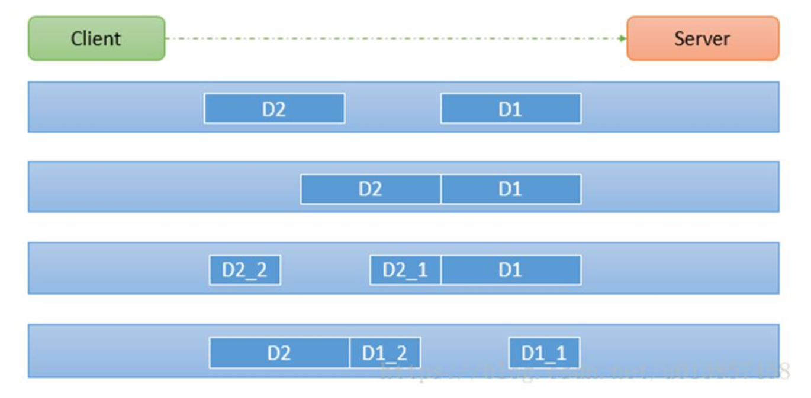

### 原因

- 由于TCP是面向连接的流式协议，本身**没有消息保护边界**。为了提高数据发送效率，采用**Nagle算法**，将多次间隔较小且数据量小的数据，合并成一个大的数据块，然后进行封包发送，服务端无法分辨完整的数据包。另外，由于TCP发送消息是通过**滑动窗口**技术，客户端和服务端都存在**发送缓冲区和接收缓冲区**，导致发送的消息有可能被截断或者相黏

### 解决方案

- 这个问题解决关键在于服务端需要确定每次读取数据长度，自己找出每一条消息的边界，可以使用自定义协议和LengthFieldBasedFrameDecoder解决

### 自定义协议规范

- 魔数

- 版本号

- 序列化算法

- 业务类型

- 请求序号

- 正文长度

- 消息正文

### 代码

#### 客户端

```java
public class MessageWrapper {
    private int len;
    private byte[] data;
}

public class DemoNettyClientHandler extends ChannelInboundHandlerAdapter {
    @Override
    public void channelActive(ChannelHandlerContext ctx) throws Exception {
        for (int i = 0; i < 5; i++) {
            byte[] data = "我叫杜俊辰".getBytes(StandardCharsets.UTF_8);
            int len = data.length;
            MessageWrapper mw = new MessageWrapper();
            mw.setLen(len);
            mw.setData(data);
            ctx.writeAndFlush(mw);
        }
    }
}

public class DemoMessageEncoder extends MessageToByteEncoder<MessageWrapper> {
    @Override
    protected void encode(ChannelHandlerContext ctx, MessageWrapper msg, ByteBuf out) throws Exception {
        System.out.println("DemoMessageEncoder encode 被调用");
        out.writeInt(msg.getLen());
        out.writeBytes(msg.getData());
    }
}
```

#### 服务端

```java
public class DemoMessageDecoder extends ReplayingDecoder<Void> {
    @Override
    protected void decode(ChannelHandlerContext ctx, ByteBuf in, List<Object> out) throws Exception {
        System.out.println("DemoMessageDecoder decode 被调用");
        int len = in.readInt();
        byte[] data = new byte[len];
        in.readBytes(data);
        //从socket中获取字节数据，并将其封装成为MessageWrapper供业务Handler使用
        MessageWrapper mw = new MessageWrapper();
        mw.setLen(len);
        mw.setData(data);
        out.add(mw);
    }
}

public class DemoNettyServerHandler extends ChannelInboundHandlerAdapter {
    //通道有Read事件发生回调，可以接收客户端消息
    @Override
    public void channelRead(ChannelHandlerContext ctx, Object msg) throws Exception {
        MessageWrapper mw = (MessageWrapper) msg;
        int len = mw.getLen();
        byte[] data = mw.getData();
        System.out.println(String.format("服务器接收数据：%s，长度为%s", new String(data, StandardCharsets.UTF_8), len));
    }
}
```

## 零拷贝

- 零拷贝分为两种：mmap（内存映射）和sendFile，零拷贝适合大量小文件传输


- 传统文件传输需要3次上下文切换，4次数据拷贝（2次DMA拷贝+2次CPU拷贝）


- mmap需要3次上下文切换，3次数据拷贝（2次DMA拷贝+1次CPU拷贝，所谓的零拷贝是指没有CPU拷贝），适合小数据量传输。java中的直接内存就是使用这种思想


- sendFile需要2次上下文切换，2次数据拷贝（2次DMA拷贝），真正实现零拷贝，适合大数据量传输。NIO的transferTo()和transferFrom()方法底层采用该零拷贝技术实现

## 参数优化

### ServerSocketChannel

- 服务端通过ServerBootstrap的option()配置ServerSocketChannel相关的参数

### SocketChannel

- 客户端通过Bootstrap的option()配置SocketChannel相关的参数，服务端通过childOption()配置SocketChannel相关的参数

### 重要参数

#### SO_BACKLOG

- ServerSocketChannel参数，TCP全连接队列大小，高并发下可以适当调大该队列大小，提高服务器连接处理能力

#### TCP_NODELAY

- SocketChannel参数，禁用Nagle算法

#### SO_SNDBUF、SO_RCVBUF

- TCP滑动窗口发送接收缓冲区，一般不需要调整

## Netty核心源码

### NioEventLoop

#### 核心成员属性

```java
 //维护优化后的Selector
 private Selector selector;
  //维护JDK原生的Selector
 private Selector unwrappedSelector;
 //任务队列
 private final Queue<Runnable> taskQueue;
 //线程
 private volatile Thread thread;
 //单线程池
 private final Executor executor;
 //定时调度线程池
 PriorityQueue<ScheduledFutureTask<?>> scheduledTaskQueue;
```

#### NioEventLoop中的线程启动流程

- NioEventLoop中的线程只会在首次调用NioEventLoop#execute()时才会被创建，并且只会创建一次。核心代码在SingleThreadEventExecutor#startThread()

```java
 private void execute(Runnable task, boolean immediate) {
        boolean inEventLoop = inEventLoop();
        //将提交的任务放入任务队列
        addTask(task);
        if (!inEventLoop) {
             //启动EventLoop中线程
             startThread();
        }
        //唤醒阻塞的Selector
        if (!addTaskWakesUp && immediate) {
            wakeup(inEventLoop);
        }
    }
```

- NioEventLoop线程最后会调用`SingleThreadEventExecutor.this.run()`，在该方法中，会以一个死循环不停的select()，如果NioEventLoop的任务队列中没有任务，则线程会进入select()阻塞，如果有任务，会先调用selectNow()顺便获取发生IO事件的任务，然后会调用processSelectedKeys()处理IO事件，调用runAllTasks()处理普通任务，两者在同一个线程中处理。processSelectedKeys()中会根据不同的事件类型处理OP_ACCEPT，OP_READ，OP_WRITE，而runAllTasks()则可以通过ioRatio参数控制IO任务和普通任务执行时间的占比

```java
protected void run() {
   // 修复JDK NIO selector BUG，在某些时间就算没有任务，select()也不会阻塞，导致空转
   //具体的逻辑在NioEventLoop#unexpectedSelectorWakeup()
   //大概原理是每循环一次计数+1，超过阈值，会重新创建一个新的Selector对象替换原先的Selector
   int selectCnt = 0;
   for (;;) {
     int strategy;
     strategy = selectStrategy.calculateStrategy(selectNowSupplier, hasTasks());
     switch (strategy) {
       case SelectStrategy.CONTINUE:
           continue;
       case SelectStrategy.BUSY_WAIT:
        //任务队列中没有任务，会进入该分支，使用select()阻塞，以免浪费CPU空转
       case SelectStrategy.SELECT:
           long curDeadlineNanos = nextScheduledTaskDeadlineNanos();
           if (curDeadlineNanos == -1L) {
                curDeadlineNanos = NONE; // nothing on the calendar
            }
            nextWakeupNanos.set(curDeadlineNanos);

                            if (!hasTasks()) {
                                //带超时的select()
                                strategy = select(curDeadlineNanos);
                            }

                    default:
      }

      selectCnt++;
      cancelledKeys = 0;
      needsToSelectAgain = false;
      //控制IO任务和普通任务执行时间的占比
      final int ioRatio = this.ioRatio;
      boolean ranTasks;
      if (ioRatio == 100) {
                    try {
                        if (strategy > 0) {
                            //处理IO任务
                            processSelectedKeys();
                        }
                    } finally {
                         //处理普通任务
                        ranTasks = runAllTasks();
                    }
       } else if (strategy > 0) {
                    final long ioStartTime = System.nanoTime();
                    try {
                        processSelectedKeys();
                    } finally {
                        // Ensure we always run tasks.
                        final long ioTime = System.nanoTime() - ioStartTime;
                        ranTasks = runAllTasks(ioTime * (100 - ioRatio) / ioRatio);
                    }
                } else {
                    ranTasks = runAllTasks(0); // This will run the minimum number of tasks
                }
        }
    }
```

- 同时NioEventLoop#execute()提交普通任务时，也会调用selector#wakeup()唤醒阻塞的select()，继续死循环，及时处理普通任务

### Server启动流程

- server启动过程主要逻辑都在AbstractBootstrap的bind()中，这个方法中主要会完成NIO中ServerSocketChannel的创建，并且将ServerSocketChannel注册到boss event loop中的Selector中，并且调用ServerSocketChannel的bind()监听端口

- initAndRegister()方法中，会先调用ReflectiveChannelFactory#newChannel()通过反射创建NioServerSocketChannel对象，在NioServerSocketChannel的构造器中，会初始化Selector，配置ServerSocketChannel为非阻塞模式。

- 接下去调用init()，为NioServerSocketChannel创建关联一个ChannelPipeline，默认添加TailContext和HeadContext两个Handler，同时在init()会再添加了一个ChannelInitializer（ChannelInitializer本质也是一个InBoundHandler，只是它只会执行一次），里面initChannel()的逻辑是往Channel的ChannelPipeline中增加一个ServerBootstrapAcceptor类型的Handler，但是此时ChannelInitializer的initChannel()还未回调

- 接下去调用NioEventLoopGroup的register()，该方法会调用next()从NioEventLoopGroup中选择一个EventLoop，并且会在EventLoop的线程中（此时发生线程切换，执行代码从main线程切换为IO线程）调用AbstractChannel#register0()，进而调到AbstractNioChannel#doRegister()，这个方法中，`selectionKey = javaChannel().register(eventLoop().unwrappedSelector(), 0, this)`会调用JDK NIO的API把Channel注册到Selector上，**同时将NioServerSocketChannel作为attachment和JDK 的Channel绑定**

- 触发ChannelPipeline中所有的Handler的handlerAdded()，此时会触发回调上面当时加入ChannelPipeline中的ChannelInitializer的initChannel()，将用户自己添加的Handler加载到ChannelPipeline中，至此initAndRegister()方法执行完成

- 接下去，会执行doBind0()，该方法会调用HeadContext#bind()，最终会调用到NioServerSocketChannel#doBind(SocketAddress localAddress)，该方法中，最终会调用JDK的ServerSocketChannel#bind(localAddress, config.getBacklog())完成端口的监听。然后会触发ChannelPipeline中所有Handler的channelActive()。主要是会触发HeadContext的channelActive()

- 在HeadContext的channelActive()中，最终会调用到AbstractNioChannel#doBeginRead()方法，在该方法中，会为之前注册到Selector上的NioServerSocketChannel绑定OP\_ACCEPT感兴趣事件

- 至此，Server启动完毕

### Io事件处理流程

- IO事件处理流程的起点是NioEventLoop#processSelectedKeys()，首先会根据是否使用Netty优化后Selector组件来处理，两者区别在于遍历SelectionKey集合方式不同。首先会拿到每一个SelectionKey的attachment，即为NIOChannel，因为后续流程中需要使用NIOChannel中的Handler来处理IO消息。处理消息的核心代码在NioEventLoop#processSelectedKey()，这里会根据不同的IO事件类型分别处理。写事件会调用`ch.unsafe().forceFlush()`，读事件和连接事件会调用`unsafe.read()`

#### ACCEPT

- 入口是unsafe.read()，最终会调用NioServerSocketChannel#doReadMessages()，内部调用`SocketChannel ch = SocketUtils.accept(javaChannel())`真正完成对accept事件的处理，并且会将处理后返回的SocketChannel包装为NioSocketChannel，然后将其作为消息放到NioServerSocketChannel中的pipeline中处理，并会触发所有Handler的channelRead()，最终是会触发之前注册的ServerBootstrapAcceptor的Handler的channelRead()，在该方法中，会从childGroup中挑选一个EventLoop，然后调用其register()，最终将NioSocketChannel关联的SocketChannel注册到该EventLoop的Selector上，并且将NioSocketChannel自身作为SelectionKey的attachment跟SocketChannel绑定，然后会回调NioSocketChannel中的ChannelInitializer的initChannel()，完成NioSocketChannel的Handler的初始化。然后会回调所有handler的channelActive()，最终会调用到HeadContext#channelActive()，最终会调到AbstractNioChannel#doBeginRead()，在这里，会为之前注册的NioSocketChannel添加OP_READ感兴趣事件

#### READ/WRITE

- READ的入口也是unsafe.read()，最终会调用到NioSocketChannel#doReadBytes()，完成Channel数据读取操作

- WRITE的入口是ch.unsafe().forceFlush()，最终会调用到NioSocketChannel#doWriteBytes()，完成对Channel数据的写入操作
