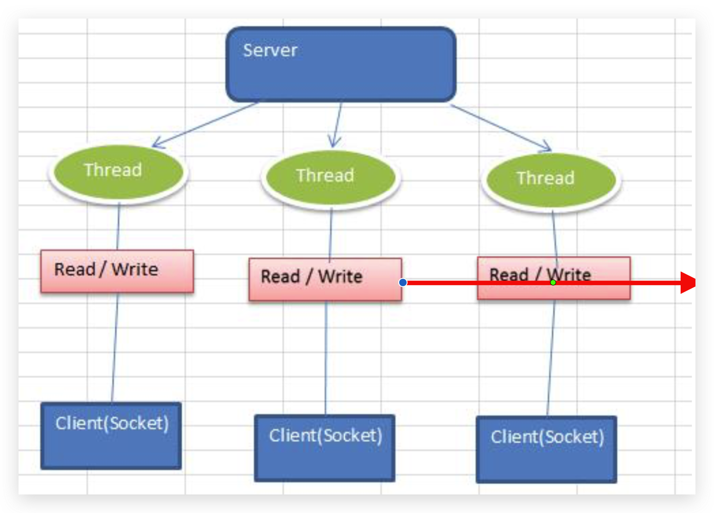
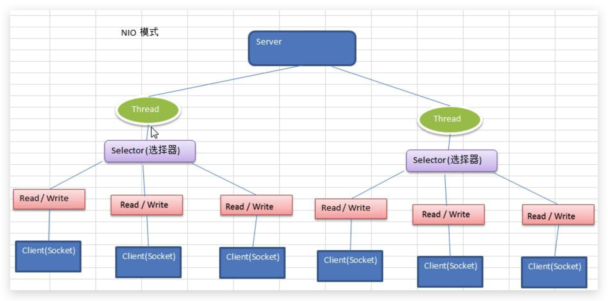
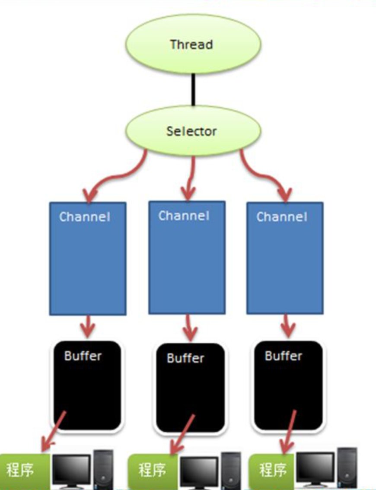

# Netty

## IO模型

### BIO

- 同步阻塞。客户端有连接请求时服务器端就需要启动一个线程进行处理，如果这个连接不做任何事情会造成不必要的线程开销

  

### NIO

- 同步非阻塞。一个线程处理多个请求(连接)，即客户端发送的连接请求都会注册到多路复用器上，多路复用器轮询到连接有 I/O 请求就进行处理，在单个连接中，底层还是使用BIO通信，是同步的，但是因为采用了多路复用技术，使得就算当前这个通道中没有数据，线程也不会阻塞，可以去处理其他事情，整个程序是非阻塞的

  

- Selector 、Channel 、Buffer的关系

  
#### Selector


- 多个 Channel 以事件的方式可以注册到同一个 Selector，如果有事件发生，便获取事件然后针对每个事件进行相应的处理

- 将ServerSocketChannel注册到Selector上，并设置感兴趣的ops为SelectionKey.OP_ACCEPT

- 当客户端连接时，通过ServerSocketChannel创建SocketChannel，并也将其注册到Selector上，并设置感兴趣的ops为SelectionKey.OP_READ，等待读取数据

- Channel注册到Selector后会返回SelectionKey（代表Channel和Selector之间的注册关系），并被加入Selector中维护的集合中

- 轮询Selector的select()方法，获取有事件发生的通道集合，并通过SelectionKey可以反向获取对应关联的Channel，并对其进行处理

##### 代码

```java
public class NioServer {
    public static void main(String[] args) throws Exception {
        Selector selector = Selector.open();
        ServerSocketChannel serverSocketChannel = ServerSocketChannel.open();
        serverSocketChannel.socket().bind(new InetSocketAddress(6666));
        serverSocketChannel.configureBlocking(false);//通道设置为非阻塞模式
        serverSocketChannel.register(selector, SelectionKey.OP_ACCEPT);//将serverSocketChannel注册到selector上，并且其监听OP_ACCEPT事件
        while (true) {
            //selector每隔100ms获取一下selector注册的通道中，有事件发生的通道数量，如果为0，则继续轮询
            if (selector.select(100) == 0) {
                continue;
            }
            //如果不为0，则将有事件发生的SelectionKey集合返回，并遍历各个SelectionKey，根据不同的事件分别进行对应的处理
            Set<SelectionKey> selectedKeys = selector.selectedKeys();
            Iterator<SelectionKey> iterator = selectedKeys.iterator();
            while (iterator.hasNext()) {
                SelectionKey key = iterator.next();
                //如果是OP_ACCEPT事件，则使用ServerSocketChannel的accept()为每一个客户端创建对应的SocketChannel，并将其也注册到selector上，并且其监听OP_READ事件
                if (key.isAcceptable()) {
                    SocketChannel socketChannel = serverSocketChannel.accept();
                    System.out.println("一个客户端连接[" + socketChannel.socket().getRemoteSocketAddress() + "]");
                    socketChannel.configureBlocking(false);//通道设置为非阻塞模式
                    socketChannel.register(selector, SelectionKey.OP_READ);
                }
                //如果是OP_READ事件，则通过SelectionKey获取与其关联的SocketChannel，并从里面读取数据
                if (key.isReadable()) {
                    SocketChannel socketChannel = (SocketChannel) key.channel();
                    System.out.println("接收到客户端[" + socketChannel.socket().getRemoteSocketAddress() + "]数据");
                    ByteBuffer buffer = ByteBuffer.allocate(10);
                    while (true) {
                        buffer.clear();
                        int read = socketChannel.read(buffer);
                        if (read == -1) {
                            break;
                        }
                        System.out.print(new String(buffer.array(), 0, read));
                    }
                }
                iterator.remove();
            }
        }
    }
}
```


#### Buffer

- 底层是数组实现的，既可以读取，也可以写入数据
- 除了boolean外的原始类型都有一个Buffer子类，最常用是ByteBuffer
- ByteBuffer的get()方法会自动往后移动position指针
- 只读ByteBuffer
- MappedByteBuffer
- Scattering和Gathering，即使用ByteBuffer数组读写数据。当往ByteBuffer数组读取或者写入数据时，会按照数组顺序依次读取或者写入
- ByteBuffer 支持类型化的 put 和 get, put 放入的是什么数据类型，get就应该使用相应的数据类型来取出，否
  则可能有 BufferUnderflowException异常
- 核心属性，大小关系为0 <= mark <= position <= limit <= capacity
  - capacity
    - 缓冲区的容量，最大容纳的元素个数，在缓冲区创建时指定，不能修改
  - limit
    - 不能读或写的第一个元素的索引，比如只允许读取缓冲区0到4的数据，limit就是5
  - position
    - 下一个将要读或者写的元素的索引，比如缓冲区已经存储0到4的数据，position就是5
  - mark
    - 标记，如果定义某个索引为mark，当调用reset()方法，position将会回到mark的位置。如果limit或者position调整到比mark小的位置，mark将会被清除

#### Channel

- 双向读写，可以异步读写数据
- 分类
  - FileChannel
  - DatagramChannel
  - ServerSocketChannel和SocketChannel

#### NIO零拷贝

- 零拷贝分为两种：mmap（内存映射）和sendFile
  - 传统文件传输需要3次上下文切换，4次数据拷贝（2次DMA拷贝+2次CPU拷贝）
  - mmap需要3次上下文切换，3次数据拷贝（2次DMA拷贝+1次CPU拷贝，所谓的零拷贝是指没有CPU拷贝），适合小数据量传输
  - sendFile需要2次上下文切换，2次数据拷贝（2次DMA拷贝），真正实现零拷贝，适合大数据量传输

- NIO的transferTo()方法底层采用零拷贝技术实现

### AIO

- 异步非阻塞。AIO 引入异步通道的概念，采用了 Proactor 模式，简化了程序编写，有效的请求才启动线程，它的特点是先由操作系统完成后才通知服务端程序启动线程去处理，一般适用于连接数较多且连接时间较长的应用

### BIO、NIO、AIO 对比表


### 适用场景

- BIO 方式适用于连接数目比较小且固定的架构，这种方式对服务器资源要求比较高，并发局限于应用中，JDK1.4以前的唯一选择，但程序简单易理解
- NIO 方式适用于连接数目多且连接比较短(轻操作)的架构，比如聊天服务器，弹幕系统，服务器间通讯等。编程比较复杂，JDK1.4 开始支持
- AIO 方式使用于连接数目多且连接比较长(重操作)的架构，比如相册服务器，充分调用 OS 参与并发操作，编程比较复杂，JDK7 开始支持

## 线程模型

### 传统阻塞 I/O 服务模型


#### 特点

- 采用阻塞IO模式获取输入的数据
- 每个连接都需要独立的线程完成数据的输入，业务处理，数据返回

#### 缺点

- 当并发数很大，就会创建大量的线程，占用很大系统资源
- 连接创建后，如果当前线程暂时没有数据可读，该线程会阻塞在 read 操作，造成线程资源浪费

### Reactor 模式


#### 特点

- **基于 I/O 复用模型**，多个连接共用一个阻塞对象，应用程序只需要在一个阻塞对象等待，无需阻塞等待所有连 接。当某个连接有新的数据可以处理时，操作系统通知应用程序，线程从阻塞状态返回，开始进行业务处理
- **基于线程池复用线程资源**，不必再为每个连接创建线程，将连接完成后的业务处理任务分配给线程进行处理，一个线程可以处理多个连接的业务

#### 核心角色

- Reactor
  - Reactor 在一个单独的线程中运行，负责监听客户端请求事件和分发事件，分发给适当的Handler来对 IO 事件处理
- Handler
  - 执行 I/O （Read或者Write）事件要完成的实际事件

#### 分类

##### 单 Reactor 单线程


###### 特点

- Reactor 对象通过 Select 监控客户端请求事件，收到事件后通过 Dispatch 进行分发
- 如果是建立连接请求事件，则由 Acceptor 通过 Accept 处理连接请求，然后创建一个 Handler 对象处理连接完成后的后续业务处理
- 如果不是建立连接事件，则 Reactor 会分发调用连接对应的 Handler 来响应
- Handler 会完成 Read→业务处理→Send 的完整业务流程

###### 优缺点

- 优点：模型简单，没有多线程、进程通信、竞争的问题，全部都在一个线程中完成
- 缺点：性能问题，只有一个线程，无法完全发挥多核 CPU 的性能。Handler 在处理某个连接上的业务时，整个进程无法处理其他连接事件，很容易导致性能瓶颈。另外，线程意外终止，或者进入死循环，会导致整个系统通信模块不可用，不能接收和处理外部消息，造成节点故障

##### 单 Reactor 多线程


###### 特点

- 在单 Reactor 单线程基础上改进，handler 只负责响应事件，不做具体的业务处理, 通过 read 读取数据后，会分发给后面的 worker 线程池的某个单独线程处理业务逻辑

###### 优缺点

- 可以充分的利用多核cpu的处理能力，但是reactor处理所有的事件的监听和响应，在单线程运行，在高并发场景容易出现性能瓶颈

##### 主从 Reactor 多线程


###### 特点

- 在单 Reactor 多线程基础上改进，将Reactor分为不同的线程组中，Reactor 主线程可以对应多个 Reactor 子线程，Reactor 主线程只负责处理连接事件，并将创建的连接分配给子Reactor线程，子Reactor线程完成具体的IO操作和业务处理

###### 优缺点

- 父线程与子线程的数据交互简单职责明确，父线程只需要接收新连接，子线程完成后续的业务处理，并且子线程无需返回数据给父线程，交互简单

## Netty架构设计

### 线程模型


- Netty 主要基于主从 Reactor 多线程模型做了一定的改进，BossGroup 专门负责接收客户端的连接, WorkerGroup 专门负责网络的读写，BossGroup 和 WorkerGroup 类型都是 NioEventLoopGroup
- NioEventLoopGroup 相当于一个事件循环组, 这个组中含有多个事件循环 ，每一个事件循环是 NioEventLoop，NioEventLoop 表示一个不断循环的执行处理任务的线程， 每个 NioEventLoop 都有一个 selector , 用于监听绑定在其上的 socket 的网络通讯
- BossGroup中的每个NioEventLoop轮询 并处理accept 事件，与 client 建立连接 , 生成 NioScocketChannel , 并将其注册到某个 worker NIOEventLoop 上的 selector
- WorkerGroup中的每个NioEventLoop轮询 并处理read, write 事件。在处理IO事件时，每个Worker NIOEventLoop 处理业务时，会使用pipeline(管道), pipeline 中包含了 channel , 即通过pipeline 可以获取到对应通道, 管道中维护了很多的 处理器
- NioEventLoop 内部采用串行化设计，从消息的读取->解码->处理->编码->发送，始终由 IO 线程 NioEventLoop 负责

### 异步模型


- Netty 的异步模型是建立在 future 和 callback 之上的
- 当 Future 对象刚刚创建时，处于非完成状态，调用者可以通过返回的 ChannelFuture 来获取操作执行的状态， 也可以注册监听器到 ChannelFuture 上，可以在 I/O 操作成功、失败或取消时回调通知调用方

## Netty核心组件

### Bootstrap、ServerBootstrap

- 配置整个 Netty 程序，串联各个组件，Netty 中 Bootstrap 类是客户端程序的启动引导类，ServerBootstrap 是服务端启动引导类

### Future、ChannelFuture

### Channel

- NioSocketChannel，异步的客户端 TCP Socket 连接
-  NioServerSocketChannel，异步的服务器端 TCP Socket 连接
-  NioDatagramChannel，异步的 UDP 连接
-  NioSctpChannel，异步的客户端 Sctp 连接
-  NioSctpServerChannel，异步的 Sctp 服务器端连接，这些通道涵盖了 UDP 和 TCP 网络 IO 以及文件 IO

### Selector

- Netty 基于 Selector 对象实现 I/O 多路复用，通过 Selector 一个线程监听并处理多个连接的 Channel 事件

### ChannelHandler

- 用来处理 I/O 事件或拦截 I/O 操作，并将其转发到其 ChannelPipeline(业务处理链) 中的下一个处理程序
- 分为ChannelInboundHandler和ChannelOutboundHandler，分别处理进站和出站事件，ChannelDuplexHandler既可以处理进站，也可以处理出站事件

### Pipeline 和 ChannelPipeline


- 在 Netty 中每个 Channel 都有且仅有一个 ChannelPipeline 与之对应
- ChannelPipeline中维护了一个由ChannelHandlerContext组成的双向链表，每个ChannelHandlerContext中又关联一个ChannelHandler
- 入站处理器和出站处理器放置的是同一个ChannelPipeline，只是每一个ChannelHandlerContext会标识该ChannelHandler是出站还是入站。入站事件会从head往后传递到最后一个入站处理器，出站事件会从tail往前传递到最前一个出站处理器，两种类型的处理器互不干扰

### ChannelHandlerContext

- 保存Channel相关所有的上下文信息，同时关联一个ChannelHandler

### ChannelOption

- 设置Channel参数

### EventLoopGroup


- EventLoopGroup包含多个EventLoop，每个EventLoop本质上是一个死循环，维护一个Selector实例
- EventLoopGroup提供next()按照一定的算法获取组中某一个EventLoop
- Boss EventLoopGroup通常为一个单线程EventLoop，维护一个注册了ServerSocketChannel的Selector，并不断轮询Selector的select()监听OP_ACCEPT事件，然后将得到的SocketChannel交给Worker EventLoopGroup,Worker EventLoopGroup根据next()确定其中一个EventLoop，并将该SocketChannel注册到其维护的Selector上，用来处理后续的IO事件

### Unpooled

- 操作ByteBuf工具类

- ByteBuf和ByteBuffer最大的区别是，ByteBuffer内部只维护一个指针，所以读写操作切换时需要执行flip()。而ByteBuf内部维护了readerindex 和 writerIndex，因为不需要flip()

### Netty心跳机制

- 使用IdleStateHandler实现，当出现IO事件空闲会产生IdleStateEvent事件，传递给下一个Handler的userEventTiggered()进一步处理

- 核心代码

  ```java
  public class DemoServerChannelInitializer extends ChannelInitializer {
      @Override
      protected void initChannel(Channel ch) throws Exception {
          ch.pipeline()
                  .addLast("DemoIdleStateHandler", new IdleStateHandler(5,10,15, TimeUnit.SECONDS))
                  .addLast("DemoNettyServerHandler", new DemoNettyServerHandler());
      }
  }
  
  public class DemoNettyServerHandler extends ChannelInboundHandlerAdapter {
      @Override
      public void userEventTriggered(ChannelHandlerContext ctx, Object evt) throws Exception {
          if(evt instanceof IdleStateEvent){
              IdleStateEvent event = (IdleStateEvent) evt;
              String  msg ;
              switch (event.state()){
                  case READER_IDLE:
                      msg = "读空闲";
                      break;
                  case WRITER_IDLE:
                      msg = "写空闲";
                      break;
                  default:
                      msg = "读写空闲";
              }
              System.out.println(ctx.channel().remoteAddress() + " " + msg);
  //            ctx.channel().close();
          }
      }
  }
  ```

### Netty实现WebSocket长连接

- 核心代码

  ```java
  public class DemoServerChannelInitializer extends ChannelInitializer<SocketChannel> {
      @Override
      protected void initChannel(SocketChannel ch) throws Exception {
          ////因为ws基于http协议，使用http的编码和解码器，添加HttpServerCodec处理器处理HTTP协议报文
          ch.pipeline().addLast("HttpHandler", new HttpServerCodec())
                  ////是以块方式写，添加ChunkedWriteHandler处理器
                  .addLast("ChunkedWriteHandler",new ChunkedWriteHandler())
                  //http 数据在传输过程中是分段, HttpObjectAggregator ，就是可以将多个段聚合
                  .addLast("HttpObjectAggregator", new HttpObjectAggregator(8192))
                  .addLast("", new WebSocketServerProtocolHandler("/hello"))
                  .addLast("DemoNettyServerHandler", new DemoNettyServerHandler());
      }
  }
  
  public class DemoNettyServerHandler extends SimpleChannelInboundHandler<TextWebSocketFrame> {
      //通道有Read事件发生回调，可以接收客户端消息
      @Override
      protected void channelRead0(ChannelHandlerContext ctx, TextWebSocketFrame msg) throws Exception {
          System.out.printf("接收客户端【%s】消息：%s\n",ctx.channel().remoteAddress(), msg.text());
          ctx.channel().writeAndFlush(new TextWebSocketFrame("收到消息"));
      }
      //发生异常回调
      @Override
      public void exceptionCaught(ChannelHandlerContext ctx, Throwable cause) throws Exception {
          ctx.channel().close();
      }
  }
  ```

  

## Netty编解码器

### 编码和解码


- encoder 负责把业务数据转换成字节 码数据，decoder 负责把字节码数据转换成业务数据

### Netty编解码器的问题

- Netty 自身提供了一些 codec(编解码器)，如StringEncoder（StringDecoder）、ObjectEncoder（ObjectDecoder）
- Netty自带的编解码器底层使用的是Java序列化技术，用因为存在无法跨语言、序列化后占用空间庞大、序列化性能差等问题

### Protobuf

- 参考文档 : https://developers.google.com/protocol-buffers/docs/proto 语言指南

- 核心代码

  - 导入protobuf依赖，因为protoc生成的类中会需要引用这个jar中的一些文件，注意：protobuf-java和protoc、.proto文件中的版本要兼容。

    ```xml
    <dependency>
      <groupId>com.google.protobuf</groupId>
      <artifactId>protobuf-java</artifactId>
      <version>3.11.4</version>
    </dependency>
    ```

  - 单一类型

    ```protobuf
    syntax = "proto3"; //版本
    option java_outer_classname = "StudentOuter";//生成的外部类名，同时也是文件名
    //protobuf 使用 message 管理数据
    //会在 StudentOuter 外部类生成一个内部类 Student， 他是真正发送的 POJO 对象
    message Student {
    // Student 类中有 一个属性 名字为 id 类型为 int32(protobuf 类型) 1 表示属性序号，不是值
    int32 id = 1;
    string name = 2;
    }
    ```

    ```java
    public class DemoClientChannelInitializer extends ChannelInitializer {
        @Override
        protected void initChannel(Channel ch) throws Exception {
            ch.pipeline()
                    .addLast("ProtobufEncoder", new ProtobufEncoder())
                    .addLast("DemoNettyClientHandler", new DemoNettyClientHandler());
        }
    }
    
    public class DemoNettyClientHandler extends ChannelInboundHandlerAdapter {
        //通道已就绪后回调
        @Override
        public void channelActive(ChannelHandlerContext ctx) throws Exception {
            StudentOuter.Student student = StudentOuter.Student.newBuilder().setId(111).setName("dujc").build();
            ctx.writeAndFlush(student);
        }
    }
    
    public class DemoServerChannelInitializer extends ChannelInitializer {
        @Override
        protected void initChannel(Channel ch) throws Exception {
            ch.pipeline()
                    .addLast("ProtobufDecoder", new ProtobufDecoder(StudentOuter.Student.getDefaultInstance()))
                    .addLast("DemoNettyServerHandler", new DemoNettyServerHandler());
        }
    }
    
    public class DemoNettyServerHandler extends ChannelInboundHandlerAdapter {
        //通道有Read事件发生回调，可以接收客户端消息
        @Override
        public void channelRead(ChannelHandlerContext ctx, Object msg) throws Exception {
            StudentOuter.Student student = (StudentOuter.Student) msg;
            System.out.printf("接收客户端【%s】消息：ID: %s,Name: %s",ctx.channel().remoteAddress(), student.getId(),student.getName());
        }
    }
    ```

    

  - 支持多种类型

    ```protobuf
    syntax = "proto3";
    option optimize_for = SPEED; // 加快解析
    //option java_package="com.example.demo.nio.netty.protobuf.gen"; //指定生成到哪个包下
    option java_outer_classname="com.example.demo.nio.netty.protobuf.gen.MyDataInfo"; // 外部类名, 文件名
    //protobuf 可以使用 message 管理其他的 message
    message MyMessage {
    //定义一个枚举类型
        enum DataType {
            StudentType = 0; //在 proto3 要求 enum 的编号从 0 开始
            WorkerType = 1;
        }
    //用 data_type 来标识传的是哪一个枚举类型
    DataType data_type = 1;
    //表示每次枚举类型最多只能出现其中的一个, 节省空间
    oneof dataBody {
    Student student = 2;
    Worker worker = 3;
    }
    }
    message Student {
    int32 id = 1;//Student 类的属性
    string name = 2;
    }
    message Worker {
    string name=1;
    int32 age=2;
    }
    ```

    ```java
    public class DemoClientChannelInitializer extends ChannelInitializer {
        @Override
        protected void initChannel(Channel ch) throws Exception {
            ch.pipeline()
                    .addLast("ProtobufEncoder", new ProtobufEncoder())
                    .addLast("DemoNettyClientHandler", new DemoNettyClientHandler());
        }
    }
    
    public class DemoNettyClientHandler extends ChannelInboundHandlerAdapter {
        //通道已就绪后回调
        @Override
        public void channelActive(ChannelHandlerContext ctx) throws Exception {
            int rand = new Random().nextInt(10);
            MyDataInfo.MyMessage msg;
            if(rand % 2 == 0){
                 msg = MyDataInfo.MyMessage.newBuilder().setDataType(MyDataInfo.MyMessage.DataType.StudentType)
                        .setStudent(MyDataInfo.Student.newBuilder().setId(666).setName("zhangsan").build()).build();
    
            }else{
                msg = MyDataInfo.MyMessage.newBuilder().setDataType(MyDataInfo.MyMessage.DataType.WorkerType)
                        .setWorker(MyDataInfo.Worker.newBuilder().setName("lisi").setAge(30).build()).build();
            }
            ctx.writeAndFlush(msg);
        }
    }
    
    public class DemoServerChannelInitializer extends ChannelInitializer {
        @Override
        protected void initChannel(Channel ch) throws Exception {
            ch.pipeline()
                    .addLast("ProtobufDecoder", new ProtobufDecoder(MyDataInfo.MyMessage.getDefaultInstance()))
                    .addLast("DemoNettyServerHandler", new DemoNettyServerHandler());
        }
    }
    
    public class DemoNettyServerHandler extends ChannelInboundHandlerAdapter {
        //通道有Read事件发生回调，可以接收客户端消息
        @Override
        public void channelRead(ChannelHandlerContext ctx, Object msg) throws Exception {
            MyDataInfo.MyMessage msg1 = (MyDataInfo.MyMessage) msg;
            switch (msg1.getDataType()){
                case WorkerType:
                    System.out.printf("WorkerType Name:%s,Age:%s", msg1.getWorker().getName(), msg1.getWorker().getAge());
                    break;
                case StudentType:
                    System.out.printf("StudentType Name:%s,Id:%s", msg1.getStudent().getName(), msg1.getStudent().getId());
                    break;
                default:
                    System.out.println("类型非法");
            }
        }
    }
    ```

  

  
  ### 编解码器
  
  #### ByteToMessageDecoder（ReplayingDecoder）
  
  
  
  - decode()方法会被多次调用，直到缓冲区中没有新的数据，每一次decode 后会将本次decode的结果发给下一个Handler处理，然后继续调用decode()
  - 解码器解码时需要判断缓冲区中数据是否足够，如果使用ReplayingDecoder则不需要判断
  
  
  
  #### MessageToByteEncoder
  
  - 如果接收的数据类型和处理的数据类型不一致，则会跳过Encoder的encode()处理
  
    ```java
    public boolean acceptOutboundMessage(Object msg) throws Exception {
            return matcher.match(msg);
    }
    
    @Override
    public void write(ChannelHandlerContext ctx, Object msg, ChannelPromise promise) throws Exception {
      ByteBuf buf = null;
      if (acceptOutboundMessage(msg)) {
        ...
          encode(ctx, cast, buf);
        ...
      } else {
        ctx.write(msg, promise);
      }
    }
    ```
  
    
  
  ### Handler调用机制
  
  
  
  
  
  ## TCP拆包粘包
  
  
  
  ### 原因
  
  - 由于TCP是面向连接，面向流的协议，为了提高数据发送效率，采用Nagle算法，将多次间隔较小且数据量小的数据，合并成一个大的数据块，然后进行封包。因此服务端无法分辨完整的数据包。面向流的通信是无消息保护边界的

	### 解决方案
	
	- 这个问题解决关键在于解决服务端每次读取数据长度的问题，可以使用自定义协议和编解码器解决
	
	### 代码
	
	#### 客户端
	
	```java
	public class MessageWrapper {
	    private int len;
	    private byte[] data;
	}
	
	public class DemoNettyClientHandler extends ChannelInboundHandlerAdapter {
	    @Override
	    public void channelActive(ChannelHandlerContext ctx) throws Exception {
	        for (int i = 0; i < 5; i++) {
	            byte[] data = "我叫杜俊辰".getBytes(StandardCharsets.UTF_8);
	            int len = data.length;
	            MessageWrapper mw = new MessageWrapper();
	            mw.setLen(len);
	            mw.setData(data);
	            ctx.writeAndFlush(mw);
	        }
	    }
	}
	
	public class DemoMessageEncoder extends MessageToByteEncoder<MessageWrapper> {
	    @Override
	    protected void encode(ChannelHandlerContext ctx, MessageWrapper msg, ByteBuf out) throws Exception {
	        System.out.println("DemoMessageEncoder encode 被调用");
	        out.writeInt(msg.getLen());
	        out.writeBytes(msg.getData());
	    }
	}
	```
	
	#### 服务端
	
	```java
	public class DemoMessageDecoder extends ReplayingDecoder<Void> {
	    @Override
	    protected void decode(ChannelHandlerContext ctx, ByteBuf in, List<Object> out) throws Exception {
	        System.out.println("DemoMessageDecoder decode 被调用");
	        int len = in.readInt();
	        byte[] data = new byte[len];
	        in.readBytes(data);
	        //从socket中获取字节数据，并将其封装成为MessageWrapper供业务Handler使用
	        MessageWrapper mw = new MessageWrapper();
	        mw.setLen(len);
	        mw.setData(data);
	        out.add(mw);
	    }
	}
	
	public class DemoNettyServerHandler extends ChannelInboundHandlerAdapter {
	    //通道有Read事件发生回调，可以接收客户端消息
	    @Override
	    public void channelRead(ChannelHandlerContext ctx, Object msg) throws Exception {
	        MessageWrapper mw = (MessageWrapper) msg;
	        int len = mw.getLen();
	        byte[] data = mw.getData();
	        System.out.println(String.format("服务器接收数据：%s，长度为%s", new String(data, StandardCharsets.UTF_8), len));
	    }
	}
	```
	
	## Netty核心源码
	
	### 启动过程
	
	#### EventLoopGroup初始化过程
	
	- 最终会调用MultithreadEventLoopGroup的构造器，如果没有传入线程数，则会使用当前
	
	
	
	### 接受请求过程
	
	### 创建Pipeline、Handler、HandlerContext
	
	### ChannelPipeline调度Handler
	
	### Netty心跳
	
	### EventLoop
	
	### Handler中加入线程池和Context中添加线程池的源码

