## 基本概念

### 网络

- 用交换机将多台计算机连接的网络

### 互联网

- 用路由器将多个网络连接起来

### 因特网

- 全球最大的互联网

### ISP

### 分组交换

### 性能指标

- 速率
  - 数字信道上传输数据位数的速率
- 带宽
  - 数字信道上传输数据位数的最大速率
- 吞吐量
  - 单位时间内通过某个网络的（所有信道）总数据量
- 时延
- 利用率

## 计算机网络体系结构

- 分层的意义
  - 有利于标准化
  - 减少各层之间的耦合，修改某一层的标准不会影响其它层

### OSI七层模型

- 应用层
  - 能够产生网络流量能够和用户交互的应用程序
- 表示层
  - 加密、压缩
- 会话层
  - 服务端和客户端建立连接
- 传输层
  - 可靠传输建立会话
  - 不可靠传输不建立会话
  - 流量控制
- 网络层
  - IP地址编址
  - 选择最佳路径
- 数据链路层
  - 输入封装
  - 添加物理层地址 MAC
- 物理层
  - 电压
  - 接口标准

### TCP/IP五层模型

## 网络层

计算机通信中，由端系统负责传输的可靠性。

### 数据报服务

### 虚拟互联网络

### IP地址

IP地址用32位表示，分为网络号和主机号。主机部分不能全部为0或1。

#### 分类

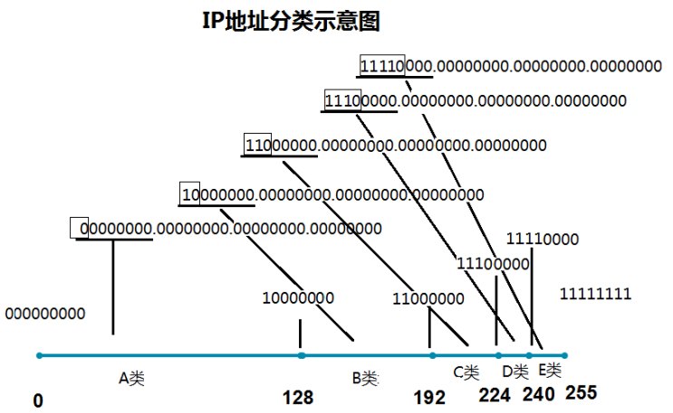

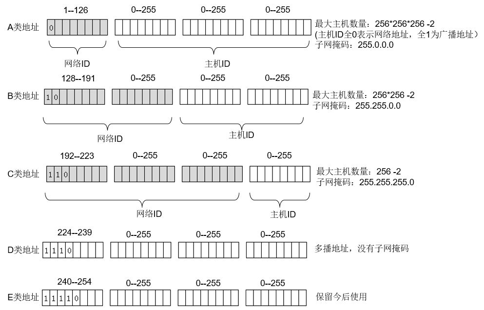

#### 特殊的地址

- 127.0.0.1 本地环回地址
- 169.254.0.0
- 保留的私网地址
  - 10.0.0.0
  - 172.16.0.0到172.31.0.0
  - 192.168.0.0到192.168.255.0

#### 子网掩码

- 子网掩码的作用是将某一个IP地址分为网络地址和主机地址两部分。
- 计算机和其它计算机通信时，会先断定目标地址和自己是否处于同一个网段，先用自己的子网掩码和自己的IP地址进行与运算得到自己所属的网段，在用自己的子网掩码和目标地址进行运算计算得到目标地址的网段。如果不在同一个网段则会使用路由器（网关）封装数据帧，如果相同，则直接把数据帧发送给目标地址。

#### 子网划分

- 要将子网等分为2^n个子网，则子网掩码在原来的基础上右移n位（也就是原n位主机号变成1作为网络号）。

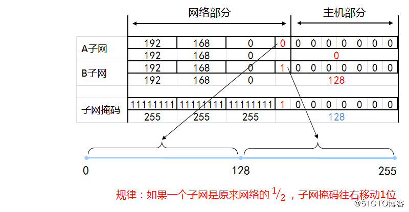

- 点到点网络（2个子网）子网掩码是255.255.255.252，往右移6位。
- 变长子网划分

#### 合并网络（CIDR）

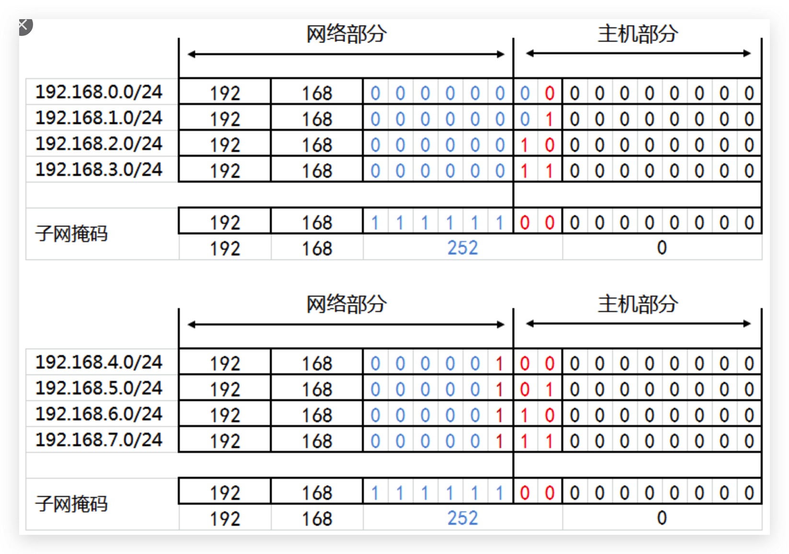

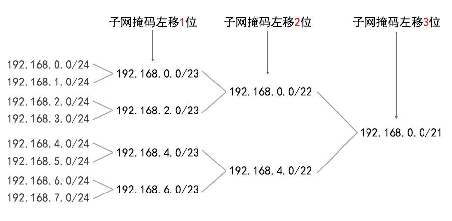

#### IP地址和MAC物理地址

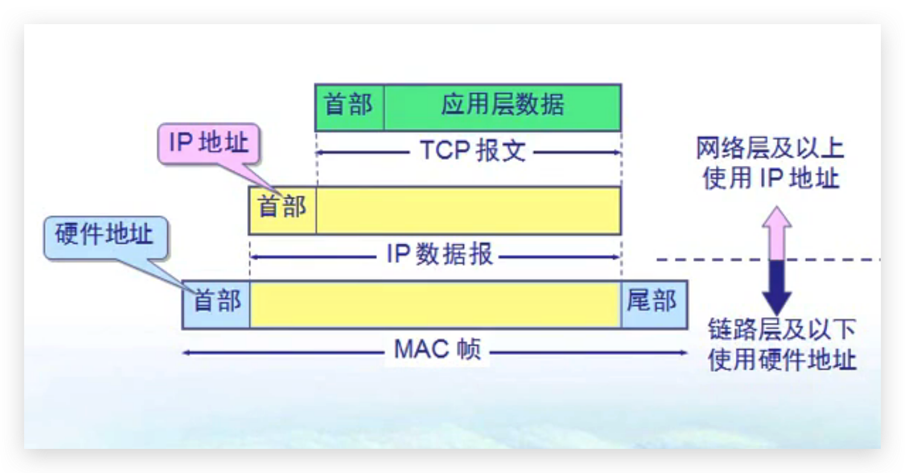

- 交换机基于数据帧的MAC地址转发数据帧，路由器基于数据包的IP地址转发数据包。
- 数据包在传输过程中不变，过网络设备数据帧要用新的物理地址重新封装。
- MAC地址决定数据帧下一跳哪个设备接收，而IP地址决定数据包的起点和终点。

### ARP协议和RARP协议

#### ARP欺骗

### 数据报首部

### 数据路由

- 路由器在不同网段转发数据包

- 沿途的路由器必须知道到目标网络下一跳给哪个接口，沿途的路由器必须知道到源网络下一跳给哪个接口

- 每个路由器会维护一个路由表，将目标地址（39.100.243.125）依次与维护的路由表中每一行的子网掩码进行与运算，然后和他的目标地址比较，如果相同，则使用对应网关地址继续下一跳路由器

  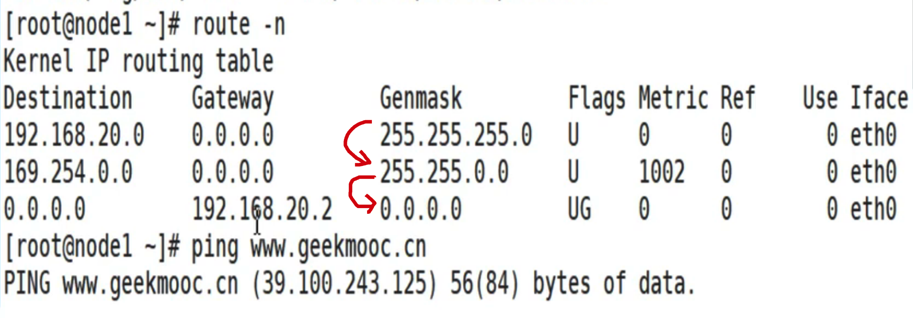

#### 静态路由

- 每个路由器需要配置除了直接相连的网段之外的所有的网段的路由信息，称之为静态路由。

#### 动态路由

##### RIP协议

#### 最长前缀匹配

### ICMP

### VPN

### NAT和PAT

## 传输层

### UDP

### TCP

#### 特点

- 面向连接
- 每一个TCP连接只能点对点传输
- 可靠传输
- 全双工通信
- 面向字节流

#### 实现可靠传输

- 自动重传请求（只要服务端未响应，就会自动重发）
  - 停止等待协议
    - 只有当服务端确认后才会继续发送，信道利用率低
  - 流水线传输
    - 使用滑动窗口机制，信道利用率高
    - 累计确认

#### 实现流量控制

#### 避免网络阻塞

- 拥塞窗口 慢开始 拥塞避免算法

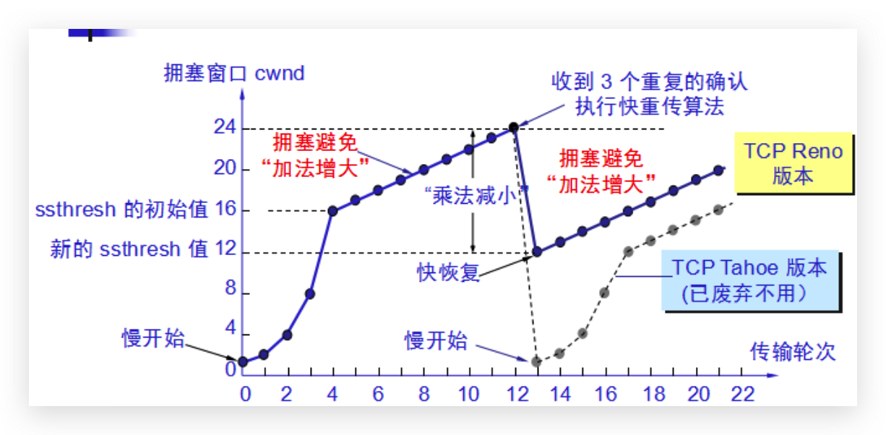

- 发送窗口的上限值是拥塞窗口和接收窗口中较小的一个。

#### TCP连接

- 三次握手

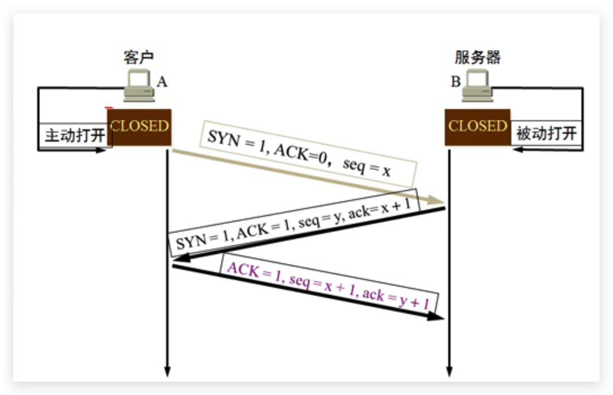

- 连接各状态

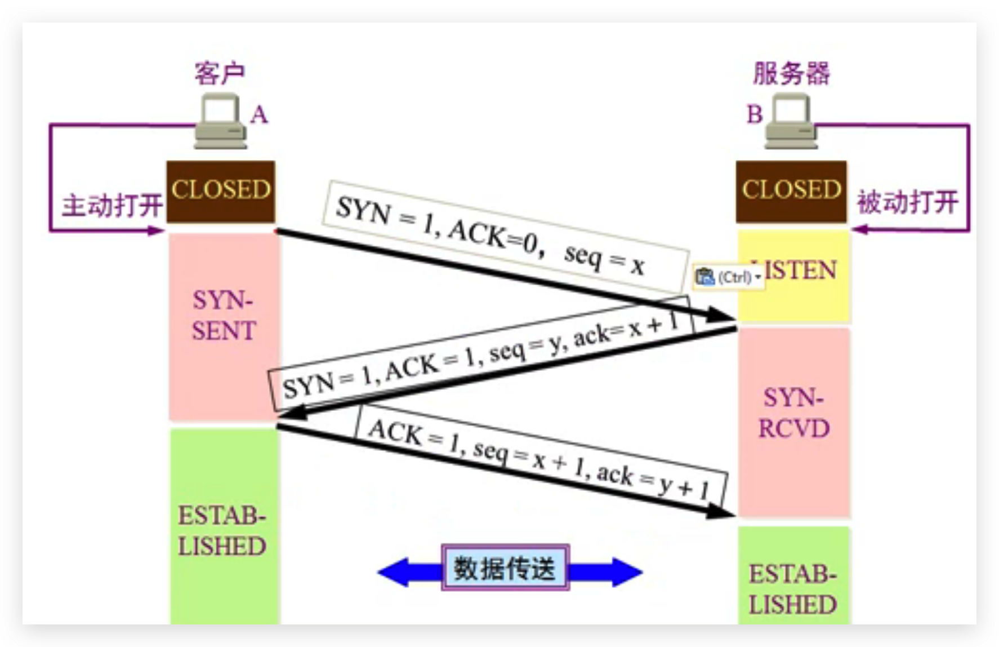

- 四次挥手

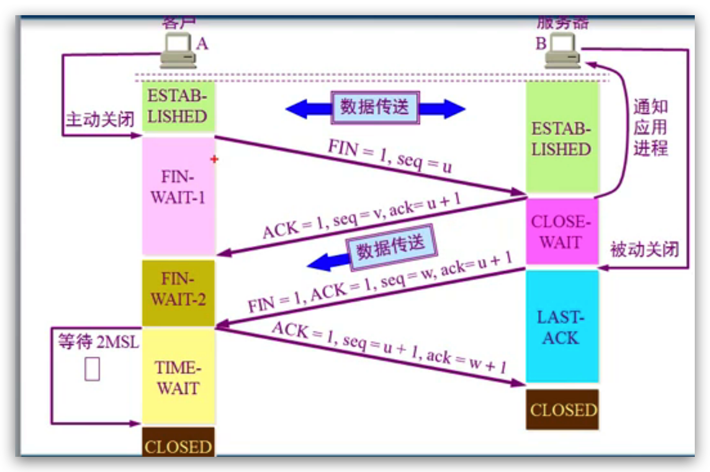

## 应用层

### DNS

#### DNS解析过程

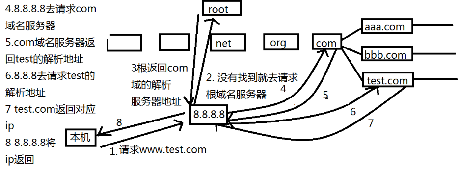

### DHCP

### FTP

#### 主动模式

#### 被动模式

如果FTP服务端有防火墙，需要开通20和21端口，使用主动模式

### Telnet

## 加密技术

### 对称加密

- 不适合网络传输
- 秘钥维护比较困难

### 非对称加密

- 加密
  -  公钥加密，私钥解密，保证加密内容不被看到
- 签名
  - 私钥加密生成的摘要，由公钥解密，对比摘要，保证内容不被篡改，同时也保证内容发布者即为私钥拥有者