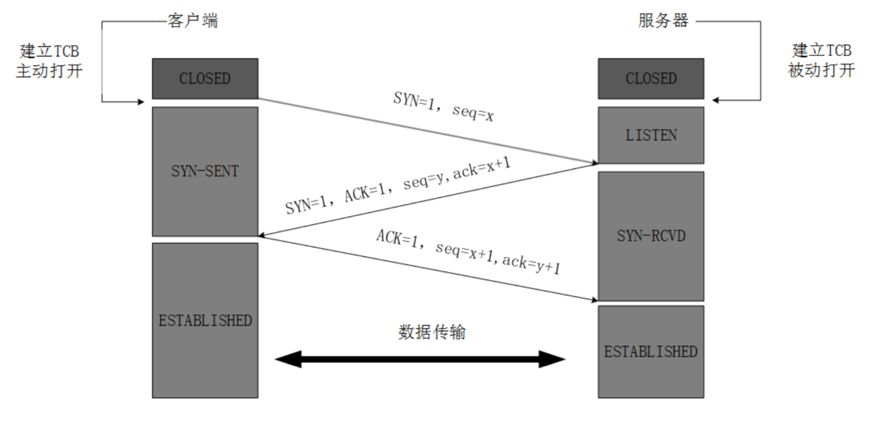
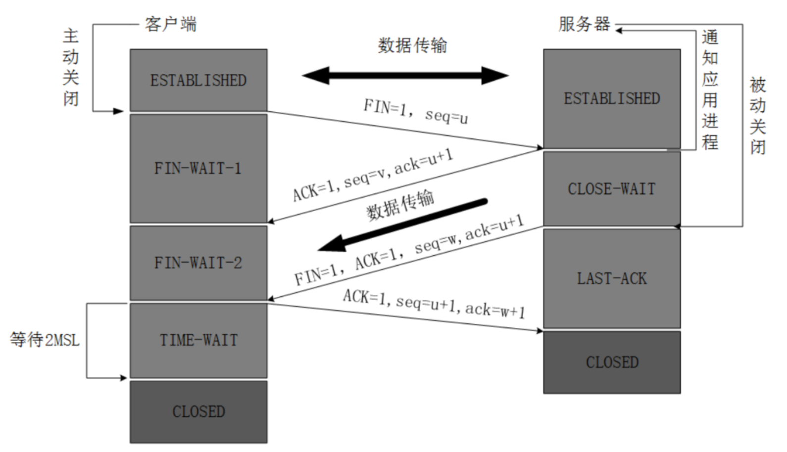

## 基本概念

### 网络

- 用交换机将多台计算机连接的网络

### 互联网

- 用路由器将多个网络连接起来

### 因特网

- 全球最大的互联网

### ISP

### 分组交换

### 性能指标

- 速率
  - 数字信道上传输数据位数的速率
- 带宽
  - 数字信道上传输数据位数的最大速率
- 吞吐量
  - 单位时间内通过某个网络的（所有信道）总数据量
- 时延
- 利用率

## 计算机网络体系结构

- 分层的意义
  - 有利于标准化
  - 减少各层之间的耦合，修改某一层的标准不会影响其它层

### OSI七层模型

- 应用层
  - 能够产生网络流量能够和用户交互的应用程序
- 表示层
  - 加密、压缩
- 会话层
  - 服务端和客户端建立连接
- 传输层
  - 可靠传输建立会话
  - 不可靠传输不建立会话
  - 流量控制
- 网络层
  - IP地址编址
  - 选择最佳路径
- 数据链路层
  - 输入封装
  - 添加物理层地址 MAC
- 物理层
  - 电压
  - 接口标准

### TCP/IP五层模型

## 网络层

计算机通信中，由端系统负责传输的可靠性。

### 数据报服务

### 虚拟互联网络

### IP地址

IP地址用32位表示，分为网络号和主机号。主机部分不能全部为0或1。

#### 分类

#### 特殊的地址

- 127.0.0.1 本地环回地址
- 169.254.0.0
- 保留的私网地址
  - 10.0.0.0
  - 172.16.0.0到172.31.0.0
  - 192.168.0.0到192.168.255.0

#### 子网掩码

- 子网掩码的作用是将某一个IP地址分为网络地址和主机地址两部分。
- 计算机和其它计算机通信时，会先断定目标地址和自己是否处于同一个网段，先用自己的子网掩码和自己的IP地址进行与运算得到自己所属的网段，在用自己的子网掩码和目标地址进行运算计算得到目标地址的网段。如果不在同一个网段则会使用路由器（网关）封装数据帧，如果相同，则直接把数据帧发送给目标地址。

#### 子网划分

- 要将子网等分为2^n个子网，则子网掩码在原来的基础上右移n位（也就是原n位主机号变成1作为网络号）。

- 点到点网络（2个子网）子网掩码是255.255.255.252，往右移6位。
- 变长子网划分

#### 合并网络（CIDR）

#### IP地址和MAC物理地址

- 交换机基于数据帧的MAC地址转发数据帧，路由器基于数据包的IP地址转发数据包。
- 数据包在传输过程中不变，过网络设备数据帧要用新的物理地址重新封装。
- MAC地址决定数据帧下一跳哪个设备接收，而IP地址决定数据包的起点和终点。

### ARP协议和RARP协议

#### ARP欺骗

### 数据报首部

### 数据路由

- 路由器在不同网段转发数据包

- 沿途的路由器必须知道到目标网络下一跳给哪个接口，沿途的路由器必须知道到源网络下一跳给哪个接口

- 每个路由器会维护一个路由表，将目标地址（39.100.243.125）依次与维护的路由表中每一行的子网掩码进行与运算，然后和他的目标地址比较，如果相同，则使用对应网关地址继续下一跳路由器
  
  

#### 静态路由

- 每个路由器需要配置除了直接相连的网段之外的所有的网段的路由信息，称之为静态路由。

#### 动态路由

##### RIP协议

#### 最长前缀匹配

### ICMP

### VPN

### NAT和PAT

## 传输层

### UDP

### TCP

#### 特点

- 面向连接
- 每一个TCP连接只能点对点传输
- 可靠传输
- 全双工通信
- 面向字节流

#### 实现可靠传输

- 自动重传请求（只要服务端未响应，就会自动重发）
  - 停止等待协议
    - 只有当服务端确认后才会继续发送，信道利用率低
  - 流水线传输
    - 使用滑动窗口机制，信道利用率高
    - 累计确认

#### 实现流量控制

- 滑动窗口协议

#### 避免网络阻塞

- 拥塞窗口 慢开始 拥塞避免算法

- 发送窗口的上限值是拥塞窗口和接收窗口中较小的一个。

#### TCP连接

##### 三次握手

- 最开始的时候客户端和服务器都是处于CLOSED状态。主动打开连接的为客户端，被动打开连接的是服务器。在两个设备要建立连接发送数据之前，双方都必须要做一些准备工作，分配内存建立起TCB数据块就是连接建立前必须要做的准备工作（TCB是一种封装了数据传输双方socket信息和装载数据缓冲区的数据结构，类似于信封的作用，用来隔离不同设备的数据发送）
- TCP服务器进程先创建TCB，时刻准备接受客户进程的连接请求，此时服务器就进入了LISTEN(监听)状态
- TCP客户进程创建TCB，然后向服务器发出连接请求报文， 报文首部中的同步位SYN=1，同时选择一个初始序列号 seq=x。此时，TCP客户端进程进入了 SYN-SENT(同步已发送状态)状态
- TCP服务器收到请求报文后，如果同意连接，则发出确认报文。确认报文中应 该 ACK=1，SYN=1，确认号是ack=x+1，同时也要为自己初始化一个序列号 seq=y，此时，TCP服务器进程进入了SYN-RCVD(同步收到)状态
- TCP客户进程收到确认后，还要向服务器给出确认。确认报文的ACK=1， ack=y+1，自己的序列号seq=x+1，此时，TCP连接建立，客户端进入 ESTABLISHED(已建立连接)状态
- 当服务器收到客户端的确认后也进入established状态，此后双方就可以开始通信了

##### 三次握手为什么需要最后客户端再发送一次确认

- 主要防止客户端发送的过期连接请求报文突然又传送到了服务器，从而产生重复建立连接等错误。客户端发送第一次握手的时候，如果在网络中延迟时间过长，导致客户端会重发握手消息。假设这一次握手请求被服务器正常接收并回复确认。如果是两次握手，那么此时TCP连接已经建立双方开始正常通信。此时此前滞留的那一次握手请求，网络通畅了到达了服务器，这个报文本该是过期失效的，但是，两次握手的机制将会让客户端和服务器再次建立连接，这将导致不必要的错误和资源的浪费。如果是三次握手，就算过期握手请求到达服务端并被回复确认，客户端检测到该请求为过期请求，并不会再次发出第三次握手确认，那么TCP不会再次建立连接

##### 四次挥手

- 数据传输完毕后，双方都可释放连接。最开始的时候，客户端和服务器都是处 于established(表示连接已经建立)状态，然后客户端主动关闭，服务器被动关闭
- 客户端进程发出连接释放报文，并且停止发送数据。释放数据报文首部， FIN=1(FIN表示关闭连接，SYN表示建立连接)，其序列号为seq=u(等于 前面已经传送过来的数据的最后一个字节的序号加1)，此时，客户端进入 FIN-WAIT-1(终止等待1)状态
- 服务器收到连接释放报文，发出确认报文，ACK=1，ack=u+1(确认序号为 收到的序号加1)，并且带上自己的序列号seq=v，此时，服务端就进入了 CLOSE-WAIT(关闭等待)状态。TCP服务器通知高层的应用进程，客户端向服务器的方向就释放了，这时候处于半关闭状态，即客户端已经没有数据要发送了，**但是服务器若发送数据，客户端依然要接受**。这个状态还要持续一段时间，也就是整个CLOSE-WAIT状态持续的时间
- 客户端收到服务器的确认请求后，此时，客户端就进入FIN-WAIT-2(终止 等待2)状态，等待服务器发送连接释放报文(在这之前还需要接受服务器发送的最后的数据)
- 服务器将最后的数据发送完毕后，就向客户端发送连接释放报文，FIN=1， ack=u+1，由于在半关闭状态，服务器很可能又发送了一些数据，假定此时 的序列号为seq=w，此时，服务器就进入了LAST-ACK(最后确认)状态， 等待客户端的确认
- 客户端收到服务器的连接释放报文后，必须发出确认，ACK=1，ack=w+1， 而自己的序列号是seq=u+1，此时，客户端就进入了TIME-WAIT(时间等待)状态。注意此时TCP连接还没有释放，必须经过2*MSL(最长报文段寿命)的时间后，当客户端撤销相应的TCB后，才进入CLOSED状态
- 服务器只要收到了客户端发出的确认，立即进入CLOSED状态。同样，撤销 TCB后，就结束了这次的TCP连接。可以看到，服务器结束TCP连接的时间要比客户端早一些

##### 为什么客户端最后还要等待2MSL

- 保证客户端发送的最后一个ACK报文能够到达服务器，因为这个ACK报文有可能丢失，服务器又会重新发送一次，客户端就能在这个2MSL等待时间段内收到这个重传的报文，并再次回应ACK报文，如果没有这个等待时间段就会导致客户端无法再次发送ACK连接释放失败
- 如果客户端发送的最后一个ACK报文立刻CLOSE并释放端口资源，有可能该端口会重新启用并连接到相同的服务端口并发送新的TCP报文数据，这会导致网络中同时存在新旧TCP报文，导致数据冲突。而等待2MSL后，客户端就可以放心地释放TCP占用的资源、端口号而不需要担心该问题

##### 为什么建立连接是三次握手，关闭连接是四次挥手

- 建立连接时， 服务器在LISTEN状态下，收到建立连接请求的SYN报文后，**把ACK和SYN放在一个报文里**发送给客户端
- 关闭连接时，服务器收到对方的FIN报文时，仅仅表示对方不再发送数据了，但是还能接收数据，而自己也未必已经将全部数据都发送给对方了，所以己方可以立即关闭，也可以发送一些数据给对方后，再发送FIN报文给对方来表示同意现在关闭连接，多了一种选择。因此，**服务端ACK和FIN一般都会分开发送**，从而导致多了一次

##### 如果已经建立了连接，但是客户端突然出现故障了怎么办

- TCP还设有一个保活计时器，显然，客户端如果出现故障，服务器不能一直等下去，白白浪费资源。服务器每收到一次客户端的请求后都会重新复位这个计时器，时间通常是设置为2小时，若两小时还没有收到客户端的任何数据，服务器就会发送一个探测报文段，以后每隔75秒发送一次。若一连发送10个探测报文仍然没反应，服务器就认为客户端出了故障，接着就关闭连接

##### TCP缺陷

- SYN flood DDOS，攻击者伪造大量的不存在的源IP地址，分别向服务器端发送大量的SYN包。服务器端返回SYN/ACK包，因为源地址是伪造的，所以伪造的IP并不会应答。服务器端没有收到伪造IP的回应，会重试3~5次并且等待一个SYN Time(— 般为30秒至2分钟)，如果超时则丢弃这个连接。攻击者大量发送这种伪造源地址的SYN请求，服务器端将会消耗非常多的资源来处理这种半连接，同时还要不断地对这些IP进行SYN+ACK重试。最后的结果是服务器无暇理睬正常的连接请求，导致拒绝服务

#### TCP性能

##### TCP连接建立握手

##### 慢启动

##### TCP延迟确认

##### Nagle算法

- 尽可能发送大块数据来提高网络传输效率，如果数据块不够大，则会等待

## 应用层

### HTTP

#### http性能

- 串行事务

- 并行连接

- 持久连接

- 管道化连接

#### HTTP 2.0

- 兼容http1.0的语义，并且性能得到了大幅提升

##### 新特性

- 增加二进制帧层

- 头部压缩

- 多路复用

- 服务器推送

### HTTPS

#### 工作原理

##### 对称加密和非对称加密

###### 数字签名

- 数字签名的作用是为了确认数据确实是发送方发送，并且防止数据篡改

- 基于非对称加密算法，发送方使用摘要算法对数据做摘要，再使用私钥加密形成数字签名
  
  

- 接收方使用公钥解密成摘要内容，同时使用相同的摘要算法对发送数据做摘要，比较两者差异，如果相同，则说明数据没有被篡改
  
  

###### 数字证书

- 权威CA数字签名过的，包含了**信息所有者的公钥**和其他信息的文件，类比身份证。SSL证书主要的作用是用来安全传递信息所有者的公钥（公钥不能在公开网络上传输，否则会有被监听风险）

#### https通信流程

- 客户端（浏览器）发送TLS版本号、一个客户端生成的随机数1，以及客户端支持的加密算法列表

- 服务端确认双方使用的加密算法，并且给出自己的数字证书，一个服务端生成的随机数2

- 客户端确认数字证书的有效性（数字证书使用CA机构的私钥加密，需要使用CA的公钥解密，而CA的公钥已经集成在了浏览器和操作系统内部，不需要通过网络传输，所以不会有被窃听的风险），并且生成一个新的随机数3，并使用数字证书中的服务端的公钥加密这个随机数，发给服务端

- 服务端使用自己的私钥获取客户端发送的随机数3，至此，客户端和服务端都有了三个相同的随机数，各自采用约定好的对称加密算法，获得对话密钥，之后所有的数据交互过程都采用这个对称加密的密钥加密传输

#### Session恢复

- 使用Session ID
  
  - 缺点是如果是集群部署，会导致不同服务器的Session共享问题。而且如果客户端数量过多，服务端存储压力很大

- 使用Session ticket
  
  - https握手建立成功后，服务端会向客户端返回一个只有服务端才能解密的Session Ticket，里面包含了登录需要的会话信息。当https连接断开重连时，只需要客户端重新发送Session ticket即可快速建立连接，并且不存在session共享问题和服务器储存问题

#### 性能优化

##### 性能问题

- 网络耗时

- 加解密计算耗时

##### 优化方案

- False Start，客户端在发送 Change Cipher Spec Finished 同时发送应用数据(如 HTTP请求)，服务端在 TLS 握手完成时直接返回应用数据(如 HTTP 响应)

- 升级到HTTP2

- 使用会话恢复机制

- 配置HSTS，减少HTTP到HTTPS跳转的开销

- 

### DNS

#### DNS解析过程

### DHCP

### FTP

#### 主动模式

#### 被动模式

如果FTP服务端有防火墙，需要开通20和21端口，使用主动模式

### Telnet

## CDN

### 作用

- CDN本质是缓存层，将网站的内容发布到最接近用户的网络”边缘“的节点，使用户可以就近取得所需的内容，提高用户访问网站的响应速度。从技术上全面解决由于网络带宽小、用户访问量大、网点分布不均等原因，提高用户访问网站的响应速度

### 应用场景

- 图片和小文件下载，包括各类型图片、html、 css、js小文件等

- 大文件下载，平均单个文件大小在20M以上，如游戏、各类客户端下载和App下载商店等

- 视频点播或短视频类

### 工作原理

- 当用户发出网站www.test.com请求时，首先通过**本地DNS**通过"迭代解析"的方式获取域名http://www.test.com的IP地址

- 如果本地DNS的缓存中没有该域名的记录，则向**根DNS**发送DNS查询报文。根DNS发现域名的前缀为"com"，则给出负责解析com的**顶级DNS**的IP地址。顶级DNS发现域名的前缀为"test.com"，在本地记录中查找负责该前缀的**权威DNS** 的IP地址并进行回复

- 本地DNS向 权威DNS 发送DNS查询报文。权威DNS查找到一条NAME字段为"www.test.com"的 CNAME记录 (由服务
  提供者配置，阿里云、网宿科技)，该记录的Value字段
  为"www.test.cdn.com";并且还找到另一条NAME字段
  为"www.test.cdn.com"的A记录(域名-->IP)，该记录的Value字段为 **GSLB**的IP地址

- 本地DNS向GSLB发送DNS查询报文。GSLB根据 本地DNS 的IP地址判断出用户的大致位置，筛选出合考量最优的**SLB**的IP地址填入DNS回应报文，作为DNS查询的最终结果

- 客户端根据IP地址向SLB发送HTTP请求，SLB综合考虑缓存服务器集群中各个节点的资源限制条件、健康度、负载情况等因素，**筛选出最优的缓存节点**后回应客户端的HTTP请求(状态码为302，重定向地址为最优缓存节点的IP地址)

- 客户端接收到SLB的HTTP回复后，重定向到该缓存节点上。缓存节点判断请求的资源是否存在、过期，将缓存的资源直接回复给客户端，否则到源站进行数据更新再回复

## 网络安全

### XSS

- WEB应用程序混淆了用户提交的数据和JS脚本的代码边界，导致浏览器把用户的输入当成了JS代码来执行

### CSRF

### 点击劫持

### URL跳转

### Session攻击

### 注入攻击

### 文件操作防护

### 访问控制