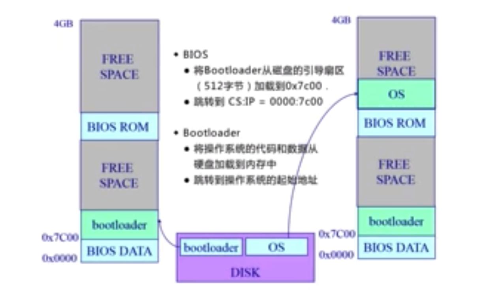
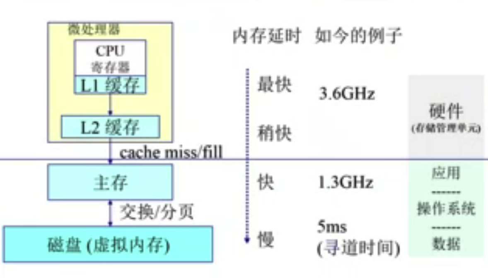
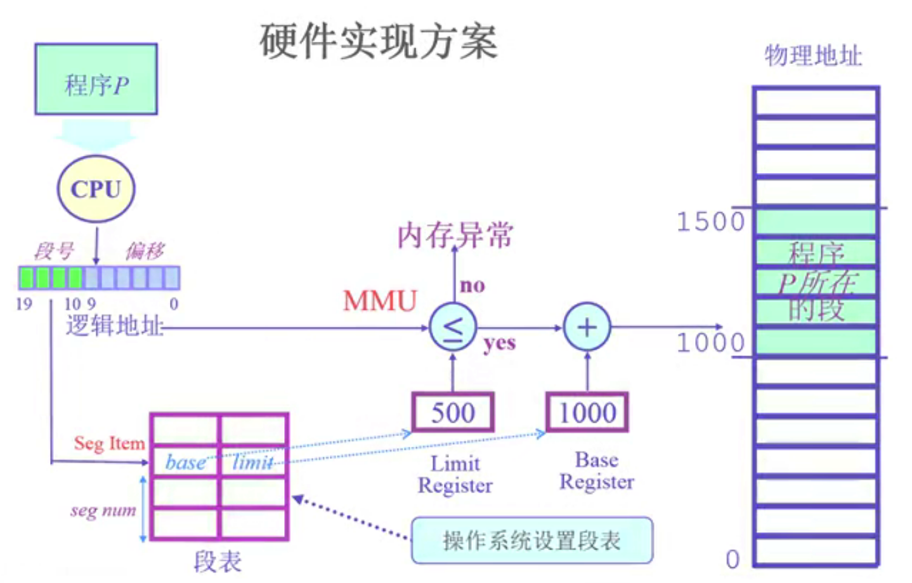
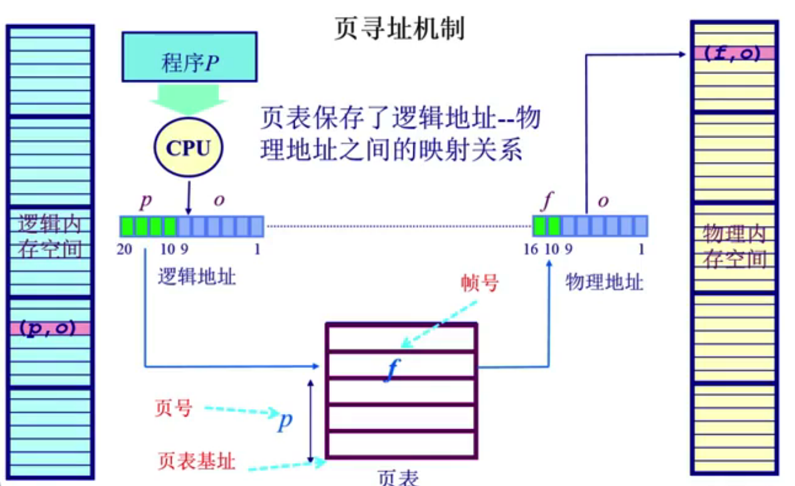
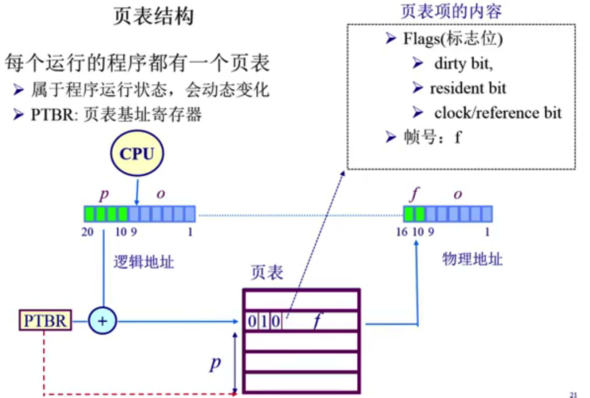
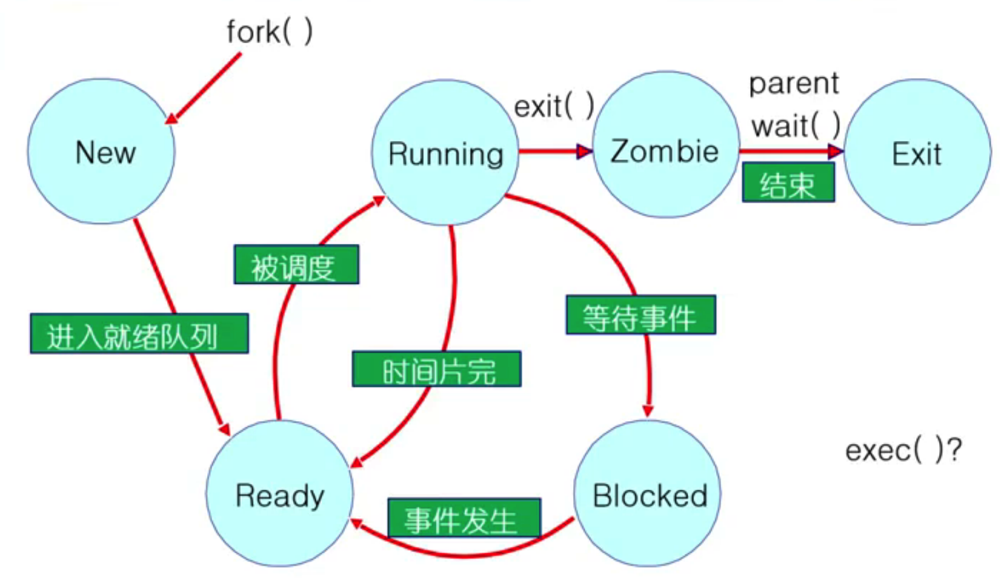
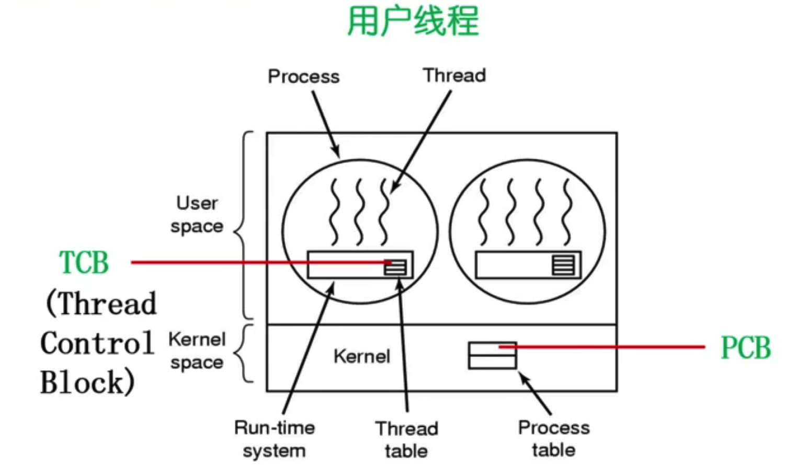
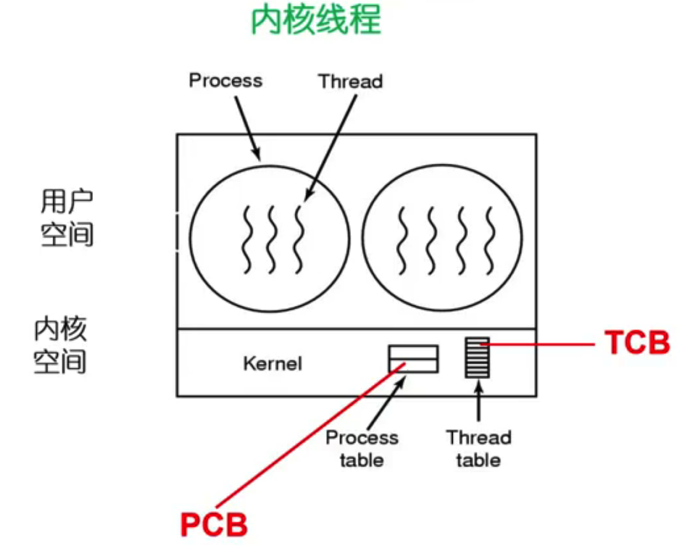
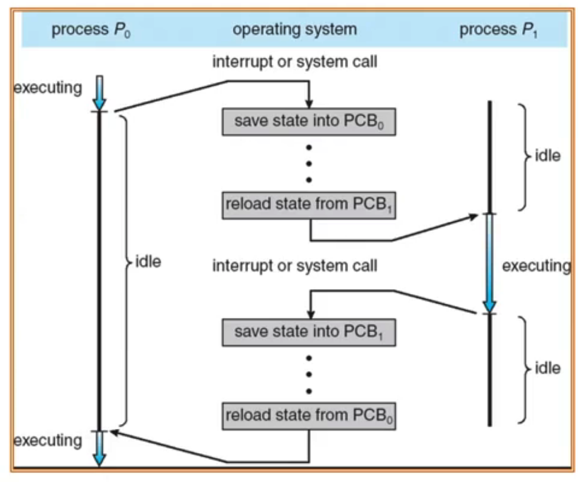

# 操作系统

## 结构

- 单体架构
- 微内核架构

## 启动

- BIOS检查外设设备是否可以工作，如果检查没有问题，从disk上加载bootloader（512byte）到内存中
- bootloader负责从disk上加载os到内存中，跳转到os的起始地址

## 交互

### 中断

- 来自于不同的硬件设备的计时器和网络的中断
- 处理过程
  - 硬件（外设）
    - 设置中断标记，将中断id发送给操作系统
  - 软件（操作系统）
    - 保存应用程序当前执行现场
    - 通过中断id查找到处理中断事件的中断服务例程，跳到中断服务例程处理中断
    - 清除中断标记
    - 恢复应用程序当前执行现场

### 异常

- 非法指令或者其它坏的处理状态（如内存出错）
- 处理过程
  - 保存应用程序当前执行现场
  - 处理异常
    - 杀死进程
    - 重新执行异常指令
  - 恢复应用程序当前执行现场

### 系统调用

- 来源于应用程序，应用程序==主动==向操作系统发出服务请求
- WIN32 API和POSIX API
- 开销：
  - 中断、异常、系统调用和对应的处理服务例程的映射表初始化开销
  - 应用程序堆栈和操作系统堆栈的切换
  - 用户态和内核态的切换

### 比较

#### 源头

- 中断：外设
- 异常：程序意想不到的行为
- 系统调用：应用程序主动发起

#### 处理时间

- 中断：异步
- 异常：同步
- 系统调用：同步或者异步

## 内存管理

### 内存层次结构

### 内存管理的目标

- 抽象，维护物理地址和逻辑地址的映射
- 保护，地址安全检查，保证进程间的地址空间相互隔离
- 共享，不同应用程序访问相同内存
- 虚拟化，当内存空间不足时，将暂时不需要内存空间的数据放到磁盘上，将内存空间留给最需要的应用程序

### 地址空间

- 逻辑地址空间
  - 应用程序支持的地址空间
- 物理地址空间
  - 硬件支持的地址空间

### 连续内存分配

#### 内存碎片

#### 分配策略

- 首次适配
- 最佳适配
- 最差适配

#### 碎片整理

- 压缩式
- 交换式

#### 连续内存分配的问题

- 分配给一个应用程序的物理内存是连续的，会导致内存利用率较低，产生较多的内碎片和外碎片问题

### 非连续内存分配

#### 非连续内存分配的优点

- 分配给一个应用程序的物理内存是非连续的，更好的内存管理和利用
- 允许共享数据
- 支持动态加载和链接

#### 解决方案

##### 分段

- 采用分段技术，将连续的逻辑地址空间映射到非连续的物理地址空间
- 段寻址方案
  - 操作系统负责维护段表，表的下标即为段号，值包含段起始位置和长度（段的长度是可变的）
  - CPU访问时先根据段号从段表查询得到段起始位置和长度，然后找到物理内存中段的位置，然后再根据偏移找到具体的地址

##### 分页

###### 页帧

- 物理内存地址被分割为大小相同的帧，每一个物理地址用(f,o)表示，f表示页帧号，用F位表示，共有2^F^ 个帧。o表示偏移，用S位表示，每一帧的大小是2^S^字节。
- 物理地址计算公式=2^S^\*f+o

###### 页

- 逻辑内存地址也被分割为大小相同的页，页的大小（偏移）和页帧的大小相同，页号不一定等于页帧号
- 逻辑地址计算公式和物理地址是一样的

###### 页寻址机制

- 操作系统负责维护页表，表的下标即为页号，值是帧号（页和帧的长度是相同的）
- CPU访问时先根据页号从页表查询得到帧号，然后根据公式计算得到物理地址
- 页表机制也可以保证不同进程无法相互访问各自独立的内存地址空间，保证了进程的隔离性

###### 页表

###### 分页机制的性能问题

- 页表可能会非常大，而且每个程序都会需要有自己独立的一个页表
- 页表体积过于大导致无法全部放入CPU加速，只能放到内存中，这会导致每次访问内存数据会需要两次内存访问开销（一次访问页表，一次访问数据）

###### 页机制性能优化

- 使用TLB缓存页表热点数据，通过TLB缓存直接通过页号获取帧号，加速页寻址速度
- 采用二级或多级页表，这样可以极大减少不存在的映射关系的页表项占用的内存空间
- 采用反向页表，使得页表的大小跟逻辑地址无关，只跟物理地址相关，极大降低内存占用开销

## 进程管理

### 概念

- 一个具有一定独立功能的程序在一个数据集合上的一次动态执行的过程
- 进程包含了一个正在运行的程序的所有状态信息
- 进程和程序的关系
  - 程序是进程的基础
  - 程序的每次运行构成不同的进程
  - 进程是程序功能的体现
- 进程和程序的区别
  - 进程是动态的，程序是静态的
  - 进程是暂时的，程序是永久的

### PCB（进程控制块）

- PCB是操作系统用来描述进程运行状态的信息集合，是进程存在的唯一标志
- 操作系统通过管理PCB来管理进程

#### 内容

- 进程标识信息
- 处理机状态信息保存区
- 进程控制信息

#### 组织形式

- PCB一般采用链表组织，因为进程可能需要频繁的创建和销毁，链表效率更高

### 进程状态

#### 进程生命周期

#### 进程状态变化

#### 进程挂起

#### 状态队列

### 线程

#### 概念

- 进程中一条执行流程
- 进程的功能分为两部分：对资源（文件、代码段、数据段等）（管理功能）+线程（执行功能）
- 进程中的资源，文件、代码段、数据段等资源是所有线程共享的，寄存器和栈是线程独占的

#### 实现

##### 用户线程

- 线程机制不依赖操作系统内核，由用户态的线程库完成对线程的管理
- TCB维护在内核态，线程切换不需要用户态到内核态的切换，系统开销较小
- 缺点
  - 如果一个线程发出阻塞请求，整个进程都会被阻塞
  - 除非一个运行中的线程主动交出CPU调度权，否则该进程中其它线程无法运行

##### 内核线程

- 由操作系统内核完成对线程创建、销毁和管理，TCB维护在内核态
- 每一次线程切换（TCB内容切换）会需要有一个用户态到内核态的切换，系统开销较大

##### 轻量级进程

- 内核支持的用户线程。一个进程有多个轻量级进程，每一个轻量级进程包含一个单独的内核线程

#### 优点

- 线程创建和终止的时间会比进程短，因为进程共享资源不需要额外初始化
- 同一个进程内的线程切换时间比进程短，因为不需要切换页表上下文
- 同一个进程内的线程共享内存空间和文件资源，通信开销小

#### 缺点

- 因为同一个进程内所有线程共享同一个地址空间，所以一个线程崩溃可能会导致一个进程内所有线程都崩溃

### 进程上下文切换

### 进程控制

- fork()
  - 创建一个新进程，复制当前进程的数据、代码、PCB内容（pid是新生成的）
- exec()
  - 加载新的程序覆盖当前进程内容（数据、代码、堆、栈）

- copy on write对fork进行优化
  - 执行fork()的时候只会复制父进程中必要的元数据信息，父子进程共用同一块地址空间，当子进程真正进行写操作时，才会真正触发复制操作，降低系统复制数据的开销
- wait()
  - 父进程等待子进程执行完成后，释放子进程在内核空间中资源，主要是子进程的PCB

- exit()
  - 释放子进程在用户态的资源，同时会将结果返回给父进程
  - 僵尸进程

### 进程间合作

- 进程间通信IPC

- 同步通信和异步通信

### 进程同步

#### 临界区问题

#### 进程同步算法

#### 信号量

#### 经典同步问题

- 生产者-消费者问题
- 读者-写者问题
- 哲学家就餐问题

### 死锁

#### 死锁发生必要条件

#### 死锁预防

#### 死锁避免

#### 死锁检测和恢复

## CPU调度

### CPU调度器

从内存中一对准备就绪的进程中（就绪队列的就绪进程）选取一个进程，将CPU分配给该进程。

- 抢占式

- 非抢占式

  自愿交出CPU调度权

### CPU分配器

### CPU调度算法

- FCFS（先到先服务）调度算法
- （抢占式和非抢占式）SJF（最短调度时间）算法
- HRN（最大响应比）算法
- 优先权法 可能会导致进程饥饿问题
- 轮转法 时间片大小的选择 响应时间优于SJF
- 多层队列调度

## 线程

- 表达程序运行线索 
- 共享内存空间
- 减少上下文切换开销

## 内存管理

### 页式存储

### 段式存储

## 虚拟存储

### 按需调页

### 缺页中断

### 页面置换

#### 算法

- FIFO算法

- Optimal算法

  置换掉接下去最长时间不被引用的页面，最优算法，但是实际实现不了

- LRU算法

  - 置换最近最长时间不被引用的页面
  - 实现
    - 为每一个页表项设置一个计数器，每次引用页面时，计数器更新为当前的时钟值。调用置换算法时，选取计数器最早的页面换出。
    - 利用堆栈实现，每一次引用一个页面，将页面提到栈顶，则栈底的页面为最长时间未被引用的页面，换出。

- 近似LRU算法-Clock算法

### 页面分配

### 系统抖动

## 文件系统

### FCB

### 虚拟文件系统VFS

### EXT2/3文件系统

### 目录实现

### 磁盘空间分配

- 连续分配

  - 支持随机访问
  - 会产生碎片，不利于空间扩展

- 链接分配

  - 不支持随机访问

  - 太依赖数据块中的指针，要求磁盘设备可靠性好，容易造成数据丢失

- 索引分配

### 磁盘调度

#### 磁盘调度算法

### 磁盘管理

