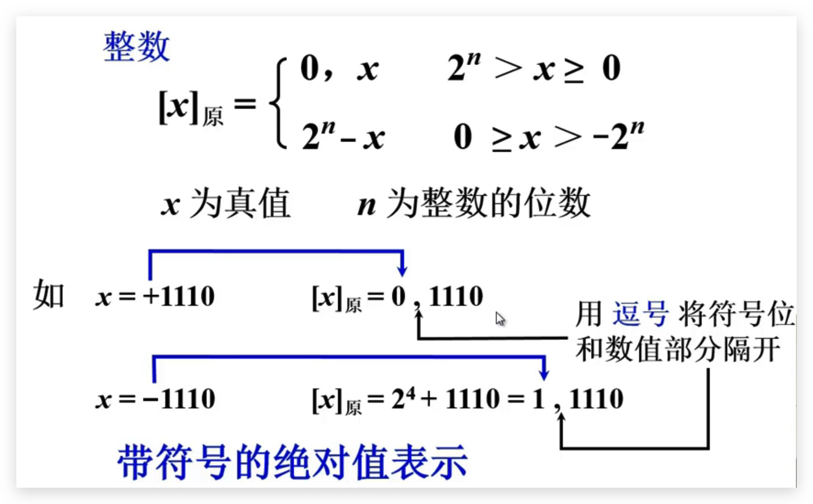
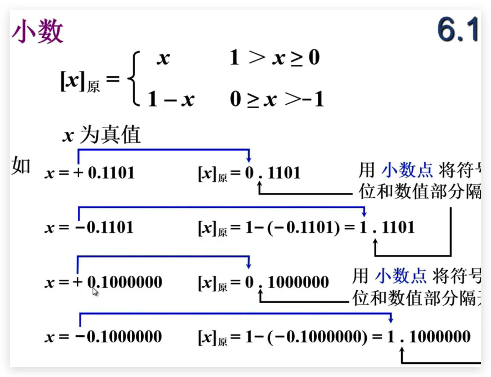
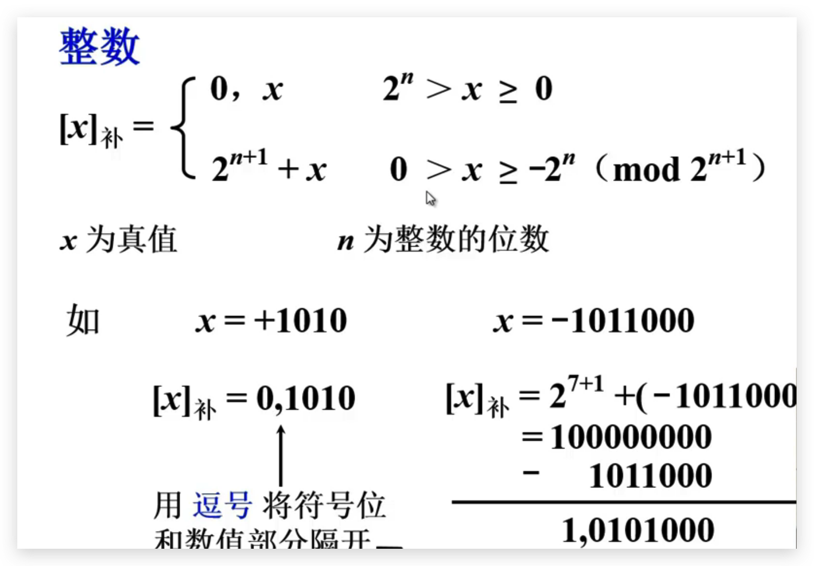
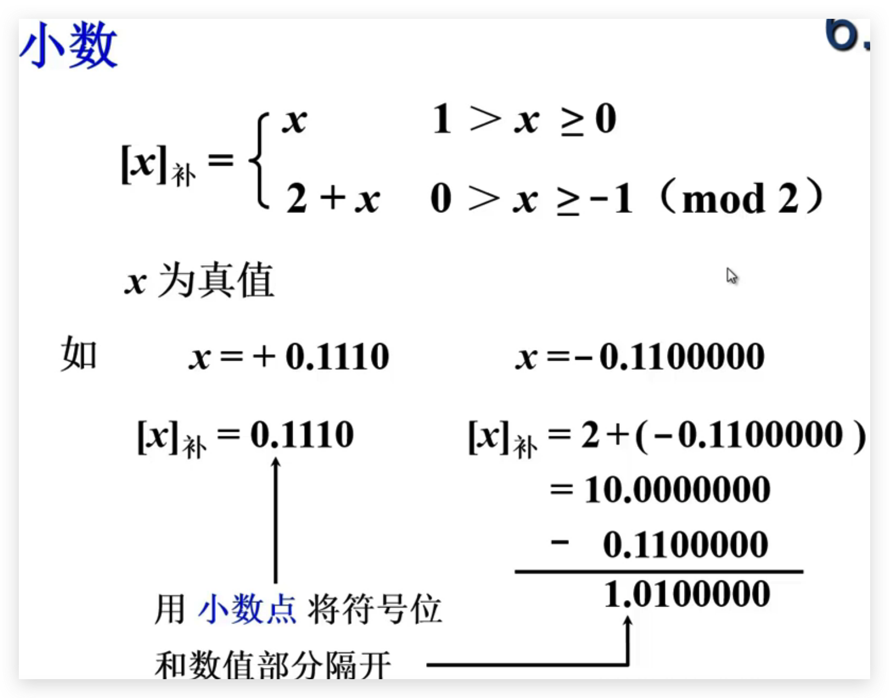
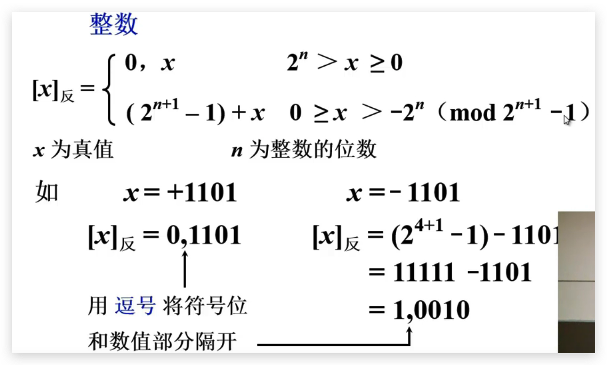
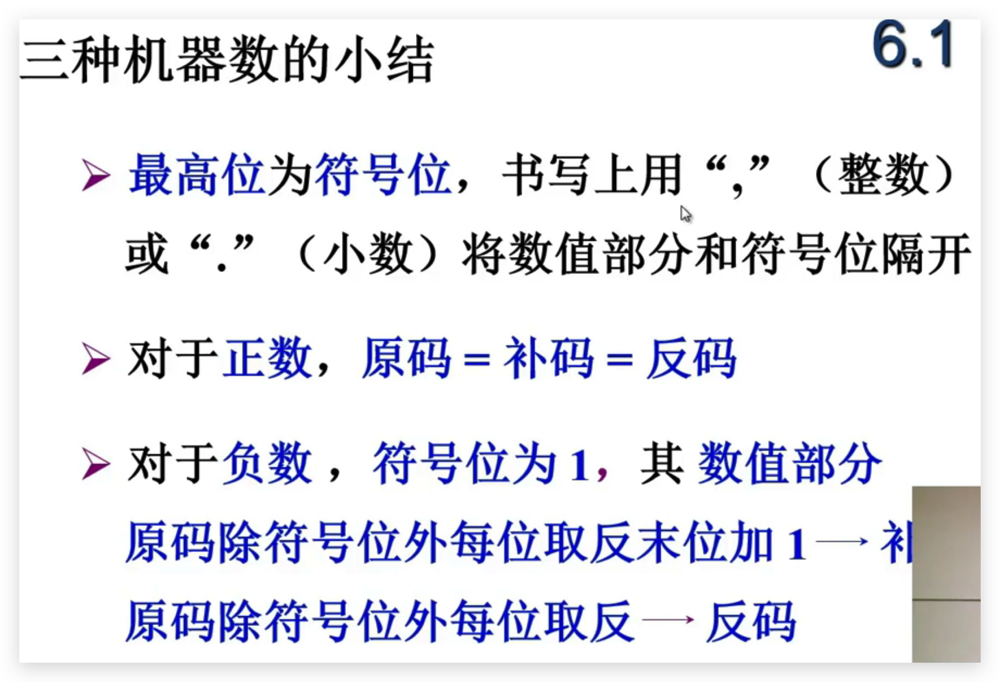
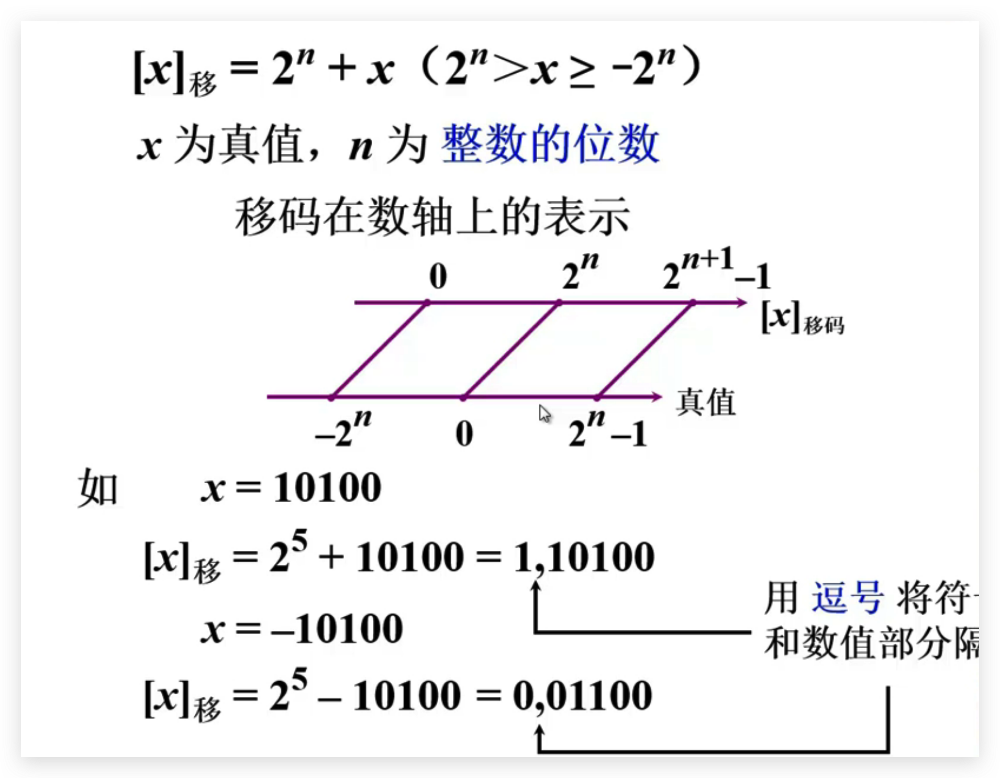
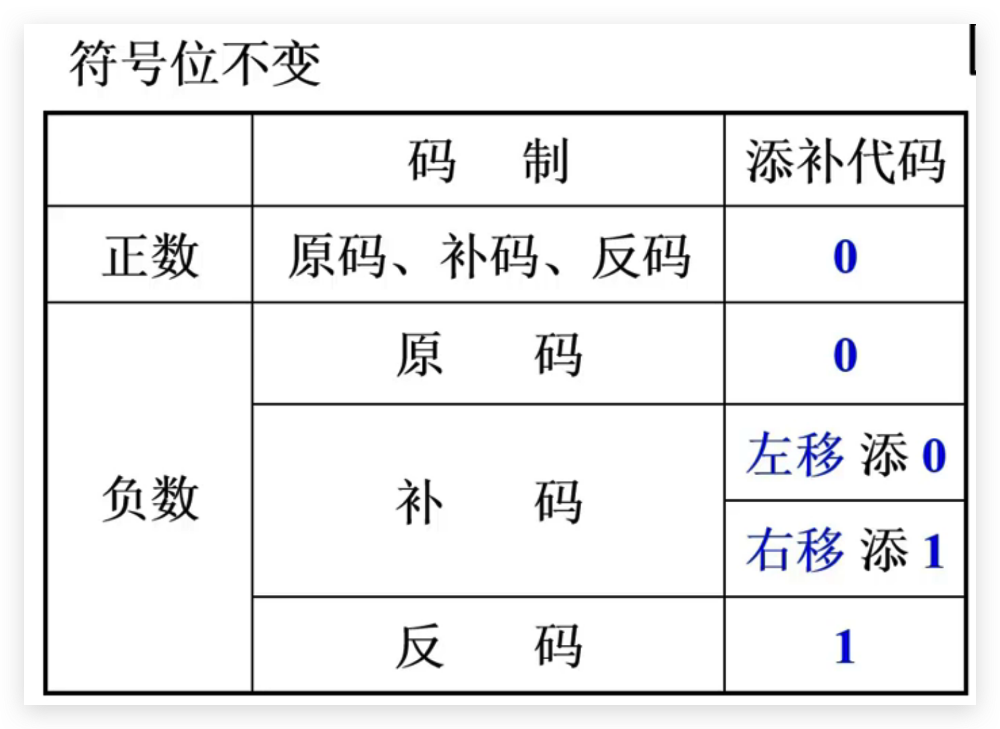

## 计算机基本组成

## 计算机中的数字

### 数的表示

####  无符号数

- 寄存器的位数反映无符号数的表示范围

#### 有符号数

- 机器数和真值

- 原码表示法

  

  ​	

- 补码表示法

  - 一个负数加上模即得到该负数的补数，一个正数和一个负数互为补数时，它们的绝对值之和为模数。
  - 正数的补数即为其本身。

- 反码表示法

- 移码表示法
  - 移码和补码之间只差了一个符号位。

​		

- 

#### 数的定点表示和浮点表示

- 引入浮点数表示的原因
  - 编程困难，需要手动调节小数点位置
  - 表示范围小，为表示大小差距很大的数据，需要很长的机器字长
  - 数据存储单元利用率很低

### 运算方法

#### 定点运算

##### 移位运算

- 移位运算规则

  

- 算术移位硬件实现

- 算术移位和逻辑移位

##### 加减法运算

##### 乘法运算

##### 除法运算

#### 浮点运算

### 运算器设计

