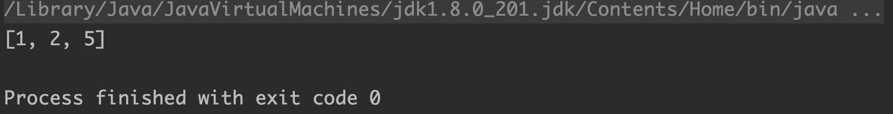
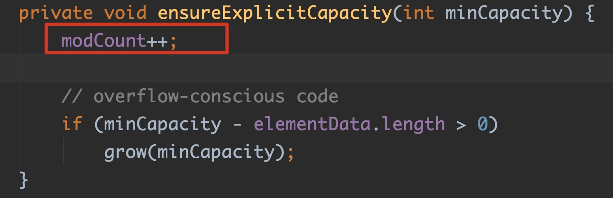
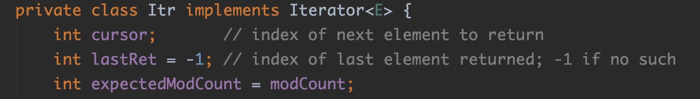
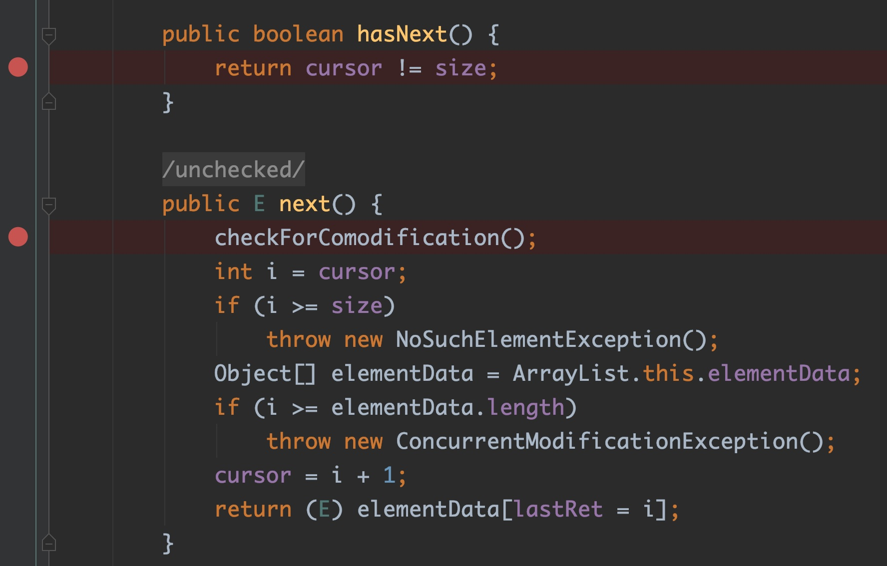
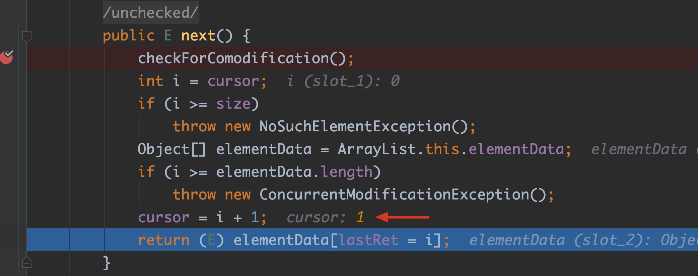
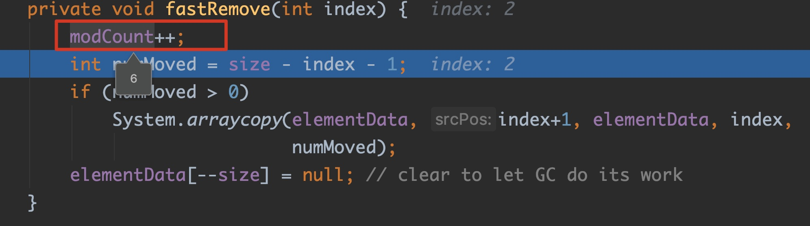
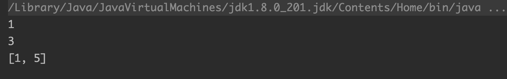
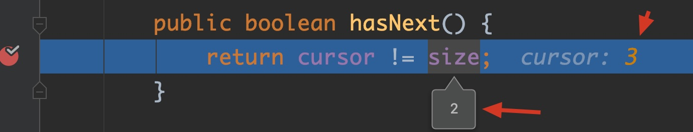

# 深入理解Java集合中的Iterator

## 问题由来

之所以今天想写这篇文章完全是一个偶然的机会。昨晚，微信技术群里的一位猿友@我，问了我一个问题，代码如下。他问我，这样写有没有问题，会不会报错？然后他说这是他今天去面试的面试官出的题目，结果他没回答出来。😅

```java
public class CollectionDemo {
    public static void main(String[] args) {
        List list = new ArrayList();
        list.add("1");
        list.add("3");
        list.add("5");

        for (Object o : list) {
            if ("3".equals(o))
                list.remove(o);
        }
        System.out.println(list);
    }
}
```

我当时没仔细想，感觉挺简单的问题，😏但定睛一看，这个是在一个增强for循环中执行了一个list的remove方法。有点Java基础的基友们肯定都知道，用迭代器方式遍历集合元素时，如果需要删除或者修改集合中元素，必须要使用迭代器的方法，绝对不能使用集合自身的方法。我也一直把这句话视为铁律。于是我断定，这个代码是有问题的，肯定会报错的。然后我噼里啪啦一顿操作猛如虎，把这段代码敲了一遍，一顿运行......输出结果如下：


结果傻眼了，居然正常输出没有报错，而且结果还是正确的！于是我又改动了一下代码，如下：

```java
public class CollectionDemo {
    public static void main(String[] args) {
        List list = new ArrayList();
        list.add("1");
      	//其余代码都没有修改，就在list.add("3");之前添加这一行
        list.add("2");
        list.add("3");
        list.add("5");

        for (Object o : list) {
            if ("3".equals(o))
                list.remove(o);
        }
        System.out.println(list);
    }
}
```

输出结果如下：



发现结果还是正确的。

于是我又改动了一下代码，如下：

```java
public class CollectionDemo {
    public static void main(String[] args) {
        List list = new ArrayList();
        list.add("1");
        list.add("2");
        list.add("3");
      	//其余代码都没有修改，就在list.add("3")之后添加这一行
        list.add("4");
        list.add("5");
        for (Object o : list) {
            if ("3".equals(o))
                list.remove(o);
        }
        System.out.println(list);
    }
}
```

输出结果如下：


这一次终于出现了期待已久的报错。

真的是奇哉怪也，居然会有如此不同的运行结果？！ 这下让我意识到了问题的严重性，这个问题并没有以前理解的那么简单。再加上自己打破砂锅问到底的性格，于是决定好好来研究一番，顺便写点东西，一方面自己以后可以回顾，也可以和各大佬交流技术，不亦乐乎？😎

## 源码分析

### ConcurrentModificationException

追根溯源，既然程序抛出该异常，那么当然先要把这个异常搞清楚。秉承学技术一看官方文档二看源码的习惯，我就看了一下ConcurrentModificationException的javadoc，原文非常长，这边贴一部分关键的，有兴趣的可以自己去翻阅JDK源码。

```java
/**
 * This exception may be thrown by methods that have detected concurrent
 * modification of an object when such modification is not permissible.
 
 * For example, it is not generally permissible for one thread to modify a Collection
 * while another thread is iterating over it.Some Iterator
 * implementations (including those of all the general purpose collection implementations
 * provided by the JRE) may choose to throw this exception if this behavior is
 * detected.  Iterators that do this are known as <i>fail-fast</i> iterators,
 * as they fail quickly and cleanly, rather that risking arbitrary,
 * non-deterministic behavior at an undetermined time in the future.
 
 * Note that this exception does not always indicate that an object has
 * been concurrently modified by a <i>different</i> thread.  If a single
 * thread issues a sequence of method invocations that violates the
 * contract of an object, the object may throw this exception.  For
 * example, if a thread modifies a collection directly while it is
 * iterating over the collection with a fail-fast iterator, the iterator
 * will throw this exception.
*/
```

​		这一大段话大概意思是说，这个异常可能会在检测到一个对象被做了不合法的并发修改，比如jdk自带的集合通常会内置一个fail-fast类型的迭代器，当集合检测到这类不合法的并发修改，就会抛出该异常。所谓的fail-fast，顾名思义，就是当检测到有异常时，越快抛出异常结束越好，以免将来带来未知的隐患。另外这段话还说了，这个异常并不是像名字那样只会出现在多线程并发修改的情况下，在单线程下也会出现。

​		然并卵，看了半天文档还是一脸懵逼。这到底说的是什么鬼？

​		没关系，控制台除了抛出这个异常，还提示了具体的异常抛出的位置，在`java.util.ArrayList$Itr.next()`内部的`checkForComodification()`方法。定位到ArrayList源码指定位置，如下图标识红框位置：


这个方法的逻辑非常简单。


那modCount和expectedModCount又是何方神圣？跟着来到定义他们的地方。

### modCount

modCount是定义在AbstractList（ArrayList的父类）里面的一个属性。这个属性的javadoc也是相当长，我挑选一部分给大家看一下。

```java
/**
* The number of times this list has been <i>structurally modified</i>.
* Structural modifications are those that change the size of the
* list, or otherwise perturb it in such a fashion that iterations in
* progress may yield incorrect results.

* <p><b>Use of this field by subclasses is optional.</b> If a subclass
* wishes to provide fail-fast iterators (and list iterators), then it
* merely has to increment this field in its {@code add(int, E)} and
* {@code remove(int)} methods (and any other methods that it overrides
* that result in structural modifications to the list).  A single call to
* {@code add(int, E)} or {@code remove(int)} must add no more than
* one to this field, or the iterators (and list iterators) will throw
* bogus {@code ConcurrentModificationExceptions}.  If an implementation
* does not wish to provide fail-fast iterators, this field may be
* ignored.
*/
protected transient int modCount = 0;
```

大概意思是，这个字段的值是用来记录list被结构性操作的次数。何为结构性操作？就是对List的容量有影响的或者迭代过程中会导致错误结果的操作。而子类可以使用这个字段的值来实现fail-fast。如果要实现fail-fast，需要在所有结构性操作的方法内部做`modCount++`操作，并且每个方法内部只能增加一次。如果不想实现fail-fast就不需要这个值的。比如ArrayList的add方法里面就有`modCount++`操作，如下图所示：



### expectedModCount
再来看看expectedModCount。expectedModCount是定义在`java.util.ArrayList$Itr`里面的属性，并且会将ArrayList的modCount的值作为其初始化值。



看到这里是不是有点感觉了？也就是正常情况下，ArrayList初始化后，内置的Itr也跟着初始化，并且expectedModCount和modCount是保持一致的。如果没有进行迭代操作，自然是不会出现不一致的问题，也就不会抛出ConcurrentModificationException。那我们的程序到底为什么会导致这两个值不一致呢？此时，不使用大招——debug我反正是无计可施了。因为我们的程序中使用了一个增强forEach循环，其实forEach可以看做是jdk一个语法糖，底层就是使用迭代器实现的。所以为了看清楚，我们在`java.util.ArrayList$Itr`的方法上都加上断点。如下图：



我们就以开头的那三个例子最后一个报错的为例，开始debug。

刚开始list添加了5个元素，size等于5。由前面得知，add操作属于结构性操作，会导致`modCount++`。


Itr迭代器的游标cursor值会从0开始随着元素的遍历移动。hasNext()通过判断`cursor != size`来确定list是否还有下一个元素取出。如果返回true，则会进入next()用来返回下一个元素。


显然我们有5个元素，可以进入next()。而在next方法中，第一行代码就是checkForComodification()用来校验expectedModCount和modCount的一致性。显然从List添加完元素到现在为止，我们没有再对list有过额外的结构性操作，自然前面3次迭代都不会抛出异常，正常返回元素。都如图所示。


并且每次执行完next()后，cursor会往后移动一位，为迭代下一个元素做准备。



这个时候轮到迭代第三个元素"3"了。自然if条件判断成立，会进入删除操作。


跟进remove()方法源码中，确实发现了`modCount++`。也就是说，这个时候modCount值已经变成6了。而expectedModCount依然还是保存着初始值5。此时两者不一致了。




因为list在“3”之后还有“4”，“5”两个元素，因此当删除“3”元素之后，迭代器还会继续迭代，重复之前的流程，会先进入hasNext()，此时cursor等于3，size等于4，自然还是满足的，所以还是会继续进入next()取出下一个元素。


可以预料此时checkForComodification()校验expectedModCount和modCount已经不一致了，所以抛出了ConcurrentModificationException。


### 初步总结

也就是说，在forEach或者迭代器中调用对集合的结构性操作会导致modCount值发生修改，而expectedModCount的值仍然是初始化值，所以在next()中校验不通过抛出异常。这也是为什么以前刚学习迭代器的时候，各大佬叫我不要在迭代器迭代过程中使用集合自带的remove等操作，而要使用迭代器自带的remove方法，原因就在于此。那为什么使用迭代器自带的remove方法就不会报错呢？如下代码：

```java
public class CollectionDemo {
    public static void main(String[] args) {
        List list = new ArrayList();
        list.add("1");
        list.add("2");
        list.add("3");
        list.add("4");
        list.add("5");
        for (Iterator it = list.iterator(); it.hasNext(); ) {
            if ("3".equals(it.next()))
                it.remove();
        }
        System.out.println(list);
    }
}
```

这是老师教的正确姿势。结果当然是正确的。


### 再探虎穴

要搞清楚这中间的区别，当然还是需要深入虎穴，再去看看List迭代器remove方法的源码了。下面代码中主要关注红框的2行，第一行作用是删除被迭代的元素，`ArrayList.this.remove`这个是调用外部类ArrayList的remove方法，上面已经说过了，集合的remove方法是结构性操作，会导致modCount++的，这样等迭代下一个元素时，调用next()时校验expectedModCount和modCount一致性必然会报错，为了防止这个问题，所以下一行`expectedModCount = modCount`将expectedModCount更新至modCount最新值，使得一致性不被破坏。这也是为什么使用迭代器自带的remove方法并不会抛出异常的原因。


怎么样？是不是感觉大功告成了，感觉自己要飘了......

### 一鼓作气

然而，这只是解释了文章开头3个例子的最后一个，那为什么前两个可以正常删除没有报错？说实话，我当时遇到这问题的内心是崩溃到怀疑人生的。

还是没有好的办法，继续来debug一下前面的例子，看看会有什么不同的事情发生吧。

List中前面的元素的遍历过程和上面是一样的，不再赘述。直接看关键处，如下图，这个时候已经遍历到“3”这个元素了，即将开始remove操作，remove操作也和上面一样，会调用fastRemove()删除元素，fastRemove()也确实会执行`modCount++`，确实导致了`expectedModCount != modCount`。但是......


当将要迭代下一个元素的时候，还是会进入hashNext()做判断，很遗憾，这个时候cursor和size都是2，也就是hashNext()条件不成立返回false，也就不会再进入next()方法，自然也就不会再去调用checkForComodification()做校验，也就不会再有机会抛异常了。其实这个时候，list中最后一个元素"5"根本也就没遍历到。为了验证这一点，可以在for循环中添加输出代码：

```java
public class CollectionDemo {
    public static void main(String[] args) {
        List list = new ArrayList();
        list.add("1");
        list.add("3");
        list.add("5");

        for (Object o : list) {
            System.out.println(o);//输出正在迭代的元素
            if ("3".equals(o))
                list.remove(o);
        }
        System.out.println(list);
    }
}
```

会发现只会输出1和3。



事情还没完，最后再来一种情况，代码如下：

```java
public class CollectionDemo {
    public static void main(String[] args) {
        List list = new ArrayList();
        list.add("1");
        list.add("2");
        list.add("3");
        for (Object o : list) {
            if ("3".equals(o))
                list.remove(o);
        }
        System.out.println(list);
    }
}
```

猜猜结果是啥？有人会认为，不是和文章第一个例子一模一样的吗？那就是成功删除了啊，输出1和2啊。呵呵🙄，让您失望了。


是不是又怀疑人生了？其实有了前面这么多的铺垫，这个错误原因已经不难推断发现了。

原因还是在这里。前面“1”，“2”两个元素遍历完毕肯定是没问题的，当开始遍历“3”时候，通过next()返回元素“3”，cursor此时会增加到3，而size由于后面会调用remove减为2了，这个时候hasNext()里的条件返回true又成立啦！我的乖乖......所以Itr迭代器又会傻傻的去调用next()，后面的事情就都知道了，checkForComodification()又被调用了，抛出ConcurrentModificationException异常。



其实通过上述的整个分析过程，可以总结出一点结论：其实整个过程的问题关键所在就是`java.util.ArrayList$Itr`的hasNext()方法的逻辑。不难看出，每当迭代器返回一个元素时，元素在列表中的索引等于Itr的cursor值，而每次删除一个元素会导致`size--`，不难推断出，如果你要删除的元素恰好位于List倒数第二个位置，则并不会抛出异常，并且会显示正确的删除操作，就像文章开头第一个例子，其余情况都会抛出异常。但是就算是不抛异常的情况，其实此时List迭代器内部的expectedModCount 和modCount一致性已经遭到了破坏，只是被掩盖了，所以这样的操作后续可能会有非常大的隐患，个人不建议这样使用，需要在迭代过程操作集合的还是应该用迭代器的方法。

另外，其实除了ArrayList以外，会发现HashMap中也会有modCount属性，而在其相应的结构性操作方法内部，如put()、clear()等都会有对`modCount++`操作，而在HashMap内部也有一个内部迭代器HashIterator，内部会维护一个expectedModCount属性，其余的套路就都和ArrayList类似了。

--------

- **今天的技术分享就分享到这里，感谢您百忙抽出这么长时间阅读我的文章😊。**
- **另外，我的笔记还有文章也会在我的github上更新。**  
  - 这边我会不定期更新一些后端核心专题干货[https://github.com/dujunchen/BackEndCore](https://github.com/dujunchen/BackEndCore)
  - 这边我会不定期更新一些读书笔记  [https://github.com/dujunchen/ReadingNotes](https://github.com/dujunchen/ReadingNotes)