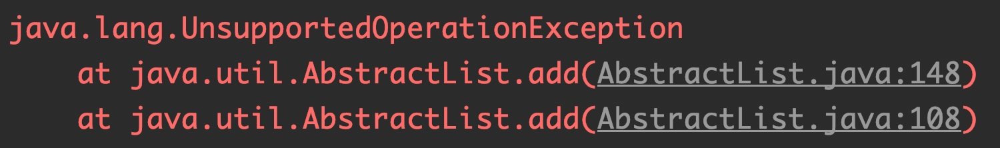
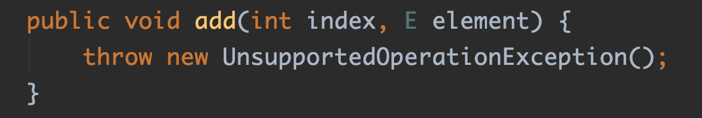
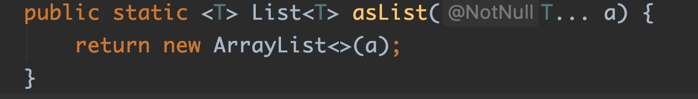
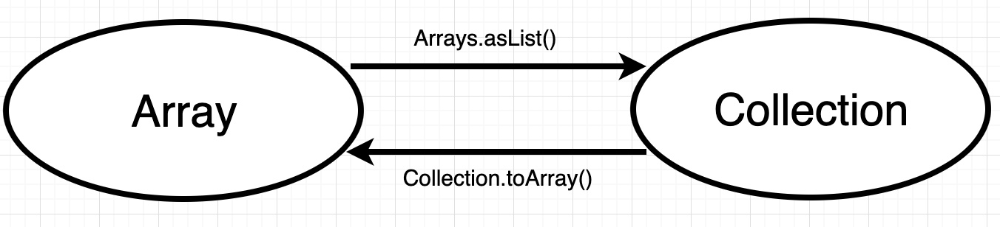
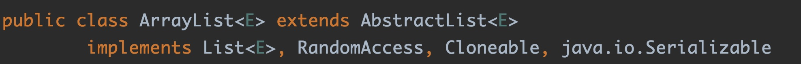
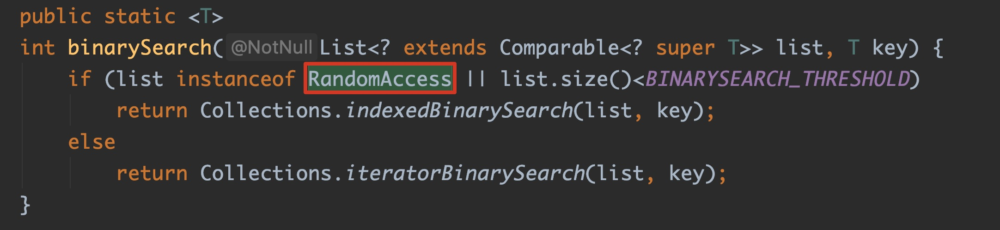

# 别再这样使用List了，会坑到你哭！

哈喽，各位朋友您们好，没想到这么快又跟大家见面了，因为这次写这篇文章又完全是一个偶然的机会——一次无意的踩坑，这坑倒不是什么特别牛逼深入的东西，很多大佬们估计都知道，说出来还有点low，但是我之前并不知道......😭所以浪费了不少时间，比较郁闷。再加上我相信肯定还是有一些朋友是不知道的，所以这一切都致使我想写点什么，帮助后来人避免踩坑。

## 问题描述

估计很多人都知道Arrays这个工具类吧？顾名思义，这个工具类中都是封装对Java数组对象的操作，比如二分查找、拷贝数组、排序、流操作等非常实用功能，但是我今天要说的是其中的asList()方法f。这个方法可以很轻松方便地将一个可变参数（本质就是数组）转换成一个List，相信很多朋友也和我一样这样使用，毕竟这样比先new一个List再往里面添加元素要方便很多。以前我也一直是这样想的，一直这样偷懒着用，舒服~😎常在河边站，哪有不湿鞋，直到昨天......

昨天闲得蛋疼，无意中写了如下代码，没想到这一写，写出来了个猝不及防...... 

```java
List<String> ls = Arrays.asList("1", "2", "3");
//MetaObject是一个Mybatis里面的一个封装对象的工具类，封装后可以使用类似OGNL一样操作对象的属性，这个我从Mybatis里单独提取出来放github上了，有兴趣的可以玩玩。
//这个不是今天的重点，此处可以忽略。
MetaObject metaObject = SystemMetaObject.forObject(ls);
metaObject.add("4");
System.out.println(ls);
```

上面这段代码貌似一看没啥问题，就是往一个List中add一个新元素呗，这能有啥问题啊？结果报错了......😭



报错了没啥稀奇的，学Java的要是没报过几个Bug都不好意思说自己是搞技术的，但坑爹的是，这错有一定的迷惑性。其实看报错提示，如果是细心的人就会产生一个疑问？报错的位置居然是在`AbstractList.add()`!?震惊！没错，在AbstractList.add()这里确实啥也没实现，只会报出该异常，该方法是需要由各实现类各自实现的。

> <font size=4>那为什么错误会从这个地方抛出来的？Arrays.asList()这个玩意返回的到底是个什么List类型啊？</font>




## 深入源码分析

于是，我自然是毫不犹豫地进入`Arrays.asList()`方法源码看，如下，奇怪，这不是一个ArrayList吗？可是`ArrayList.add()`是实现了`AbstractList.add()`的方法的啊，怎么还会报这个错呢？



就这么一个极其简单，事后回想起来都觉得很无语的一个问题，整整困了我半个多小时啊......

其实这个问题相当的简单，如果这个时候能再往里深入点一下，就知道其中的坑爹之处，其实此ArrayList

非彼ArrayList......这里面的这个ArrayList类只是Arrays类中的一个私有静态内部类。这个类确实继承了AbstractList类，但是并没有去实现其add()方法，所以会直接抛出UnsupportedOperationException。其实这个问题相当简单，不过既然被这个类坑了，索性我们就再全面了解一下这个类的内容吧。


其实，这个类中只是实现了AbstractList的一部分方法，而且绝大部分方法都是读取操作，比如上面说的add()操作并未实现，自然也就失去了ArrayList该有的动态伸缩的功能。因此，不难得出结论，以前为了偷懒一直使用的`Arrays.asList()`确实可以返回一个List类型，但是这个List长度并不可变，没法像ArrayList那样做到动态伸缩，实现了set()方法可以做修改操作，但也仅限于你传入的数组范围，超过后会像数组一样抛出`java.lang.ArrayIndexOutOfBoundsException`。所以本质上返回的其实还是一个数组。

mmp......太坑爹了，那么设计JDK的大佬为何要设计这么一个坑爹的玩意呢？专坑我这样的菜鸟......😭不过郁闷归郁闷，还是要搞清楚这样设计的初衷啊不是？其实，Arrays.asList()这个方法的真正意义是在于连接Java中的数组对象和Java集合的API，跟`Collection.toArray()`是一对兄弟。他们的关系如下图表示。



所以，如果我们需要将一个数组（或者可变参数）转成一个List，正确操作姿势是如下代码所示：

```java
List<String> ls = Arrays.asList("1", "2", "3");//或者是new String[]{"1", "2", "3"}
List<String> ls2 = new ArrayList<>(ls);
ls2.add("4");
System.out.println(ls2);
//输出结果：
[1, 2, 3, 4]
```

哈哈，这时你得到的就是一个真正的ArrayList了，自然所有List相关操作都能正常执行了，其实这里面可以引申出一种设计模式——**适配器模式**，当然这边不是讲设计模式，不展开，后续会开启一系列关于设计模式的文章，希望到时大家期待。这边客户端需要使用当前的接口（List）去对原有不兼容的接口（数组）操作，而Arrays.asList()恰好充当了适配器的角色，为数组和集合的转换提供了一个桥梁。其实是自己用错该方法，错怪设计JDK API的大佬了......🤦‍♂️

## 知识延伸

既然说到了List，不妨再给大家引申个内容，我们发现`Arrays$ArrayList`除了继承了AbstractList，以及实现了我们熟悉的`java.io.Serializable`，还另外实现了一个`RandomAccess`接口，我就顺便聊聊这玩意，毕竟我以前没了解过这玩意，估计大部分人也和我一样。点进去会发现，这个接口是个标记接口，里面啥东西都没有，JavaDoc倒是写了很多。基本大意是说，这个标记接口用来声明可以快速随机访问的List。这边就引申出2个问题，

> <font size=4>什么是随机访问的List？用这个接口声明为随机访问的List有什么卵用？</font>

学过List的都知道，常用的List主要有两个：ArrayList和LinkedList。这两者的区别相信不用我再赘述了，这也是面试题的高频选择。这两者最大的区别就是底层实现。ArrayList采用数组实现，而LinkedList采用链表。有点数据结构基础的人都知道数组在内存中是连续分配的，所有元素紧密排列，我们可以使用数组索引快速定位到该数组中任意一个元素。这种结构特点导致数组结构查询效率极高，时间复杂度O(1)。链表就刚好相反，每个元素使用节点保存，节点和节点之间采用指针连接，所以要查询链表中某一元素，必须从表头元素依次向后遍历，导致其时间复杂度最差O(n)。

就是因为ArrayList和LinkedList的实现本质存在如此大的差异，所以聪明的JDK设计者在JDK API设计有关他们的算法时就会区别对待，这中间就是使用到了`RandomAccess`接口。

我们先来看看ArrayList和LinkedList的源码，细心的人会发现，ArrayList实现了`RandomAccess`，而LinkedList并没有，这是为什么呢？这就跟我前面说的两者的差异性有关系了。




所谓的随机访问，就是指像数组这种结构，无论需要查找其中哪个元素，这个元素出于什么位置，都是O(1)复杂度，效率非常高。这类List称之为可以随机访问的List，如ArrayList。而LinkedList则显然不是。

><font size=4>那用这个接口声明为随机访问的List到底有什么卵用呢？这只是一个空接口而已啊？</font>

这里先跟大家聊一下标记接口。标记接口也叫空接口，顾名思义，这些接口不包含任何方法和属性，仅仅作为标记使用，那到底是标记啥？标记它属于某一个特定的类型。Java中最典型的标记接口有*`java.io.Serializable`*，  *`java.lang.Cloneable`*。标记接口的唯一目的就是后续在一些算法中可以使用*`instanceof`*进行类型查询。当然在JDK引入注解之后，这个功能也可以被标记注解替代了。同理，标记注解不包含成员。标记注解的唯一目的就是标记声明，后续可以使用*`isAnnotationPresent()`*方法进行查询。

><font size=4>那`RandomAccess`接口到底在哪里有使用到？</font>

Collections是JDK中一个非常实用的集合操作工具类，里面封装实现了大量对Java集合框架的操作，包括查找、排序、遍历、比较等功能。在这个类中，我们可以发现有大量`RandomAccess`接口的身影。我们以其中的`binarySearch()`方法为例，其余的方法大家有兴趣可以自己研究。



这是一个二分搜索方法。可以清晰的看出，这边使用`RandomAccess`接口来区别不同的List类型，并执行不同的算法。具体的算法实现不是我们这边的重点。不难得出结论，当一个List如果是实现了`RandomAccess`（比如ArrayList）或者元素个数<5000，就会采用索引方式遍历查找。否则会采用迭代器从头到尾遍历方式搜索。

其实`RandomAccess`接口的JavaDoc也提到了，如果是实现了`RandomAccess`接口的List，一般情况下采用索引遍历的性能会比直接用迭代器好一些，当然这是理论上的支持，具体实际测试情况，大家有兴趣可以自己性能测试一下结果，这边就不再赘述。

## 结束

从下次开始，我将会开始写GOF23所有设计模式一整个系列文章，其实之前我也做过一些笔记放在github上，不过有读者反映笔记太过精简，看不懂，而且个人觉得记笔记终归比不上文章来的深入全面，所以这次打算将其丰满成一系列文章，为保证质量，保持在一周到十天左右一篇的频率，敬请期待。😊

--------

- **今天的技术分享就分享到这里，感谢您百忙抽出这么长时间阅读我的文章😊。**
- **另外，我的笔记还有文章也会在我的掘金社区专题上更新。**  
我的掘金主页：[https://juejin.im/user/5cc3e604e51d456e7b3720fd/posts](https://juejin.im/user/5cc3e604e51d456e7b3720fd/posts)

