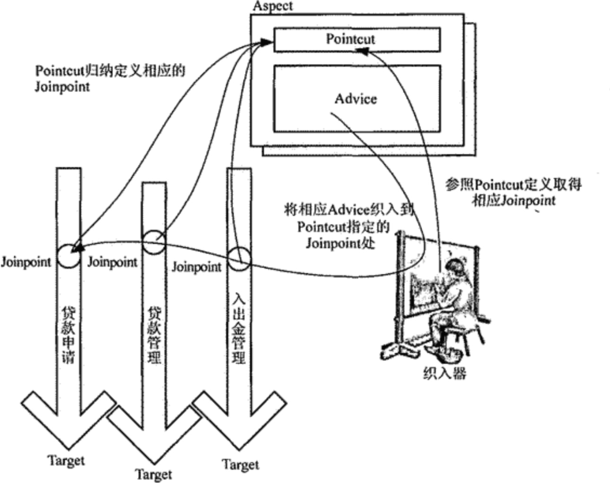

# Spring AOP

## AOP

- 静态AOP

  典型代表AspectJ，特点是采用特定的编译器ajc将Aspect以字节码形式织入系统各个功能模块，以达到融合Class和Aspect目的。优点是直接使用编译后的静态类执行，性能很好。缺点是灵活性不够，需求改变后需要修改Aspect定义文件并重新编译。

- 动态AOP

  大都采用Java语言实现，通过Java的动态特性实现。典型代表Spring AOP。AOP各种概念都是Java类体现，容易开发集成。与静态AOP最大的区别是，AOP织入过程是在系统运行开始后进行，而不是预先编译到系统类中，方便做修改调整。优点是灵活性和易用性比较好，缺点是会有一定的性能损失。

## Java平台实现AOP

- 动态代理
- 动态字节码增强
- 自定义类加载器
- AOL扩展

## AOP术语

- Joinpoint

  系统中将要进行织入操作的系统执行点。

- Pointcut

  - Joinpoint的表述方式，指定系统中符合条件的一组Joinpoint。
  - Pointcut表述方式有三种，指定方法名称、正则表达式、使用特定Pointcut表述语言（如AspectJ）。
  - Pointcut可以做一些逻辑运算。

- Advice

  织入的横切逻辑。

  - Before

    正常情况下不会中断程序，但是可以通过抛出异常中断流程。通过用来做一些系统初始化工作，如设置系统初始值，获取必要系统资源等。

  - After

    - After returning

      正常执行完成后才会执行。

    - After throwing

      执行过程中抛出异常才会执行。

    - After

      不管正常执行还是抛出异常都会执行。

  - Around

    Servlet中的Filter采用这种思想。

  - Introduction

    可以为原有对象添加新特性或者新行为。

- Aspect

- 织入器

  完成横切关注点逻辑到系统的织入。

- 目标对象

## Spring AOP

### 实现机制

采用动态代理和字节码生成技术实现。

### Pointcut

#### ClassFilter

Class级别类型匹配

#### MethodMatcher

方法级别拦截

#### 常用Pointcut实现类

### Advice

根据自身实例能否在目标对象类所有实例中共享，可以分为per-class类型和per-instance类型。

#### per-class类型Advice

自身实例可以在目标对象类所有实例中共享，只提供方法拦截功能，不会为目标对象类保存任何状态或者添加新的特性。

#### per-instance类型Advice

在Spring中，Introduction是唯一一种per-instance类型Advice。

在Spring中为目标对象添加新的属性或者行为都需要声明对应的接口和实现。然后通过拦截器IntroductionInterceptor将新的属性或者行为添加到目标对象中。

### Advisor

Advisor代表Spring中的Aspect。分为PointcutAdvisor和IntroductionAdvisor。

### Spring AOP织入器

#### ProxyFactory

ProxyFactory通过AdvisedSupport设置生成代理对象的信息，通过AopProxy返回最终生成的代理对象。

- AopProxy

  对不同的代理实现机制进行抽象。分为动态代理和CGLIB。

  

- AdvisedSupport

  封装生成代理对象所需要的信息。包括控制信息和必要信息。

  

#### ProxyFactoryBean

#### Spring AOP自动代理

- 原理

  Spring AOP自动代理建立在IOC的BeanPostProcessor。提供一个BeanPostProcessor，当对象实例化时自动创建代理对象并返回，而不是目标对象本身。

- InstantiationAwareBeanPostProcessor

  特殊的BeanPostProcessor，当检测到InstantiationAwareBeanPostProcessor类型的BeanPostProcessor，会直接通过它的逻辑构造对象并返回，不会走正常的对象实例流程。所有的xxxAutoProxyCreator都是InstantiationAwareBeanPostProcessor类型的。

- 常用AutoProxyCreator实现类

  - BeanNameAutoProxyCreator
  - DefaultAdvisorAutoProxyCreator

- 扩展AutoProxyCreator

  - AbstractAutoProxyCreator
  - AbstractAdvisorAutoProxyCreator

