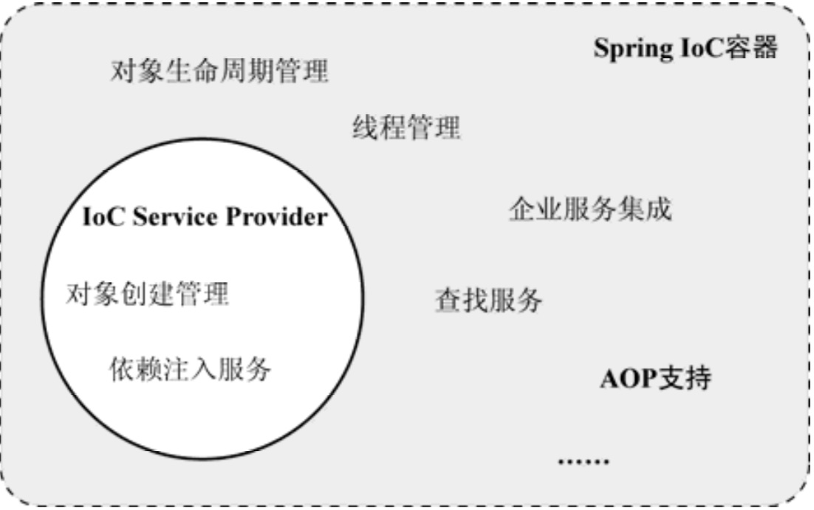
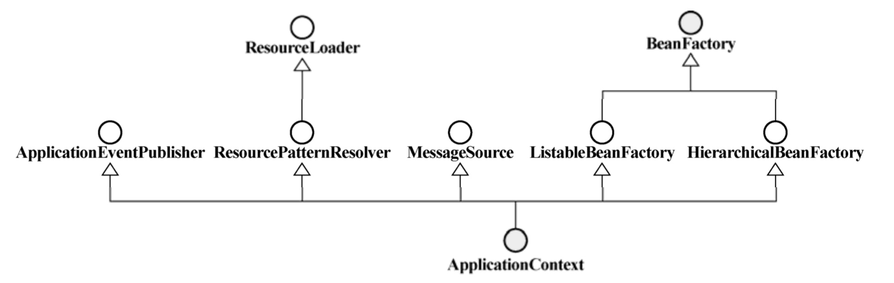
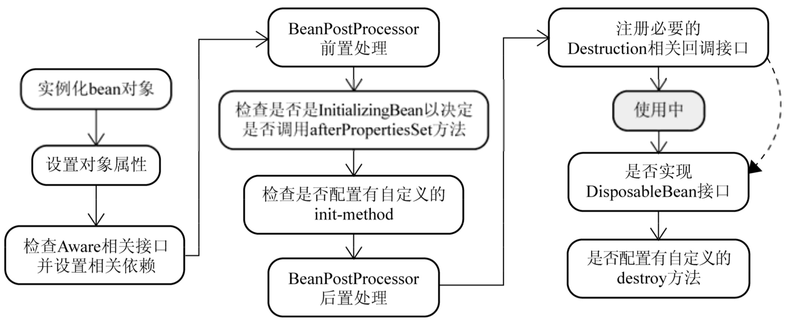
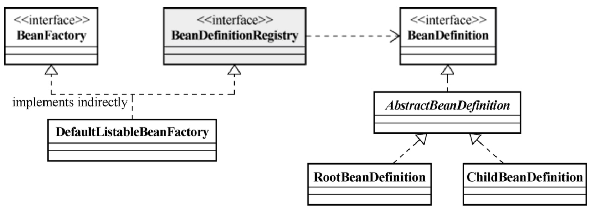
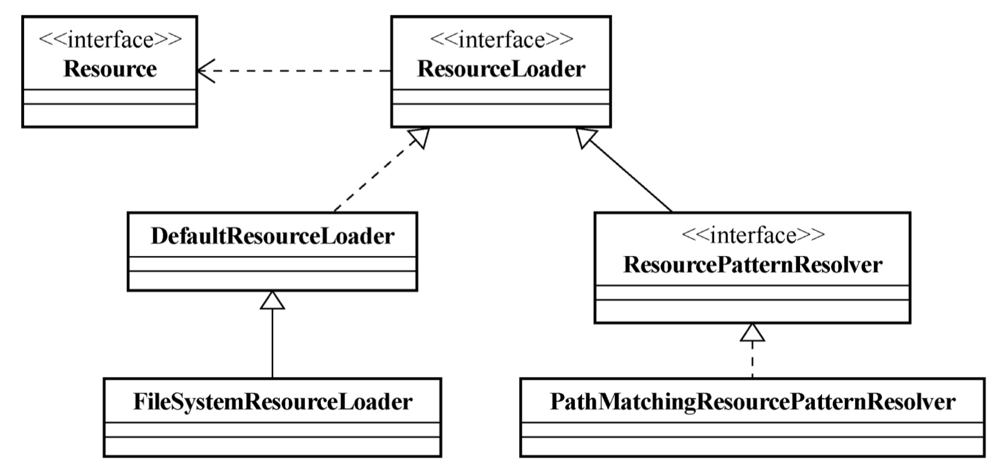
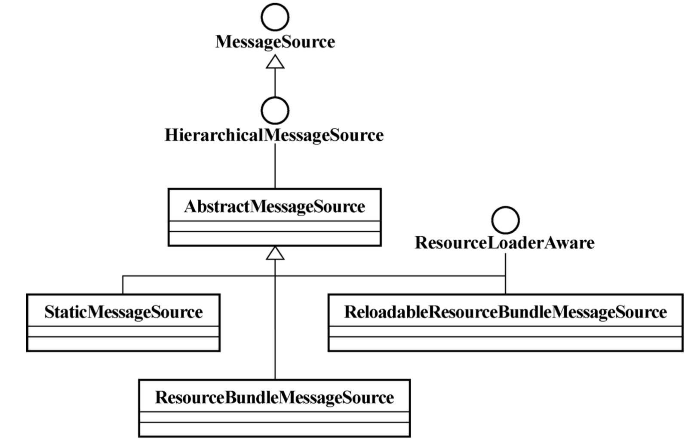
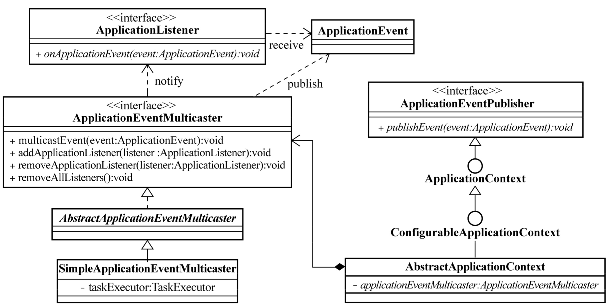

# Spring IOC

## Spring架构

## IOC理念

### 概念

- IoC Inversion of Control (控制反转/反转控制)，它是一个技术思想，不是一个技术实现，主要用来解决对象创建以及生命周期管理的问题
- 控制反转是指对象的创建以及生命周期管理的权利由客户端转换为外部环境（IOC容器）
- IOC主要解决了对象之间的耦合问题

### **IoC**和**DI（依赖注入）**的区别

- IOC和DI描述的是同一件事情，只不过⻆度不一样罢了。IOC是从对象角度看，对象的创建和管理权利被反转。DI是从IOC容器角度看，通过依赖注入的方式解决对象之间依赖耦合的问题

## Spring IOC

### Spring的IoC容器和IoC Service Provider之间的关系

### Spring IOC容器类型

#### BeanFactory

- 提供完整的IOC功能，默认延迟加载初始化对象，容器启动速度比较快，节约资源，适合资源有限场景。

#### ApplicationContext

- 拥有BeanFactory所有功能基础上，提供事件发布、国际化等功能。容器启动后，默认所有对象全部初始化完成，需要更多资源，启动较BeanFactory慢。

- 关系

  

## Spring IoC使用

### 启动IOC

#### Java环境

- ClassPathXmlApplicationContext:从类的根路径下加载配置文件(推荐使用)
-  FileSystemXmlApplicationContext:从磁盘路径上加载配置文件
-  AnnotationConfigApplicationContext:纯注解模式下启动Spring容器

#### Web环境

- 使用ContextLoaderListener启动IOC容器

### 延迟加载

- 普通 Bean 的初始化是在容器启动初始化阶段执行的，而被lazy-init=true修饰的 bean 则是在从容器里 第一次进行context.getBean() 时进行触发
- 主要应用场景：对于不常使用的 Bean，设置为延迟加载，这样偶尔使用的时候再加载，不必要从一开始该 Bean 就占用资源，一定程度提高容器启动和运转性能

### FactoryBean

- 作用跟静态工厂方法，实例工厂方法注入相似，主要是应用于复杂Bean的构建
- 容器默认返回的是FactoryBean中工厂方法返回的实例，而不是FactoryBean实现类自身。可以通过在bean定义前面加&获取FactoryBean实现类自身实例。

### 后置处理器

#### BeanFactoryPostProcessor

- 在**BeanFactory初始化之后，对象实例化之前**，可以对注册到容器的BeanDefinition所保存的信息做相应的修改。

- 常用内置BeanFactoryPostProcessor

  - **PropertyPlaceholderConfigurer**

    会从系统属性（设置SystemPropertiesMode）或者properties文件中获取数据替换XML配置文件中的占位符。

  - PropertyOverrideConfigurer

    对容器中配置的任何property配置信息进行覆盖替换。可以重写convertPropertyValue()方法实现对配置信息加解密。

  - CustomEditorConfigurer 

    完成由字符串到具体对象类型的转换。

#### BeanPostProcessor

- BeanPostProcessor是针对Bean级别的处理，可以针对某个具体的Bean，分别对其**初始化方法（init方法）**进行前置和后置处理。

### Bean生命周期

- BeanFactory容器启动之后，并不会马上实例化相应的bean定义。只有当请求方（显式或者隐式）通过BeanFactory的getBean()方法（AbstractBeanFactory.getBean()）来请求某个对象实例的时候，才有可能触发Bean实例化阶段的活动。
- 只有第一次调用BeanFactory的getBean()方法才会触发Bean实例化。第二次会直接从缓存中返回。（prototype类型bean除外）
- Spring容器将对其所管理的对象全部给予统一的生命周期管理。（prototype类型bean除外）
- 采用策略模式决定采用何种方式初始化bean实例。InstantiationStrategy定义是实例化策略的抽象接口。容器内部默认采用CglibSubclassingInstantiationStrategy，通过CGLIB的动态字节码生成功能创建对象。
- 使用BeanWrapper对构造完成的对象实例进行包裹，返回相应的BeanWrapper实例。BeanWrapper可以方便的对实例属性值进行操作设置。
- 当对象实例化完成并且相关属性以及依赖设置完成之后，Spring容器会检查当前对象实例是否实现了一系列的以Aware命名结尾的接口定义，如果是，将Aware接口中规定的资源注入实例。
- 使用**BeanPostProcessor**对容器内所有符合条件的实例进行处理。如ApplicationContextAwareProcessor用来为所有实现Aware接口的类注入相应的依赖。
- InitializingBean和init-method
- DisposableBean与destroy-method

### 循环依赖注入

- Spring不支持原型bean的循环依赖，单例bean通过setXxx或者@Autowired进行循环依赖，不可以通过构造器注入
- Spring 的循环依赖的理论依据基于 Java 的引用传递，当获得对象的引用时，对象的属性是可以延 后设置的，但是构造器必须是在获取引用之前，所以不可以通过构造器注入。Spring通过setXxx或者@Autowired方法解决循环依赖其实是通过提前暴露一个ObjectFactory对 象来完成的，简单来说ClassA在调用构造器完成对象初始化之后，在调用ClassA的setClassB方法 之前就把ClassA实例化的对象通过ObjectFactory提前暴露到Spring容器中

## Spring IOC启动流程

- Spring IOC启动的流程主要分为两个阶段：Beanfactory的创建以及Bean的创建，核心的源码在 AbstractApplicationContext#refresh() 方法中

### Beanfactory创建流程（具体分为两部分：创建Beanfactory和BeanDefinition加载解析及注册）

- 核心逻辑在AbstractRefreshableApplicationContext#refreshBeanFactory()

- 获取BeanFactory，默认实现是DefaultListableBeanFactory
- 依次调用多个类的 loadBeanDefinitions 方法  —> AbstractXmlApplicationContext  —> AbstractBeanDefinitionReader —> XmlBeanDefinitionReader  一直执行到 XmlBeanDefinitionReader 的 doLoadBeanDefinitions 方法，最终该方法中会把封装在XML 中的定义Bean信息封装为 BeanDefinition 对象之后放入一个Map中，BeanFactory 是以 Map 的结构组织这些 BeanDefinition 的。

### Spring Bean 创建流程

- Bean创建的过程在DefaultListableBeanFactory#preInstantiateSingletons()中，这边将会完成对所有的非懒加载的单例Bean创建初始化，填充属性，初始化方法调用，BeanPostProcessor后置处理等操作，同时，这里面会通过singletonObjects，earlySingletonObjects，singletonFactories三级缓存解决循环依赖注入的问题

- 分为容器启动阶段和Bean实例化阶段。

  - 容器启动阶段

    - 加载解析配置信息，并封装到BeanDefinition，执行一些后处理（BeanFactoryPostProcessor）。

  - Bean实例化阶段

    - 实例化对象，装配依赖，生命周期回调，对象其它处理，注册回调接口。

## BeanFactory

### DefaultListableBeanFactory

- 一个比较通用的BeanFactory实现类，负责bean的注册和管理。

### BeanFactory

- 定义如何访问容器内管理的Bean的方法。

### BeanDefinitionRegistry

- 管理bean的注册和加载。

### BeanDefinition

- 解析XML中bean的配置，封装成BeanDefinition实例，负责保存对象的所有必要信息，包括其对应的对象的class类型、是否是抽象类、构造方法参数以及其他属性等。

### 关系图

### BeanDefinitionReader

- 根据不同的外部配置文件格式，不同的BeanDefinitionReader实现类，将相应的配置文件内容读取并映射到BeanDefinition，然后将映射后的BeanDefinition注册到一个BeanDefinitionRegistry，之后，BeanDefinitionRegistry完成Bean的注册和加载。
- Spring内置常用的实现类：PropertiesBeanDefinitionReader和XmlBeanDefinitionReader。分别处理properties文件和xml文件。

### Scope

- singleton
  - 在Spring的IoC容器中只存在一个实例，所有对该对象的引 用将共享这个实例。该实例从容器启动，并因为第一次被请求而初始化之后，将一直存活到容器退出。
  - 注意和单例模式的区别。
- prototype
  - 接到该类型对象的请求的时候，会每次都重新生成一个新的对象实例给请求方。虽然这种类型的对象的实例化以及属性设置等工作都是由容器负责 的，但是只要准备完毕，并且对象实例返回给请求方之后，容器就不再拥有当前返回对象的引用，请 求方需要自己负责当前返回对象的后继生命周期的管理工作，包括该对象的销毁。
  - prototype声明的一般都是**有状态**的对象。
  - 注意和原型模式的区别。
- 自定义scope类型
  - org.springframework.beans.factory.config.Scope接口

## ApplicationContext

### Resource和ResourceLoader

- Resource是Spring中所有资源的抽象和访问接口。

- ResourceLoader是查找定位资源的抽象接口，根据资源路径返回单个Resource实例。默认实现为DefaultResourceLoader。支持classpath:协议。

- ResourcePatternResolver是ResourceLoader子类，根据资源路径匹配模式返回多个Resource实例。最常用实现为PathMatchingResourcePatternResolver。支持classpath*:协议。

- classpath:和classpath*:区别

  如果在classpath下找到多个指定资源，classpath*:会返回多个。

### ApplicationContext和ResourceLoader

- ApplicationContext可以作为一个ResourceLoader或者ResourcePatternResolver。

### MessageSource

### ApplicationContext和MessageSource

- 在默认情况下，ApplicationContext将委派容器中一个名称为messageSource的Message- Source接口实现来完成MessageSource应该完成的职责。如果找不到这样一个名字的MessageSource实现，ApplicationContext内部会默认实例化一个不含任何内容的StaticMessageSource实例，以保证相应的方法调用。

### 容器事件发布

- ApplicationEvent

  - Spring容器内自定义事件类型，继承自java.util.EventObject，它是一个抽象类，需要根据情

    况提供相应子类以区分不同情况。

- ApplicationListener

  - ApplicationContext容器内使用的自定义事件监听器接口，继承自java.util.EventListener。ApplicationContext容器在启动时，会自动识别并加载EventListener类型bean定义， 一旦容器内有事件发布，将通知这些注册到容器的EventListener。

- ApplicationContext

  - ApplicationContext继承了ApplicationEventPublisher接口，担当了事件发布者的角色。不过在具体实现上，ApplicationContext将具体的事件发布委托给plicationEventMulticaster接口，其抽象实现类AbstractApplicationEventMulticaster实现了对事件监听器的管理功能，SimpleApplicationEventMulticaster类实现了具体的事件发布功能。默认使用SyncTaskExecutor进行事件的发布，事件是同步顺序发布的。
  - 容器启动时会检查容器内是否存在名称为applicationEventMulticaster的ApplicationEventMulticaster对象实例。有的话就使用提供的实现，没有则默认初始化一个SimpleApplicationEventMulticaster作为将会使用的ApplicationEventMulticaster。