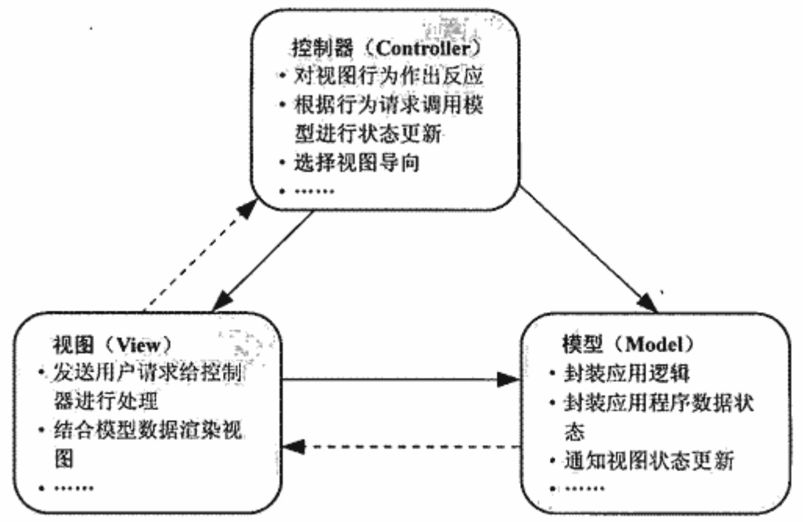
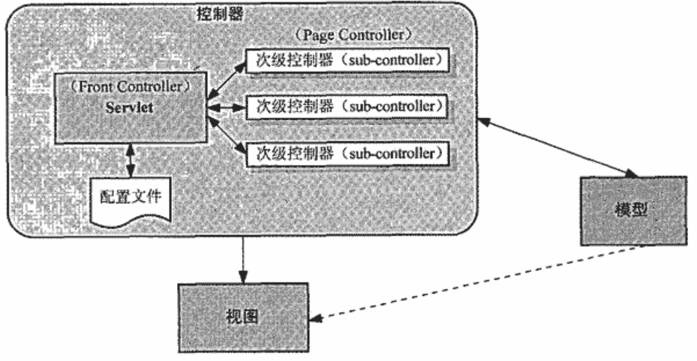
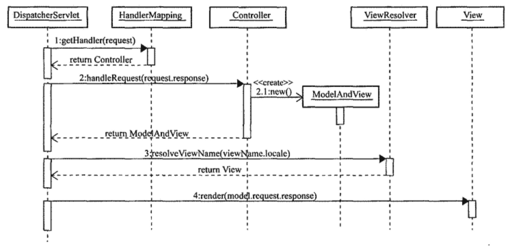
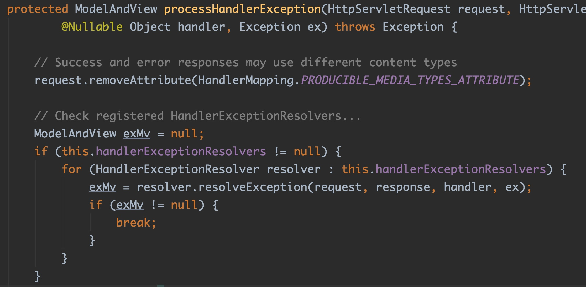
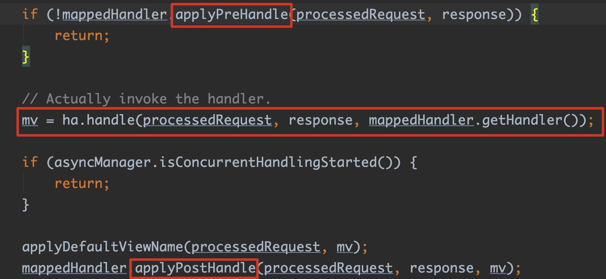
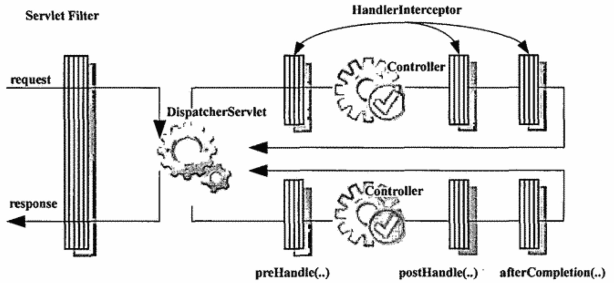

# Spring MVC

## MVC模式



- 控制器（C）：负责接收视图发送的请求并进行处理，根据请求通知模型进行系统状态更新，之后选择合适的视图显示给用户。控制器可以采用多个Servlet或者一个Servlet实现方式。多个Servlet的方式优点是，可以借助Web容器（如Tomcat）的URL映射匹配能力来解决请求到具体处理Servlet的映射（web.xml）。缺点随着应用规模增大，web.xml配置很庞大。另外所有的请求都是分散管理，没有集中管理的方式，后续维护成本很大。使用单一Servlet实现的优点是，web.xml配置简单，请求处理可以集中化管理。缺点是，Servlet控制类体积庞大，无法再借助Web容器（如Tomcat）的URL映射匹配能力来解决请求到具体处理Servlet的映射，需要控制类自己根据请求信息来判断处理流程走向。
- 模型（M）：封装应用的逻辑和数据状态。
- 视图（V）：面向用户的接口。

## 单一Servlet的MVC



## Spring MVC处理请求核心流程



- DispatcherServlet本质上是一个Servlet，继承了GenericServlet，在外部Servlet容器启动时会调用init()，该方法被HttpServletBean重写，并且会调用initServletBean()，该方法又会被FrameworkServlet重写，通过调用initWebApplicationContext()实现Web环境初始化，该方法中主要是会通过onRefresh(wac)实现SpringMVC九大组件的初始化工作，详细创建流程见DispatcherServlet#initStrategies()
- DispatcherServlet核心逻辑都在doService()方法中，该方法会被父类FrameworkServlet.doXX()系列方法调用。doService()的核心分发逻辑在doDispatch()方法中
- 通过checkMultipart()处理multipart类型请求
- 遍历所有可用的HandlerMapping，调用优先级最高的HandlerMapping.getHandler()返回HandlerExecutionChain实例。HandlerExecutionChain中封装了Handler和HandlerInterceptor
- 遍历所有的HandlerAdapter，返回优先级最高，支持当前Handler的HandlerAdapter
- 执行当前Handler所有HandlerInterceptor的前置拦截处理，顺序执行
- HandlerAdapter.handle()是当前Handler真正的请求处理逻辑。在该方法中，依次通过AbstractHandlerMethodAdapter#handle(),RequestMappingHandlerAdapter#handleInternal(),invokeHandlerMethod(),ServletInvocableHandlerMethod#invokeAndHandle(),InvocableHandlerMethod#invokeForRequest()等，最后通过反射方式调用Handler逻辑的执行，并且使用HandlerMethodArgumentResolver和HandlerMethodReturnValueHandler完成对方法参数和返回值的解析，最后会将结果封装为ModelAndView实例返回
- 执行当前Handler所有HandlerInterceptor的后置拦截处理，反序执行
- 调用processDispatchResult()完成视图解析和渲染工作。在该方法中，DispatcherServlet#render()会解析逻辑视图名为真正的物理视图名，并创建View实例，调用其render()方法，这里面会调用InternalResourceView#renderMergedOutputModel()，这个方法会将Model中所有数据放入request域中，然后调用RequestDispatcher#forward()完成请求转发
- 以上步骤中如果抛出任何异常，会统一捕捉，并遍历所有的HandlerExceptionResolver处理异常，并返回包括错误信息的ModelAndView实例
- 如果抛出异常，执行当前Handler所有HandlerInterceptor的afterCompletion()处理
- 最后做一些收尾性工作

## SpringMVC九大组件

### HandlerMapping

- 帮助DispatcherServlet处理请求URL到具体处理请求的次级控制器Handler的映射。Handler的具体表现形式可以是类，也可以是 方法，比如标注了@RequestMapping的每个方法或者实现了Controller的类都可以看成是一个Handler
- 可以为DispatcherServlet指定多个HandlerMapping，DispatcherServlet会根据HandlerMapping的优先级（Ordered接口）进行选取返回

### HandlerAdapter

- SpringMVC中的Handler不止Controller一种，还可能是其它的，比如Struts中的Action，也有可能是类或者方法的形式存在。为了在DispatcherServlet中屏蔽对具体Handler的差异，引入HandlerAdapter组件
- 可以为DispatcherServlet指定多个HandlerAdapter，默认会启动HttpRequestHandlerAdapter、SimpleControllerHandlerAdapter（针对传统的Controller）、RequestMappingHandlerAdapter（针对基于注解的Controller）
- AbstractController采用模板方法模式，主要处理了请求方式管理，页面缓存设置和Session同步，具体Web请求处理逻辑handleRequestInternal()由各子类实现

### ModelAndView

- 视图相关内容，可以是View实例，也可以是逻辑视图名。
- 模型数据，最终会被视图渲染到View中。

### HandlerExceptionResolver

- 对映射获取具体Handler和Handler执行请求处理逻辑的异常进行处理。如果Handler执行过程中没有抛出任何异常，那么会返回正常的ModelAndView实例。如果中间出现任何异常，通过HandlerExceptionResolver处理后也会返回ModelAndView实例，不过这个时候ModelAndView实例里面存放的是错误信息和错误页面。详见DispatcherServlet.processHandlerException()方法。

  

- 可以为DispatcherServlet指定多个HandlerExceptionResolver。默认启动创建的HandlerExceptionResolver实例见DispatcherServlet.properties。

### ViewResolver

- 根据Handler返回的ModelAndView中的逻辑视图名，返回一个可用的View实例

- ViewResolver可以分为两类，面对单一视图类型和面对多视图类型。

  - 面对单一视图类型

    每种ViewResolver只负责解析一种类型的View，不需要明确指定逻辑视图名和具体视图之间的映射关系。如UrlBasedViewResolver及其子类。

  - 面对多视图类型

    每种ViewResolver可以负责解析多种类型的View，需要通过某种配置方式明确指定逻辑视图名和具体视图之间的映射关系。如BeanNameViewResolver。

- 可以为DispatcherServlet指定多个ViewResolver，DispatcherServlet会根据ViewResolver的优先级（Ordered接口）进行选取返回。如果没有找到任何可用的ViewResolver，默认使用InternalResourceViewResolver。（查看DispatcherServlet.properties）

### RequestToViewNameTranslator
- RequestToViewNameTranslator 组件的作用是当没有设置 View，也没有设置 ViewName时从请求中获取 ViewName

### LocaleResolver

- 作用
  - 根据当前Locale解析策略获取当前Web请求的Locale值
  - 如果当前的策略支持Locale的修改，对获取得到的Locale值修改

- 作用点
  - 当DispatcherServlet启动初始化时，会通过LocaleResolver获取当前Web请求的Locale值，并将其绑定到当前线程中。后续ViewResolver解析视图时，可以从当前线程中获取Locale值解析逻辑视图名。详见FrameworkServlet.processRequest()
- 使用LocaleChangeInterceptor变更Locale值

### ThemeResolver和Theme和ThemeChangeInterceptor

### MultipartResolver

- 用来做文件上传。

- 当请求到达DispatcherServlet时，最终会调用doDispatch()方法，该方法中会通过checkMultipart()方法中的MultipartResolver.isMultipart()判断是否是multipart类型请求。如果是，会调用MultipartResolver.resolveMultipart()方法处理成为MultipartHttpServletRequest并返回，进而作为后继流程的HttpServletRequest类型，否则直接返回HttpServletRequest。

- 根据底层不同的实现有多个实现类，比如CommonsMultipartResolver底层采用Apache Commons FileUpload实现。

### FlashMapManager

FlashMap 用于重定向时的参数传递。因为重定向时参数会丢失，如果不想把参数写进URL(不推荐)，那么就可以通过FlashMap来传递，底层Spring会将FlashMap的数据存到Session中，实现重定向两次请求数据传递。FlashMapManager就是用来管理 FalshMap的

## 拦截器

### HandlerInterceptor

- DispatcherServlet通过调用HandlerMapping.getHandler()返回一个具体的Handler，不过这个Handler是以HandlerExecutionChain形式返回的。HandlerExecutionChain封装了Handler和一组对应的HandlerInterceptor，这一组HandlerInterceptor可以对该Handler执行前后做拦截处理

  

- SpringMVC内置HandlerInterceptor实现类主要有WebContentInterceptor还有AsyncHandlerInterceptor下面的实现类（使用了适配器模式）

- 添加自定义HandlerInterceptor只需要通过HandlerMapping.setInterceptors()注入

- 因为DispatcherServlet可以指定多个HandlerMapping，而每一个HandlerMapping只负责自己管理的一组映射关系。因为，我们可以只赋予特定的HandlerMapping特定的HandlerInterceptor，这样这一组HandlerInterceptor只会拦截该HandlerMapping的Handler，达到细粒度的拦截控制

- 当有多个拦截器同时工作时，它们的**preHandle()方法**会按照配置文件中拦截器的配置**顺序执行**，而它们的**postHandle()方法**和**afterCompletion()方法**则会按照配置顺序的**反序执行**

### Filter和HandlerInterceptor的比较



- Filter是Servlet规范的组件，对Request请求起到过滤的作用，作用在Servlet之前，如果配置为/*可以对所有的资源访问(servlet、js/css静态资源等)进行过滤处理
- Interceptor是MVC框架自带的组件，不会拦截 jsp/html/css/image的访问，只会拦截访问的控制器方法(Handler)
- Filter和HandlerInterceptor都可以对Web请求拦截处理。但是HandlerInterceptor位于DispatcherServlet之后，拥有更加细粒度的拦截点。可以在Handler执行前、后以及整个DispatcherServlet处理流程完毕后拦截。可以对不同的HandlerMapping管理的多组不同的Handler应用不同的HandlerInterceptor，更加灵活细粒度。而Filter位于DispatcherServlet之前，比HandlerInterceptor拥有更高的执行优先级，但是Filter是在Servlet层面对DispatcherServlet进行拦截，所以拦截粒度比较粗

### HttpMessageConverter

- 对Http请求响应报文格式进行自定义转换
- 可以通过WebMvcConfigurer配置，配置的HttpMessageConverter最终会被WebMvcConfigurationSupport的getMessageConverters()使用，进而给其他需要设置HttpMessageConverter的Bean使用
- HttpMessageConverter的具体使用位置，以RequestResponseBodyMethodProcessor为例，解析请求参数是在resolveArgument()方法，里面会通过调用readWithMessageConverters()实现参数读取和转换的工作，在这个方法中会使用设置的HttpMessageConverter进行数据格式转换。同样，处理响应内容是在方法handleReturnValue()，里面会调用writeWithMessageConverters()。

## 基于注解的SpringMVC

### 原理

- 老版本：RequestMappingHandlerMapping会随着DispatcherServlet初始化创建，并会扫描Classpath下面所有的@Controller的对象。同时，RequestMappingHandlerAdapter通过反射方式获取到@RequestMapping的方法，将请求参数绑定到方法上，并通过反射方式调用后返回ModelAndView实例。
- 新版本：通过@EnableWebMvc注解开启MVC功能。该注解会Import DelegatingWebMvcConfiguration，该配置类会获取所有的WebMvcConfigurer,同时DelegatingWebMvcConfiguration继承了WebMvcConfigurationSupport，这个类会创建出很多SpringMVC所需要的组件Bean。

### 请求处理的方法签名

- 在请求处理的方法中声明以下类型参数，可以直接获取到请求处理过程中所需要的引用
  - HttpServletRequest,HttpServletResponse,HttpSession
  - WebRequest
  - Reader,Writer
  - Map,ModelMap
  - Errors,BindingResult
  
  - SessionStatus
- 框架类通过反射获取到@RequestMapping的方法后，通过反射调用方法并且会将上述类型的参数传入。当方法执行完毕后，再将其中的数据添加返回的ModelAndView实例中即可


### 参数绑定

- 简单类型参数

- Pojo类型参数

- 嵌套Pojo对象参数，可以使用OGNI表达式定位

  ```java
  public class QueryVo {
    private String mail;
    private String phone; 
    // 嵌套了另外的Pojo对象
    private User user;
  }
  
  @RequestMapping("/handle05")
  public ModelAndView handle05(QueryVo queryVo) {
  
  }
  
  // SpringMVC接收pojo包装类型参数 url:/demo/handle05?user.id=1&user.username=zhangsan
  ```

  

- 绑定日期类型参数，需要实现并注册自定义类型转换器Converter

