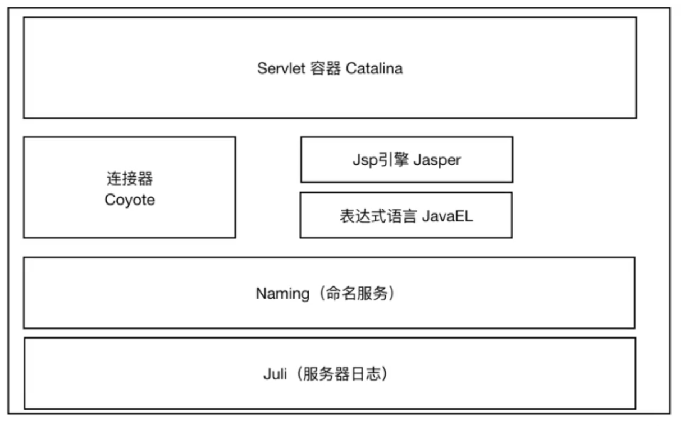
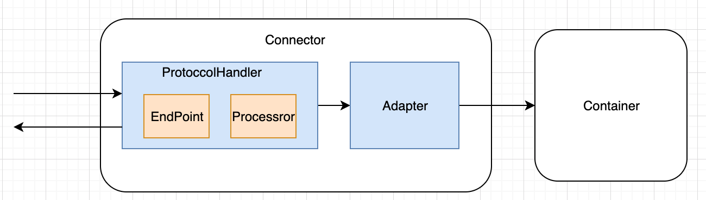
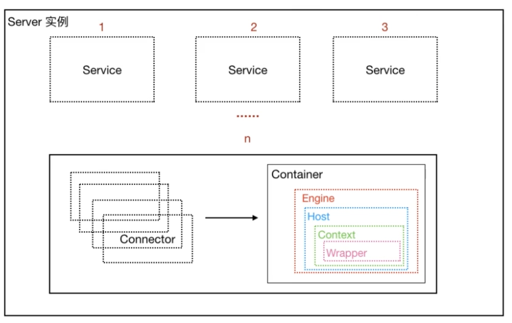
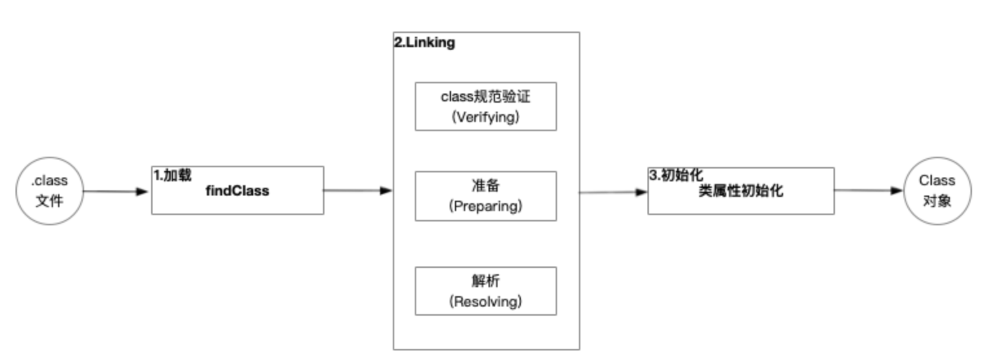
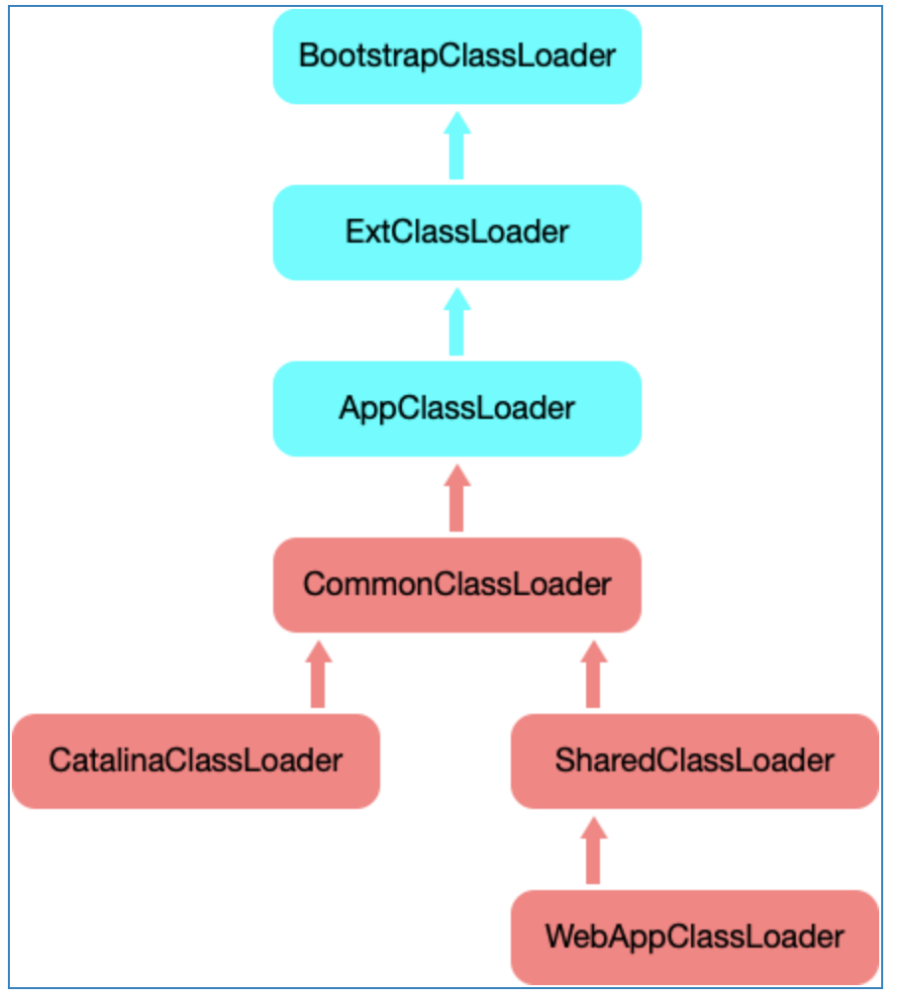

# Tomcat

## 架构

- Tomcat本质上有两个身份

### http服务器

- 可以用来处理http请求，这部分对应于Tomcat内部的Connector组件（具体实现为Coyote），主要是用来处理socket连接，将字节流转为Request和Response对象

### Servlet容器

- 可以通过调用Servlet业务类完成业务逻辑处理，对应于Tomcat中的Container组件，用来加载和管理Servlet

## 核心组件

### Coyote

- 核心组件包括ProtoccolHandler、Adapter，其中ProtoccolHandler包括EndPoint、Processror，EndPoint作为socket接收和发送处理，实现TCP协议，Processror是将EndPoint接收到的socket字节流转为Request和Response对象，并且交给Adapter，Adapter主要主要作用是将Request和Response对象转换为标准的ServletRequest和ServletResponse对象，完成对Servlet业务实现类的调用，作为连接Connector组件和Container组件的桥梁

### Catalina

- Catalina是Tomcat对Servlet容器的实现，是Tomcat的核心

#### 结构

- Tomcat启动时会创建Catalina实例，并通过Catalina实例完成对server.xml的解析以及其它容器组件的创建和管理

#### 组件

##### Server

- 一个Catalina实例对应一个Server实例

##### Service

- 一个Server实例可以对应多个Service实例，Service实例相互隔离，每个Service可以理解为是一个Connector集合，这些Connector可以共享同一个容器，比如一个非SSL和一个SSL连接器共享相同的网络应用

###### Engine

- 一个Engine代表了一个Catalina中完整的Servlet引擎，主要用在需要支持多个虚拟主机来处理请求的场景。Engine是Catalina体系中最高层次的Container，一个Engine可以包含多个Host和Context

###### Host

- 一个Host代表一个虚拟主机

##### Context

- 一个Context代表一个Servlet Context

##### Wrapper

- Wrapper是Container体系中最底层的Container，代表了一个Servlet实例

## Tomcat执行流程核心源码

### 启动阶段

- Tomcat的启动起点是在Bootstrap的main()中，Bootstrap的init()主要完成类加载器的初始化和Catalina实例的创建，load()主要是调用Catalina#load()，创建Digester实例用于解析server.xml文件，并且调用Server#init()，接下去会开启一系列组件的init() 的递归调用，完成所有必要组件的初始化工作
- 调用Bootstrap#start()，进而调用Catalina#start()，接下去会开启一系列组件的start() 的递归调用，完成所有必要组件的启动工作

### 处理请求阶段

- 在Tomcat启动流程中，Connector#start()中会调用ProtocolHandler#start()，进而依次调用Endpoint#start()，NioEndpoint#startInternal()，在该方法中会创建Acceptor线程和Poller线程。其中Acceptor主要是用来接收Socket请求，Poller才是真正用来处理请求的线程，核心处理请求逻辑都在Poller#run()中，里面会依次调用NioEndpoint#processKey()，AbstractEndpoint#processSocket()，SocketProcessorBase#run() ，NioEndpoint#doRun()，AbstractProtocol.ConnectionHandler#process()，Processor#process()，Http11Processor#service()，在这个方法中，会具体处理socket请求的解析工作，并且将数据封装为Request和Response对象，然后调用CoyoteAdapter#service(Request, Response)，CoyoteAdapter#postParseRequest()中主要完成查找处理当前请求的Servlet的工作，核心代码在connector.getService().getMapper().map(serverName, decodedURI,version, request.getMappingData())，这里主要使用Mapper这个工具类，调用其map()完成查找处理当前请求的Servlet的工作，并将映射相关的数据封装到MappingData中，然后通过调用connector.getService().getContainer().getPipeline().getFirst().invoke(request, response)，开启一系列的调用链，分别StandardEngineValve#invoke()，StandardHostValve#invoke()，StandardContextValve#invoke()，StandardWrapperValve#invoke()，在这个方法中，会构建ApplicationFilterChain实例，并调用filterChain.doFilter()，该方法中，会调用Filter#doFilter()，并最终调用Servlet#service()，至此，整个请求处理流程结束

## Tomcat类加载机制

### JDK类加载机制

- ClassLoader顾名思义就是类加载器，负责将类的.class文件中的二进制数据加载到JVM中，然后在堆区创建一个java.lang.Class对象，用来封装类在方法区内的数据结构（类的方法代码，变量名，方法名，访问权限，返回值等）。类的加载的最终产品是位于堆区中的Class对象， Class对象封装了类在方法区内的数据结构，并且向Java程序提供了访问方法区内的数据结构的接口

#### 类加载特性

- **缓存机制**
- **双亲委托**
- **全盘负责**
  - 当一个类加载器负责加载某个Class时，该Class所依赖的和引用的其他Class也将由该类加载器负责载入，除非显示使用另外一个类加载器来载入

#### 类的加载方式

- 主要可以通过Class.forName()和ClassLoader.loadClass()实现类加载工作。两者的区别是：Class.forName()不仅会把类的.class文件加载到JVM中，并完成对类进行解释的并执行类属性的初始化。而ClassLoader.loadClass()只是把.class文件加载到JVM中，不会执行类属性的初始化，只有在newInstance才会去执行

#### ClassLoader核心源码

- loadClass()方法完成整个类加载逻辑，默认采用双亲委托模型
- findClass()方法一般和defineClass()方法配合使用，主要用来实现自定义类的加载规则（比如字节码解密），从而得到待加载类的字节码二进制流。然后调用defineClass方法生成类的Class对象
- defineClass()方法用来将byte字节流解析成JVM能够识别的Class对象，有了这个方法意味着我们不仅可以通过class文件实例化对象，还可以通过其它方式实例化对象，比如通过网络接受一个类的字节码，然后那这个字节码二进制流直接创建类的Class对象。
- resolveClass()方法实现类的链接工作，Class对象调用defineClass将类加载到JVM，并生成Class对象后，只是实现了加载，并没有被链接

### Tomcat中的类加载机制

- Tomcat主要采用设计多级类加载器来实现容器与Web应用，Web应用与Web应用之间的类的共享与隔离

#### Tomcat加载器体系

- WebAppClassLoader，每一个Web应用都会有一个独立的WebAppClassLoader，实现Web应用与Web应用之间类加载的隔离
- SharedClassLoader，实现Web应用与Web应用之间类加载的共享，Tomcat无法访问
- CatalinaClassloader，专门来加载Tomcat自身的类，Web应用无法访问
- CommonClassLoader，实现容器与Web应用类加载的共享，容器与Web应用都可以访问

#### 源码分析

- Bootstrap#main方法中在创建Bootstrap后会调用Bootstrap#init()方法，会调用initClassLoaders()完成对commonLoader，catalinaLoader，sharedLoader加载器的创建，默认情况下都是commonLoader实例。使用catalinaLoader加载Tomcat运行必须的类，以及Catalina类，并且把sharedLoader设置为Catalina的parentClassLoader
- WebAppClassLoader创建是在StandardContext的startInternal()中，WebAppLoader是WebAppClassLoader的管理组件，里面的WebappClassLoaderBase classLoader才是真正封装的WebAppClassLoader。WebAppLoader也实现了Lifecycle接口，其startInternal()中完成Classloader的创建，具体的Classloader类型是ParallelWebappClassLoader，然后调用WebappClassLoaderBase的start()完成对Web应用的/WEB-INF/classes和/WEB-INF/lib的数据加载
- WebappClassLoaderBase是Tomcat自定义的类加载器，重写了ClassLoader的loadClass()和findClass()，findClass()会先从Web服务本地目录查找，如果没有找到，再调用父类加载配置的其他路径下的资源。loadClass()的主要逻辑是先从Tomcat本地缓存中获取加载过的Class，如果没有获取到，再从JVM的缓存中获取，如果没有获取到，会先尝试使用javaseClassLoader去加载JavaSE自带的类库，比如rt.jar和$JAVA_HOME/jre/lib/ext目录下的jar，来保证JDK自带的类库的安全。如果delegateLoad为true，则会先按照双亲委托模型由parent加载器（commonLoader或者sharedLoader）加载，加载不到然后再从本地Web目录加载。如果delegateLoad为false，则会打破双亲委托模型，先从本地Web目录加载，加载不了再由parent加载器（commonLoader或者sharedLoader）加载
