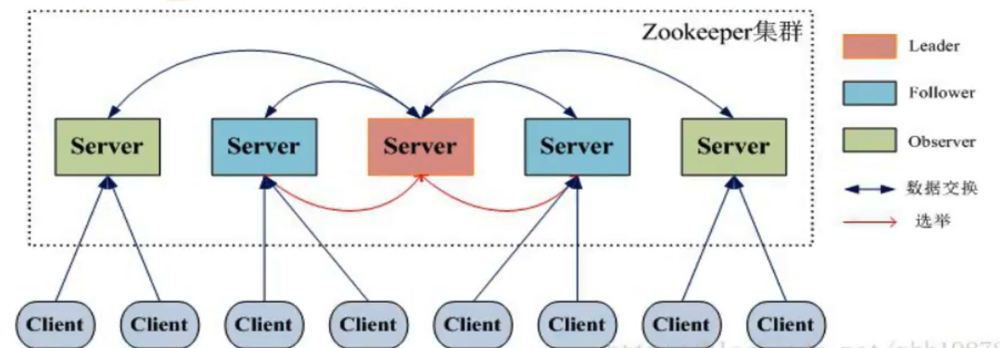

# Zookeeper

## 作用

- 提供通用的分布式锁服务，用来协调分布式应用

## Paxos协议

- 先通过zxid和myid选举出Leader节点，然后由Leader发起一个提议（在zk中表示的是znode的增删改操作），编号为zxid，并通知给所有其他节点
- 其他节点收到Leader的提议后，如果当前自己记录的zxid小于Leader通知的编号，则回复Leader同意
- 当Leader收到超过半数的节点的通知，则选举结束，并通知所有节点更新为该最新的zxid
- 如果没有Leader节点，所有节点平等，则会出现“活锁”，导致投票无法结束
- 节点分工
  - Leader负责投票的发起和决策，并广播给其他节点更新状态（增删改）
  - Follower和Observer负责接收客户端请求，如果是写请求则会转发给Leader处理。另外，Follower有选举权，Observer没有选举权。Observer存在的目的是为了对Zookeeper集群水平扩展

## 特性

- 原子性，所有对节点操作只会有成功或者失败两种状态，不会出现中间状态

- 一致性，所有的节点提供一致的视图

- 顺序性，因为客户端提交的操作都会经过一次投票决定，都会对应于一个zxid，zxid递增，并且所有节点保持同步

- 可用性，可以容忍小于一半的节点的宕机（所以尽量将集群节点数设置为奇数，因为一方面奇数节点数可以保证投票肯定会有结果，另一方面奇数节点容错的效率更高。比如三节点可以容忍宕机一台，四节点也是容忍宕机一台，节省服务器资源），并且可以防止集群网络分区（因为拆分成的多个分区，最多只会有一个分区能启动成功，因为需要超过半数节点才能正常启动）

  

## ZAB协议

- Zookeeper采用原子广播ZAB协议，保证各个Server节点之间的同步
- 采用ZXID保证了提议按照顺序处理。其中zxid是一个64位数字，高32位表示epoch，标识Leader是否改变，每次重新选举出新的Leader，会生成一个新的epoch。低32位是一个递增计数

## Leader选举和增删改操作

- 

## Session

- 客户端通过TCP协议与节点建立连接，Leader会生成Session，并且会通过投票机制，保证Session创建成功或者失败
- 同一个Session中，客户端的请求会按照FIFO顺序消费
- 如果连接的Server宕机，客户端在连接未超时的情况下会透明的转移到其他节点，并且Session保持不变
- 同一个Session中特性保持不变
- 当Session终止后，在该Session期间创建的临时节点被删除

## 目录结构

- 目录型结构
- znode不是file
  - 可以包含最大1M的信息
  - 记录zxid等元数据
- 节点类型
  - 临时节点
    - 客户端连接Server时创建，断开连接时会被删除。临时节点没有子节点
  - 永久节点
    - 不依赖客户端Session，只有显示删除时才会被删除
  - 有序节点
    - Server会自动分配唯一的递增序号拼接在后面

## 事件监听

- 基于通知机制，避免采用网络轮询方式开销很大
- 客户端可以对znode设置watcher来接收通知。watcher是单次触发，如果需要多次通知，客户端需要在每次通知后重新设置watcher
- 可以设置watcher的操作：exists，getChildren，getData，可以触发观察的操作：create，delete，setData

## ZK做注册中心的原理

- 服务端集群每一个节点启动后会连接ZK并创建一个临时节点，保存自己服务的url，利用临时节点的特点，ZK可以监控到服务节点的上下线状态
- 客户访问ZK的临时节点父节点，拉取所有在线服务的节点url列表缓存在客户端本地，并设置watcher操作，这样当服务节点变动后，客户端可以及时感应到变化，重新拉取服务url。然后客户端采用一定的负载均衡策略请求服务节点