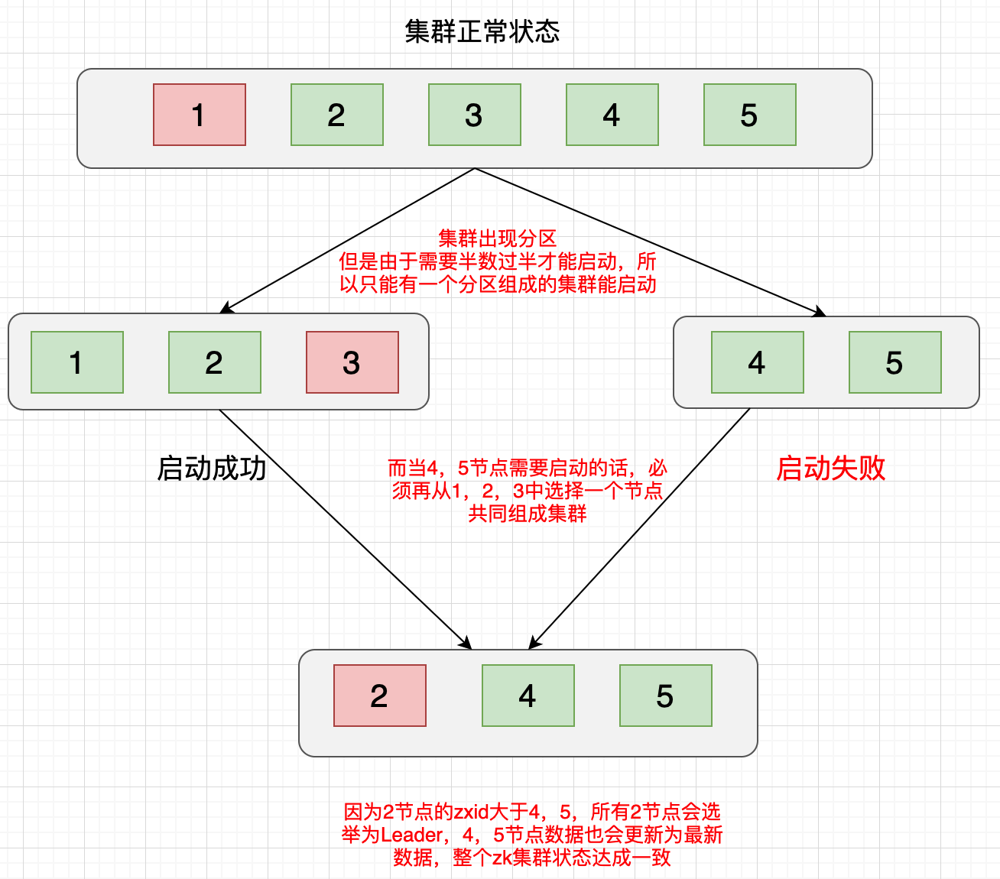
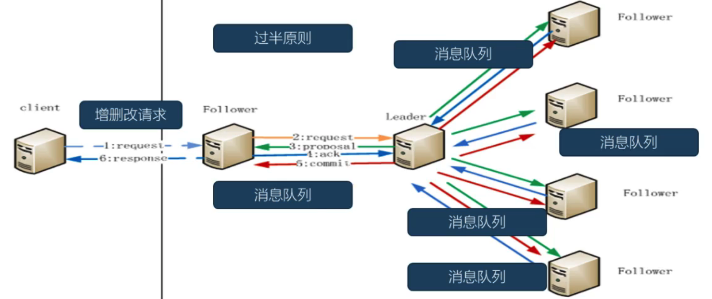
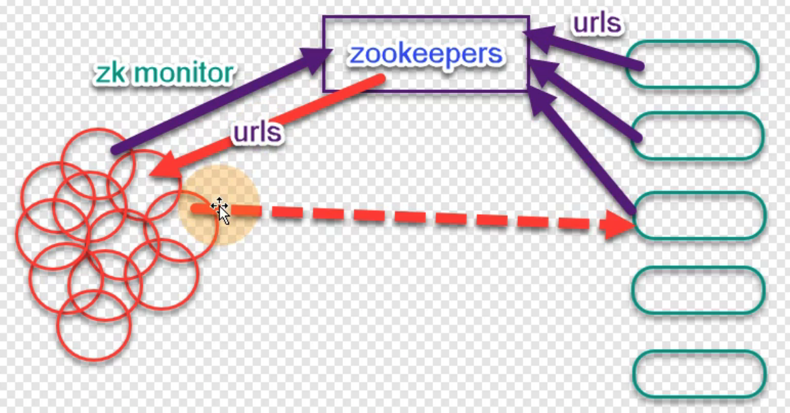

# Zookeeper

## 分布式理论

### 分布式存在的问题

- 通信异常

- 网络分区

- 节点故障

- 分布式三态，成功、失败、超时

### 分布式系统指标

#### 性能

- 吞吐量（TPS）

- 响应时间（RT）

- 并发能力（QPS）

#### 可用性

#### 可扩展性

#### 一致性

### 分布式数据一致性解决方案

#### 分布式事务

##### 2PC


###### 流程

- 第一阶段，各事务参与方只执行事务操作，但是事务不提交

- 第二阶段，当协调者收到第一阶段所有事务参与者正反馈后，发命令让所有事务参与方提交事务

###### 缺点

- 性能比较差，在第二阶段真正提交事务前，所有事务参与方节点都处于阻塞状态，并且占用资源，只有当第二阶段真正提交事务后才能释放资源

- 事务协调者存在单点故障

- 第二阶段如果发生网络问题，会导致有些节点提交事务成功，有些节点未提交事务，造成数据不一致

- ，没有容错机制和超时机制

##### 3PC


- 在2PC基础上做了改进，将2PC中的第一阶段分成cancommit阶段和precommit阶段，同时引入参与方超时机制，一旦指定时间内事务参与方未收到协调者消息，会自动提交事务，解决协调者单点故障问题

###### 流程

- 第一阶段，协调者会询问所有参与方是否符合事务执行条件，如果有参与方不符合或者超时，则终止事务执行，如果所有事务参与方都符合事务提交条件，进入第二阶段

- 第二阶段， 各个事务参与方接收协调者的执行事务的命令，执行事务，如果未收到超时，默认执行事务

- 第三阶段，收到所有事务参与方执行事务成功的指令，协调者发送命令给各事务参与方提交或者回滚事务，如果有参与方超时未收到指令，默认提交事务

###### 优缺点

- 和2PC相比，将第一阶段分为cancommit阶段和precommit阶段，降低了阻塞的范围，避免资源白白浪费

- 第三阶段仍有可能数据不一致。比如，第三阶段协调者给各参与方发送事务回滚操作，如果有部分参与方未收到，就会导致其超时自动提交事务导致数据不一致

#### 分布式一致性算法

##### 拜占庭将军问题

##### Paxos

##### Raft

##### ZAB

#### Quorum机制（鸽笼原理）

- 总节点数N，写入成功节点数W，读取最新数据节点数R，那么当至少R+W>N时，可以保证客户端一定可以读取到集群最新写入的数据

- 写入数据时只要W>N/2，则认为数据写入成功。那么读取数据时R>N/2，则一定能读取到最新的数据

#### CAP和BASE

## 一致性算法

### Paxos

- Paxos中有三种角色：Proposer（提议者，发起提案，并广播给所有的Acceptor）、Acceptor（接收者，可以接受或者拒绝提案）、Learner（学习者，只能被动的学习通过的提案，没有选举权）

- 所有事务请求有一个全局唯一的服务器来处理，成为Leader，剩余的服务器成为Follower。Leader将客户端的事务请求转换为一个proposal，并且将proposal广播分发给集群中所有的Follower对其投票，之后Leader等待所有的Follower的反馈，一旦超过半数的Follower进行了赞成，Leader会再次向所有的Follower分发commit消息，要求提交该proposal

### Raft

- Raft的核心流程分成两部分：**Leader选举和数据同步**

- 刚开始所有节点都是Follower，选举出Leader后，客户端所有的写请求都是发给Leader处理，Leader会生成一个提议广播给所有的Follower执行，收到半数的Follower正反馈，Leader会再次向所有的Follower分发commit消息，要求提交事务，使用了两阶段提交思想

### ZAB

- 基于Raft，两者几乎相同。核心流程分成两部分：**Leader选举和数据同步**
- Zookeeper采用原子广播ZAB协议，保证各个Server节点之间的同步
- 采用ZXID保证了提议按照顺序处理。其中zxid是一个64位数字，高32位表示epoch，标识Leader是否改变，每次重新选举出新的Leader，会生成一个新的epoch。低32位是txid，如果epoch发生变化，txid会重新开始计数。每执行一次事务操作（增删改znode或者选举Leader），zxid都会递增，保证事务串行执行

## Zookeeper

- Zookeeper是一个分布式数据一致的协调服务

### 特性

- 原子性，所有对节点操作只会有成功或者失败两种状态，不会出现中间状态

- 一致性，**所有的节点都保存整个集群的完整数据**，对外提供一致的视图

- 顺序性，集群会通过选举算法选出Leader节点，客户端提交的事务请求都统一发给Leader处理，并且是**串行执行**，每次都会经过一次投票决定，都会对应于一个zxid，zxid递增，并且所有节点保持同步

- **可用性**，可以容忍小于一半的节点的宕机（所以尽量将集群节点数设置为**奇数**，因为一方面奇数节点数可以保证肯定能选举出Leader，不会因为偶数，半数反对半数赞成，选举失败导致服务不可用。另一方面奇数节点容错的效率更高。比如三节点可以容忍宕机一台，四节点也是容忍宕机一台，节省服务器资源），并且可以防止集群网络分区，也就是**集群脑裂**（因为拆分成的多个分区，最多只会有一个分区能启动成功，因为需要超过半数节点才能正常启动，小的那个集群无法正常选举Leader启动）
  
  

### Leader选举和增删改操作



- 先通过zxid和myid选举出Leader节点，然后由Leader发起一个提议（在zk中表示的是znode的增删改操作），编号为zxid，并通知给所有其他节点
- 其他节点收到Leader的提议后，如果当前自己记录的zxid小于Leader通知的编号，则回复Leader同意
- 当Leader收到超过半数的节点的通知，则选举结束，并通知所有节点更新为该最新的zxid
- 如果没有Leader节点，所有节点平等，则会出现“活锁”，导致投票无法结束

### server节点类型

- Leader负责投票的发起和决策，并广播给其他节点更新状态（增删改）
- Follower和Observer负责接收客户端请求，如果是写请求则会转发给Leader处理。另外，Follower有选举权，Observer没有选举权。Observer存在的目的是为了对Zookeeper集群水平扩展

### Session

- 客户端通过TCP协议与节点建立连接，Leader会生成Session，并且会通过投票机制，保证Session创建成功或者失败

- 同一个Session中，客户端的请求会按照FIFO顺序消费

- 如果连接的Server宕机，客户端在连接未超时的情况下会透明的转移到其他节点，并且Session保持不变

- 同一个Session中特性保持不变

- 当Session终止后，在该Session期间创建的临时节点被删除

### znode系统

- 类似文件系统，树状结构组织

- 每个znode有唯一的path，既能存储数据，也能挂载子节点，除了临时节点以外

- 只能存放少量数据，每个节点最多包含1M的信息

- 记录zxid等元数据

#### 节点类型

- 临时节点
  - 客户端连接Server时创建，Session断开连接时会被删除。临时节点没有子节点
- 永久节点
  - 不依赖客户端Session，只有显示删除时才会被删除
- 有序节点
  - path的尾部会自动拼接唯一的递增序号，序号是由父节点维护的

### 事件监听


- 客户端可以对znode设置watcher来接收通知。watcher是单次触发，如果需要多次通知，客户端需要在每次通知后重新设置watcher
- 可以设置watcher的操作：exists，getChildren，getData，可以触发观察的操作：create，delete，setData

### 应用场景

#### 发布订阅和配置中心

- 可以利用实现配置中心。客户端对存储配置的znode添加监听，当发生配置变更时自动通知各个客户端获取最新配置内容

#### 命名服务

- 可以利用zk的有序节点特性实现分布式唯一ID

#### 集群管理

- 集群管理无非两件事情：Leader选举和服务器上下线监控

#### 分布式锁

- 可以用来实现独占锁，读写锁，时序锁（公平锁）

- 创建一个znode当做锁，多个客户端同时执行创建，最终只会有一个客户端执行成功，即抢到了锁，其余的客户端继续监听znode删除事件，当抢到锁的客户端删除znode释放锁后继续新的一轮争抢锁。如果抢到锁的客户端宕机超时，znode自动删除释放锁

- 在znode下面创建有序临时节点，每次只有序号最小的客户端才能执行

#### 队列管理

- 可以利用有序节点实现FIFO队列。先来的客户端创建的节点序号较小，后来的序号大，处理的时候按照序号从小到大既可以保证先来先处理

- 分布式屏障。监听znode下面的子节点数量，到达指定数量后才能继续往下执行

#### 注册中心（负载均衡）



- 服务端集群每一个节点启动后会连接ZK并创建一个临时节点，保存自己服务的url，利用临时节点的特点，ZK可以监控到服务节点的上下线状态
- 客户访问ZK的临时节点父节点，拉取所有在线服务的节点url列表缓存在客户端本地，并设置watcher操作，这样当服务节点变动后，客户端可以及时感应到变化，重新拉取服务url。然后客户端采用一定的负载均衡策略请求服务节点

### 源码剖析

#### 序列化和反序列化

- 序列化和反序列化的API主要在Zookeeper-jute模块。核心的类有：Record、Index、InputArchive、OutputArchive

- Record定义了序列化和反序列化的接口，znode底层实现DataNode就实现了Record接口

- Index定义了反序列化时数据的迭代器

#### 持久化机制

- 持久化的API在org.apache.zookeeper.server.persistence下面。核心的类有：TxnLog、SnapShot、FileTxnSnapLog、DataTree、DataNode

- TxnLog定义了事务日志的相关操作，具体默认的实现是FileTxnLog

- SnapShot定义了快照的相关操作，具体默认的实现是FileSnap

- FileTxnSnapLog维护了FileTxnLog和FileSnap，实际对事务日志和快照的操作都是委托给FileTxnLog和FileSnap

- DataNode表示一个znode的内存结构，所有的DataNode在内存中组织成一颗树状结构DataTree

- DataTree每隔一段时间会拍摄快照，把内存数据持久化到磁盘

#### 网络通信

- 核心类有ClientCnxn、ServerCnxn，具体实现有NIOServerCnxn、NettyServerCnxn

#### Watcher监听机制

- 核心的类有：Watcher、WatchedEvent、ClientWatchManager

- 当客户端调用exists，getChildren，getData等API注册Watcher时，客户端会将Watcher封装为WatchRegistration对象，然后发送给服务端，并且会调用WatchRegistration的register()将该Watcher注册到ZKWatchManager中。当服务端发生事件时，会发送给客户端并封装为WatchedEvent对象，同时会调用ZKWatchManager的materialize()，根据服务端的传回的事件确定需要被触发的Watcher集合，然后会有单独一个EventThread线程去触发回调操作

#### server启动

- 入口是QuorumPeerMain的main()，首先会解析配置内容封装为QuorumPeerConfig，启动DatadirCleanupManager线程，然后调用runFromConfig()启动server集群

- runFromConfig()中，会创建QuorumPeer实例，每一个QuorumPeer实例代表一个集群节点中的server，给QuorumPeer实例设置好必要的属性，调用start()

- start()中，主要包括几个核心操作：loadDataBase()、startServerCnxnFactory()、startLeaderElection()、super.start()

- loadDataBase()中先通过zkDb.loadDataBase()从磁盘的snapshot和commited log文件中恢复数据到内存ZKDatabase中，然后获得上次最大zxid，设置acceptedEpoch和currentEpoch，为下一次Leader选举做准备

- startServerCnxnFactory()主要是启动服务端NIO服务，处理客户端连接请求和IO请求

- startLeaderElection()主要是初始化一些选举过程中的资源和组件，为后续真正Leader选举做准备。首先会创建当前server的Vote对象，以及FastLeaderElection对象。

- **FastLeaderElection**内部，会初始化QuorumCnxManager实例，接下去选举过程中会用QuorumCnxManager来负责网络通信。FastLeaderElection对象内部会启动另外两个线程WorkerSender、WorkerReceiver。投票时，每个节点发送给其他server的消息会被封装为ToSend，接收其它server发过来的消息是Notification。其中，WorkerReceiver会从recvqueue获取其它server发来的投票，同时会将自己的选票封装为ToSend放入sendqueue队列中等待发送。而WorkerSender会从sendqueue中拉取消息，，如果是投给自己的票的消息，会放入QuorumCnxManager中的recvQueue队列，如果是投给其他server的，则发给QuorumCnxManager中的SendWorker线程发送给其他server


- **QuorumCnxManager**实例主要用来负责选举过程中的所有网络通信，它里面有三个内部类，Listener，SendWorker，RecvWorker，他们本质都是线程，Listener线程主要用来开启选举端口，和其它参与选举的server节点连接通信。SendWorker用来发送消息，RecvWorker用来接收消息。同时，QuorumCnxManager内部还维护了一个recvQueue队列，负责存放RecvWorker接收的消息，而SendWorker线程会从recvQueue队列中拉取消息发送给其他server


- QuorumPeer本身就是一个线程，super.start()会启动线程，执行run()方法逻辑，这里面是一个死循环，会不停的根据当前节点的状态，分别执行相应的逻辑

```java
while (running) {
    switch (getPeerState()) {
    case LOOKING:
        setCurrentVote(makeLEStrategy().lookForLeader());
        break;
    case OBSERVING:
        setObserver(makeObserver(logFactory));
        observer.observeLeader();
        break;
    case FOLLOWING:
        setFollower(makeFollower(logFactory));
        follower.followLeader();
        break;
    case LEADING:
        setLeader(makeLeader(logFactory));
        leader.lead();
        setLeader(null);
        break;
    }
}
```

#### Leader选举

- Leader选举的核心逻辑在QuorumPeer的run()方法中LOOKING分支中，最终会调用FastLeaderElection的lookForLeader()

#### 数据同步

- Follower的followLeader()

- Observer的observeLeader()