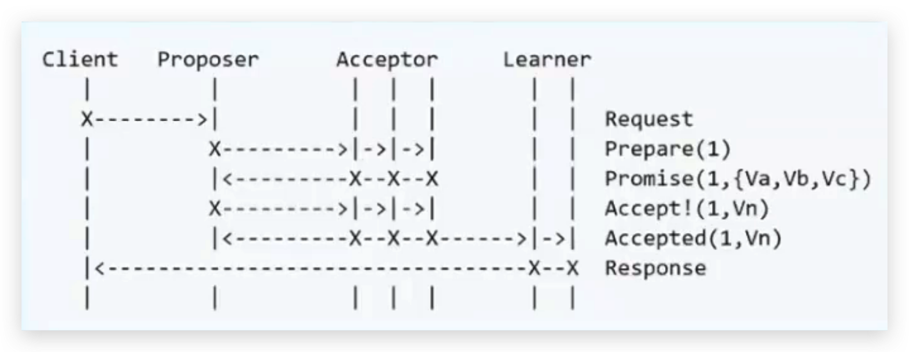
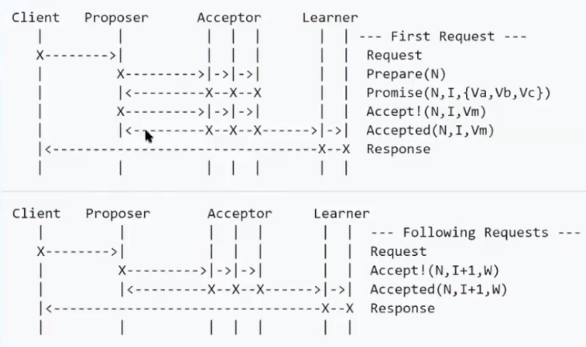
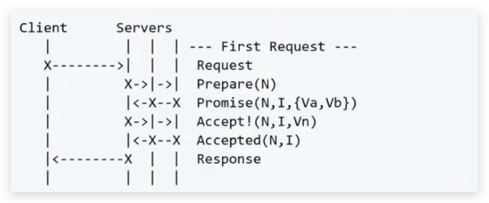

# 一致性算法

## 分类

### 弱一致性

- DNS
- Gossip

### 强一致性

- 同步
- Paxos
- Raft
- ZAB

## 强一致性算法——Paxos

### Basic Paxos

#### 角色

- Client：请求发起者
- Proposer：接收请求，向集群提出提议。
- Acceptor：提议投票和接收者。只有在形成法定人数（Quorum，一般即为多数派）提议才会被接受。
- Learner：提议接收者，备份，对集群一致性没什么影响。

#### 实现过程

- Proposer接收client的请求，并会提出一个提议，编号为N，N大于这个Propser之前提出的提案编号，请求Acceptors中多数派（Quorum）接受。
- 如果N大于该Acceptor之前接受的任何提案编号，则接受，否则拒绝。
- Proposer根据所有Acceptors返回的结果，如果达到多数派Proposer会发出accept请求，请求包括提案编号N和提案内容。
- 如果该Acceptor自此期间没有接收到任何提案编号大于N的提案，则接受，否则忽略。

### Multi Paxos

#### Basic Paxos

- 难以实现
- 需要两轮RPC，效率较低
- 有活锁问题

#### 角色

Leader：唯一的Proposer，所有请求都经过此Leader。

#### 实现过程

减少角色，进一步简化

### Fast Paxos

## 强一致性算法——Raft

### 内容

- Leader选举
- Log Replication
- Safety
  - Timeout
  - 心跳
  - 网络分区情况下，没有Leader的分区会重新进行选举新一轮的Leader。当有不同的客户端请求不同的分区中的Leader写操作，其中达到Quorum的分区会写成功，否则会失败。当网络分区恢复后，旧的Term会同步最新Term节点的数据。

### 角色

- Leader：整个集群只有一个Leader,整个集群所有写的请求都会经过Leader。
- Follower：接收Leader日志
- Candidate：当Follower经过一个超时时间后发现没有Leader心跳后，会先成为Candidate状态参与下一轮Leader选举。

### 实现过程

- 初始状态下，集群中所有节点都是Follower。
- 进行第一轮Leader选举，选举出Leader节点。如果出现多个节点同时成为Candidate，并且获得相同的投票，则会重新进行一轮随机超时时间的选举，直至选出Leader。
- 客户端请求Leader后，写入本地Log，同时发送心跳（包含Log内容）给所有的Follower，Follower收到Leader的心跳后会重置timeout。
- 当集群中达到法定人数（Quorum）的节点已经成功写入Log后，Leader会提交本地的操作并响应给客户端，同时通知其他Follower提交操作。

## 强一致性算法——ZAB

- 原理基本和Raft相同，只是一些名词不同，ZAB将某一个Leader的周期成为epoch，raft称为term。raft中心跳方向是Leader到Follower，ZAB则相反。