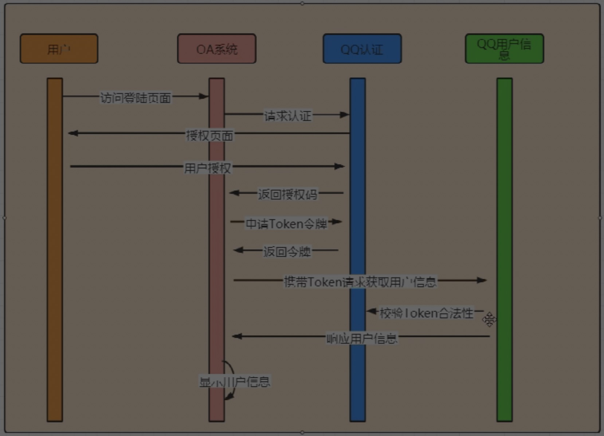

# 单点登录和授权登录

## Cookie、Session和Token

## 域、跨域、CORS、CSRF

## SSO

## Oauth2

- 授权码模式
  - 资源所有者，第三方应用和授权服务器互不信任的情况下使用
- 简化模式
  - 授权服务和第三方应用相互信任情况下
- 密码模式
  - 资源所有者和第三方应用相互信任
- 客户端模式
  - 资源所有者，第三方应用和授权服务器都互相信任

## SSO和授权登录的区别

## Open Id

## 解决方案

### IP Hash（Session黏贴）

- 没有充分发挥集群的优势

### Session同步（Session复制）

- 网络开销很大，并且会导致用户状态的混乱

### Redis实现Session共享（集中存储Session）

- 当节点数量过大时会造成redis压力过大，影响系统扩展性

### 开源的单点登录系统（CAS）

### 基于无状态的token

- 用户认证通过后返回一个包含所有用户信息的Token给客户端，服务端不存储任何状态信息，比较方便在分布式环境下进行扩展

